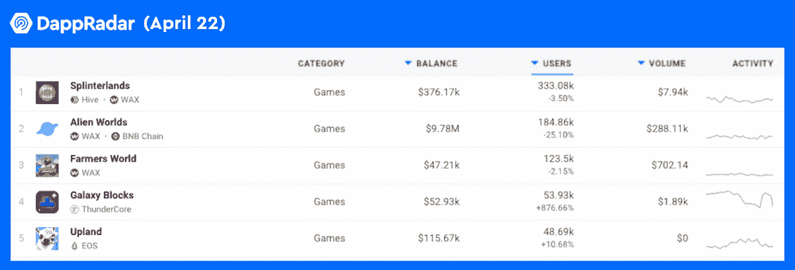
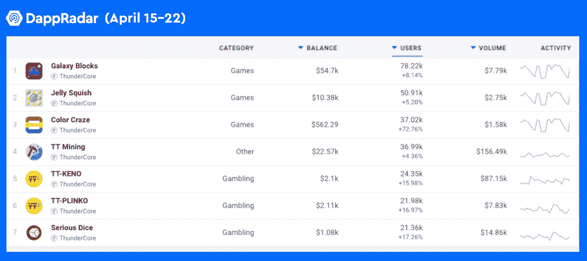
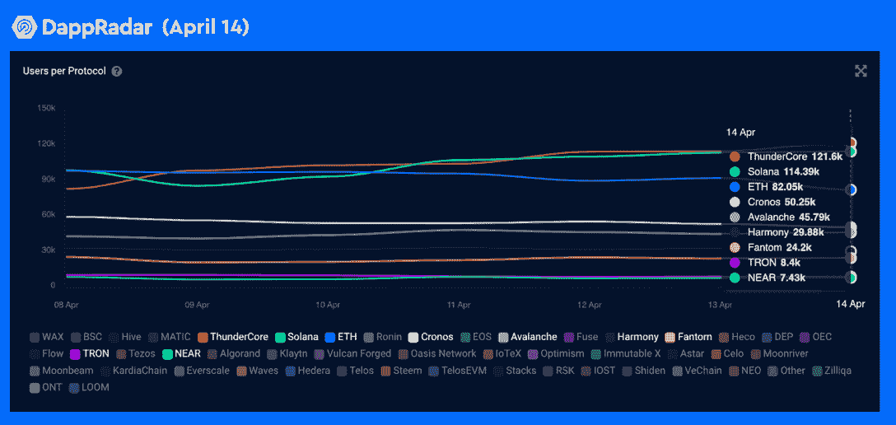

# ThunderCore 推出新的品牌标识，雄心勃勃地改革 Web3 移动娱乐

> 原文：<https://web.archive.org/web/https://dappradar.com/blog/thundercore-unveils-new-brand-identity-ambitious-to-revolutionize-web3-mobile-entertainment>

## ThunderCore 是一款手机友好型区块链，革新了区块链娱乐业

ThunderCore 是首批完全支持 EVM 兼容性的公司之一。现在，它努力成为领先的技术和生态系统，为开发者和用户带来终极的移动友好体验。

**概要:**

*   ThunderCore 很高兴推出新的品牌标识。独特的调色板代表着 ThunderCore 拥抱 Web3 之旅。
*   ThunderCore 的突破性技术使其区块链生态系统在许多领域蓬勃发展。
*   在 2022 年第一季度，ThunderCore 实现了许多里程碑，并将在 2022 年的剩余时间里继续闪耀。

2021 年，游戏在娱乐行业保持迅猛增长，移动游戏占据了最大的市场份额。[根据 Newzoo 的估计](https://web.archive.org/web/20220925073449/https://newzoo.com/insights/articles/the-games-market-in-2021-the-year-in-numbers-esports-cloud-gaming/)，移动游戏在 2021 年创造了 932 亿美元的收入，同比增长 7.3%，占整个游戏市场的 50%以上。

毫无疑问，手机游戏是千禧一代和 Z 世代的首选娱乐方式。领先的移动数据分析平台 DataAI 透露，2021 年游戏下载量为 829.8 亿次，消费者支出达到 1160 亿美元。与此同时，手机游戏也开始占据区块链博彩业的中心舞台。

以移动娱乐为导向的区块链(T1)thunder core 正在为 GameFi、SocialFi 和元宇宙创造一种新的模式，以寻求将 Web2 的世界提升到 Web3。最近，ThunderCore 更新了其视觉形象，以庆祝其里程碑。这也是其誓言要在区块链移动娱乐领域掀起更大波澜的象征性举措。

## ThunderCore 的移动娱乐帝国蒸蒸日上

ThunderCore 坚信 Web3 的未来，分散的元素将无缝集成到当前的 Web2 世界中。这种信念激发了 ThunderCore 为移动 dapps 的蓬勃发展构建最佳网络架构。值得注意的是，ThunderCore 的成就是显而易见的。

2022 年第一季度，区块链博彩业的用户数量下降。然而，[手机友好型游戏 dapps 正逆市场大趋势而动](https://web.archive.org/web/20220925073449/https://dappradar.com/blog/mobile-friendly-game-dapps-gain-traction-amidst-dropping-user-numbers)，独特的主动钱包和交易不断增加。ThunderCore dapps 是推动上升趋势的公司之一，它们的牵引力还在继续。

根据 DappRadar 的说法，ThunderCore 的移动友好型 dapps 在过去的七天里一直在排行榜上飙升。例如，在 4 月 22 日, [Galaxy Blocks](https://web.archive.org/web/20220925073449/https://dappradar.com/thundercore/games/galaxy-blocks) 的独特活跃钱包比前一天增长了 876%。

令人印象深刻的是，ThunderCore 排行榜上的顶级 dapps 在上周都实现了 7 天的正数据增长。

ThunderCore 开创性的 [PaLa consensus protocol](https://web.archive.org/web/20220925073449/https://blog.thundercore.com/consenus-series-pala-569b87293bd7) 允许区块链每秒执行超过 4000 次交易(TPS)，而天然气成本不到 1 美分。

## ThunderCore 在 Q1 2022 的里程碑

自 2019 年以来，ThunderCore 已经建立了一个充满活力的生态系统，包括多个桥梁，去中心化的交易所，稳定的硬币交易所，oracle，NFT 市场，多签名钱包，GameFi 和信贷市场等。进入 2022 年第二季度，ThunderCore 已经跨越了几个关键的里程碑。其中包括 [TT 钱包](https://web.archive.org/web/20220925073449/https://play.google.com/store/apps/details?id=com.thundercore.mobile&hl=en_ZA&gl=US)超过 400，000 MAU，覆盖 190 多个国家的国际用户，达到超过 9700 万的区块高度，总交易量超过 3.26 亿笔。此外，就用户数量而言，ThunderCore 进入了 [DappRadar 的前 10 名公共区块链](https://web.archive.org/web/20220925073449/https://dappradar.com/industry-overview)。

thunder core mainnet 的 [Iris network](https://web.archive.org/web/20220925073449/https://blog.thundercore.com/introducing-the-thundercore-iris-hard-fork-e614628cb10a) 升级的启动标志着另一项重要成就。新的升级确保从像[雪崩](https://web.archive.org/web/20220925073449/https://dappradar.com/rankings/protocol/avalanche)、[以太坊](https://web.archive.org/web/20220925073449/https://dappradar.com/rankings/protocol/ethereum)、[多边形](https://web.archive.org/web/20220925073449/https://dappradar.com/rankings/protocol/polygon)和 [BSC](https://web.archive.org/web/20220925073449/https://dappradar.com/rankings/protocol/binance-smart-chain) 这样的链移植 dapps 变得更容易。它还保证了 ThunderCore 的 EVM 兼容区块链在与以太坊的 Solidity 编程语言的互操作性方面是完全最新的。

## 借助 ThunderCore 迈向 Web3 时代

ThunderCore 为 2022 年的剩余时间制定了一个稳健的计划。相信用户体验是采用的关键，ThunderCore 的目标是大大缩短 Web2 开发者和用户对其 API 的学习曲线。因此，开发人员将从编写自己的智能合同的麻烦中解脱出来，用户可以享受无气 dapp 体验。

更重要的是，ThunderCore 推出了一项 1000 万美元的开发者成长基金计划，以支持拥有出色想法的雄心勃勃的团队。该计划为 dapp 开发者提供的不仅仅是资金资源。广泛的运营咨询将帮助开发商实现其业务目标。开发者可以通过 [Discord](https://web.archive.org/web/20220925073449/https://discordapp.com/invite/5EbxXfw) 或[联系 ThunderCore 的团队，点击这里](https://web.archive.org/web/20220925073449/https://blog.thundercore.com/10-million-growth-fund-how-to-apply-d9b41ff34cc3)了解如何在 2022 年 12 月 21 日前申请资助。

值得一提的是，ThunderCore 通过协作创造机会。比如 ThunderCore 就是沙盒、OurSong、Numbers 的早期投资人。此外，ThunderCore 还与 DJ KAKU 和艺术家 Van Ness Wu 等名人合作了各种 NFT 项目。

由于 ThunderCore 已经以全新的面貌开始了关键的 2022 年第二季度，请通过以下渠道继续关注:

[网站](https://web.archive.org/web/20220925073449/https://www.thundercore.com/)

[不和](https://web.archive.org/web/20220925073449/https://discordapp.com/invite/5EbxXfw)

[推特](https://web.archive.org/web/20220925073449/https://twitter.com/ThunderProtocol?ref_src=twsrc%5Egoogle%7Ctwcamp%5Eserp%7Ctwgr%5Eauthor)

**免责声明** —这是一篇赞助文章。DappRadar 不认可本页面上的任何内容或产品。DappRadar 旨在提供准确的信息，但读者应该在采取行动之前总是自己做研究。DappRadar 的文章不能被认为是投资建议。