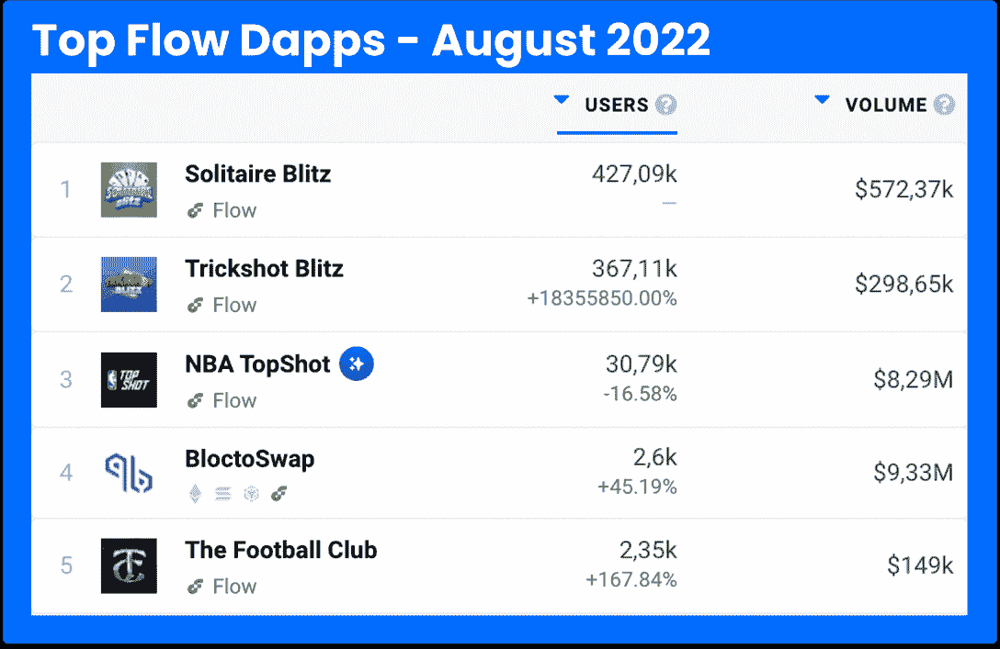

# Ticketmaster 与 Dapper Labs 合作，在 Flow Blockchain 上创建事件 NFT

> 原文：<https://web.archive.org/web/https://dappradar.com/blog/ticketmaster-mint-event-nfts-flow-blockchain>

## 组织者可以在活动之前或之后向粉丝发放 NFT

NFT 公用事业公司正朝着未来又迈进了一步。全球领先的票务管理公司 Ticketmaster 周三宣布，它终于签署了加入 Web3 的合同。Dapper Labs 的 Flow 被选为区块链造币厂，在平台上销售现场活动的可收藏 NFT。

这是一种创新的方式来提高球迷的经验，可以永远珍藏，感谢区块链技术。

> *“我们与 Ticketmaster 的合作将使数百万现场活动粉丝能够通过数字收藏品来纪念、分享和提升他们的 IRL 体验”*
> 
> Mickey Maher, SVP Partnerships of Dapper Labs.

区块链宣布，这一合作仍处于初期阶段，社区可以期待更多的消息。

## NFT 活动门票

虽然 NFT 在 2021 年赢得了名人和小报的青睐，但它们的使用案例从那时起才开始增加。全球品牌已经在时尚、、体育、视频游戏等领域采用了这些独特的标志。

在[元宇宙](https://web.archive.org/web/20220926010759/https://dappradar.com/blog/what-is-the-metaverse)的现场和虚拟赛事中，NFTs 作为门票的效用一直在增长。

正如 [Dapper Labs 的官方新闻稿](https://web.archive.org/web/20220926010759/https://www.dapperlabs.com/newsroom/ticketmaster-launches-new-capability-to-issue-digital-collectible-nfts-to-fans-before-during-or-after-an-event)所指出的，这并不是我们第一次听说 Ticketmaster 使用 Flow 来铸造 NFT。超过 70，000 张 POAP NFT 在 LVI 超级碗上分发。

此外，在 2022 赛季，NFL 将向超过 100 场比赛的每一位参与者发放 NFTS——也是在 Flow 上铸造的。

## 什么是流量？

Flow 是一个快速、用户友好和开发者友好的 PoS 区块链。它是由 Dapper Labs 团队在 2019 年底创建的，以其著名的 [Cryptokitties](https://web.archive.org/web/20220926010759/https://dappradar.com/ethereum/games/cryptokitties) 而闻名。

从那时起，它已经领导了其他几个大型和媒体驱动的 Web3 项目，如 [NBA Top Shot NFTs](https://web.archive.org/web/20220926010759/https://dappradar.com/flow/collectibles/nba-topshot) ，以及最近的[纸牌闪电战](https://web.archive.org/web/20220926010759/https://dappradar.com/flow/games/solitaire-blitz)游戏。

你可以在我们的完整文章中了解更多关于 [Flow 的信息，并使用](https://web.archive.org/web/20220926010759/https://dappradar.com/blog/introducing-the-flow-blockchain-home-of-nba-top-shot) [DappRadar 排名工具](https://web.archive.org/web/20220926010759/https://dappradar.com/rankings/protocol/flow)跟踪区块链上最常用的 dapps。

[<picture></picture>](https://web.archive.org/web/20220926010759/https://dappradar.com/rankings/protocol/flow)

[Top Flow Dapps in August 2022 via DappRadar](https://web.archive.org/web/20220926010759/https://dappradar.com/rankings/protocol/flow)

一旦您从 Ticketmaster 获得门票并参加活动，收到的 POAP NFTs 将进入您的 Web3 钱包。

通过使用 [DappRadar 投资组合跟踪器](https://web.archive.org/web/20220926010759/https://dappradar.com/hub/wallet/)，您不仅可以管理您的投资，还可以对您的活动 NFTs 有一个[概览——这在未来也将与 Flow 集成。](https://web.archive.org/web/20220926010759/https://dappradar.com/blog/dappradar-integrates-poaps-into-portfolio-tracker)

此外，达普拉达将继续关注 NFT 空间的最新消息。请务必关注我们的[博客](https://web.archive.org/web/20220926010759/https://dappradar.com/blog/)以获取教育内容&最热门的趋势。

***以上不构成投资建议。此处给出的信息仅供参考。请尽职调查并自行研究。***

 NewsletterUnsubscribe at any time. [T&Cs](https://web.archive.org/web/20220926010759/https://dappradar.com/terms) and [Privacy Policy](https://web.archive.org/web/20220926010759/https://dappradar.com/privacy-policy)