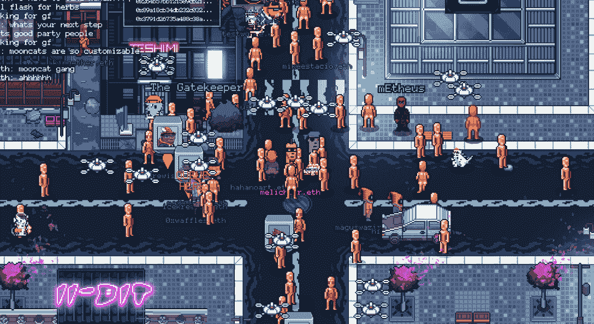

# 十大最佳元宇宙游戏世界

> 原文：<https://web.archive.org/web/https://dappradar.com/blog/top-10-best-gaming-metaverse-worlds>

## 元宇宙世界，游戏体验是玩家体验的中心

就游戏性和投资机会而言，元宇宙世界游戏正稳步成为区块链爱好者的首选。这种平台的最大优势是玩家可以享受游戏，并拥有游戏的一部分。

在过去的几个月里，元宇宙地产的交易活动全面大幅增加。尤其是在像脸书(现在的 Meta)这样的机构玩家开始推动元宇宙成为主流之后。随着这股关注的浪潮，新的虚拟世界正在元宇宙遍地开花。但是哪个元宇宙游戏世界提供了最好的体验呢？看看下面的十大清单，了解更多。

## Aavegotchi

Aavegotchi 是元宇宙游戏界的一颗新星。该平台已经引入了相当数量的游戏元素，团队的最新版本是 Gotchiverse 的引入。在虚拟世界中，玩家[需要收集](https://web.archive.org/web/20221001233108/https://dappradar.com/blog/how-to-earn-aavegotchis-gotchus-alchemica-and-craft-the-le-golden-aaltar) FUD、FOMO、阿尔法和 KEK，这些都是多边形区块链上唯一的货币。这四个令牌也被称为 Gotchus 炼金术。

玩家可以使用 Gotchus 炼金术制造限量版[金色阿尔塔](https://web.archive.org/web/20221001233108/https://dappradar.com/blog/how-to-earn-aavegotchis-gotchus-alchemica-and-craft-the-le-golden-aaltar)或更便宜的金色瓷砖。这些物品可以提高哥特人土地的效用，因为哥特人需要保护他们的领地免受邪恶清算者的攻击。带着你的 Gotchi 在 Gotchiverse 跑一圈并获得奖励，或者使用官方借贷工具从其他玩家那里借一个 Gotchi。[进入这里的草丛](https://web.archive.org/web/20221001233108/https://verse.aavegotchi.com/)！

[https://web.archive.org/web/20221001233108if_/https://www.youtube.com/embed/BxYQoDKO62Y?feature=oembed](https://web.archive.org/web/20221001233108if_/https://www.youtube.com/embed/BxYQoDKO62Y?feature=oembed)

## 无限轴

[Axie Infinity](https://web.archive.org/web/20221001233108/https://dappradar.com/multichain/games/axie-infinity) 作为引入这一革命性商业模式的先锋力量，是“即玩即赚”空间的重要组成部分。除了广泛的游戏内经济，Axie Infinity 还让玩家有机会获得自己的土地，以建立一个定制的 Axie 宇宙。目前，土地还没有完全融入到游戏中。然而，Sky Mavis 团队正在积极开发平台的这一方面。

Axie Infinity 生态系统中的土地将在游戏所需的资源方面发挥至关重要的作用。结合两个本地令牌， [AXS](https://web.archive.org/web/20221001233108/https://dappradar.com/hub/token/eth/AXS/ETH?from=0xbb0e17ef65f82ab018d8edd776e8dd940327b28b) 和 [SLP](https://web.archive.org/web/20221001233108/https://dappradar.com/hub/token/eth/SLP/ETH?from=0xcc8fa225d80b9c7d42f96e9570156c65d6caaa25) ，这些资源将在竞技场战斗和任务中帮助玩家。

[https://web.archive.org/web/20221001233108if_/https://www.youtube.com/embed/o6kAdSYR0uQ?feature=oembed](https://web.archive.org/web/20221001233108if_/https://www.youtube.com/embed/o6kAdSYR0uQ?feature=oembed)

## 沙盒

早在 2012 年，沙盒就以一种普通的移动和 PC 体验开始了。然而，在 2018 年，Animoca Brands 购买了该平台，并开始添加区块链功能。今天，沙盒是一个领先的游戏元宇宙世界，每月产生数百万 NFT 土地销售。

在原生令牌[和](https://web.archive.org/web/20221001233108/https://dappradar.com/hub/token/eth/SAND/ETH?from=0x3845badade8e6dff049820680d1f14bd3903a5d0)的支持下，这款游戏现在提供了一个边玩边赚的元素和该领域最受欢迎的土地收集之一。由于沙盒，像[育碧](https://web.archive.org/web/20221001233108/https://dappradar.com/blog/game-company-ubisoft-brings-raving-rabbids-into-the-sandbox/)和[华纳音乐集团](https://web.archive.org/web/20221001233108/https://dappradar.com/blog/the-sandbox-welcomes-warner-music-group/)这样的大品牌已经进入元宇宙。更重要的是，像 Snoop Dogg 这样的名人正在该平台上建立广泛的虚拟体验。考虑到沙盒吸引的主流玩家的兴趣，这个游戏元宇宙世界在这个领域最受欢迎也就不足为奇了。

[https://web.archive.org/web/20221001233108if_/https://www.youtube.com/embed/Zg5vcdEeLOA?feature=oembed](https://web.archive.org/web/20221001233108if_/https://www.youtube.com/embed/Zg5vcdEeLOA?feature=oembed)

## NFT 世界

NFT 世界是元宇宙游戏世界中的一颗新星。它结合了已经流行的《我的世界》与区块链技术和土地 NFTs。NFT 世界团队依靠本地令牌 WRLD 创造了一个广泛的游戏经济。

令人印象深刻的是，游戏中的土地代表了整个世界。不像其他虚拟世界只提供单一世界中的一小块土地，这个平台允许玩家购买整个生态系统。NFT 的每一片土地都有其独特的特征，比如水土比和资源丰富程度。这些特点决定了剧情的价值，以及对各种任务的适合程度。

[https://web.archive.org/web/20221001233108if_/https://www.youtube.com/embed/pzfsKNJa6jM?feature=oembed](https://web.archive.org/web/20221001233108if_/https://www.youtube.com/embed/pzfsKNJa6jM?feature=oembed)

## 山地

建在 EOS 区块链的[高地](https://web.archive.org/web/20221001233108/https://dappradar.com/eos/games/upland)是终极的房地产体验。这个游戏元宇宙世界为玩家提供了成为区块链房地产大亨的机会。根据真实世界地图绘制的高地是目前最大的虚拟世界之一。更重要的是，该游戏每周吸引数千个独特的活跃钱包。

玩家有机会购买真实地点后绘制的土地。土地所有者可以创建企业或翻转他们的土地获利。就像传统的房地产一样，位置、大小和邻近的房产都会影响一块土地的价格。该游戏具有广泛的社区建设功能和无数的挑战以及赢得奖品的机会。

[https://web.archive.org/web/20221001233108if_/https://www.youtube.com/embed/c_e8yzC_IuQ?feature=oembed](https://web.archive.org/web/20221001233108if_/https://www.youtube.com/embed/c_e8yzC_IuQ?feature=oembed)

## 万维网

是一个基于探索的游戏元宇宙世界，玩家可以通过公寓的形式购买土地。公寓分为四种不同的大小，使玩家能够拥有一个定制的万维网世界。更重要的是，这些地块可以作为一个个性化的 NFT 画廊，甚至是一个活动场所。

在游戏性方面，WorldWideWebb 提供了大量的任务，以收藏品和各种其他资源的形式给玩家带来奖励。该游戏自推出以来吸引了成千上万的玩家，这要归功于详细且经常具有挑战性的任务和任务。值得注意的一个重要细节是，WorldWideWebb 是集成方面的领导者，允许玩家链接他们的 NFT 收藏，并从他们的收藏品组合中选择一个头像。

## Mirandus

Mirandus 是一款史诗般的奇幻 RPG 游戏，背景是一个由五位玩家君主统治的庞大世界。玩家们标上他们的所有权并购买土地契约来建造城镇、城市和城堡。契约是玩家建立安全和商业场所的手段。每个契约都是一个模板，可以“印”在米兰多斯的地形上，让它成为你自己的。

由区块链最大的游戏工作室之一 Gala Games 制作的《米兰多斯》吸引了全球玩家的关注。更重要的是，这款游戏的沃克斯 NFT 收藏已经产生了数百万的交易量。令人印象深刻的是，[一件罕见的龙 NFT 在二级市场上卖出了 150 多万美元](https://web.archive.org/web/20221001233108/https://dappradar.com/blog/mirandus-vox-dragon-nft-switched-owners-for-1-48-million/)。该团队最近推出了 Materium (MTRM)，这是米兰多斯游戏生态系统的原生令牌。

[https://web.archive.org/web/20221001233108if_/https://www.youtube.com/embed/chbT1p99ziM?feature=oembed](https://web.archive.org/web/20221001233108if_/https://www.youtube.com/embed/chbT1p99ziM?feature=oembed)

## 灰烬之剑

余烬剑是一个基于多边形的 MMORPG，有着玩家驱动的经济，无阶级的战斗系统，以及稀缺的可交易的化妆品收藏品。此外，游戏的特点是广泛的土地 NFT 收集紧密相连的基本游戏和故事。重要的是，土地所有者从他们的土地所属的地产产生的现实收入中获得一小部分。

烬剑是多边形上最受欢迎的 MMORPG 游戏之一，具有顶级图形和身临其境的设计。在 160，000 个有限总供应的情况下，《余烬之剑》中的土地是最受欢迎的游戏创收方式之一。然而，游戏还没有上线。

[https://web.archive.org/web/20221001233108if_/https://www.youtube.com/embed/xFeoAp1ddBE?feature=oembed](https://web.archive.org/web/20221001233108if_/https://www.youtube.com/embed/xFeoAp1ddBE?feature=oembed)

## 夹板地

基于蜂巢的交易卡牌游戏[夹板岛](https://web.archive.org/web/20221001233108/https://dappradar.com/multichain/games/splinterlands)是所有协议中玩得最多的区块链游戏之一。凭借广泛的游戏内经济和迷人的快节奏战斗，该平台吸引了大量的活动。

游戏最令人期待的功能之一是陆地功能。Splinterlands 已经进行了几次 NFT 土地销售，几乎立即售罄。目前，陆地 NFT 还没有被积极地融入到游戏中。然而，当下注本地令牌 [SPS](https://web.archive.org/web/20221001233108/https://dappradar.com/hub/token/bsc/SPS/BNB?from=0x1633b7157e7638c4d6593436111bf125ee74703f) 时，拥有小块土地会增加被动收入。在未来，陆地 NFTs 将生产玩家需要的资源来提升他们的卡牌。

[https://web.archive.org/web/20221001233108if_/https://www.youtube.com/embed/PXj7594jgaM?feature=oembed](https://web.archive.org/web/20221001233108if_/https://www.youtube.com/embed/PXj7594jgaM?feature=oembed)

## 巨型世界(又名巨型加密城市)

[巨型世界](https://web.archive.org/web/20221001233108/https://dappradar.com/multichain/games/megacryptopolis)是一款多链分散城市建设者战略游戏。该平台允许玩家购买或租赁土地，并在元宇宙创建自己的空间。由[巨型](https://web.archive.org/web/20221001233108/https://dappradar.com/hub/token/eth/MEGA/ETH?from=0x3218a02f8f8b5c3894ce30eb255f10bcba13e654)令牌驱动，游戏具有广泛的游戏内经济。

Mega World 允许玩家租赁建筑，生产其他建筑所需的材料，创造新一代公民，为其他玩家提供服务，放置广告和驾驶汽车。在 Mega World 中，每当一个地块的所有者发生变化时，购买该地块的一部分价格就会落入周围 7×7 半径范围内的土地所有者手中。

[https://web.archive.org/web/20221001233108if_/https://www.youtube.com/embed/1j3dvrTO8kg?feature=oembed](https://web.archive.org/web/20221001233108if_/https://www.youtube.com/embed/1j3dvrTO8kg?feature=oembed)

 NewsletterUnsubscribe at any time. [T&Cs](https://web.archive.org/web/20221001233108/https://dappradar.com/terms) and [Privacy Policy](https://web.archive.org/web/20221001233108/https://dappradar.com/privacy-policy)