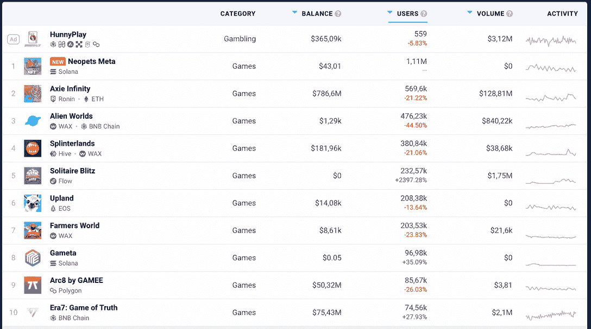

# 十大最佳区块链游戏，可玩并赢取加密代币

> 原文：<https://web.archive.org/web/https://dappradar.com/blog/top-10-blockchain-games-to-play-and-earn-crypto-tokens>

## 一轮 10 个最好的区块链游戏来玩，并赚取加密代币

**自从 2021 年游戏赚钱的大爆发以来，每个人都在寻找下一款最好的区块链游戏。有数百个新项目冒出来，玩家往往很难找到宝石。**

但是有哪些最好的区块链游戏可以玩并赢得加密代币呢？我们的前 10 名名单是你开始搜索的好地方。

## 十大最值得玩和赢取的区块链游戏

这是目前最值得玩和赚的 10 款区块链游戏。有些提供了很棒的 web3 游戏体验，但所有这些都让你有机会做些小事情。

### 1.无限轴

所有区块链游戏中的*爸爸*， [Axie Infinity](https://web.archive.org/web/20221002180858/https://dappradar.com/multichain/games/axie-infinity) 在 [DappRadar 的游戏排名页面](https://web.archive.org/web/20221002180858/https://dappradar.com/rankings/category/games)中位于多个链上活动的顶部附近。

[https://web.archive.org/web/20221002180858if_/https://www.youtube.com/embed/X2z_YIeettE?feature=oembed](https://web.archive.org/web/20221002180858if_/https://www.youtube.com/embed/X2z_YIeettE?feature=oembed)

自从 2021 年 11 月它的全盛时期，一块土地[以 230 万美元](https://web.archive.org/web/20221002180858/https://dappradar.com/blog/axie-infinity-smashes-records-with-land-sale-worth-2-3m)的价格售出，围绕 Axie Infinity 的炒作已经稍微消退。

但是玩家仍然可以通过收获顺滑的爱情药剂(SLP)、繁殖和出售 Axie 以及下注 Axie Infinity 碎片(AXS)来赚钱，这一点你可以在[官网](https://web.archive.org/web/20221002180858/https://axieinfinity.com/)上确认。

从长远来看，投资可以出租或出售获利的土地是另一种选择。新的发展必将重振 Axie 生态系统。

*   游戏内货币: [AXS](https://web.archive.org/web/20221002180858/https://dappradar.com/hub/token/eth/AXS?from=0xbb0e17ef65f82ab018d8edd776e8dd940327b28b)

### 2.Aavegotchi

[Aavegotchi](https://web.archive.org/web/20221002180858/https://dappradar.com/polygon/games/aavegotchi)2022 年初出现转机。在那之前，它一直是一个 GameFi 平台，承诺让人们沉迷于游戏。随着 [alpha 即将推出](https://web.archive.org/web/20221002180858/https://dappradar.com/blog/aavegotchi-rewards-real-fans-by-replacing-airdrops-with-playdrops)，用户开始有更多的机会获得奖励并有可能赚钱。

[https://web.archive.org/web/20221002180858if_/https://www.youtube.com/embed/PtgZT-dVERI?feature=oembed](https://web.archive.org/web/20221002180858if_/https://www.youtube.com/embed/PtgZT-dVERI?feature=oembed)

买卖[王国土地](https://web.archive.org/web/20221002180858/https://dappradar.com/blog/aavegotchi-gotchiverse-land-release)和游戏中的 NFT 化身 Gotchi，最近已经成为[的大生意](https://web.archive.org/web/20221002180858/https://dappradar.com/polygon/games/aavegotchi)。Gotchi 可穿戴设备也有市场，或者 GHST 持有者可以持有代币赚取利息。

DappRadar 将继续为您更新该项目的最新消息，您也可以访问[官方网站](https://web.archive.org/web/20221002180858/https://www.aavegotchi.com/)了解更多信息。

*   游戏内货币: [GHST](https://web.archive.org/web/20221002180858/https://dappradar.com/hub/token/eth/GHST?from=0x3f382dbd960e3a9bbceae22651e88158d2791550)

### 3.REVV 赛车

赛车游戏几乎和电脑游戏一样古老。Animoca Brands 的 REVV Racing 是 Polygon 网络上最大的游戏 dapps 之一，它的体验包括了我们已经爱上的汽车游戏的一切。

[https://web.archive.org/web/20221002180858if_/https://www.youtube.com/embed/_HqyMCx4VDA?feature=oembed](https://web.archive.org/web/20221002180858if_/https://www.youtube.com/embed/_HqyMCx4VDA?feature=oembed)

用户可以通过卖收藏品和跑马圈地来赚钱。还有比赛可以赢——根据[官方网站](https://web.archive.org/web/20221002180858/https://www.revvracing.com/)的消息，去年 9 月的塔杯启动了 15 万美元的奖金池，获胜者将获得 1.2 万美元。

*   游戏内货币: [REVV](https://web.archive.org/web/20221002180858/https://dappradar.com/hub/token/eth/REVV?from=0x557b933a7c2c45672b610f8954a3deb39a51a8ca)

### 4.城镇明星

Gala Games 最大的头衔[城镇明星](https://web.archive.org/web/20221002180858/https://dappradar.com/blog/tag/town-star)[最近重新调整了其象征学](https://web.archive.org/web/20221002180858/https://dappradar.com/blog/gala-games-powers-up-plans-for-town-earnings)，因为它希望保持其在游戏赚取游戏世界的强势地位。

[https://web.archive.org/web/20221002180858if_/https://www.youtube.com/embed/ewtbKY7ltqg?feature=oembed](https://web.archive.org/web/20221002180858if_/https://www.youtube.com/embed/ewtbKY7ltqg?feature=oembed)

该平台采取这一举措是为了让新用户有公平的机会参与游戏并获得奖励。

赚钱策略包括手工制作、采矿和种植资产出售，以及向其他玩家出租建筑。还有每月一次的挑战，获胜者可以赢得 [GALA](https://web.archive.org/web/20221002180858/https://dappradar.com/hub/token/eth/GALA/ETH?from=0x15d4c048f83bd7e37d49ea4c83a07267ec4203da) 代币。

*   游戏内货币:[城镇](https://web.archive.org/web/20221002180858/https://dappradar.com/hub/token/eth/TOWN?from=0x3dd98c8a089dbcff7e8fc8d4f532bd493501ab7f)

### 5.Pegaxy

[Pegaxy](https://web.archive.org/web/20221002180858/https://dappradar.com/polygon/games/pegaxy) 是另一款赛车游戏，除了这款游戏涉及神秘的机械马互相争夺奖品。

[https://web.archive.org/web/20221002180858if_/https://www.youtube.com/embed/B9-BxA5YouE?feature=oembed](https://web.archive.org/web/20221002180858if_/https://www.youtube.com/embed/B9-BxA5YouE?feature=oembed)

玩家可以在市场上出售他们的 Pega，或者出租给其他人使用。Pegaxy 在其官方路线图中计划了许多更新，DappRadar 将继续在我们的 T2 多边形游戏排名中跟踪它的成功。

这是一个赛车游戏，你也可以让你的马参加单人比赛，或者参加 Pegaxy 的全球比赛。

*   游戏中的货币:VIS

**进一步阅读** : [顶级游戏世界及其加密代币经济](https://web.archive.org/web/20221002180858/https://dappradar.com/blog/7-game-worlds-and-their-crypto-token-economies)

### 6.被解放的神

《被解放的神》是一款 AAA 级区块链游戏，由比特币基地背后的投资者提供支持。

[https://web.archive.org/web/20221002180858if_/https://www.youtube.com/embed/t2PtC76k4b0?feature=oembed](https://web.archive.org/web/20221002180858if_/https://www.youtube.com/embed/t2PtC76k4b0?feature=oembed)

这是一款建立在[以太坊网络](https://web.archive.org/web/20221002180858/https://dappradar.com/rankings/protocol/ethereum/category/games)上的可收集的交易卡牌游戏，玩家可以通过与对手进行排名赛来赚钱。

当玩家获胜并升级时，游戏会奖励他们一些卡片，他们可以将这些卡片组合起来在公开市场上出售。玩家还可以参加周末挑战，赢得额外的资产出售。

*   游戏内货币:[神](https://web.archive.org/web/20221002180858/https://dappradar.com/hub/token/eth/GODS?from=0xccc8cb5229b0ac8069c51fd58367fd1e622afd97)

### 7.克拉巴达

[Crabada](https://web.archive.org/web/20221002180858/https://dappradar.com/avalanche/games/crabada) 是一款建立在[雪崩区块链](https://web.archive.org/web/20221002180858/https://dappradar.com/rankings/protocol/avalanche)基础上的游戏。寄居蟹居住在克拉巴达王国，玩家通过采矿、掠夺、繁殖和战斗等活动获得奖励。

[https://web.archive.org/web/20221002180858if_/https://www.youtube.com/embed/ETCwabk4J0s?feature=oembed](https://web.archive.org/web/20221002180858if_/https://www.youtube.com/embed/ETCwabk4J0s?feature=oembed)

用户可以在 Crabada 市场上出售他们的奖励。还可以通过把螃蟹借出去让人租的方式来挣钱。

*   游戏中的货币:CRA

### 8.九编年史

一个开源的闲置 MMORPG，[九历记](https://web.archive.org/web/20221002180858/https://dappradar.com/other/games/nine-chronicles)是一个完全去中心化的 dapp，玩家在那里一起玩，一起采矿，一起统治。他们也可以通过制作和交易游戏中的资产来赚钱。有九个不同的领域探索完成任务的奖励。

[https://web.archive.org/web/20221002180858if_/https://www.youtube.com/embed/Kf-7NXLVLOE?feature=oembed](https://web.archive.org/web/20221002180858if_/https://www.youtube.com/embed/Kf-7NXLVLOE?feature=oembed)

《九世纪事报》在它自己的区块链上运行，但是玩家可以将他们的《九世纪事报》( NCG)转换成以太坊。

*   游戏中的货币:NCG

### 9.Thetan 竞技场

拥有超过 2300 万玩家，可以在 Android、iOs 和 PC 上玩， [Thetan Arena](https://web.archive.org/web/20221002180858/https://dappradar.com/binance-smart-chain/games/thetan-arena) 已经是游戏世界中的一个既定头衔。

[https://web.archive.org/web/20221002180858if_/https://www.youtube.com/embed/nFFI671jKlI?feature=oembed](https://web.archive.org/web/20221002180858if_/https://www.youtube.com/embed/nFFI671jKlI?feature=oembed)

这款游戏建立在[币安智能链](https://web.archive.org/web/20221002180858/https://dappradar.com/rankings/protocol/binance-smart-chain/category/games)之上，拥有[稳定的路线图](https://web.archive.org/web/20221002180858/https://thetanarena.com/)和奖励坚持到底者的计划。

[DappRadar 对如何在 Thetan 竞技场挣钱进行了深入的分解](https://web.archive.org/web/20221002180858/https://dappradar.com/blog/what-is-thetan-arena-and-how-to-play-and-earn)但是为了 tl 的目的；dr，玩家可以通过战斗、任务和排位获得游戏内代币。这些可以换成加密货币或者法币，也可以用它买 NFT。

*   游戏中的货币:THC 和 THG

### 10.分散游戏

[分散式游戏](https://web.archive.org/web/20221002180858/https://dappradar.com/multichain/games/decentral-games)是一个分散式自治组织(DAO ),在分散式土地内部的多边形网络上构建赚取游戏。它也是一个赌场生态系统，提供扑克、21 点、轮盘和吃角子老虎机游戏。

[https://web.archive.org/web/20221002180858if_/https://www.youtube.com/embed/DMNYHEV8lYo?feature=oembed](https://web.archive.org/web/20221002180858if_/https://www.youtube.com/embed/DMNYHEV8lYo?feature=oembed)

玩家可以通过游戏和下注本国货币 DG 来赚钱。

在 ICE Poker 中借出 NFT 是赚取被动收入的简单方法。

*   游戏内货币: [xDG](https://web.archive.org/web/20221002180858/https://dappradar.com/hub/token/eth/xDG?from=0x4f81c790581b240a5c948afd173620ecc8c71c8d) 和 [ICE](https://web.archive.org/web/20221002180858/https://dappradar.com/hub/token/polygon/ICE_1?from=0xc6c855ad634dcdad23e64da71ba85b8c51e5ad7c)

## 为什么区块链奥运会与众不同？

随着互联网从 Web2 到 Web3 的演变，游戏行业也在重塑自己。所谓的区块链游戏彻底改变了游戏玩家、开发人员、工作室以及其他所有人的工作方式。

与传统游戏不同，Web3 游戏使用基于密码的区块链技术。这些分散的协议允许更大的透明度、无信任的交互，并使玩家能够拥有他们的游戏数据和游戏中的资产。

从开发商的角度来看，使用区块链技术可以让他们创造新的商业模式，专注于留住玩家，并进入新的市场。

## 区块链游戏值得玩吗？

就像传统视频游戏一样，也有各种各样的 Web3 游戏。有些游戏的可玩性可能很差，有些则通过未来的技术提供有意义的游戏体验。

归根结底，一款区块链游戏是否值得一玩将取决于项目背后的团队。

他们是热情的开发者和游戏玩家吗？tokenomics 这个游戏是否经过深思熟虑，是否透明？社区是否活跃并受到尊重？

这些都是在开始一个新游戏之前要问的简单而重要的问题。

如果你有兴趣了解更多关于这类游戏的知识，可以看看这篇文章 [Gaming: DappRadar 的终极指南](https://web.archive.org/web/20221002180858/https://dappradar.com/blog/gaming-dappradars-ultimate-guide)

## 如何发现新的加密游戏来玩和赚取？

尽管我们的最佳区块链游戏列表可能很完整，但新的游戏项目一直在涌现。如果你想跟上最新的发布，你必须查看一下 [DappRadar 区块链游戏排名](https://web.archive.org/web/20221002180858/https://dappradar.com/rankings/category/games)。

达普拉达将继续密切关注区块链的最佳比赛。

如果你想进一步了解令人兴奋的去中心化应用世界中的顶级项目，请关注我们的[博客](https://web.archive.org/web/20221002180858/https://dappradar.com/blog/)、 [YouTube](https://web.archive.org/web/20221002180858/https://www.youtube.com/c/DappRadar) 频道和 [Twitter](https://web.archive.org/web/20221002180858/https://twitter.com/dappradar) 。

 NewsletterUnsubscribe at any time. [T&Cs](https://web.archive.org/web/20221002180858/https://dappradar.com/terms) and [Privacy Policy](https://web.archive.org/web/20221002180858/https://dappradar.com/privacy-policy)