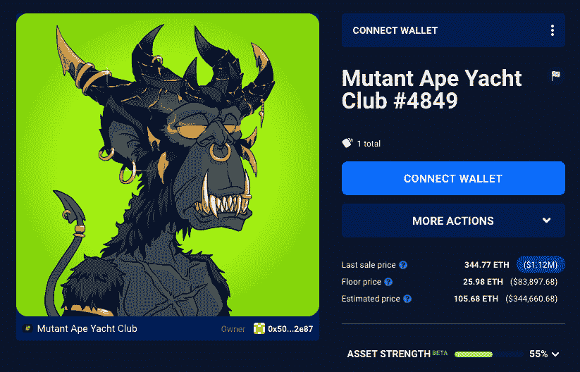
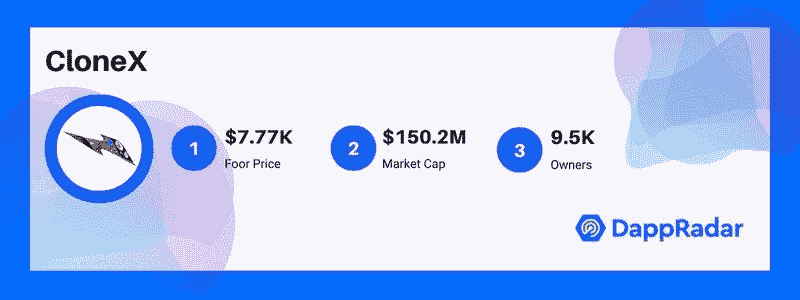
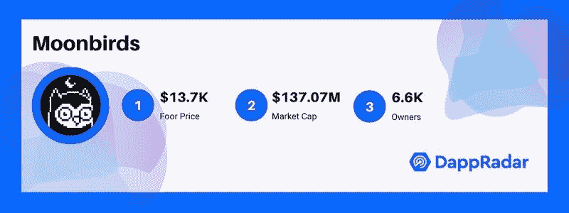
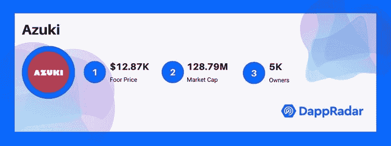
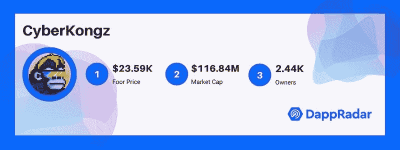
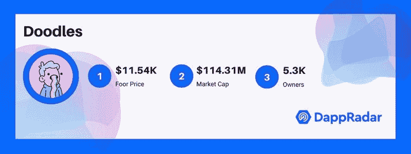
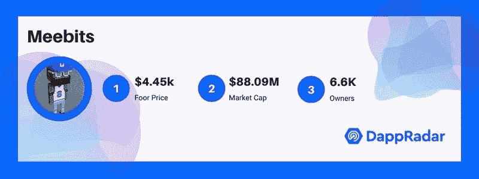
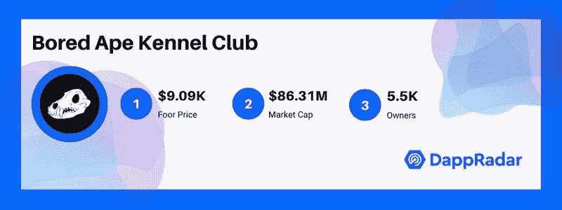

# 十大最受欢迎的头像亲民党 NFT 收藏

> 原文：<https://web.archive.org/web/https://dappradar.com/blog/top-10-most-popular-avatar-pfp-nft-collections>

## 无聊的猿人，神秘的朋克，克隆人，这些是你应该知道的

最初发布于 2022 年 4 月 8 日，更新于 2022 年 9 月 19 日。

市面上最受欢迎的头像或亲民党 NFT 系列有哪些？为什么他们在 NFT 领域有影响力？那些围绕着无聊的猿和密码朋克这样的集合而形成的社区，他们做了什么？在这篇文章中，我们将揭示这些问题的答案。此外，我们将定期更新 NFT 十大玩家名单，这样你就可以随时了解最热门的头像收藏。

**内容:**

*   [无聊猿游艇俱乐部](https://web.archive.org/web/20221129150939/https://dappradar.com/blog/top-10-most-popular-avatar-pfp-nft-collections/#BAYC)
*   [隐朋克](https://web.archive.org/web/20221129150939/https://dappradar.com/blog/top-10-most-popular-avatar-pfp-nft-collections/#punks)
*   [变异猿游艇俱乐部](https://web.archive.org/web/20221129150939/https://dappradar.com/blog/top-10-most-popular-avatar-pfp-nft-collections/#MAYC)
*   [CloneX](https://web.archive.org/web/20221129150939/https://dappradar.com/blog/top-10-most-popular-avatar-pfp-nft-collections/#cloneX)
*   [月鸟](https://web.archive.org/web/20221129150939/https://dappradar.com/blog/top-10-most-popular-avatar-pfp-nft-collections/#moonbirds)
*   [志那都红豆](https://web.archive.org/web/20221129150939/https://dappradar.com/blog/top-10-most-popular-avatar-pfp-nft-collections/#Azuki)
*   [网络之王](https://web.archive.org/web/20221129150939/https://dappradar.com/blog/top-10-most-popular-avatar-pfp-nft-collections/#kongz)
*   [涂鸦](https://web.archive.org/web/20221129150939/https://dappradar.com/blog/top-10-most-popular-avatar-pfp-nft-collections/#doodles)
*   [Meebits](https://web.archive.org/web/20221129150939/https://dappradar.com/blog/top-10-most-popular-avatar-pfp-nft-collections/#meebits)
*   [无聊猿养狗俱乐部](https://web.archive.org/web/20221129150939/https://dappradar.com/blog/top-10-most-popular-avatar-pfp-nft-collections/#bakc)

PFP 代表校样图片，或者简单地说，是“个人资料图片”。从 2020 年底到 2021 年年中，以 CryptoPunks 和 Bored Ape Yacht Club (BAYC)为代表的亲民党 NFT 藏品横扫顶级拍卖行。可以说，私营部门基金会正在改变人们消费艺术和文化的方式，颠覆传统的商业逻辑。

这种趋势不可阻挡。

运行一个成功的 PFP 项目需要战略规划，包括营销、社区建设、商业模式设计、技术支持等等。看到这些项目给区块链生态系统带来了多少创新是令人兴奋的。

在这篇文章中，我们将与您分享最新的 10 大亲民党 NFT 收藏受欢迎程度。本文中的数字是在撰写本文时写下的。与此同时，你可以利用 [DappRadar 的投资组合跟踪器](https://web.archive.org/web/20221129150939/https://dappradar.com/hub/wallet)来管理你在 NFT 的资产，并利用[的 NFT 浏览器工具](https://web.archive.org/web/20221129150939/https://dappradar.com/hub/nft-explorer)来查看各种最新的 NFT 市场信息。

## 排名第一的无聊猿游艇俱乐部

BAYC 目前以 9.5305 亿美元的市值高居所有 NFT 收藏的榜首。这个项目创造了一个会员俱乐部，一个时尚的游戏品牌，一个商业帝国，一个文化符号，或者社区决定的任何东西。

作为亲民党 NFT 领域的超级巨星，拜克已经成为虚拟世界中吹嘘社会地位的兰博基尼。不出所料，顶级名人的赞助似乎只会增加。最新的名人名单包括 NBA 球星斯蒂芬·库里、电视主持人吉米·法伦、音乐偶像阿姆、超级偶像贾斯汀比伯和亿万富翁马克·库班。

BAYC 在 2022 年实现了许多里程碑，例如发布 ApeCoin 作为社区激励和治理令牌。此外，BAYC 通过出售其元宇宙土地，Otherdeeds 发布了备受期待的元宇宙项目 Otherside。

值得注意的是，这个最昂贵的亲民党头像已经达到了 21.7 亿美元的历史最高价。为了评估这个非凡的 NFT 收藏，下面有一些有用的链接。

*   [BAYC 实时行情数据。](https://web.archive.org/web/20221129150939/https://dappradar.com/hub/nft-explorer/collection/bored-ape-yacht-club)
*   DappRadar 关于无聊猿游艇俱乐部的简单指南。
*   [ApeCoin 实时行情数据。](https://web.archive.org/web/20221129150939/https://dappradar.com/hub/token/eth/APE?from=0x4d224452801aced8b2f0aebe155379bb5d594381)
*   [Otherdeeds 实时行情数据。](https://web.archive.org/web/20221129150939/https://dappradar.com/hub/nft-explorer/collection/otherdeed-for-otherside)
*   [如何估值百无聊赖的猿类游艇俱乐部 NFTs？](https://web.archive.org/web/20221129150939/https://dappradar.com/blog/how-to-value-bored-apes-yacht-club-nfts/)

## #2 加密朋克

2022 年 3 月 11 日，宇迦实验室(母公司和 BAYC 的创造者)宣布收购 CryptoPunks IP。作为有史以来第一个目前市值为 8.1989 亿美元的 PFP 项目， [CryptoPunks](https://web.archive.org/web/20221129150939/https://dappradar.com/ethereum/collectibles/cryptopunks) 开创了一个头像收集的典范。craze 朋克于 2017 年 6 月由幼虫实验室推出，于 2020 年底点燃了 NFT 热潮。像素化的个人资料图片曾经是 PFP 竞赛的巅峰。然而，它在 2021 年 12 月首次被 BAYC 超越。

尽管 BAYC 在当前的地板价(73 ETH 或 9.5 万美元)上领先，但 CryptoPunks 仍以 29.3 亿美元的历史交易量排名第一。最重要的是，CryptoPunks 给大众带来的数字所有权教育是不可磨灭的。查看下面的链接，了解 CryptoPunks 估值的更可靠的想法。

*   [crypto punk 实时市场数据。](https://web.archive.org/web/20221129150939/https://dappradar.com/hub/nft-explorer/collection/cryptopunks)
*   [什么是密码朋克，简单解释一下？](https://web.archive.org/web/20221129150939/https://dappradar.com/blog/what-are-cryptopunks-a-simple-explanation/)
*   [如何估值 CryptoPunks](https://web.archive.org/web/20221129150939/https://dappradar.com/blog/how-to-value-cryptopunks/) 。

## #3 变种人猿游艇俱乐部

[变种人猿游艇俱乐部(MAYC)](https://web.archive.org/web/20221129150939/https://dappradar.com/ethereum/collectibles/mutant-ape-yacht-club) 是 BAYC 的衍生项目，市值 3.5167 亿美元。突变猿是通过将一只无聊的猿暴露在一小瓶突变血清中而产生的。通过这种方式，BAYC 奖励了忠诚无聊的猿类持有者一个全新的 NFT，他们灵长类动物的突变版本。此外，它还降低了新手参与 BAYC 生态系统的门槛。

突变猿#4849 是迄今为止收藏中最昂贵的 NFT。这只长着黑色犄角、长着长长牙齿、脸色铁青的突变猿以高达 350 ETH 的价格售出。

该系列目前的底价为 18，080 美元，总成交量为 15.1 亿美元。

## 排名第四的 CloneX

CloneX 是虚拟街头时尚世界中的一个突出例子。CloneX 的创造者 RTKFT Studios 在虚拟街头服装和运动鞋领域迅速崛起。凭借对元宇宙的雄心，耐克公司于 2021 年 12 月收购了 RTFKT，认可了其融合文化和游戏的前沿创新的下一代收藏品。

这个备受期待的 PFP 项目去年与当代顶级艺术家村上隆合作，共同发布了《阿凡达》系列。毫无疑问，该系列立即售罄，甚至从 3 ETH 开始。

## #5 月鸟

Moonbirds 是我们 NFT 十大亲民党名单中的新面孔。这是 PROOF Collective 的 NFT 收藏，这是一个由 NFT 收藏家和艺术家组成的小型但有影响力且相对富裕的社区。令人印象深刻的是，这些 pixel birds 在官方造币厂发行后的两天内创造了一些非凡的记录。

持有月鸟 NFT 的最大好处之一是获得上述独家集体资源。在信息瞬息万变的 NFT 市场，知识就是黄金。

“月鸟”让收藏家们能够凭借最新的、可能是最有前途的 NFT 藏品领先市场一步。这种预期使得 Moonbirds 的价值飙升，在不到十天的时间里，平均交易价格超过 40 ETH。

这一传奇系列目前的底价为 13，700 美元。为了评估这个非凡的 NFT 收藏，下面有一些有用的链接。

*   [月鸟实时行情数据。](https://web.archive.org/web/20221129150939/https://dappradar.com/hub/nft-explorer/collection/moonbirds)
*   一个周末打破所有记录的 NFT 系列月鸟是什么？

## 第六名志那都红豆

今年一月下旬，志那都红豆主导了 NFT 地区的销售。动漫风格的 NFT 角色在三分钟内销售一空，收入超过 2900 万美元。志那都红豆将自己定位为元宇宙的高端品牌，他们希望这个社区成为其未来的核心。会员专用花园是志那都红豆元宇宙的一个角落，艺术、文化和社区在这里融合，激发灵感。

志那都红豆的成功并不令人惊讶。首先，志那都红豆杰出的视觉艺术不言自明。此外，近年来全球动漫文化的繁荣也将该项目推向了更广泛受众的面前。

作为最受欢迎的蓝筹股 NFT 系列之一，志那都红豆一直在稳步扩大其生态系统，增加各种福利。今年，该项目发布了几首配乐，举办了一次私人花园派对，并对所有志那都红豆持有者进行了一次突然的空投。

为了更好地了解志那都红豆的价值，请查看下面的链接。

*   [志那都红豆实时行情数据。](https://web.archive.org/web/20221129150939/https://dappradar.com/hub/nft-explorer/collection/azuki)
*   [如何评价志那都红豆](https://web.archive.org/web/20221129150939/https://dappradar.com/blog/how-to-value-azuki-nft-collection/)。

## #7 数码港

CyberKongz 是一个由 8888 个独特的、随机生成的头像组成的集合。CyberKongz 的生态系统中有两种 Kongz，OG Kongz(创世纪)和婴儿/孵化器 Kongz。

值得一提的是，CyberKongz 是第一个通过实用令牌 BANANA 将生成价值与其 PFP NFTs 相关联的 avatar 项目。Cyberkongz genesis 持有人在未来十年内每天可以获得 10 个香蕉。

数码港一直积极参与元宇宙的建设。该项目早些时候在沙盒中购买了一些包裹，以创建一个巨大的多地产混凝土丛林，在那里他们将策划涉及所有 CyberKongz NFTs 及其香蕉令牌的游戏和社交体验。

2022 年 3 月 5 日， [CyberKongz](https://web.archive.org/web/20221129150939/https://dappradar.com/hub/nft-explorer/collection/cyberkongz) 宣布了一个到 Polygon 网络的桥梁，标志着它向“玩赚”游戏 Play & Kollect 迈出了关键的一步。此后不久，CyberKong 在 Polygon 上正式拉开了这款备受期待的游戏的序幕。

## #8 涂鸦

涂鸦者 NFT 是 NFT 社区的宠儿。去年 10 月推出的 Doodles NFT 系列一直在排行榜上独占鳌头，并成为 NFT 业界最受欢迎的系列之一。毕竟谁能对马卡龙色的可爱角色说不呢？但是，更重要的是，该项目的社区第一的方法已经完全赢得了粉丝的心。

例如，其社区金库 Doodlebank 旨在为社区投票的产品和活动提供资金。只有涂鸦持有者有权决定如何使用这些资金。自推出以来，Doodle 积极与各种项目合作，为社区带来了无与伦比的体验。

要更深入地了解涂鸦，请点击下面的链接。

*   [涂鸦实时行情数据。](https://web.archive.org/web/20221129150939/https://dappradar.com/hub/nft-explorer/collection/doodles-official)
*   什么是涂鸦？
*   [如何给涂鸦估价？](https://web.archive.org/web/20221129150939/https://dappradar.com/blog/how-to-value-doodles-nfts/)

## #9 密比特

由幼虫实验室于 2021 年 5 月推出的 [Meebits](https://web.archive.org/web/20221129150939/https://dappradar.com/ethereum/collectibles/meebits) 是 20，000 个 3D 体素人物，旨在看起来像著名开放世界游戏如《我的世界》和 Roblox 中的角色。这个项目打算在各种游戏、虚拟世界和其他应用中使用这些 NFT 角色。

3 月 11 日，米比特 NFT 集合与它的姐妹项目 CryptoPunks 一起加入了宇迦实验室家族。目前，从 3.39 ETH 开始，米比特被认为在更广泛的宇迦实验室的生态系统中有特殊的位置。

你可以通过下面的链接找到更多关于如何更好地评估 Meebits NFTs 的信息。

*   [Meebits 实时行情数据。](https://web.archive.org/web/20221129150939/https://dappradar.com/hub/nft-explorer/collection/meebits)
*   什么是 Meebits？
*   [如何评价 Meebits？](https://web.archive.org/web/20221129150939/https://dappradar.com/blog/how-to-value-the-meebits-nft-collection)

## #10 无聊猿养狗俱乐部

无聊猿养狗俱乐部由 9602 只卡通柴犬狗组成，是更广泛的 BAYC 家族的一部分。推出后，每个 BAYC 持有者都可以免费“收养”一只 NFT 狗舍作为宠物。

对于 BAYC 的所有者来说，bakc 目前最大的用途是可以在二级市场上溢价出售。另一方面，购买者发现狗舍 NFTs 非常有吸引力，因为它是他们成为这个独家俱乐部成员的通行证，因为 BAYC 有一个遥远的门槛。此外，随着无聊猿元宇宙的进化，狗舍和它们的主人将获得更多的好处。

## 在 DappRadar 上跟踪流行的 NFT

对于那些 NFT 的忠实用户来说，这些高价的 jpegs 图片远不止是卡通图像。你拥有的或者你正试图拥有的东西很大程度上说明了你是谁，你的信仰，甚至你的时尚品味。每个亲民党的集合代表了一个完整的文化，有自己的视觉效果，语气和声音，社区结构，并在 NFT 圈分享声音。

买一个不仅仅是跟随潮流或获得溢价。更重要的是，这是一种身份的宣示。如果你想更好地了解这些私营部门筹资和伙伴关系收藏的价值，并了解如何抓住下一波浪潮，使用 [DappRadar 的 NFT 探索](https://web.archive.org/web/20221129150939/https://dappradar.com/hub/nft-explorer) r 获得所有这些收藏的实时市场数据。

## 随身携带您的 Web3 之旅

使用 DappRadar 移动应用程序，再也不会错过 Web3。查看最受欢迎的 dapps 的性能，并关注您投资组合中的 NFT。您在 DappRadar 上的帐户会与我们的移动应用程序同步，这样您很快就可以选择实时接收提醒。

[Download the DappRadar app now](https://web.archive.org/web/20221129150939/https://dappradar.app.link/blog)[<picture></picture>](https://web.archive.org/web/20221129150939/https://play.google.com/store/apps/details?id=com.portfolio.dappradar)