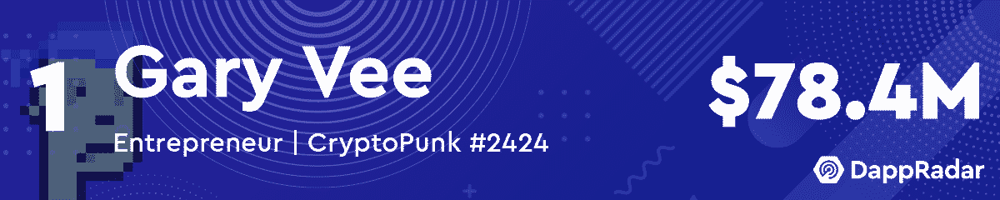
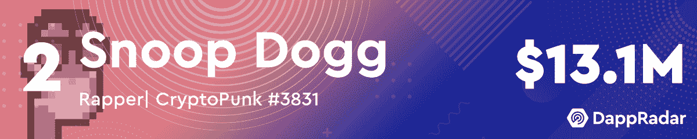
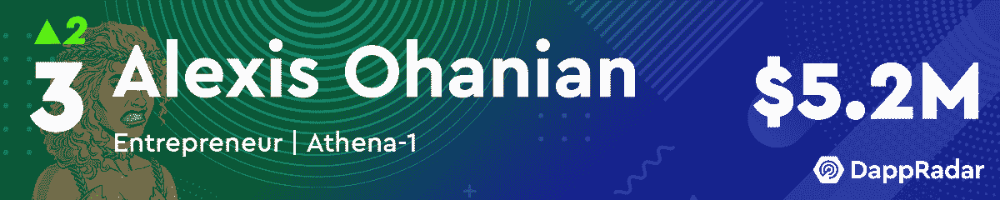
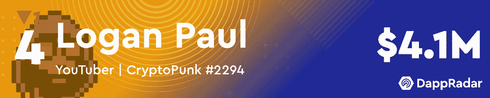
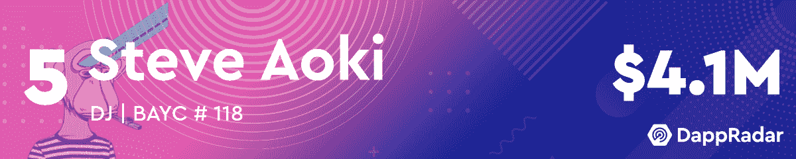
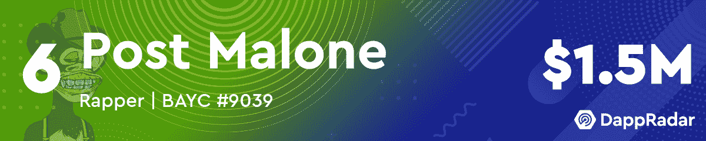
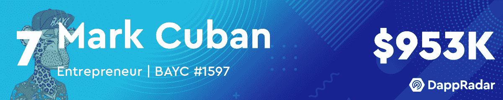
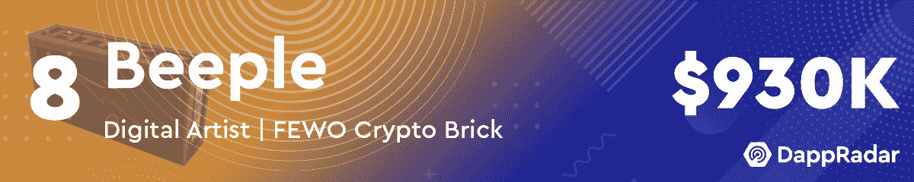
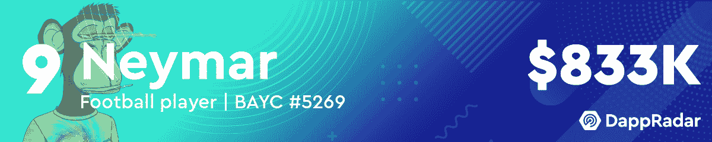
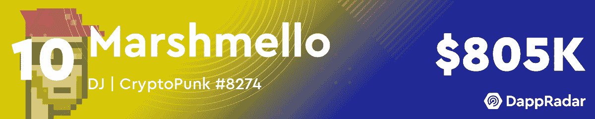

# 二月份十大最有价值的名人 NFT 作品集

> 原文：<https://web.archive.org/web/https://dappradar.com/blog/top-10-most-valuable-celebrity-nft-portfolios-in-february>

## 亚历克西斯·奥哈尼安重回前三，DJ 马什梅洛下降了 4 位

每月一次的达普拉达名人 NFT 富豪榜回顾时间到了。随着 2022 年的进展，名人正在挑选更多的 NFT 并建立他们的收藏。这个月的名单没有包括任何新的名字，但是，我们可以看到一些有趣的位置变化。

Gary Vee 和 Snoop Dogg 继续他们的统治地位，在他们的投资组合中保持着价值数百万的 NFT 的前两名。令人印象深刻的是，[亚历克西斯·奥哈尼安](https://web.archive.org/web/20221230005922/https://dappradar.com/hub/wallet/eth/0x0ed1e02164a2a9fad7a9f9b5b9e71694c3fad7f2/nfts)现在排名第三，在过去的一个月里，他的投资组合价值增加了 120 多万美元。与 2022 年 1 月相比，这位企业家的钱包里有 118 个新的 NFT，上升了两位。

本月我们看到的另一个有趣的趋势是，尽管 ETH 表现不稳定，但名人投资组合的价值正在上升。虽然上个月排名最后的[拉梅洛·鲍尔](https://web.archive.org/web/20221230005922/https://dappradar.com/hub/wallet/eth/0xc1064e3662b0718357e9050694a3bfeaabede8ab/nfts)以 626，000 美元的 NFT 登上了榜单，但二月份的数据却大相径庭。

DJ Marshmello 本月排名第十，与一月份相比下降了四位。然而，他在 NFT 的作品仍然比拉梅洛·鲍尔的藏品多 20 万美元。从这个意义上说，名人 NFT 富豪榜的整体价值持续上升，显示出贵宾在 NFT 领域越来越活跃。

***这里需要注意的一点是，名人会吸引大量注意力到他们的钱包，并收到数千份 NFT 作为礼物。我们已经手动筛选了所有这些名人钱包，给读者带来了一个更加过滤的视角。为了实现这一点，我们已经排除了赠送给这些钱包的 NFT。如果您看到此列表与 DappRadar 投资组合跟踪器上显示的值之间存在差异，请考虑这一点。***

## 二月份十大最有价值的名人 NFT 作品集

## NFT 投资组合增值

2022 年，秘密空间有一个艰难的开始，但这似乎并没有困扰名人 NFT 收藏家。尽管 ETH T1 和其他 T2 主要加密令牌 T3 的估值相当不稳定，但 NFT 的炒作仍在继续。

加里·维的收藏价值超过 300 万美元，而 T2 的史努比·道格的 NFT 投资组合价值增加了 130 多万美元。[亚历克西斯·奥哈尼安](https://web.archive.org/web/20221230005922/https://dappradar.com/hub/wallet/eth/0x0ed1e02164a2a9fad7a9f9b5b9e71694c3fad7f2/nfts)也在二月份疯狂购物，使他的投资组合价值增加了 120 万美元。

总的来说，在 2 月份的榜单上，10 个名人投资组合中有 8 个出现了估值上升。有些人喜欢加里·维(Gary Vee)令人印象深刻的六位数跳跃，而其他人只有 1 万美元。尽管如此，趋势很明显，名人在 NFTs 上下了更大的赌注。

随着越来越多的贵宾加入炒作，达普雷达将继续监测名人 NFT 空间。要查看更多名人 NFT 钱包，请访问官方 DappRadar 列表。此外，你可以在[的推特](https://web.archive.org/web/20221230005922/https://twitter.com/dappradar)上关注 DappRadar，首先了解最新的 NFT 名人新闻。

## 最新名人 NFT 头条

**RSS Error:** A feed could not be found at `https://dappradar.com/blog/celebrity-wallets-feed`; the status code is `200` and content-type is `application/octet-stream` NewsletterUnsubscribe at any time. [T&Cs](https://web.archive.org/web/20221230005922/https://dappradar.com/terms) and [Privacy Policy](https://web.archive.org/web/20221230005922/https://dappradar.com/privacy-policy)