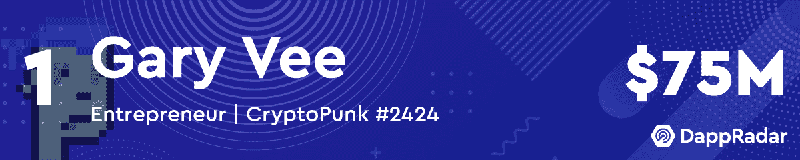
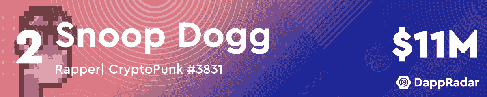
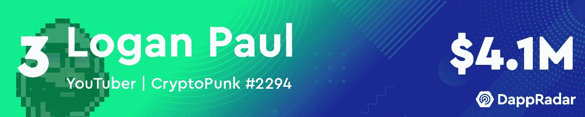
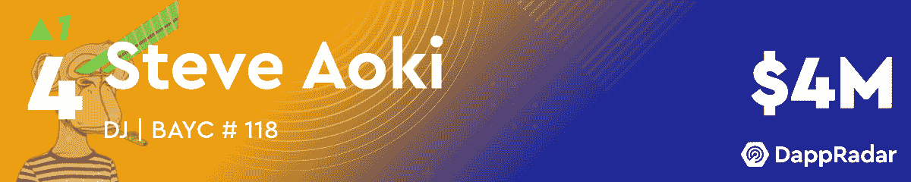
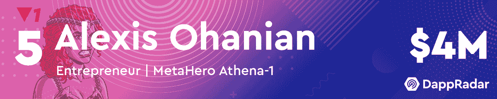
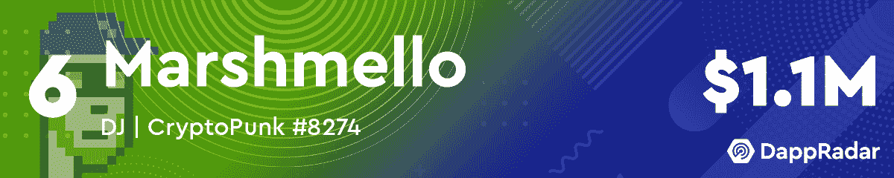
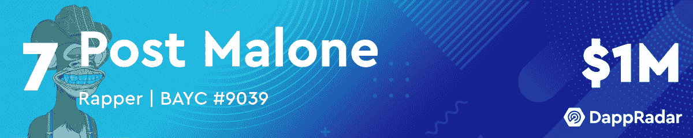
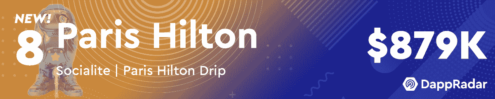
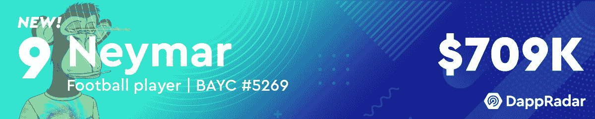
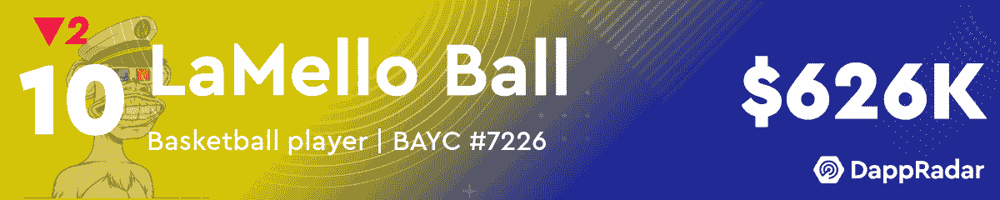

# 一月份十大最有价值的名人 NFT 作品集

> 原文：<https://web.archive.org/web/https://dappradar.com/blog/top-10-most-valuable-celebrity-nft-portfolios-in-january>

## 内马尔和帕丽斯·希尔顿也加入了这个行列

DappRadar 每月公布的最有价值的名人 NFT 投资组合清单是追踪该领域名人净资产的一个好方法。似乎每个名人成为 NFT 空间的一部分是什么感觉，因为这个一月的场景令人兴奋不已。

随着 2022 年的第一个月很快过去，是时候看看 NFT 的顶级名人投资组合了。加里·维继续占据榜首，他的 NFT 投资组合价值超过 7500 万美元。他是无可匹敌的领导者，因为第二名史努比·道格的收入仅达到 1100 万美元。

令人印象深刻的是，这份名单中的所有钱包都包含价值超过 50 万美元的 NFT。向下滚动以查看完整的名单，并发现哪个名人在今年一月成功攀升。

***这里需要注意的一点是，名人会吸引大量注意力到他们的钱包，并收到数千份 NFT 作为礼物。我们已经手动筛选了所有这些名人钱包，给读者带来了一个更加过滤的视角。为了实现这一点，我们已经排除了赠送给这些钱包的 NFT。如果您看到此列表与 DappRadar 投资组合跟踪器上显示的值之间存在差异，请考虑这一点。***

[https://web.archive.org/web/20221231133919if_/https://www.youtube.com/embed/jKcARO4kNEg?feature=oembed](https://web.archive.org/web/20221231133919if_/https://www.youtube.com/embed/jKcARO4kNEg?feature=oembed)

## NFT 存储价值，而加密正在崩溃

虽然 2021 年见证了 NFT 空间的爆炸并成为区块链最活跃的领域，但 2022 年似乎是名人将模仿 NFTs 的一年。像帕丽斯·希尔顿和内马尔这样的大人物不仅透露了他们对 NFT 的兴趣，还展示了他们的巨额投资组合。虽然没有人能够与加里·维令人印象深刻的 7500 万美元相竞争，但名人投资组合的总价值正在增长。

NFT 正在成为在密码空间中存储值的重要方式。尽管目前代币价格正在下跌，但人们对 NFT 空间的兴趣仍在持续增长。更何况，名人也开始认识到这种价值。随着 2022 年的开始，我们看到像阿姆和迪普这样的音乐行业的大牌进入了这个领域。此外，许多好莱坞明星如格温妮丝·帕特洛、伊娃·朗格利亚和吉米·法伦也透露了他们的购买情况。

的确，他们中的大多数人使用 Moonpay 来促进交易，但是，他们愿意炫耀他们的购买行为对整个行业的信心起到了重要的推动作用。尽管加密令牌的价格在下降，但这个空间充满了活力和激情。

DappRadar 将继续跟踪 NFT 空间，并提供最新的统计和跨链分析数据。如果你想了解该领域的最新销售和新品，请查看 [DappRadar PRO](https://web.archive.org/web/20221231133919/https://dappradar.com/token/pro) 。有了 PRO，您可以在探索新系列和独家 NFT 主题 Discord 频道的同时，获得近 15 分钟的 NFT 连锁销售和销量数据。

## 最新名人 NFT 头条

**RSS Error:** A feed could not be found at `https://dappradar.com/blog/celebrity-wallets-feed`; the status code is `200` and content-type is `application/octet-stream` NewsletterUnsubscribe at any time. [T&Cs](https://web.archive.org/web/20221231133919/https://dappradar.com/terms) and [Privacy Policy](https://web.archive.org/web/20221231133919/https://dappradar.com/privacy-policy)