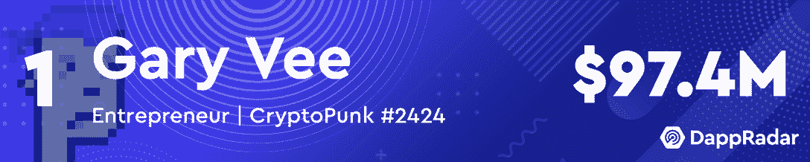
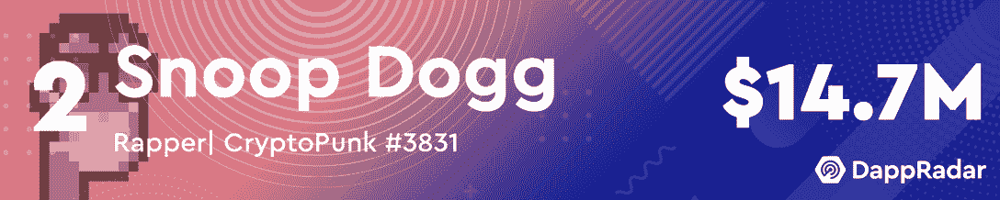
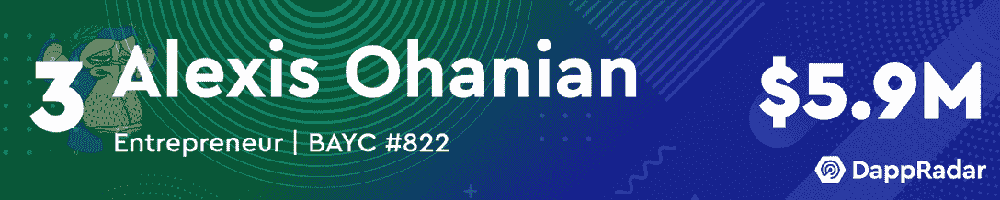
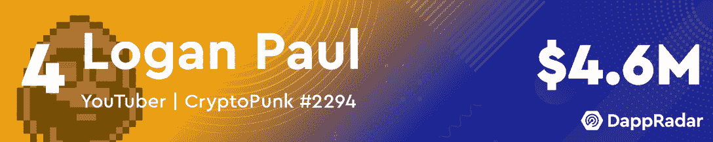
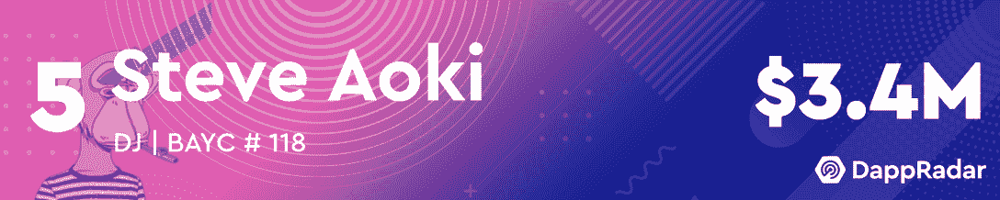
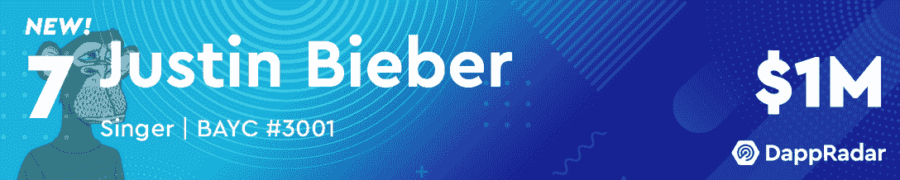
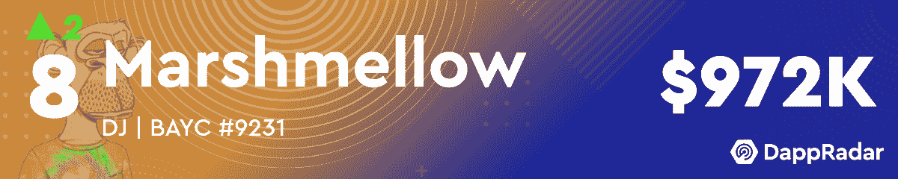
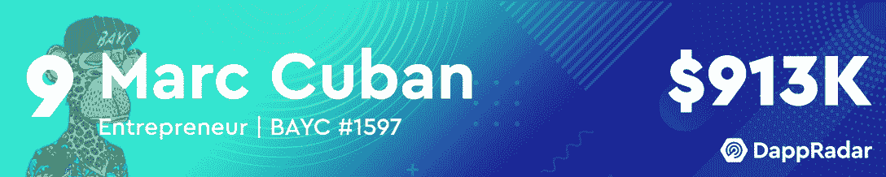
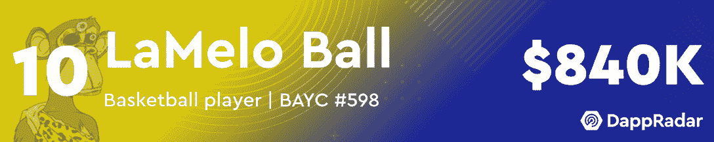

# 三月份十大最有价值的名人 NFT 作品集

> 原文：<https://web.archive.org/web/https://dappradar.com/blog/top-10-most-valuable-celebrity-nft-portfolios-in-march>

## 看看哪些名人增加了他们的投资组合的价值，哪些名人退出了排名

3 月份，加里·维仍然是 NFT 最有价值的名人投资组合的领头羊，在过去的 30 天里，他获得了超过 1900 万美元的估值。紧随其后的是 Snoop Dogg 的美第奇金库，该金库在 3 月份的估价超过了 160 万美元。

有趣的是，在本月的榜单中，拉梅洛·鲍尔凭借 29 家新上市公司和超过 240，000 美元的估值增长再次成为焦点。此外，排名还欢迎新人[贾斯汀比伯](https://web.archive.org/web/20220926003249/https://dappradar.com/hub/wallet/eth/0xe21dc18513e3e68a52f9fcdacfd56948d43a11c6/nfts)，他在 3 月份为自己的投资组合增加了超过 28 万美元的 NFT 价值。有趣的是，这位流行歌手和[的粉丝](https://web.archive.org/web/20220926003249/https://dappradar.com/hub/wallet/eth/0xc6b0562605d35ee710138402b878ffe6f2e23807/nfts)有联系，因为两个名人的钱包里都有大约 100 万美元的 NFT。然而，比伯拥有超过两倍的非物质文化遗产，这表明在 NFT，质量常常胜过数量。

榜单前五名保持不变。尽管他的 NFT 投资组合估值损失了 50 多万美元，史蒂夫·青木还是设法保住了他上个月的头寸。尽管如此，DJ 在过去的三十天里增加并收到了数百件新的收藏品，这帮助他限制了损失。

继续阅读，找出三月份最有价值的名人 NFT 作品集的完整列表。

[https://web.archive.org/web/20220926003249if_/https://www.youtube.com/embed/4fge15Ff-ZI?feature=oembed](https://web.archive.org/web/20220926003249if_/https://www.youtube.com/embed/4fge15Ff-ZI?feature=oembed)

***这里需要注意的一点是，名人会吸引大量注意力到他们的钱包，并收到数千份 NFT 作为礼物。我们已经手动筛选了所有这些名人钱包，给读者带来了一个更加过滤的视角。为了实现这一点，我们已经排除了赠送给这些钱包的 NFT。如果您看到此列表与 DappRadar 投资组合跟踪器上显示的值之间存在差异，请考虑这一点。***

## 二月份十大最有价值的名人 NFT 作品集

[<picture></picture>](https://web.archive.org/web/20220926003249/https://dappradar.com/hub/wallet/eth/0xd6a984153acb6c9e2d788f08c2465a1358bb89a7/nfts/1)[<picture></picture>](https://web.archive.org/web/20220926003249/https://dappradar.com/hub/wallet/eth/0xce90a7949bb78892f159f428d0dc23a8e3584d75/nfts/1)[<picture></picture>](https://web.archive.org/web/20220926003249/https://dappradar.com/hub/wallet/eth/0x0ed1e02164a2a9fad7a9f9b5b9e71694c3fad7f2/nfts)[<picture></picture>](https://web.archive.org/web/20220926003249/https://dappradar.com/hub/wallet/eth/0xff0bd4aa3496739d5667adc10e2b843dfab5712b/nfts/1)[<picture></picture>](https://web.archive.org/web/20220926003249/https://dappradar.com/hub/wallet/eth/0xe4bbcbff51e61d0d95fcc5016609ac8354b177c4/nfts)[<picture></picture>](https://web.archive.org/web/20220926003249/https://dappradar.com/hub/wallet/eth/0xc6b0562605d35ee710138402b878ffe6f2e23807/nfts)[<picture></picture>](https://web.archive.org/web/20220926003249/https://dappradar.com/hub/wallet/eth/0xe21dc18513e3e68a52f9fcdacfd56948d43a11c6/nfts)[<picture></picture>](https://web.archive.org/web/20220926003249/https://dappradar.com/hub/wallet/eth/0xa679c6154b8d4619af9f83f0bf9a13a680e01ecf/nfts)[<picture></picture>](https://web.archive.org/web/20220926003249/https://dappradar.com/hub/wallet/eth/0xc1064e3662b0718357e9050694a3bfeaabede8ab/nfts)

## 无聊的猿类提升名人钱包的价值

作为 NFT 交易量最大的蓝筹股，Bored Ape Yacht Club 出现在大多数 NFT 名人的投资组合中。不仅如此，该项目也是最常使用的入职采购，启动贵宾的 NFT 之旅。

今年 3 月，宇迦实验室经历了迄今为止最成功的几个月之一，这对该公司藏品的估值产生了积极影响。随着 APE token 的推出， [BAYC 的底价涨幅超过了 100 ETH](https://web.archive.org/web/20220926003249/https://dappradar.com/blog/yuga-labs-takeover-pushes-cryptopunk-meebit-sales-1000/) 。这种价格上涨也影响了更罕见的 BAYC NFTs，它获得了数千美元的估值。

比如，马希梅洛最有价值的 NFT 不再是他的[朋克#8274](https://web.archive.org/web/20220926003249/https://dappradar.com/hub/assets/eth/0xb47e3cd837ddf8e4c57f05d70ab865de6e193bbb/8274) ，而是[无聊猿#9231](https://web.archive.org/web/20220926003249/https://dappradar.com/hub/assets/eth/0xbc4ca0eda7647a8ab7c2061c2e118a18a936f13d/9231) 。更不用说名人钱包里最贵的十件 NFT 中有六件属于 BAYC 系列。

三月还迎来了两位新名人加入 BAYC 家庭。Dillon Francis 和 [Madonna](https://web.archive.org/web/20220926003249/https://dappradar.com/hub/wallet/eth/0x6ef962ea7e64e771d3a81bce4f95328d76d7672b) 都通过购买 BAYC 进入了 NFT 空间。随着无聊的猿类继续推动创新和主流认可，这在某种程度上已经成为 VIP 的一种规范。

DappRadar 将继续监测最有价值的名人 NFT 投资组合，每月为您带来一份富豪榜。如果你想查看更多 VIP NFT 钱包，请查看官方[名人钱包页面](https://web.archive.org/web/20220926003249/https://dappradar.com/blog/celebrity-wallets-a-dive-into-crypto-hollywood)。此外，你可以在[的 Twitter](https://web.archive.org/web/20220926003249/https://twitter.com/dappradar) 上关注 DappRadar，首先获得最新的 NFT 名人新闻。

 NewsletterUnsubscribe at any time. [T&Cs](https://web.archive.org/web/20220926003249/https://dappradar.com/terms) and [Privacy Policy](https://web.archive.org/web/20220926003249/https://dappradar.com/privacy-policy)