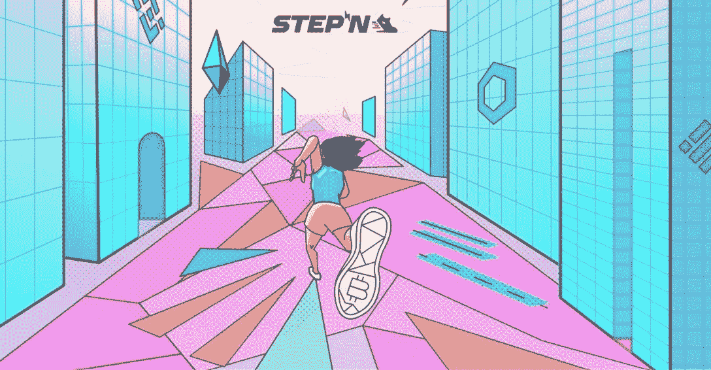

# 今年夏天获得加密的五大最佳移动赚取平台

> 原文：<https://web.archive.org/web/https://dappradar.com/blog/top-5-best-move-to-earn-platforms-to-earn-crypto-this-summer>

## 移动赚取是区块链领域的最新创新之一

鼓励用户保持活跃并赚取加密作为奖励的最佳移动赚取平台有哪些？Move-to-earn 是区块链游戏的最新创新举措，因为它希望为我们的日常生活创造真正的好处。如果你想变得活跃并在做的时候赚取密码，这份前 5 名的移动赚取平台列表是最好的开始。

尽管这是一个“新”的想法，似乎是从哪里冒出来的，但许多在移动赚钱领域运营的公司已经存在了几年。有些人显然有远大的目标，他们希望一步一步地把现实世界和虚拟世界联系起来。

## STEPN

*索拉纳区块链生态系统的一部分。*

STEPN 是旗舰移动挣钱平台。用户需要建立一个账户，购买一双带有 [SOL](https://web.archive.org/web/20221004123038/https://dappradar.com/rankings/protocol/solana) 的 NFT·斯戴普运动鞋，然后开始在现实世界中走动。您移动得越多，赢得的绿色 Satoshi 代币就越多。像马拉松模式这样的游戏内挑战让玩家保持参与并朝着挑战努力。目前，虽然有一个时间门控机制，在某一点上限制了玩家的收入潜力。点击阅读完整的[指南。](https://web.archive.org/web/20221004123038/https://dappradar.com/blog/how-to-get-crypto-on-move-to-earn-platform-stepn)

STEPN app artwork

## 奥利弗

*多边形区块链生态系统的一部分。*

OliveX 是一家数字健身公司，使用游戏化、增强现实和玩赚游戏来提供一个完整的生态系统，旨在改善人们的健康。该平台不仅在沙盒中构建自己的互动虚拟世界，还拥有 [Dustland](https://web.archive.org/web/20221004123038/https://dappradar.com/polygon/collectibles/the-dustland) 系列游戏。通过在现实世界中跑步和走动，玩家可以获得虚拟奖励(NFTs/[does](https://web.archive.org/web/20221004123038/https://dappradar.com/hub/token/eth/DOSE?from=0xb31ef9e52d94d4120eb44fe1ddfde5b4654a6515)token ),他们可以用这些奖励来升级他们的虚拟角色并继续他们的冒险。

[https://web.archive.org/web/20221004123038if_/https://www.youtube.com/embed/BzVPKdT1g4Y?feature=oembed](https://web.archive.org/web/20221004123038if_/https://www.youtube.com/embed/BzVPKdT1g4Y?feature=oembed)

OliveX virtual world within The Sandbox

## 基因宠物

*索拉纳区块链生态系统的一部分。*

基因宠物于 2021 年 8 月开始生活。游戏结合了 [NFT 收藏品](https://web.archive.org/web/20221004123038/https://dappradar.com/nft/collections)，竞技场游戏和移动赚取功能。玩家可以通过在现实世界中锻炼来升级他们的基因宠物 NFT 化身。你的基因宠物越强壮，它们就越有可能征服你的对手。

[https://web.archive.org/web/20221004123038if_/https://www.youtube.com/embed/YtVwo2A4Ebc?feature=oembed](https://web.archive.org/web/20221004123038if_/https://www.youtube.com/embed/YtVwo2A4Ebc?feature=oembed)

Genopets trailer

## Dotmoovs

*多边形区块链生态系统的一部分。*

Dotmoovs 的目标是“大众化体育挑战”。无论用户在世界的哪个角落，无论银行余额有多少，他们都可以与其他互联网用户竞争。这款游戏的原始标志是 [MOOV](https://web.archive.org/web/20221004123038/https://dappradar.com/hub/token/eth/MOOV?from=0x24ec2ca132abf8f6f8a6e24a1b97943e31f256a7) ，玩家可以通过在足球挑战赛或舞蹈比赛中与对手正面交锋来获得它。用户也可以铸造运动鞋和足球作为 NFT 在游戏中使用。

[https://web.archive.org/web/20221004123038if_/https://www.youtube.com/embed/rTZN9Z3tQL4?feature=oembed](https://web.archive.org/web/20221004123038if_/https://www.youtube.com/embed/rTZN9Z3tQL4?feature=oembed)

Dotmoovs introducing its “sports revolution”

## 虚拟的

*BNB 智能链区块链生态系统的一部分。*

Wirtual 于 2019 年开始开发，2020 年 4 月上线。move-to-earn 平台每月拥有 40，000 名用户，在全球 160 个国家提供服务。玩家可以加入 wi tual 的跑步、散步、游泳、骑自行车、跳舞和健身活动，以赚取 wi tual 代币。该公司称之为“汗水开采”,平台上收入最高的人目前每天能赚 50 美元。锻炼者可以在一系列链接的活动应用程序上跟踪他们的活动，并将信息上传到他们的虚拟账户。

[https://web.archive.org/web/20221004123038if_/https://www.youtube.com/embed/sBizyq45XMM?feature=oembed](https://web.archive.org/web/20221004123038if_/https://www.youtube.com/embed/sBizyq45XMM?feature=oembed)

Wirtual 2.0 trailer

 NewsletterUnsubscribe at any time. [T&Cs](https://web.archive.org/web/20221004123038/https://dappradar.com/terms) and [Privacy Policy](https://web.archive.org/web/20221004123038/https://dappradar.com/privacy-policy)