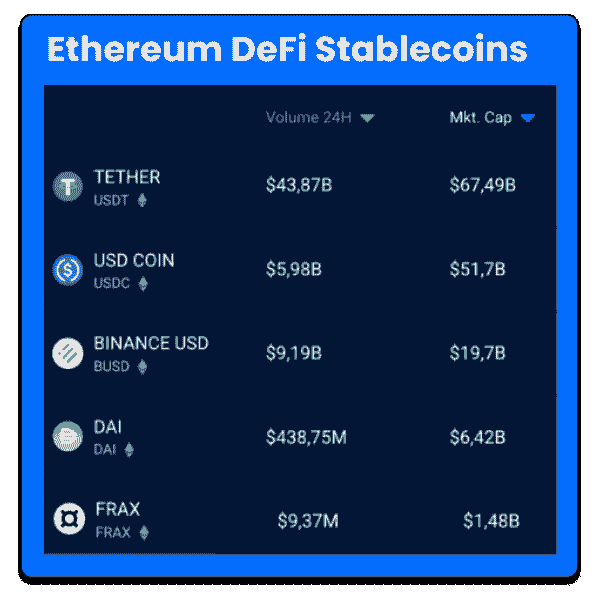

# 五大以太坊定义

> 原文：<https://web.archive.org/web/https://dappradar.com/blog/top-5-ethereum-defi-stablecoins>

## 我们来调查一下 2022 年排名前 5 的 stablecoins。

在加密货币行业，Stablecoins 已经变得非常流行。与比特币等其他加密资产一样，由于没有剧烈的波动，它们提供了一种稳定主要货币价值的方式。这篇文章将为你呈现以太坊上 5 个最大的稳定点，让你对这个激动人心的创新行业有更深的了解。

## 什么是 stablecoins？

稳定硬币是加密货币，旨在降低硬币价格相对于一些“稳定”资产或资产集合的波动性。稳定的货币可以与一种货币或交易所交易的商品挂钩。

Stablecoins 因其所连接的基础资产而异，可分为加密、法定或资产支持的 stablecoins。你可能知道，稳定货币的价格通常与美元或黄金等稳定资产以一比一的比例挂钩，后者作为抵押品被储备起来。

通过这种方式， [stablecoins 在日益发展的以太坊 DeFi 运动](https://web.archive.org/web/20220909190705/https://dappradar.com/topic/defi)中被大量使用，以执行许多关键功能，了解该领域的主要参与者是值得的。

*   **深入主题:** [Stablecoins:简单指南](https://web.archive.org/web/20220909190705/https://dappradar.com/blog/stablecoins-the-simple-guide)

## 以太坊 DeFi stablecoins 排名前 5 的有哪些？

[<picture></picture>](https://web.archive.org/web/20220909190705/https://dappradar.com/hub/tokens/ethereum/all/1)

[Top 5 Stablecoins by Market Cap via DappRadar Token Explorer](https://web.archive.org/web/20220909190705/https://dappradar.com/hub/tokens/ethereum/all/1)

### 1.极限

系绳(USDT)是一种与美元挂钩的稳定币，也是第一种被创造出来的稳定币。这是 dapp 生态系统中最受欢迎的稳定币，也是[发行量和市值最大的](https://web.archive.org/web/20220909190705/https://www.coingecko.com/en?category_id=36&view=market)稳定币。

[https://web.archive.org/web/20220909190705if_/https://www.youtube.com/embed/GsSSLDzKCOE?feature=oembed](https://web.archive.org/web/20220909190705if_/https://www.youtube.com/embed/GsSSLDzKCOE?feature=oembed)

USDT 盯住美元的汇率制度是通过一对一的抵押比率来维持的。Tether Limited 声称，流通中的每一枚 USDT 都 100%由储备中的实际法定货币支持。Tether 在他们的[透明页面](https://web.archive.org/web/20220909190705/https://wallet.tether.to/transparency)上公布了他们的余额，并作为支持 USDT 的法定货币的第三方保管人。

### 2.美元硬币

美元硬币(USDC)代表着我们使用货币方式的重大突破。数字美元像其他数字内容一样工作——它们以互联网的速度移动，可以像我们分享内容一样进行交换，并且比现有的支付系统更便宜、更安全。

[https://web.archive.org/web/20220909190705if_/https://www.youtube.com/embed/QRe3txilUKg?feature=oembed](https://web.archive.org/web/20220909190705if_/https://www.youtube.com/embed/QRe3txilUKg?feature=oembed)

USDC 由受监管的金融机构发行，由全额储备资产支持，可按 1:1 的比例兑换美元。USDC 由 Centre 管理，这是一个会员制的财团，为稳定的货币制定技术、政策和金融标准。

### 3.币安美元

[币安美元(BUSD)](https://web.archive.org/web/20220909190705/https://dappradar.com/hub/token/eth/BUSD) 是一种 1:1 美元支持的稳定硬币，由币安(与 Paxos 合作)发行。经纽约州金融服务局(NYDFS)批准和监管，BUSD 月度审计报告可从官方网站查看[。](https://web.archive.org/web/20220909190705/https://www.dfs.ny.gov/)

[https://web.archive.org/web/20220909190705if_/https://www.youtube.com/embed/TwnLd22ybN8?feature=oembed](https://web.archive.org/web/20220909190705if_/https://www.youtube.com/embed/TwnLd22ybN8?feature=oembed)

币安美元只是最新的稳定货币，其储备由 Paxos 持有。该公司是第一家在 2015 年获得纽约 DFS 信任执照的加密公司(名为 [itBit Trust Company](https://web.archive.org/web/20220909190705/https://www.coindesk.com/itbit-rebrands-paxos-amid-blockchain-pivot) )，现在为其自己的 [Paxos Standard stablecoin](https://web.archive.org/web/20220909190705/https://www.coindesk.com/paxos-unveils-dollar-backed-stablecoin-approved-by-new-york-regulator) 和 [Huobi 的 HUSD token](https://web.archive.org/web/20220909190705/https://www.coindesk.com/huobi-revamps-husd-stablecoin-to-help-power-fiat-on-ramp) 保管美元储备。

### 4.奶妈

马克尔道是稳定币戴的幕后协议人，也可以说是当前反垄断浪潮的领导者。戴是一种加密货币，与美元保持 1:1 的汇率。为方便起见，将 1 个 DAI 想象成 1 美元，每个 DAI 由以太坊而不是第三方支持。以太坊波动的价格意味着[当试图维持联系汇率时，有趣的挑战出现了。](https://web.archive.org/web/20220909190705/https://defirate.com/makerdao-shutdown-concerns/)

[https://web.archive.org/web/20220909190705if_/https://www.youtube.com/embed/CbjBJ_KrknQ?feature=oembed](https://web.archive.org/web/20220909190705if_/https://www.youtube.com/embed/CbjBJ_KrknQ?feature=oembed)

所以本质上，MakerDAO 就像一个信贷机构，以一定的利率发放贷款。如果利率(稳定费)低，就会鼓励人们借更多的钱(锁定更多的 ETH)。如果利率高，资本成本就高，降低了借贷的吸引力。

### 5.FRAX

世界上第一个分数稳定币， [FRAX](https://web.archive.org/web/20220909190705/https://dappradar.com/hub/token/eth/FRAX) 是开源的，无许可的，完全在线的——目前在 12 个链和以太坊上实现。

[https://web.archive.org/web/20220909190705if_/https://www.youtube.com/embed/Mx4OgfbRzRI?feature=oembed](https://web.archive.org/web/20220909190705if_/https://www.youtube.com/embed/Mx4OgfbRzRI?feature=oembed)

正如你可以在 [Frax 生态系统官方网站](https://web.archive.org/web/20220909190705/https://frax.finance/):*上看到的，Frax 协议向世界介绍了加密货币的概念，这种货币部分由抵押品支持，部分在算法上稳定。*

## 用 DappRadar 继续学习 stablecoins

我们确信，stablecoin 空间将在未来几个月和几年内呈指数增长，因为其他 dapp 项目，无论是在 [DeFi 生态系统](https://web.archive.org/web/20220909190705/https://dappradar.com/defi)内，还是在其他垂直行业内，都希望在各自的生态系统内提供经济稳定性。

一如既往，我们将继续更新和刷新前 5 名稳定的名单。请务必将 [DappRadar](https://web.archive.org/web/20220909190705/https://dappradar.com/blog/) 加入书签，并注册下面的时事通讯，以便直接在您的收件箱中接收更新。

 NewsletterUnsubscribe at any time. [T&Cs](https://web.archive.org/web/20220909190705/https://dappradar.com/terms) and [Privacy Policy](https://web.archive.org/web/20220909190705/https://dappradar.com/privacy-policy)

***以上不构成投资建议。此处给出的信息仅供参考。请尽职调查并自行研究。***