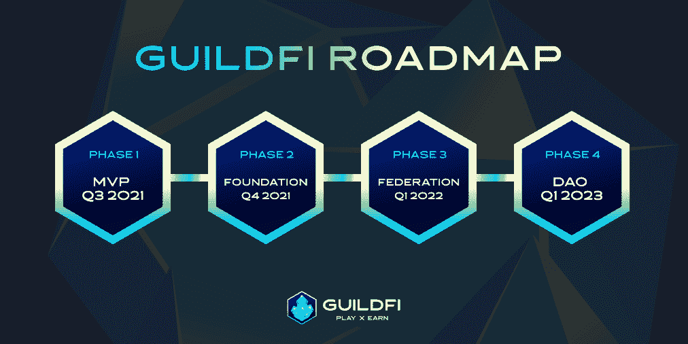

# 前 5 名玩即赚游戏公会

> 原文：<https://web.archive.org/web/https://dappradar.com/blog/top-5-play-to-earn-gaming-guilds>

## 五大平台降低了游戏的准入门槛

[**博彩**](https://web.archive.org/web/20220811201724/https://dappradar.com/rankings/category/games) **公会在** [**即玩即赚**](https://web.archive.org/web/20220811201724/https://dappradar.com/blog/best-nft-play-to-earn-games-for-2022-from-a-to-f) **区块链平台的世界里广受欢迎，因为它们降低了进入的财务门槛。我们的代币市值最大的 5 个公会列表概述了他们提供什么，以及你可以通过成为学者和加入他们的计划来玩什么游戏。**

## 内容

*   [功绩圈](https://web.archive.org/web/20220811201724/https://dappradar.com/blog/top-5-play-to-earn-gaming-guilds/#merit-circle)
*   [屈服公会游戏](https://web.archive.org/web/20220811201724/https://dappradar.com/blog/top-5-play-to-earn-gaming-guilds/#yield-guild)
*   [GuildFi](https://web.archive.org/web/20220811201724/https://dappradar.com/blog/top-5-play-to-earn-gaming-guilds/#guild-fi)
*   [黑泽](https://web.archive.org/web/20220811201724/https://dappradar.com/blog/top-5-play-to-earn-gaming-guilds/#black-pool)
*   [UniX 游戏](https://web.archive.org/web/20220811201724/https://dappradar.com/blog/top-5-play-to-earn-gaming-guilds/#unix-gaming)
*   [下五大公会](https://web.archive.org/web/20220811201724/https://dappradar.com/blog/top-5-play-to-earn-gaming-guilds/#next-five)

游戏公会向用户开放了 GameFi 和 play-to-earn 平台的世界，否则他们可能负担不起入场费。他们的金库里装满了头像、硬币、交易卡、阿尔法通行证和虚拟赛车。此外，他们会将自己的 [NFT](https://web.archive.org/web/20220811201724/https://dappradar.com/nft) 出租给人们，这样他们就可以玩游戏了。听起来对大家都是双赢。

下面，我们列出了市值最大的五个游戏公会。还有每个公会合作的游戏的信息。请记住，每个公会经常玩同一款游戏，这其中有很多交叉。例如，它们都为玩家提供了玩 Axie Infinity 的机会，用户可以在沙盒中和大多数人一起玩 CyBall。

为了避免重复，下面的列表并不详尽。但是找到哪个公会提供哪个游戏只需要快速搜索和几次点击。

## 功绩圈

作为最大的公会令牌( [MC](https://web.archive.org/web/20220811201724/https://dappradar.com/hub/token/eth/MC?from=0x949d48eca67b17269629c7194f4b727d4ef9e5d6) )市值，Merit Circle 是一个分散的自治组织(DAO)，自 2021 年 9 月以来一直支持区块链博彩参与。Merit Circle 向其玩家提供 70/30 的游戏利润分成以及慷慨的赌注系统。

功德圈得到了 Bitscale Capital、Mechanism Capital 和数字货币集团等机构的支持。据报道，该公会已经经历了两轮融资，筹集了 460 万美元。

它的奖学金项目——学者是通过公会的 NFTs 游戏赚钱的游戏玩家——通过 Discord 频道管理。功绩圈也活跃在 Substack 上，并维护一个信息丰富的 Gitbook。

用户可以通过功德圈玩的游戏:

*   [轴无穷大](https://web.archive.org/web/20220811201724/https://dappradar.com/multichain/games/axie-infinity)
*   [小精灵王国](https://web.archive.org/web/20220811201724/https://dappradar.com/binance-smart-chain/games/elfin-kingdom)
*   [Sidus 英雄](https://web.archive.org/web/20220811201724/https://dappradar.com/ethereum/games/sidus-nft-heroes)
*   [火神宇宙](https://web.archive.org/web/20220811201724/https://dappradar.com/vulcanforged/games/vulcanverse)

上面列表中的游戏只是目前正在运行的游戏，目前可以在功德圈上玩。以下是 Merit Circle 即将在他们的名册中引入的一些头衔:

*   皇家爆炸
*   Civitas
*   玛维亚的英雄
*   [基因宠物](https://web.archive.org/web/20220811201724/https://dappradar.com/binance-smart-chain/games/genopets)
*   [冲积层](https://web.archive.org/web/20220811201724/https://dappradar.com/ethereum/games/illuvium)

其他优点圈区块链博彩投资:

*   冒险故事
*   巴拉托农的打手
*   [加密攻略](https://web.archive.org/web/20220811201724/https://dappradar.com/polygon/games/crypto-raiders)
*   福托铵
*   Lava Labs

## 屈服公会游戏

除了功绩圈，产量公会游戏可能是两个最著名的玩赚公会之一。该协会始于 2018 年的菲律宾队，当时联合创始人 Gabby Dizon 开始将他的 Axies 借给其他买不起自己的 Axie Infinity 球员。

在全球疫情期间，Yield Guild Games 看到它为菲律宾人创造了真正的财富，否则他们就会失业。从 Axies 开始，Yield Guild Games 现在提供了一系列游戏的入门点。

它的 YGG 令牌在过去的一个月里遭受了一点打击，但这种下降与加密市场的其他部分大致一致。虽然 Yield Guild Games 的网站上没有赌注功能，但用户可以在 YGG 金库中锁定他们的 YGG 代币。作为回报，他们将获得金库中游戏的代币奖励。

用户可以玩的游戏 Yield Guild 游戏:

*   [守护者协会](https://web.archive.org/web/20220811201724/https://dappradar.com/multichain/games/guild-of-guardians)
*   [冲积层](https://web.archive.org/web/20220811201724/https://dappradar.com/ethereum/games/illuvium)
*   [夹板垫](https://web.archive.org/web/20220811201724/https://dappradar.com/multichain/games/splinterlands)
*   [星图](https://web.archive.org/web/20220811201724/https://dappradar.com/solana/games/star-atlas)
*   [Zed 运行](https://web.archive.org/web/20220811201724/https://dappradar.com/polygon/games/zed-run)

其他收益公会游戏投资:

*   [余烬剑](https://web.archive.org/web/20220811201724/https://dappradar.com/polygon/games/ember-sword)
*   [火神宇宙](https://web.archive.org/web/20220811201724/https://dappradar.com/vulcanforged/games/vulcanverse)
*   [球球](https://web.archive.org/web/20220811201724/https://dappradar.com/binance-smart-chain/games/cyball)
*   马维亚
*   维纳里传说

[https://web.archive.org/web/20220811201724if_/https://www.youtube.com/embed/Yo-BrASMHU4?feature=oembed](https://web.archive.org/web/20220811201724if_/https://www.youtube.com/embed/Yo-BrASMHU4?feature=oembed)

Yield Guild Games’ documentary about guild gaming

## 吉尔迪

GuildFi 的目标是将尽可能多的用户推向区块链和“玩即赚”游戏。它在 2021 年第三季度推出了 MVP，此后一直在快速发展。一个奖励系统，一个早期的公会网络，和一个让玩家早期接触游戏的游戏发射台都已经完成了。

GuildFi 还有一个赌注系统，已经锁定了超过 1500 万美元。它目前提供了非常高的年回报率，所以那里有钱可赚。但是永远记住，高回报往往伴随着高风险。所以要经常练习尽职调查。

GuildFi 得到了 web3 中一些大牌的支持。它的财政支持者包括 Animoca Brands、T2、达帕实验室、比特币基地风险投资公司和潘迪拉。公会目前处于联盟阶段，计划引入以下内容:

*   高级关卡系统，玩家通过经验值获得等级。
*   公会网络来发展社区和生态系统。
*   奖学金门户网站将使选择奖学金更加容易。
*   BYO 模块可扩展对虚拟资产的访问，以满足市场需求。

GuildFi’s roadmap

用户可以通过 GuildFi 玩的游戏:

*   上升者
*   秘密袭击者
*   DeVerse
*   硝基联盟
*   [peg xy](https://web.archive.org/web/20220811201724/https://dappradar.com/polygon/games/pegaxy)

## 黑潭

布莱克普不是一个纯粹的游戏公会。这是一只与 NFT 产业一起运作的基金，管理着从运动卡到游戏项目到数字艺术的一系列资产。但由于它持有如此多的 NFT 作为投资，布莱克浦开始了布莱克浦的军队。

BlackPool armies 的诞生是为了帮助玩家将玩游戏的时间转化为金钱，任何人都可以申请加入。申请相当广泛，所以留出几分钟来准备一些好的答案，比如“你为什么想为布莱克普总部效力？”“你最大的游戏成就是什么，或者你最自豪的时刻是什么？”

黑池在其网站上还有一个赌注门户，通过 API 直接链接到 [SushiSwap](https://web.archive.org/web/20220811201724/https://dappradar.com/multichain/defi/sushi) 和[come](https://web.archive.org/web/20220811201724/https://dappradar.com/polygon/exchanges/comethswap)。通过这个门户网站，用户可以将 Blockport ( [BPT](https://web.archive.org/web/20220811201724/https://dappradar.com/hub/token/eth/BPT?from=0x327682779bab2bf4d1337e8974ab9de8275a7ca8) )作为黑泽的治理令牌。

用户可以通过 BlackPool 玩的游戏:

*   索拉鲁
*   [被解放的神](https://web.archive.org/web/20220811201724/https://dappradar.com/multichain/games/gods-unchained)
*   [MetaSoccer](https://web.archive.org/web/20220811201724/https://dappradar.com/polygon/games/metasoccer)
*   aavegotchi
*   [守护者协会](https://web.archive.org/web/20220811201724/https://dappradar.com/multichain/games/guild-of-guardians)

## UniX 游戏

UniX 游戏是一个生态系统和平台，可以将新的 GameFi 项目装载到他们自己的虚拟世界中。它在社区 Discord 上有超过 200，000 名成员，并声称在其横幅上有 2，700 万追随者。

该协会通过奖学金、育种者、研发、主持人和教师提供收入来源。教育是 Unix 使命的一个重要部分。他们计划通过其本地学习和收入平台每周免费教育近 30，000 人。

公会的令牌 UniX 支撑了整个 UniX 游戏的经济。它建立在以太坊区块链的基础上，将作为治理和公用事业。游戏玩家可以通过挑战和社区贡献获得 UniX。

UniX 游戏玩的游戏

*   [西弗](https://web.archive.org/web/20220811201724/https://dappradar.com/ethereum/games/sipherian-surge)
*   [星图](https://web.archive.org/web/20220811201724/https://dappradar.com/solana/games/star-atlas)
*   [分散式国家](https://web.archive.org/web/20220811201724/https://dappradar.com/ethereum/marketplaces/decentraland)
*   [夹板地](https://web.archive.org/web/20220811201724/https://dappradar.com/multichain/games/splinterlands)
*   [沙盒](https://web.archive.org/web/20220811201724/https://dappradar.com/multichain/games/the-sandbox)

## 名单上的下五个

如果上面没有一个公会能提供你在探索 web3 游戏世界时所寻找的东西，也许下面的五个公会适合你。按代币市值计算，这是接下来的五个平台，它们各自提供的东西略有不同。

*   [牛油果道](https://web.archive.org/web/20220811201724/https://avocadodao.io/)–AVG 币，11000 奖学金，超过 45 个 GameFi 项目投资。

*   [PATH Dao](https://web.archive.org/web/20220811201724/https://pathdao.io/)–原生令牌为 PATH。该平台拥有 5100 名玩家和超过 1600 万 USDC。

*   [Perion](https://web.archive.org/web/20220811201724/https://perion.gg/)–本机令牌是 PERC。有双子座、Animoca Brands 和潘迪拉的投资。

*   [向前播放刀](https://web.archive.org/web/20220811201724/https://playitfwd.io/)——原生令牌为 PIF。2022 年初，PIF DAO 成功筹集了 600 万美元的投资。

*   好游戏公会——原生令牌是 GGG。一个游戏中心，旨在赞助和投资以游戏赚钱的游戏玩家。

 NewsletterUnsubscribe at any time. [T&Cs](https://web.archive.org/web/20220811201724/https://dappradar.com/terms) and [Privacy Policy](https://web.archive.org/web/20220811201724/https://dappradar.com/privacy-policy)