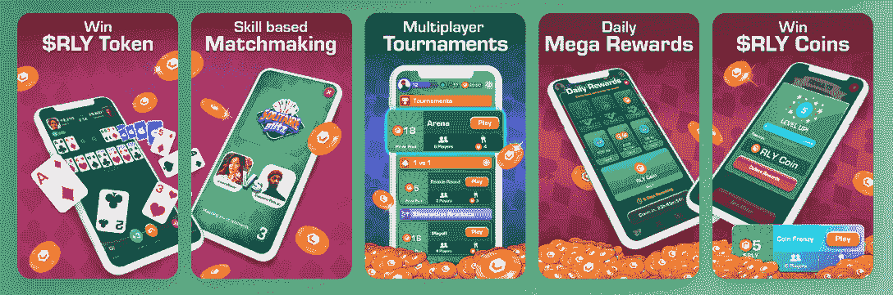

# 前 5 名简单的“玩即赚”游戏

> 原文：<https://web.archive.org/web/https://dappradar.com/blog/top-5-simple-play-to-earn-games>

## 简单的区块链游戏，用户可以赚取奖励

**区块链技术可能看起来复杂而令人困惑。我们在 DappRadar 的工作是为我们的用户让事情变得更简单，不那么复杂。我们为我们的社区提供易于理解的数据和信息。幸运的是，对于世界上的游戏玩家来说，有其他平台也有同样的目标。这是目前市场上最简单的 5 款游戏。**

**总结**

*   ***[【孤独闪电】](https://web.archive.org/web/20220926152454/https://dappradar.com/blog/top-5-simple-play-to-earn-games/#solitaire-blitz)***

*   ***[arc 8](https://web.archive.org/web/20220926152454/https://dappradar.com/blog/top-5-simple-play-to-earn-games/#arc8)***
*   ***[矿业网](https://web.archive.org/web/20220926152454/https://dappradar.com/blog/top-5-simple-play-to-earn-games/#mining-network)***
*   ***[寻找最佳游戏的最佳方式](https://web.archive.org/web/20220926152454/https://dappradar.com/blog/top-5-simple-play-to-earn-games/#finding-games)***

移动游戏革命让每个人都可以玩游戏。现在，事情更进一步。游戏工作室正在开发简单易行的游戏，任何人今天都可以开始玩。他们让所有这些都可以在你的手机上看到。

## 孤独的闪电

[纸牌闪电战](https://web.archive.org/web/20220926152454/https://dappradar.com/rankings/category/games)建立在[流量区块链](https://web.archive.org/web/20220926152454/https://dappradar.com/rankings/protocol/flow)的基础上，并且经常发现自己在 [DappRadar 的游戏排名](https://web.archive.org/web/20220926152454/https://dappradar.com/rankings/category/games)中名列前茅。这款游戏由 Joyride 开发，将于 2021 年在 Q2 发布。

这个概念很简单:在经典的纸牌游戏中击败对手。要得分，你需要执行正确的动作，少用卡片，继续跑，增加你的分数。每场比赛持续 60 秒。

要赢得真正的奖励，你需要参加配对游戏或锦标赛。但是任何人都可以免费玩，为了娱乐和练习。

[DappRadar’s full guide to Solitaire Blitz](https://web.archive.org/web/20220926152454/https://dappradar.com/blog/over-140000-users-are-playing-joyrides-solitaire-blitz-to-earn-real-money-rewards)

前往[纸牌闪电战](https://web.archive.org/web/20220926152454/https://dappradar.com/deeplink/16370) dapp

游戏内代币:[拉力赛(RLY)](https://web.archive.org/web/20220926152454/https://www.coingecko.com/en/coins/rally)

Solitaire Blitz gameplay modes

## 配子

Gameta 建立在[索拉纳区块链](https://web.archive.org/web/20220926152454/https://dappradar.com/rankings/protocol/solana)的基础上，该平台的目标是将 web3 带给人们。这是一个简单的游戏，没有复杂的注册过程和复杂的游戏。

要参与进来，你需要一个游戏内的 NFT。每个报名的玩家都有一个免费的。但是如果你买一个更贵的，你会赢得更多的代币。

要赢得代币，您需要完成游戏关卡。你玩得越好，完成每个挑战越熟练，你赢得的加密货币就越多。

如果你喜欢玩经典手机游戏，同时又有可能赚到加密货币，那么 Gameta 绝对是适合你的游戏。

[DappRadar’s full guide to Gameta](https://web.archive.org/web/20220926152454/https://dappradar.com/blog/what-is-gameta-and-how-to-use-it)

前往 [Gameta](https://web.archive.org/web/20220926152454/https://dappradar.com/deeplink/16145) dapp

游戏内代币:河马(HIP)和宝石代币(GJEW 和 Gem-x)

## Trickshot Blitz

来自开发纸牌闪电战的同一个团队， [Trickshot Blitz](https://web.archive.org/web/20220926152454/https://dappradar.com/flow/games/trickshot-blitz) 也在 [Flow 区块链](https://web.archive.org/web/20220926152454/https://dappradar.com/rankings/protocol/flow)上。它在用户中的表现也一直很好，并且总是在 [DappRadar 的区块链游戏排名](https://web.archive.org/web/20220926152454/https://dappradar.com/rankings/category/games)中名列前茅。

再说一次，这是一个非常简单的游戏，背后的想法很简单。成功地在数字台球桌上进行特技拍摄。如果你能做到，而你的对手失败了，你就赢了。

你也可以免费玩这个游戏，提高你的技能，变得不可战胜。但是一旦你准备好与对手对抗，计算机会让你与技能水平相当的人对抗。

要玩，你需要在手机屏幕上拖动你的手指来移动你的球杆。当你选择了正确的力量和轨迹，把你的手指拿开，让白球做剩下的事情。

前往[特技闪电战](https://web.archive.org/web/20220926152454/https://dappradar.com/deeplink/18031) dapp

游戏内代币:[拉力赛(RLY)](https://web.archive.org/web/20220926152454/https://www.coingecko.com/en/coins/rally)

## Arc8

平台开发商 GAMEE 在 [Arc8](https://web.archive.org/web/20220926152454/https://dappradar.com/polygon/games/arc8-by-gamee-1) 的旗帜下有一大堆游戏。有 11 个游戏可供选择，似乎新作品永远不会远离发布。

基于[多边形](https://web.archive.org/web/20220926152454/https://dappradar.com/rankings/protocol/polygon)第二层网络，玩家可以参与拼图、战斗、冒险和体育挑战。这个生态系统也有自己的可玩 NFT 化身，G-机器人。

[https://web.archive.org/web/20220926152454if_/https://www.youtube.com/embed/P8iGUHSjiSI?feature=oembed](https://web.archive.org/web/20220926152454if_/https://www.youtube.com/embed/P8iGUHSjiSI?feature=oembed)

游戏制造商建议他们计划及时扩展他们的虚拟世界，以便它成为元宇宙空间的主要玩家。不过现在，你可以拿起你的手机，下载 Arc8 并开始赢取奖励。

[DappRadar’s full guide to Arc8](https://web.archive.org/web/20220926152454/https://dappradar.com/blog/how-to-play-and-win-arc8-2)

转到 [Arc8](https://web.archive.org/web/20220926152454/https://dappradar.com/deeplink/9152) dapp

游戏内令牌: [GMEE (Gamee)](https://web.archive.org/web/20220926152454/https://dappradar.com/hub/token/eth/GMEE?from=0xd9016a907dc0ecfa3ca425ab20b6b785b42f2373)

## 采矿网络

采矿网络在这个列表中有点另类，这不仅仅是因为它建立在[蜡像区块链](https://web.archive.org/web/20220926152454/https://dappradar.com/rankings/protocol/wax)之上。它有点不寻常的原因是因为它不像上面四款游戏那样是一款“游戏”。

[https://web.archive.org/web/20220926152454if_/https://www.youtube.com/embed/0U1VTx8owbQ?feature=oembed](https://web.archive.org/web/20220926152454if_/https://www.youtube.com/embed/0U1VTx8owbQ?feature=oembed)

A simple guide to creating a WAX wallet

游戏非常简单，因为它模仿了因比特币而出名的采矿过程。玩家需要得到一个 ASIC(专用集成电路)矿工，点击赌注按钮。然后他们将开始累积股份。就这么简单！

一旦你建立了足够的份额，你可以用它们来升级你的 ASIC 矿机或者把它们变成 Bitcake。然后，你可以使用分散的 Alcor Exchange(T1)将比特币蛋糕变成真正的货币。

[DappRadar’s full guide to Mining Network](https://web.archive.org/web/20220926152454/https://dappradar.com/blog/the-miningnetwork-game-on-wax-attracted-more-than-800k-users-within-30-days)

转到[矿业网](https://web.archive.org/web/20220926152454/https://dappradar.com/deeplink/15817) dapp

游戏中的令牌:比特蛋糕(BTK)

## 找到最好的“玩即赚”游戏的最佳方式

有了 DappRadar 的游戏排名，发现最好的区块链游戏变得很容易。我们列出了超过 1800 个 dapps，用户可以玩并获得奖励。我们一直在将更多的游戏整合到我们的平台中，所以无论是新的还是旧的，我们都会跟踪它。

我们分解了来自超过 45 个区块链的信息，并向您展示了独特的用户号码以及人们通过每个 dapp 消费了多少加密货币。我们还向您展示了不同时间段的这些信息，这样您就可以看到现在什么是热门，什么是上升趋势。

对于像福布斯、T2、彭博和 T4 这样的公司来说，我们是值得信赖的数据和信息来源。我们的 DappRadar x BGA 报告是区块链博彩业的权威报告之一。

 NewsletterUnsubscribe at any time. [T&Cs](https://web.archive.org/web/20220926152454/https://dappradar.com/terms) and [Privacy Policy](https://web.archive.org/web/20220926152454/https://dappradar.com/privacy-policy)