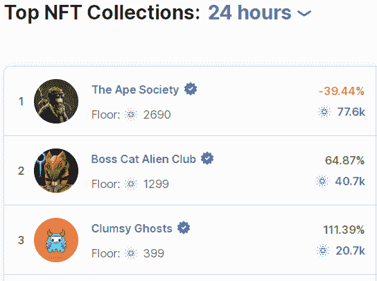
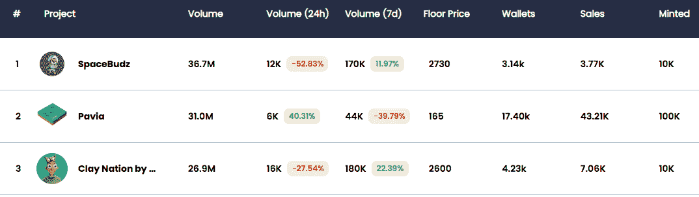

# 卡尔达诺的顶级 NFT 市场:比较与选择

> 原文：<https://web.archive.org/web/https://dappradar.com/blog/top-nft-marketplaces-for-cardano-compare-choose>

## 发现在 Cardano 上买卖 NFT 的最佳选择

卡尔达诺是越来越多的 dapps 和 NFT 市场的所在地。高度环保的区块链为艺术家和收藏家提供了一些特色，让他们可以尝试一下非传统艺术。我们为你整理了一份最好的 NFT 卡达诺市场清单。

## **目录**

*   [卡达诺是什么？](https://web.archive.org/web/20221130132217/https://dappradar.com/blog/top-nft-marketplaces-for-cardano-compare-choose/#What-is-Cardano?)
*   [是什么让 Cardano NFTs 与众不同？](https://web.archive.org/web/20221130132217/https://dappradar.com/blog/top-nft-marketplaces-for-cardano-compare-choose/#What-makes-Cardano-NFTs-different?)
*   NFT 最好的卡达诺市场有哪些？

*   [JPG。商店](https://web.archive.org/web/20221130132217/https://dappradar.com/blog/top-nft-marketplaces-for-cardano-compare-choose/#JPG.Store)
*   [CNFT.io](https://web.archive.org/web/20221130132217/https://dappradar.com/blog/top-nft-marketplaces-for-cardano-compare-choose/#CNFT.io)
*   [卡尔达诺魔方](https://web.archive.org/web/20221130132217/https://dappradar.com/blog/top-nft-marketplaces-for-cardano-compare-choose/#Cardano-Cube)
*   [豆蔻](https://web.archive.org/web/20221130132217/https://dappradar.com/blog/top-nft-marketplaces-for-cardano-compare-choose/#Cardahub)
*   [托克逊](https://web.archive.org/web/20221130132217/https://dappradar.com/blog/top-nft-marketplaces-for-cardano-compare-choose/#Tokhun)

*   [结论](https://web.archive.org/web/20221130132217/https://dappradar.com/blog/top-nft-marketplaces-for-cardano-compare-choose/#Conclusion-)

## 卡尔达诺是什么？

卡尔达诺是一个很有潜力的有趣的区块链。其背后的团队声称，它克服了加密市场中现有的问题:主要是比特币太慢和不灵活，以太坊不安全或不可扩展。

[https://web.archive.org/web/20221130132217if_/https://www.youtube.com/embed/wZEXfppjCUg?feature=oembed](https://web.archive.org/web/20221130132217if_/https://www.youtube.com/embed/wZEXfppjCUg?feature=oembed)

这个广受欢迎的[区块链平台是 ADA 加密货币的所在地，拥有活跃的全球用户和开发者社区。它已经比以太坊快得多，允许以公平的价格进行快速交易。](https://web.archive.org/web/20221130132217/https://iohk.io/en/research/library/papers/ouroborosa-provably-secure-proof-of-stake-blockchain-protocol/#:~:text=Ouroboros%3A%20A%20Provably%20Secure%20Proof%2Dof%2DStake%20Blockchain%20Protocol,-Aggelos%20Kiayias%2CAlexander&text=We%20present%20%E2%80%9COuroboros%E2%80%9D%2C%20the,by%20the%20bitcoin%20blockchain%20protocol.)

该平台的开发始于 2015 年，由以太坊和 BitShares 的联合创始人查尔斯·霍斯金森(Charles Hoskinson)于 2017 年推出。霍斯金森离开以太坊是出了名的，此前他与联合创始人维塔利克·布特林(Vitalik Buterin)就接受资金创建一个盈利实体发生了争执，而布特林希望将其作为一个非营利组织运营。

## 是什么让 Cardano NFTs 与众不同？

让 Cardano NFTs 与众不同的一点是，它们不需要智能合约。这一独特的特性使得 Cardano NFTs 创建起来更加安全，执行起来更加容易，同时大大降低了汽油和交易费用。

[https://web.archive.org/web/20221130132217if_/https://www.youtube.com/embed/4lnlrnpQbxE?feature=oembed](https://web.archive.org/web/20221130132217if_/https://www.youtube.com/embed/4lnlrnpQbxE?feature=oembed)

## 什么是最好的卡达诺 NFT 市场？

到目前为止，超过 56，000 个 NFT 系列已经在 Cardano **、**上推出，尽管整个 NFT 市场正在放缓，但 Cardano 最近的 Vasil fork 通过显著提高可扩展性和修复安全漏洞，标志着 NFTs 的光明前景。

让我们来看看 NFT 五个最好的卡尔达诺市场

### 1.JPG。商店

这个平台是初学者进入数字收藏品世界的理想选择。JPG 的用户界面。商店 NFT 市场类似于 OpenSea 和 LooksRare，使导航非常简单。在这里，您可以发现即将推出的 NFT 滴，并购买和出售您最喜爱的 NFT 没有任何麻烦。

[Explore JPG Store](https://web.archive.org/web/20221130132217/https://dappradar.com/cardano/marketplaces/jpg-store)

#### 额外津贴包括:

*   支持大多数卡达诺钱包
*   拥有各种各样的收藏品
*   2%的交易费
*   采矿工具
*   收藏排名
*   创作者版税
*   收集验证
*   无托管(交易中没有第三方临时持有资金)

[<picture></picture>](https://web.archive.org/web/20221130132217/https://dappradar.com/cardano/marketplaces/jpg-store)

Source: JPG.Store

### 2.CNFT.io

这是第一个 ADA NFT 市场。它是著名的卡尔达诺 NFT 收藏馆的所在地，如 SpaceBudz 和 Paviaothers。在撰写本文时，CNFT 市场在 24 小时内的交易量超过 5 亿 ADA。

Source: [CNFT.io](https://web.archive.org/web/20221130132217/https://cnft.io/)

#### 额外津贴包括:

*   2.5%的市场费用
*   本地令牌$CNFT
*   许多上市选项
*   支持大多数卡达诺钱包

[Discover NFT Collections](https://web.archive.org/web/20221130132217/https://dappradar.com/hub/nft-explorer)

### 3.卡尔达诺立方体

这不是一个 per sé的 NFT 市场，而是一个聚合器，显示所有可用的 dapps 和正在 Cardano 上构建的项目，当然包括 NFT 市场，由于 Cardano 活跃的开发人员社区，这些市场每天都在增长。

#### 额外津贴包括:

*   支持所有卡达诺钱包
*   1，000 多个基于卡尔达诺的 dapps 和项目概述
*   0%费用

### 4.豆蔻

对于想要尝试 Cardano NFTs 的初学者来说，这是另一个很好的选择，因为它具有用户友好的特性。在这里，您可以铸造自己的 NFT，并支付单独的卡尔达诺区块链交易。

#### 额外津贴包括:

*   使用方便
*   支持 Nami、CCvault、Flint 和 Gero 钱包
*   没有市场费用，只有卡达诺区块链交易费

### 5.托克洪

由于其笨拙的视觉效果，这个平台可能是列表中最不友好的。它以 100 多名艺术家的作品为特色，他们每个人都可以创作多达 20 个独特命名的 NFT，通过一个单独的 mint 自动编号。

#### 额外津贴包括:

*   高度可定制的 NFT 铸币功能
*   系列化铸造
*   真实性验证
*   创作者版税
*   2.5%的费用
*   本地令牌$TKHN，包括标记

## 随身携带您的 Web3 之旅

使用 DappRadar 移动应用程序，再也不会错过 Web3。查看最受欢迎的 dapps 的性能，并关注您投资组合中的 NFT。您在 DappRadar 上的帐户会与我们的移动应用程序同步，这样您很快就可以选择实时接收提醒。

[Download the DappRadar app now](https://web.archive.org/web/20221130132217/https://dappradar.app.link/blog)[<picture></picture>](https://web.archive.org/web/20221130132217/https://play.google.com/store/apps/details?id=com.portfolio.dappradar)

## 结论

卡尔达诺社区有许多热情的成员，NFT 市场的发展才刚刚起步。同样，现在说 NFTs 会对 Cardano 的整体采用产生什么影响还为时过早。

然而，区块链凭借其绿色加密货币(ADA)和强大的安全升级(如 Vasilius)提供的独特优势，有着光明的未来。越来越多的 NFT 市场出现在卡达诺，因为它易于部署，可持续性和可靠性。

在 DappRadar，我们希望帮助你在 Web3 和 NFT 市场的广阔天地中导航。如果你看好 Cardano，看看这些伟大的 dapps，找出最适合你的。