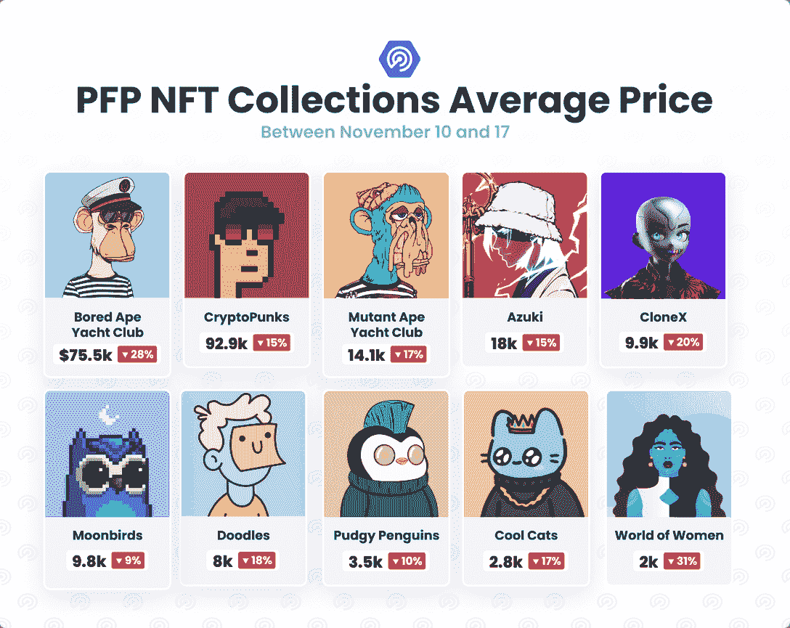
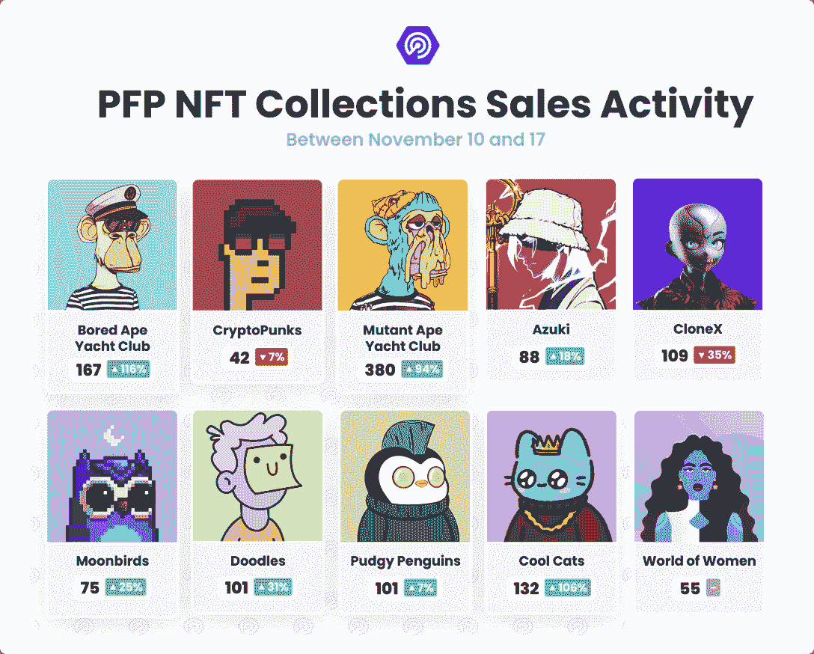

# 顶级私营部门筹资和信托基金的销售活动增加，价格下降

> 原文：<https://web.archive.org/web/https://dappradar.com/blog/top-pfp-nfts-see-sales-activity-rise-and-prices-fall>

## 看看 FTX 动乱是如何影响一些最受欢迎的 NFT 收藏品的

围绕 FTX 崩溃的灾难性事件影响了整个网络 3。在 NFTs 的例子中，有很多东西可以用来理解收藏家的反应。虽然出现了恐慌性销售和平均价格下跌，但对收藏品的需求仍然很高，这些项目并没有失去动力。在 NFTs 的例子中，有很多东西可以用来理解收藏家的反应。

**亮点**

*   在过去的七天里，我们看到大多数顶级 PFP(个人资料图片)收藏品的销售活动都有所上升；
*   与此同时，关于平均销售价格的普遍下降，NFT 市场也有很多争论；
*   *你可以在*[*【DappRadar】*](https://web.archive.org/web/20221226100908/https://dappradar.com/nft)*上追踪所有你喜欢的以太坊 NFT 系列的数据。*

## 市场和数字资产价格的下跌

许多有前途的 Web3 项目都以这样或那样的方式与阿拉米达联系在一起，FTX 感觉到公众对它们的信任程度受到了很大影响。

这种变化导致许多人提供他们来自流行的 PFP 收藏的宝贵数字资产，如 [Bored Ape Yacht Club](https://web.archive.org/web/20221226100908/https://dappradar.com/ethereum/collectibles/bored-ape-yacht-club) 、 [Doodles](https://web.archive.org/web/20221226100908/https://dappradar.com/ethereum/collectibles/doodles) 和[志那都红豆](https://web.archive.org/web/20221226100908/https://dappradar.com/ethereum/collectibles/azuki)出售。

从下图中可以看出，在过去的一周里，10 个顶级的 NFT 收藏的平均销售价格波动了多少。

[<picture></picture>](https://web.archive.org/web/20221226100908/https://dappradar.com/nft)

上述项目拥有强大的团队，致力于新版本和合作伙伴关系，并在该领域开发创新。不管怎样，所有人都看到他们的 NFT 比所谓的*加密传染病*前一周卖得少。

在上面列出的系列中，[女人世界](https://web.archive.org/web/20221226100908/https://dappradar.com/ethereum/collectibles/world-of-women)和[无聊猿游艇俱乐部](https://web.archive.org/web/20221226100908/https://dappradar.com/ethereum/collectibles/bored-ape-yacht-club)跌幅最大，平均销售率分别下降了 31%和 28%。

另一方面，[月鸟](https://web.archive.org/web/20221226100908/https://dappradar.com/ethereum/collectibles/moonbirds)和[矮胖企鹅](https://web.archive.org/web/20221226100908/https://dappradar.com/ethereum/collectibles/pudgy-penguins/nfts)虽然也经历了一周的低迷，但价格跌幅最小，与前一周相比分别下降了 9%和 10%。

[Check Out NFT Collections Rankings](https://web.archive.org/web/20221226100908/https://dappradar.com/nft)

## 销售活动拍摄:这些资产有多强？

来自宇迦实验室、无聊猿游艇俱乐部、[变异猿游艇俱乐部](https://web.archive.org/web/20221226100908/https://dappradar.com/ethereum/collectibles/mutant-ape-yacht-club)以及酷猫的收藏品在过去 7 天里销量翻了一番。

请看下文，在此期间，亲民党 NFT 收藏的顶级销售活动是如何变化的。

[<picture></picture>](https://web.archive.org/web/20221226100908/https://dappradar.com/nft)

当谈到市场上一些顶级的亲民党收藏品时，这种幅度的波动是不容忽视的。

DappRadar 数据可以帮助您监控数字资产数字，并提供工具来更好地分析它们如何反映市场情绪。

## 用 DappRadar 继续追踪 NFT 的趋势

我们希望您喜欢更多地了解 NFT 空间如何应对最近的市场波动。DappRadar 将继续关注 NFT 的发展趋势，为您提供教育内容和丰富的数据和分析。

在 DappRadar，你可以管理你的 [NFT 投资组合](https://web.archive.org/web/20221226100908/https://dappradar.com/hub/wallet),跟踪最热门的 NFT 销售、收藏和区块链各个市场。

[Explore Top NFT Collections Stats Now](https://web.archive.org/web/20221226100908/https://dappradar.com/nft)

### 有用的链接

*   [什么是动态 NFT，它如何随时间变化](https://web.archive.org/web/20221226100908/https://dappradar.com/blog/what-is-a-dynamic-nft)
*   你的 NFT 一文不值吗？如何分析它们的价值
*   [什么是蓝筹 NFT 藏品&如何找到它们](https://web.archive.org/web/20221226100908/https://dappradar.com/blog/what-are-blue-chip-nft-collections)

***以上不构成投资建议。此处给出的信息仅供参考。请尽职调查并自行研究。***

 NewsletterUnsubscribe at any time. [T&Cs](https://web.archive.org/web/20221226100908/https://dappradar.com/terms) and [Privacy Policy](https://web.archive.org/web/20221226100908/https://dappradar.com/privacy-policy)