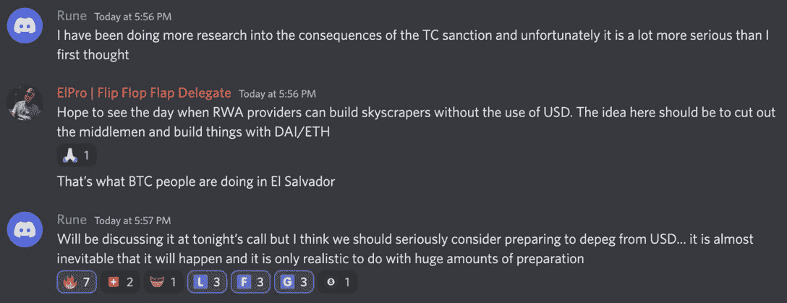
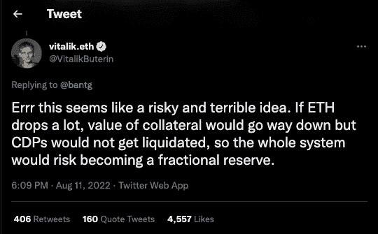
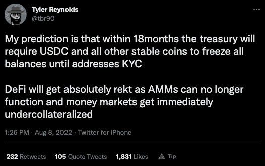

# 龙卷风现金余波可能蔓延到比特币

> 原文：<https://web.archive.org/web/https://dappradar.com/blog/tornado-cash-fallout-could-spread-to-bitcoin>

## 制裁带来的影响仍在继续，可能会影响比特币

**美国财政部于 2022 年 8 月 8 日批准了 Tornado Cash，声称该工具让用户匿名发送和接收加密，自 2019 年以来清洗了价值超过 70 亿美元的加密资产。这些措施禁止所有美国居民和实体使用龙卷风现金。8 月 8 日之前，财政部从未批准过开源协议。**

美国财政部的这一举措引发了一波反应，因为[dapp 和协议](https://web.archive.org/web/20220925233613/https://dappradar.com/rankings)试图处理遗留的混乱，并最大限度地服务于他们的平台和用户的利益。与此同时，一些人在思考比特币的最终后果。然而，并不是所有的决策和想法都受到热烈欢迎，因为关于分散化和集中控制的争论再次出现。

所有这些都是在熊市和 Curve 等核心 DeFi 平台宣布鲸鱼和机构投资者对加密货币的需求进一步下降的背景下发生的。根据 Dune Analytics 的数据，整个 7 月，Curve 录得约 80 亿美元的交易量，较 6 月下降 48%。除了 Curve，其他臭名昭著的[高交易量指数](https://web.archive.org/web/20220925233613/https://dappradar.com/defi/protocol/ethereum)如 [Uniswap](/web/20220925233613/https://dappradar.com/blog/what-is-uniswap-and-how-to-use-it/) 、 [Synthetix](https://web.archive.org/web/20220925233613/https://dappradar.com/multichain/defi/synthetix) 、 [Balancer](https://web.archive.org/web/20220925233613/https://dappradar.com/multichain/exchanges/balancer) 、 [Shibaswap](/web/20220925233613/https://dappradar.com/blog/shibaswap-finds-its-way-to-binance-smart-chain/) 和 [Sushi](https://web.archive.org/web/20220925233613/https://dappradar.com/multichain/defi/sushi) 也随着投资者信心的持续动摇[跌至新低](https://web.archive.org/web/20220925233613/https://dappradar.com/defi)。

## 行动需要反应

禁令生效后，USDC 背后的财团 Centre[将 38 个钱包地址](https://web.archive.org/web/20220925233613/https://thedefiant.io/usdc-addresses-banned)列入黑名单，冻结了他们在 USDC 的 75000 美元。由 Circle 和比特币基地成立的这个财团自 2018 年 9 月推出 USDC 以来，已经禁止了 81 个钱包地址。

龙卷风现金钱包的黑名单使[马克尔道的戴稳定币](/web/20220925233613/https://dappradar.com/blog/makerdao-an-introduction-and-how-it-works/)的去中心化成为焦点，主要是因为行业观察家已经批评戴只不过是包装好的而已。因为戴背后有 32%的靠山。这相当于约 35 亿美元，意味着它是支持戴的最大一笔资产。

此外，观察家们还担心戴对的依赖，从本质上来说，这是一种中央集权的资产，容易受到政府和企业思想的干扰。

两周前，MakerDAO 宣布了在 USDC 用高达 35 亿美元兑换以太币的投机计划——此举可能会导致其稳定货币 DAI 失去与美元挂钩的地位。目前，有超过 76 亿美元的戴在流通，使其成为市值第四大稳定货币[。](/web/20220925233613/https://dappradar.com/blog/stablecoins-the-simple-guide/)

[https://web.archive.org/web/20220925233613if_/https://www.youtube.com/embed/bZkSZ1jqoDI?feature=oembed](https://web.archive.org/web/20220925233613if_/https://www.youtube.com/embed/bZkSZ1jqoDI?feature=oembed)

## 戴有可能与美元脱钩

[DAI 是一种超额抵押的稳定货币](/web/20220925233613/https://dappradar.com/blog/makerdao-an-introduction-and-how-it-works/)，这意味着希望持有 DAI 的用户需要向 MakerDAO 协议提供一系列加密货币的资产作为抵押，以维持 DAI 与美元的挂钩。不像 USDT 或 USDC，它们都是由一个中心点控制的。戴被认为是提供了无与伦比的权力下放，因为缺乏一个中央权威。

问题在于，戴与美元的联系汇率是由所谓的联系汇率稳定机制来维持的，该机制允许使用者一对一地用等稳定货币来交换戴。

戴的抵押品中有 30%以上是的资产，抛售意味着摆弄盯住美元的机制。但如果没有套利交易来维持与美元的等值，戴最终将与美元脱钩，并升至 1 美元以上。

MakerDao 的创始人 Rune Christensen 认为回报大于风险，并主要发泄了对 Tornado Cash 发行如何证明了一种方法的担忧，这种方法可以快速且违反宪法地阻止任何与集中式 stablecoins 相关的智能合同，而没有采取行动的准备时间。简而言之，MakerDAO 希望减少对一项可能受到外部干预的资产的依赖。

值得注意的是，Rune Christensen 和 MakerDAO 仍然需要对这一提议进行投票，目前还没有做出任何决定。以太坊(Ethereum)创始人 Vitalik Buterin 对这种情况发表了评论，指出 MakerDAO 以 35 亿美元出售 USDC 收购 ETH 的计划可能是危险和可怕的。他进一步表示，他认为一个解决方案可能是将任何用作支持的资产的权重限制在 20%左右。

## 可行的替代方案

随着 USDC 不断受到负面媒体言论的打击，并明显倾向于遵守立法者的要求，[反种族主义者开始关注](/web/20220925233613/https://dappradar.com/blog/decentralized-finance-defi-dappradars-ultimate-guide/)[名单之外的三个稳定的国家:USDC、USDT 和 BUSD。](/web/20220925233613/https://dappradar.com/blog/these-are-the-best-stablecoins-you-can-trust/)

随着 AAVe 和 Curve 今年宣布推出 stablecoin 项目，竞争只会越来越激烈。然而，一些行业旁观者怀疑投资者会在更多信息和透明度出现之前放弃前三名。

然而，投资者正在探索 Liquity 等替代产品，Liquity 是一种依赖于债务抵押头寸的协议。自从 [Liquity](https://web.archive.org/web/20220925233613/https://dappradar.com/ethereum/defi/liquity) 只接受 ETH 作为抵押品以来，LUSD 作为一个更加分散化的选择越来越受到青睐。根据 DEX Screener 的数据，他们已经看到与美元挂钩的 LUSD 跃升至 1.04 美元。当行业影响者 [Tetranode](https://web.archive.org/web/20220925233613/https://twitter.com/Tetranode/status/1556720108583657478) 在谈论 RAI 时，RAI 不与美元挂钩，而是仅由 ETH 支持，旨在维持稳定的价格。

Synthetix 也有它的 sUSD stablecoin，一些社区成员认为它可以开始占有市场份额，因为 USDC 的信任度在下降，顶级的集中式 stablecoin。

## 立法者能走多远？

可以说，像美国财政部外国资产控制办公室这样的执法机构为实现其目标所能做的是没有限制的。可以说，龙卷风现金崩溃已经暴露了这一点。这个案例甚至更有意思，因为许多分散化的工具最初是为了应对政府的全面控制而建立的，旨在防止这种行为。

正如许多业内人士在过去几周所强调的，对开源代码的制裁可能会侵犯保护言论自由的宪法第一修正案。更重要的是，[代码是根据美国法律](https://web.archive.org/web/20220925233613/https://www.eff.org/deeplinks/2015/04/remembering-case-established-code-speech)作为言论建立的。此外，任何对开源代码的攻击都是对比特币的攻击。

此外，对 Tornado Cash 的完全制裁对使用该工具保护其合法隐私利益的守法居民产生了负面影响。此外，这导致人们质疑美国财政部是否可以将这些措施扩展到比特币及其工具。

## 比特币有搅拌器

比特币有自己的混合工具，叫做 [CoinJoins](https://web.archive.org/web/20220925233613/https://bitcoinmagazine.com/technical/a-comprehensive-bitcoin-coinjoin-guide) 。这是一种混合硬币的方法，以保护用户在像比特币这样的公共账本上的隐私。还有 Samourai、Wasabi 等工具。假设执法机构可以扩大他们的权力以满足他们的要求，这些可能会受到制裁威胁的攻击。

第一种情况是执法机构完全禁止 CoinJoins。不管可能性有多大，尽管这将意味着排除多方比特币交易，但这种行动仍有可能实现。

或许更有可能的情况是 CoinJoins 的协调人受到制裁。虽然像 JoinMarket 这样的平台由于其设置不会直接受到制裁，但在 Samourai 和 Wasabi 的案件中，有中央协调员。鉴于 CoinJoins 的结构和欧洲刑警组织的声明，这种类型的制裁仍然相对不太可能，声明称反洗钱规则不适用于这些工具。

理论上，制裁协调人类似于制裁 Tornado Cash，但实际上是不同的。有了比特币 CoinJoins，比特币区块链就没有单点联系，这是与 Tornado Cash 基于以太坊的[智能合约系统的一个关键区别。但是当然，一切皆有可能。](/web/20220925233613/https://dappradar.com/blog/what-is-ethereum-dappradars-ultimate-guide/)

比特币和以太坊的另一个关键区别是，在[以太坊生态系统](https://web.archive.org/web/20220925233613/https://dappradar.com/rankings/protocol/ethereum)中，集中式工具在其去中心化的工作中扮演着更重要的角色。例如，为大多数以太坊 dapps、钱包和服务提供动力的 Infura 很容易受到制裁和审查。可以说，比特币更有能力承受类似的问题。

鉴于其设计，比特币可以说是抵御国家攻击准备最充分的网络。此外，对比特币隐私工具实施可能的制裁存在挑战，这使得采取行动不太可能，也相对无用。最后，CoinJoins 的独特特征及其工作中的差异意味着这种事件的可能性很低。

[<picture></picture>](https://web.archive.org/web/20220925233613/https://dappradar.com/blog/what-is-a-dapp-on-the-blockchain)[<picture></picture>](https://web.archive.org/web/20220925233613/https://dappradar.com/blog/what-is-defi-or-decentralized-finance)[<picture></picture>](https://web.archive.org/web/20220925233613/https://dappradar.com/rankings)

***以上不构成投资建议。此处给出的信息仅供参考。请行使尽职调查，做你的研究。作者持有多种加密货币的头寸，包括 BTC、瑞士法郎和雷达。***