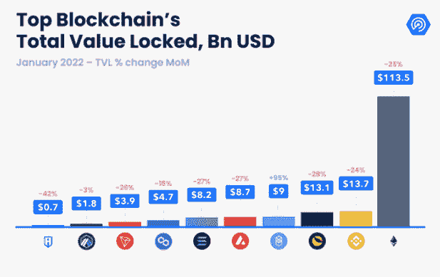
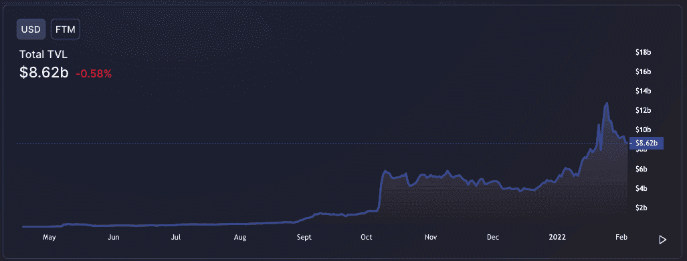
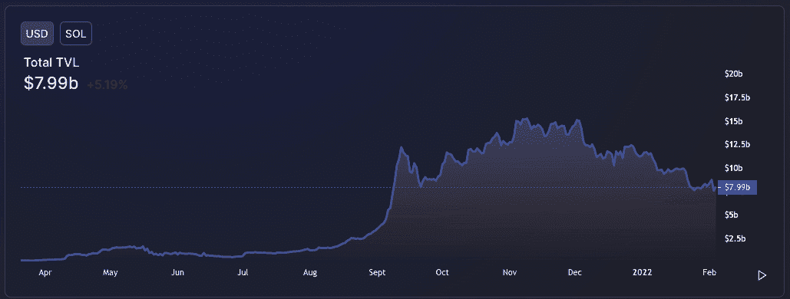

# DeFi 锁定的总价值缩水 23%，至 1，780 亿美元

> 原文：<https://web.archive.org/web/https://dappradar.com/blog/total-value-locked-in-defi-shrinks-23-to-178-billion>

## 以太坊仍然占有最大份额

**由于加密价格下跌和看跌情绪席卷整个行业，整个区块链行业锁定在 DeFi 协议中的总价值从 2021 年 12 月底缩水了 23%。尽管竞争加剧，以太坊目前在 TVL 的估值约为 1780 亿美元，但仍占据最大份额。根据最新的[DappRadar 1 月 Dapp 行业报告](/web/20220930101206/https://dappradar.com/blog/dapp-industry-report-january-2022/)，领先的区块链保持了对 DeFi 活动 65%的控制。**

需要记住的是，TVL 代表了智能合约在任何给定时间持有的总价值，仅包括加密资产和稳定账户。这一次，Stablecoins 的参与更为显著，因为交易者现在转而投资与美元或欧元挂钩的加密资产。或者，下注或集中这些作为奖励。由于上述原因导致 TVL 下降不太明显。然而，总体而言，随着合约中持有的资产价值下降，不断下跌的象征性价格有机地降低了 TVL 的美元价值。

尽管有这种细微差别，DeFi 的活动也在下降，因为 DeFi dapps 似乎对加密市场更加敏感。鉴于它们的功能是交易和利用加密货币，这并不奇怪，其中大多数加密货币自 2021 年高点以来已下跌近 50%。

与去年 12 月相比，DeFi dapps 的使用量在 1 月份下降了 3%，上个月每天有 825，000 个 UAW 连接到 DeFi dapps。DeFi 的用户优势从去年年底的 36% 下降到本文撰写时的 33%。就 TVL 而言，以太坊仍然是占主导地位的连锁企业，拥有该行业 65%的市场份额。然而，这比去年年底观察到的 67%的优势下降了两个百分点。在撰写本文时，以太坊在 TVL 持有 1130 亿美元，比去年 12 月减少了 25%。

## 争夺第二名

最有趣的观察是占 DeFi 锁定的总价值的另外 35%的网络之间的战斗。这个数字目前已经超过 650 亿美元。 [BSC](https://web.archive.org/web/20220930101206/https://dappradar.com/rankings/protocol/binance-smart-chain) 和 Terra 仍在争夺第二的位置，两者都持有超过 130 亿美元，尽管本月他们的 TVL 分别下降了 24%和 28%。

就 TVL 而言，最大的赢家是新整合的 Fantom 网络。高度可扩展的第 1 层解决方案在过去 30 天内 TVL 几乎翻了一番，在 1 月份超过了 90 亿美元。

Source: [DeFi Lama](https://web.archive.org/web/20220930101206/http://solana appears to be losing its footing in the defi landscape on the flip side. tvl has consistently dropped over the last few months amidst a slew of negative press stories, not to mention a recent exploit through the network’s wormhole finance token bridge. during this incident hacker drained over $320 million from the platform./)

索拉纳似乎正在失去其在另一面的 DeFi 景观的立足点。在过去的几个月里，TVL 在一系列负面新闻报道中不断下跌，更不用说最近通过网络的虫洞金融令牌桥的利用了。在这次事件中，一名[黑客从平台](/web/20220930101206/https://dappradar.com/blog/321-million-taken-as-solana-wormhole-bridge-hacked/)上取走了超过 3 . 2 亿美元。

Source: [DeFi Lama](https://web.archive.org/web/20220930101206/https://defillama.com/chain/Solana)

虽然记住 DeFi 的主要 TVL 指标的细微差别很重要，但它是衡量该行业的标准。自 2020 年喧嚣的夏天以来，DeFi 无疑已经退居二线，但这一类别还远未结束。此外，我们正在看到游戏和 DeFi 的融合，通过游戏化的方式呈现金融工具。像和谐王国这样的平台就是一个典型的例子。

但是，认真的交易者会为了收集魔咒而去互换杠杆、现货交易、闪贷吗？我们认为不是。相反， [GameFi 和 play-to-earn gaming 正在成为](https://web.archive.org/web/20220930101206/https://dappradar.com/blog/dapp-industry-report-january-2022)一款视觉上更友好、坦率地说更容易理解的游戏。那些处于边缘的人只需很少的投资就能参与进来，并有可能带着回报离开。当通胀率将达到一代人以来的最高水平时，人们寻找机会就不足为奇了。

[https://web.archive.org/web/20220930101206if_/https://www.youtube.com/embed/Ut8RbzDmeCk?feature=oembed](https://web.archive.org/web/20220930101206if_/https://www.youtube.com/embed/Ut8RbzDmeCk?feature=oembed)

当然，旅程不需要在 GameFi 停留。如前所述，这是一个 onramp。一些 DeFi 平台已经宣布略微转向以玩为赚，而其他的[如 Abracadabra Money](https://web.archive.org/web/20220930101206/https://dappradar.com/multichain/defi/abracadabra-money) 和 [DeFi Kingdoms](/web/20220930101206/https://dappradar.com/blog/play-to-earn-defi-kingdoms-rise-to-success/) 从一开始就实现了游戏化的机制。此外，dapps 可以用他们以前的 DeFi dapps 构建具有紧密经济循环的游戏。随着时间的推移，可能会导致用户升级到更复杂的 DeFi 机制。

区块链工业以闪电般的速度发展。正如一些头条媒体最近评论的那样，DeFi 肯定没有死，它只是在重塑自己，适应市场条件。

 NewsletterUnsubscribe at any time. [T&Cs](https://web.archive.org/web/20220930101206/https://dappradar.com/terms) and [Privacy Policy](https://web.archive.org/web/20220930101206/https://dappradar.com/privacy-policy)

***以上不构成投资建议。此处给出的信息仅供参考。请行使尽职调查，做你的研究。作者持有 ETH、BTC、AGIX、HEX、LINK、GRT、CRO、OMI、不可变 X、GALA、AVASTR、GMEE、CUBE、RADAR、FLOW、FTM、BNB、SPS、WRLD、ATOM 和 ADA。***