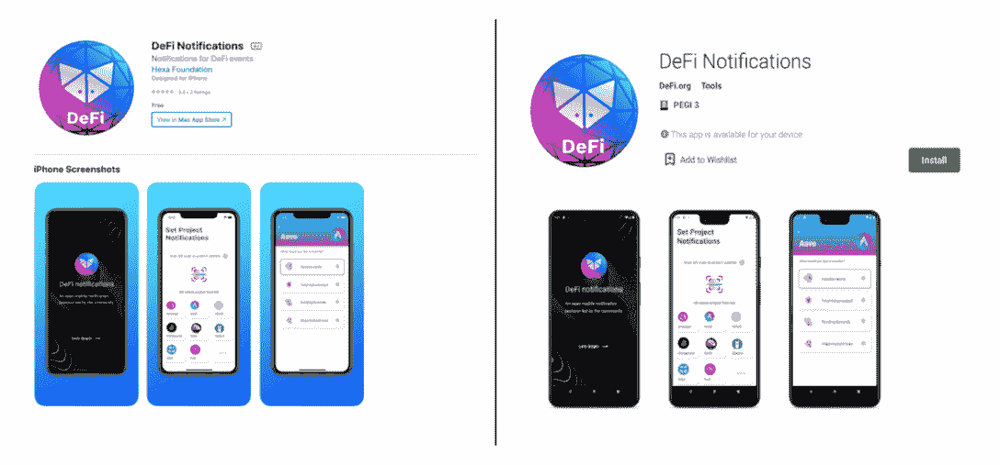

# 像专业人士一样使用开放定义通知协议进行交易

> 原文：<https://web.archive.org/web/https://dappradar.com/blog/trade-like-a-pro-with-the-open-defi-notification-protocol>

## 支持以太坊，多边形，BNB 链，扇形和雪崩的定义

**开放式 DeFi 通知协议是一项由社区推动的倡议，为 DeFi 用户提供分散的免费移动通知，用于他们的链上 DeFi 事件。它可以推送止损、价格变动、TVL 变化、合同升级等提醒，帮助用户获得优势。**

摘要

*   由 [Orbs](https://web.archive.org/web/20220705010121/https://www.orbs.com/) 提供动力，开放式 DeFi 通知协议使 DeFi 用户能够跟上最新的市场更新。
*   协议支持[以太坊](https://web.archive.org/web/20220705010121/https://dappradar.com/rankings/protocol/ethereum)、[多边形](https://web.archive.org/web/20220705010121/https://dappradar.com/rankings/protocol/polygon)、 [BNB 链](https://web.archive.org/web/20220705010121/https://dappradar.com/rankings/protocol/binance-smart-chain)、[方顿](https://web.archive.org/web/20220705010121/https://dappradar.com/rankings/protocol/fantom)和[雪崩](https://web.archive.org/web/20220705010121/https://dappradar.com/rankings/protocol/avalanche)上的 DeFi 项目。
*   它具有移动友好、免费使用、社区驱动等特点。

2022 年对 cryptos 来说是艰难的一年，熊市没有结束。自 2021 年 11 月中旬达到 1900 亿美元的历史最高总价值锁定(TVL)以来， [DeFi](https://web.archive.org/web/20220705010121/https://dappradar.com/defi) 部门在撰写时已降至 1000 亿美元以下。

然而，强调这个行业的脆弱性和泡沫是不公平的，因为 DeFi 的重要性是显而易见的。DeFi 创造了一个无信任、无许可的金融市场，它不仅会存在，还会继续发展，以改变人们的金融活动。因此，相信分散化未来的理性投资者选择明智地为熊市做好准备，直到市场好转。

在处理 DeFi 世界的复杂性时，有一点要记住，不要让信息的洪流淹没你。如何实现这一点？许多人转向开放式 DeFi 通知协议寻求帮助。该协议及时向用户免费通知重要的链上 DeFi 事件。

## 什么是开放定义通知协议

开放式 DeFi 通知协议是一个移动友好的，社区驱动的，分散的通知工具，用于链上 DeFi 事件。该项目由 Orbs 提供支持，Orbs 帮助实施该协议，并为许多公认的 DeFi 项目的整合做出了贡献，如 [Sushi](https://web.archive.org/web/20220705010121/https://dappradar.com/multichain/defi/sushi) 和 [Aave](https://web.archive.org/web/20220705010121/https://dappradar.com/ethereum/defi/aave-v2) 。

DeFi 通过用点对点网络取代中介，并允许公众访问各种数字资产，颠覆了传统的金融体系。然而，由于加密市场是跨大量令牌全天候运行的，因此始终保持与所有事物同步是一项挑战。此外，波动性是另一个可能导致重大损失的挑战，特别是当用户在抵押品价值突然下降时没有及时采取行动。

开放式 DeFi 通知协议为用户提供了一种可靠的方式来提醒不同的市场变化。由于 DeFi 协议和 dapps 的透明性和开源性，Open DeFi Notification Protocol 可以访问那里的所有数据，对其进行处理，并将其转化为有用的信息。

## 开放式 DeFi 通知协议有什么独特之处？

在快速变化的 DeFi 世界中，即使是最有经验的用户也会错过重要信息。而使用开放式 DeFi 通知协议，即使是新手也可以随时了解市场动向。

### 免费使用且易于使用

开放 DeFi 通知协议在 [iOS](https://web.archive.org/web/20220705010121/https://apps.apple.com/il/app/defi-notifications/id1588243632) 和 [Android](https://web.archive.org/web/20220705010121/https://play.google.com/store/apps/details?id=com.orbs.openDefiNotificationsApp) 上都可用。用户可以设置各种通知，以便更好地控制用户的资产，减少风险。这些包括止损、价格变动、TVL 变化、合同升级等警报。最重要的是，这个 DeFi 用户的必备工具是免费使用的。没有订阅，没有广告。

### 多网络支持

开放定义通知网络目前支持以太坊、多边形、BSC、Fantom 和 Avalanche。由于在扩展其生态系统时采用了不可知的方法，该协议可以与任何希望插入的生态系统集成。因此，它可以支持所有 DeFi 用户，无论他们选择何种网络。

### 社区驱动和开放

Open DeFi 通知协议允许任何开发人员贡献代码，集成任何项目，以及帮助运行节点的任何验证器。将一个新的 DeFi 项目加入到协议中是非常容易的。

因为任何人都可以做出贡献，所以 Open DeFi 通知协议不需要项目的开发团队来实现集成。因此，即使是一个社区成员也可以做到这一点。它只需要实现一个简单的 JavaScript web3 类，从链数据中提取通知。这个类然后通过 PR 贡献给协议 Github repo。

## 最后的想法

尽管回报是有希望的，淹没在大量的信息中会使 DeFi 投资受挫。实时 DeFi 事件通知工具可以改变这种情况。

更重要的是，用户不需要担心未来更复杂的 DeFi 环境。Orbs 设计了开放式 DeFi 通知协议，其核心是可伸缩性和灵活性。结果，该协议准备好与任何未来的 DeFi 协议集成，并且能够引入附加通知，只要它们与用户偏好相关。

Open DeFi 通知协议致力于构建一个动态的生态系统，让各类用户受益。该平台与 DappRadar 合作推出了一项新的 10 万美元开发者补助金，旨在支持开发者的雄心和出色的想法。开发者可以在这里找到完整的细节。

找到更多关于 Orbs 和开放 DeFi 通知协议:

[宝珠网站](https://web.archive.org/web/20220705010121/https://www.orbs.com/)

[开放 DeFi 通知协议](https://web.archive.org/web/20220705010121/https://defi.org/notifications/)

[推特](https://web.archive.org/web/20220705010121/https://twitter.com/orbs_network)

[不和](https://web.archive.org/web/20220705010121/https://discord.gg/sswGDYGBt5)

**免责声明** —这是一篇赞助文章。DappRadar 不认可本页面上的任何内容或产品。DappRadar 旨在提供准确的信息，但读者应该在采取行动之前总是自己做研究。DappRadar 的文章不能被认为是投资建议。