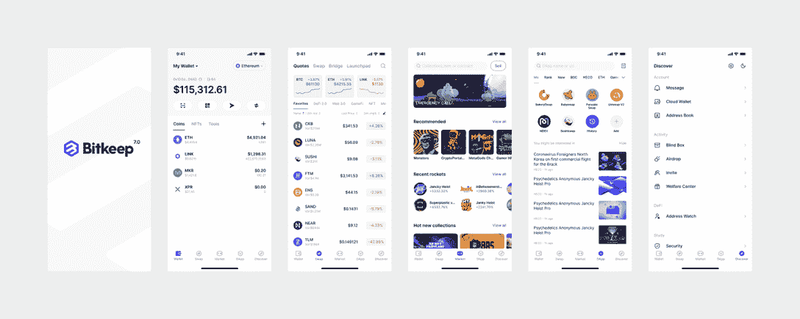
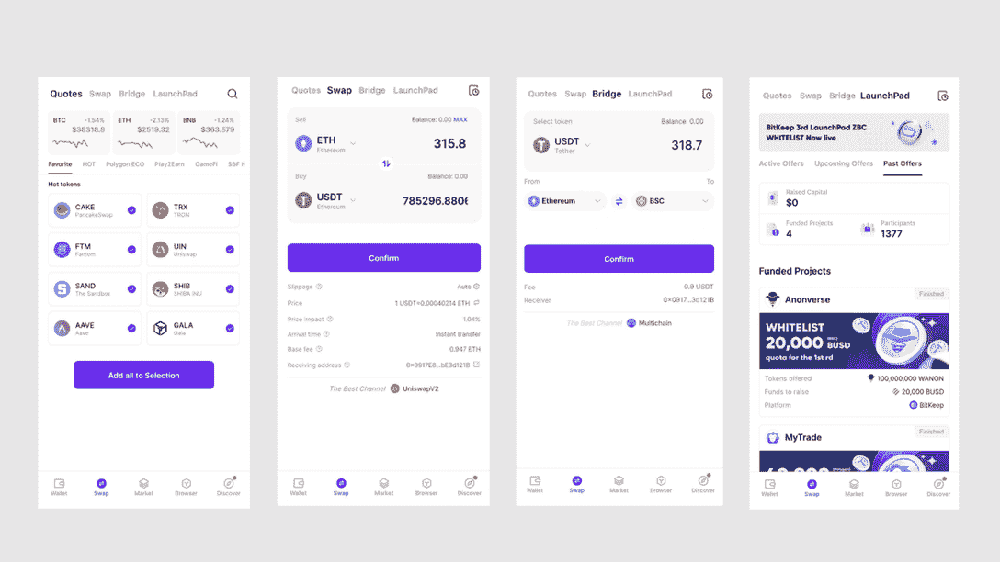
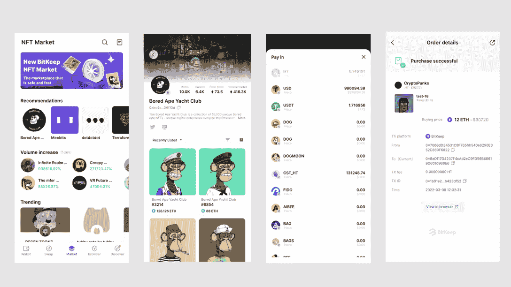
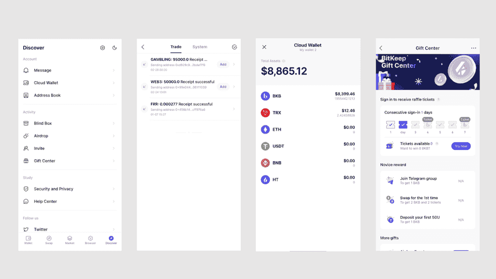

# 使用 BitKeep Wallet 在 40 多个区块链顺利交易代币

> 原文：<https://web.archive.org/web/https://dappradar.com/blog/trade-tokens-across-40-blockchains-smoothly-with-bitkeep-wallet>

## BitKeep 是一个一站式加密资产交易平台

**BitKeep 以全新的面貌正式推出支持跨 40 多个区块链代币交易的 BitKeep Wallet V.7.0。升级版本进一步为用户提供了直观的可视化、更多的交换选项、全新的 NFT 市场、dapp 发现工具等等。**

根据[chain analysis《2021 年全球加密货币采用指数报告》，](https://web.archive.org/web/20221127143458/https://blog.chainalysis.com/reports/2021-global-crypto-adoption-index/)亚洲国家是最积极采用加密货币的国家。在加密采用指数最高的前 20 个国家中，有 7 个亚洲国家，其中越南排名第一。这种高采用率导致了亚洲加密货币行业的激烈竞争。

BitKeep 从亚洲起步，目前为超过 168 个国家的超过 5，000，000 名用户提供服务，作为业界顶级的加密资产管理解决方案，BitKeep 不断创新。以成为世界领先的加密钱包为愿景，BitKeep 努力构建一个广泛的加密货币网络，以全方位支持用户体验。BitKeep 的交易平台支持最具潜力的区块链生态系统，包括[和谐](https://web.archive.org/web/20221127143458/https://dappradar.com/rankings/protocol/harmony)、[仲裁](https://web.archive.org/web/20221127143458/https://dappradar.com/ethereum/other/arbitrum)、[蜡](https://web.archive.org/web/20221127143458/https://dappradar.com/rankings/protocol/wax)、[近](https://web.archive.org/web/20221127143458/https://dappradar.com/rankings/protocol/near)、乐观等等。

BitKeep 已经实现了几个里程碑，最近完成了一次关键的平台升级，并在其生态系统中添加了一个全新的 NFT 市场。在今天的文章中，让我们深入了解 BitKeep 7.0 的全新用户界面(UI)和增强的用户体验(UX)。

[https://web.archive.org/web/20221127143458if_/https://www.youtube.com/embed/FskRmYjXqbY?feature=oembed](https://web.archive.org/web/20221127143458if_/https://www.youtube.com/embed/FskRmYjXqbY?feature=oembed)

## BitKeep 外观新颖的用户界面

随着应用程序可用于 iOS 和 Android 设备，以及 Chrome 的扩展，BitKeep 的全新用户界面允许用户直观地了解他们的加密资产组合。但是，更重要的是，它确保用户永远不会在庞大的 BitKeep dapp 生态系统中迷失，瞬间满足你的需求。

## 增强的钱包功能

BitKeep 旨在为用户提供最便捷的交易加密资产的体验，同时保护用户的隐私和资产安全。升级后的 BitKeep 钱包为用户提供以下功能:

*   交易令牌来自 40+主链及其 dapps，包括 ETH、BSC、Polygon、OEC、AVAX-C、TRON、Solana 等。
*   允许用户用一个账户管理多个连锁店的资产。
*   只需轻轻一点，即可在不同的 dapps 间导航。

支持十多种语言，包括中文、英文、韩文、日文、西班牙文、阿拉伯文、越南文、土耳其文等。

## 轻松交换代币

交换部分由四个主要功能组成:报价、交换、桥接和启动板。

*   Quotes 是一个全面的实时市场数据中心，通过数据可视化为交易者提供 200，000+令牌的最新见解。
*   Swap 为用户提供跨十个链的令牌交换功能，包括 ETH、BSC、Solana、Polygon、OEC、TRON、AVAX、Arbitrum、Optimis 和 Fantom。值得一提的是，用户可以在任意两个令牌之间进行跨链互换。随后，Swap 将支持跨 26 种协议的令牌交换，包括 Uniswap、SushiSwap、BabySwap 和 Pancake。
*   BitKeep 正在创建全球最具包容性的分散加密市场。当前版本的 Bridge 支持七种常用的桥，包括 BK 桥、币安桥和 SWFT。
*   Launchpad 是用户可以探索有前途的早期项目的地方。这些项目包括 BitKeep 孵化的项目和第三方的特色项目。

## 新推出的 NFT 市场

BitKeep 全新的 NFT 市场旨在通过高品质的 NFT 艺术品和收藏品连接 NFT 创作者和收藏家。以灵活性和多功能性为核心，BitKeep 的团队建立了 NFT 市场，作为一个一站式平台，以 360 度满足创作者和收藏家的需求。最值得注意的是，用户可以选择钱包中的任何代币/硬币来支付 NFTs。此外，NFT 市场通过显示最新的 NFT 最大赢家排名来帮助用户跟上市场趋势。

## 发现机会

Discover 集成了包括消息、云钱包、帮助中心、礼品中心、盲盒和 Airdrop 在内的功能。这些功能将帮助您熟悉 BitKeep 的功能，并享受该平台令人惊讶的额外待遇。例如，用户可以在帮助中心找到各种信息图表教程，以学习安全交易加密资产。而且礼品中心有奖励机制，让用户发现会员福利和奖金。

BitKeep V7.0 的成功推出标志着 BitKeep 上线以来最重要的里程碑之一。更重要的是，它反映了团队对不断交付健壮的 UX 和流畅的用户友好的无缝 UI 设计的最大承诺。随着区块链生态系统以前所未有的速度扩张，很明显，加密钱包已经成为用户进入加密世界的重要门户，而不是简单的资产管理工具。考虑到这一点，BitKeep 将继续发展，以满足 Web3 时代用户的多样化需求。

**链接**

[网站](https://web.archive.org/web/20221127143458/https://bitkeep.com/)
[推特](https://web.archive.org/web/20221127143458/https://twitter.com/BitKeepOS)
[不和](https://web.archive.org/web/20221127143458/https://discord.com/invite/gUQB7gUarR)
[电报](https://web.archive.org/web/20221127143458/https://t.me/bitkeep)
[脸书](https://web.archive.org/web/20221127143458/https://www.facebook.com/BitKeep/)
[insta gram](https://web.archive.org/web/20221127143458/https://www.instagram.com//bitkeep_global/)
[YouTube](https://web.archive.org/web/20221127143458/https://www.youtube.com/channel/UCD2S03RS-Q08VdJqZpuOCFQ)

**免责声明** —这是一篇赞助文章。DappRadar 不认可本页面上的任何内容或产品。DappRadar 旨在提供准确的信息，但读者应该在采取行动之前总是自己做研究。DappRadar 的文章不能被认为是投资建议。