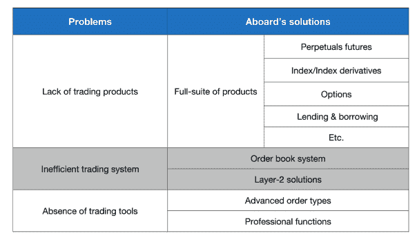

# Arbitrum 上的交易平台增强了加密衍生品的采用

> 原文：<https://web.archive.org/web/https://dappradar.com/blog/trading-platform-aboard-enhances-crypto-derivative-adoption-on-arbitrum>

## 满足不同衍生品投资者需求的订单式分散交易所

船上为加密衍生品提供一体化的分散式交易所，为用户提供高效的交易系统和先进的智能工具。通过其服务，Aboard 希望让投资者更容易交易和投资加密衍生品，所有这些都由以太坊第二层解决方案 Arbitrum 提供支持。

密码行业见证了对衍生品兴趣的激增。然而，现有的交易所未能为投资者提供各种交易产品。此外，市场迫切需要更高效的交易系统和先进的交易工具。为了进一步释放这个充满希望的市场的潜力，Aboard 推出了一个整合了各种智能工具的综合交易平台。

要了解国外提供什么，先说加密衍生品。衍生工具是一种金融工具，其价值来自基础资产。因此，衍生品通过提高基础资产的流动性和为投资者提供各种对冲风险的方式，在全球金融市场中发挥着至关重要的作用。据估计，这一巨大部分的高端价值超过 1 千万亿美元。 [根据期货行业协会](https://web.archive.org/web/20221007082845/https://www.fia.org/resources/global-futures-and-options-trading-hits-another-record-2021)的数据，2021 年是全球交易所交易的衍生品市场连续第四年创下与上年相比的新高。

由于区块链技术，个人和机构投资者受益于各种新兴的金融工具，加密衍生品就是其中之一。同样，加密衍生品为市场提供了更多的流动性，并允许投资者对冲他们的头寸。人们对加密衍生品的兴趣激增，2020 年上半年，场外衍生品的总市值达到 15.5 万亿美元。

区块链的优势，包括去中心化、透明度和无障碍交易，吸引了许多投资者进入加密领域。然而，为了更好地促进分散融资，支撑这些活动的基础设施仍然需要不断成熟。具体来说，现有的指数面临三大问题:缺乏交易产品，交易系统效率低下，缺乏交易工具。

第一，现有的去中心化衍生平台大多只提供永续产品，不足以让专业交易者应用各种投资策略。

其次，大多数 DeFi 衍生品交易所都是建立在 AMM(自动做市商)基础上的。尽管 AMM 在去中心化方面很有效，但它也有滑点、非永久性损失、延迟和超前交易的问题。随后，由于交易过程中的过度随机性，对 AMM 进行交易甚至回测对于量化策略来说是不可行的。最后，分散的衍生品交易所没有提供多样化的专业工具箱，而这对于复杂的衍生品交易来说是必不可少的。

针对上述市场需求，国外推出了一款一体机。船上交易所将把加密衍生品交易体验提升到一个全新的水平，具有全套产品、高效率和易于使用的工具。

## 加密衍生品交易的 360 度优化

凭借来自 TradFi 衍生产品和资产管理背景以及加密领域的团队，Aboard 对如何解决前面提到的加密衍生产品交易的三难问题有着深刻的理解。“上船”提供了一个潜在的解决方案，即创建一个分散的交易所，提供广泛的产品，提高效率，以及满足高级交易者需求的专业交易功能。

### 全套产品

船上将提供各种 DeFi 产品，包括代币永久债券、指数永久债券、期权、现货、保证金和借贷。

*   **永久和杠杆交易**-交易者可以在国外访问主流加密货币的永久合同，如 USDC 联邦理工学院、BTC USDC 大学、USDC 大学等。此外，高达 25 倍的杠杆和交叉保证金交易系统将允许用户最大限度地提高资本效率。

*   **指数和指数期货**——国外将推出一系列指数和配套的指数期货，以满足交易者对衍生品不同的需求。潜在指数将覆盖加密领域的核心部门，包括加密大型股指数、DeFi 指数、NFT 指数、SocialFi 指数、GameFi 指数和元宇宙指数。

上船将为用户提供一个多样化的工具箱，其中包含先进的订单类型和交易工具。除了基本订单类型，包括市价订单、限价订单、事后订单和止损订单，专业交易者还可以在船上使用各种高级订单类型进行交易。类型包括跟踪止损市场/限制，钉住，捕捉，条件，组合，对冲，批量，等等。

至于高级交易工具，上船将提供图书交易员，图表交易员，期权交易员，交易 API，风险控制器，投资组合监视器，等等。这些工具可以满足交易者更复杂的需求。例如，船上的交易 API 使 quants 能够实现算法或量化交易策略。

### 提高效率

船上的设计是高效和经济的。具体来说，船上采用订单系统。因此，习惯于集中交易的做市商和专业投资者会发现，转移到分散的订单簿交易会更容易。所以投资人加入平台开始交易几乎没有学习成本。此外，Aboard 是第二层解决方案的倡导者，目前已经部署在 Arbitrum Mainnet 上。这种方法大大降低了交易成本，从而从本质上增加了交易者的利润。

## 革命咨询协议

该咨询协议彻底改变了传统金融，取消了所有中介机构，直接将加密基金投资者与基金经理联系起来。最重要的是，该协议是透明和不可改变的。

它是如何工作的？秉承“代码即法律”的理念，on board 利用智能合约技术打破传统基金管理的低效工作流程。有了智能合约，投资者和基金经理只需在没有第三方参与的情况下签署电子协议，或者支付托管费，就可以建立联系。

## ABE Token 及其使用方法

如果没有本地的 ABE 令牌,“上船”就不会存在，ABE 令牌是一个治理和实用令牌。因此，ABE 有两个主要功能。首先，安倍提高了流动性，增强了网络效应。第二，ABE 是一种奖励和治理的象征，以促进船上的分散治理和激励社区。简而言之，交易员可以通过以下五种方式使用 ABE token:

*   **交易费用抵消**-参与者可以持有 ABE 代币，以获得与持股比例成比例的交易费用抵消。
*   **投票权**–安倍代币持有人拥有与其持股比例成比例的加权投票权。
*   **贸易开采**–持有者可以将代币投入赌注池以获得回报。此外，ABE 对那些提供流动性或在船上交易的人也是一种激励。
*   **咨询协议和费用**–参与者可以下注 ABE 代币来解锁咨询协议功能。而且用户可以用 ABE 支付资产管理费。
*   **使用专业功能**–参与者可以通过 ABE 体验高级功能，如风险控制和投资组合管理。

加密货币交易在机构和散户投资者中越来越受欢迎。但是，如果没有可靠的基础设施，衍生品市场的发展可能会停滞。健康的金融体系需要有效配置资本和流动性。有了这个平台和多元化的产品，我们有理由相信衍生品市场将会有一个更有活力的未来。

## 未来在船上

加密衍生品交易在机构和散户投资者中越来越受欢迎。然而，没有可靠的基础设施，衍生品市场的大规模采用可能会停滞不前。众所周知，资本配置效率和流动性是衡量一个健康金融体系的关键因素。随着海外交易所及其多样化产品的出现，加密衍生品市场必将迎来一个充满活力的未来。

**关于上船的更多信息**

出国访问:[https://www.aboard.exchange/](https://web.archive.org/web/20221007082845/https://www.aboard.exchange/)

中**:**【https://medium.com/@Aboard.Exchange】T2

推特[https://twitter.com/AboardExchange](https://web.archive.org/web/20221007082845/https://twitter.com/AboardExchange)

不和:[https://discord.com/invite/n7r73ehJtf](https://web.archive.org/web/20221007082845/https://discord.com/invite/n7r73ehJtf)

**免责声明** —这是一篇赞助文章。DappRadar 不认可本页面上的任何内容或产品。DappRadar 旨在提供准确的信息，但读者应该在采取行动之前总是自己做研究。DappRadar 的文章不能被认为是投资建议。