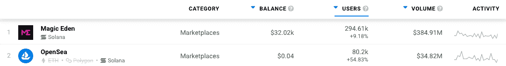

# 交易 Solana NFTs–魔法伊甸园 vs. OpenSea

> 原文：<https://web.archive.org/web/https://dappradar.com/blog/trading-solana-nfts-magic-eden-vs-opensea>

## 茄果类非交易市场二级市场的比较研究

Solana NFTs 正在稳步占领这个领域，尽管它们还没有达到以太坊区块链的收藏量。考虑到这种不断上升的人气，我们决定看看两个最受欢迎的 Solana NFTs 市场——Magic Eden 和 open sea——的利弊。

你在寻找下一部 NFT 大片吗？看看新的 NFT 探险家帮助您的搜索！

**概要:**

*   索拉纳 NFT 最近风靡一时，像 OkayBears 这样的项目抢尽了风头
*   magic Eden vs . OpenSea——列表、费用、易用性，以及关于这两个平台你需要知道的一切

## 索拉纳 NFTs 占据中心舞台

当 NFT 空间在以太坊上蓬勃发展时，其他区块链正在加快步伐，提供有竞争力的交易环境和低得多的汽油费。随着 NFT 爱好者奔向链条上的新项目，索拉纳在这场比赛中大放异彩。

Solana NFTs 最近最令人印象深刻的成功之一是 OkayBears 系列。它席卷了 NFT 市场，超过了所有连锁品牌，如 Bored Ape Yacht Club、Axie Infinity 和 CryptoPunks。

你可以在这里阅读我们详细的 OkayBears 报告。

考虑到这类项目的名气越来越大，Solana NFTs 正在获得牵引力。越来越多的用户转向高吞吐量和低汽油费的区块链寻找他们下一个最喜欢的收藏品。这就产生了一个问题，Solana NFTs 的顶级市场是哪些？答案很简单——魔法伊甸园和开放海洋。

## 魔法伊甸园大战开放海

### 入门指南

开始使用 Magic Eden 和 OpenSea 非常简单。您需要连接您的钱包，以便平台能够查看您当前的 NFT 投资组合。如果你想购买新的 NFT，它们将进入那个钱包，如果你想出售你当前持有的一些，它们必须存储在连接的钱包中。

Magic Eden 支持 13 个钱包提供商，包括 Phantom、Solflare、Solet 和 Exodus。另一方面，OpenSea 坚持更传统的选择 Metamask、Wallet Connect、Phantom 和 Glow。

这两个平台都有一个简单明了的用户界面，只需点击几下鼠标，你就可以在几秒钟内链接你的投资组合。然而，如果你正在寻找最终的 Solana 钱包品种，Magic Eden 在可用选择方面胜过 OpenSea。

### 购买索拉纳 NFTs

一旦你的钱包连接到二级市场，你通常有两条路可走——购买 Solana NFTs 或上市出售。先说采购。

魔法伊甸园有一个非常简单的购买结构。但是，用户需要钱包里有足够的资金。虽然 OpenSea 支持通过 Moonpay 进行卡支付，但 Magic Eden 完全是 web3，只允许客户使用钱包中已经存在的加密支付。

值得注意的是，Magic Eden 的交易费为 2%，而 OpenSea 的交易费为 2.5%。由于两个市场都促进了索拉纳区块链的交易，与购买相关的汽油费相对较低，约为 0.00001 索尔，或不到 0.01 美元。

### 上市和销售 Solana NFTs

在 Magic Eden 和 OpenSea 上列出和出售你的 Solana NFTs 并不太麻烦。一旦你的钱包连接到你选择的平台，你就可以决定你想要出售的收藏品。

魔术伊甸园不收取任何额外的费用上市或退市。当然，物品出售时 2%的交易费仍然存在，这实际上是你通过平台上市和销售 NFTs 时唯一欠 Magic Eden 的东西。重要的是，创作者的费用，或版税，也将从你的 NFTs 的销售价格中扣除，每次他们转换所有者。

OpenSea 的功能也是如此。虽然以太坊 NFT 在 OpenSea 上的销售需要验证和更高的汽油费，但其 Solana beta 版本将这些成本降至最低。你每卖出一笔，平台交易费就剩 2.5%。此外，创作者版税也从最终售价中扣除。

这两个平台都允许艺术家和创作者设定自己的版税比例。

### 拍卖

这是一个由 Magic Eden 和 OpenSea 提供的独立销售机制。拍卖功能允许卖家不对他们的 NFT 设定固定价格，而是邀请竞标者说出他们愿意为这件作品支付的价格。

这两个市场都有拍卖结构，允许卖家为他们的 NFT 创建现场投标竞争。重要的是，如果你在拍卖中出价，你需要在你的钱包中准备好你准备支付的 SOL 代币的数量，因为它们被放在一个托管钱包中，直到拍卖完成。如果有人出价比你高，你的 SOL 会回到你的钱包里。

### 表演

根据 DappRadar 的数据，Magic Eden 和 OpenSea 是 Solana NFTs 的主要二级市场。Magic Eden 排名第一，在过去三十天内注册了近 30 万个独特的活动钱包。

OpenSea 紧随其后，位居第二，在过去的一个月里，有超过 80，000 个独立的活动钱包注册。然而，需要注意的是，OpenSea 的 Solana 集成仍处于测试阶段。

## 简而言之，魔法伊甸园大战开放海

|  | **魔法伊甸园** | **OpenSea** |
| 钱包
支持 | – 13 Solana wallets
– Phantom
– Solflare
– Solet
– Exodus | –2 个 Solana 钱包
–幻影
–发光 |
| 交易
费用 | –对所有
交易收取 2%的费用 | –对所有
交易收取 2.5%的费用 |
| 拍卖支持 | 是的 | 是的 |
| 每月索拉纳
用户 | 每月约 30 万 UAW
 | 每月约 80，000 UAW
 |

Magic Eden 和 OpenSea 在索拉纳 NFT 领域占据主导地位，在 DappRadar Solana Marketplaces 排行榜上一直名列前茅。如果你想密切关注这些顶级演员，可以查看他们的官方 dapp 页面:[魔法伊甸园](https://web.archive.org/web/20220719081026/https://dappradar.com/solana/marketplaces/magic-eden)和[开放海洋](https://web.archive.org/web/20220719081026/https://dappradar.com/multichain/marketplaces/opensea)。此外，你可以在 Twitter[上关注 DappRadar](https://web.archive.org/web/20220719081026/https://twitter.com/dappradar)以获得最新的对比评论和 NFT 更新。

 NewsletterUnsubscribe at any time. [T&Cs](https://web.archive.org/web/20220719081026/https://dappradar.com/terms) and [Privacy Policy](https://web.archive.org/web/20220719081026/https://dappradar.com/privacy-policy)