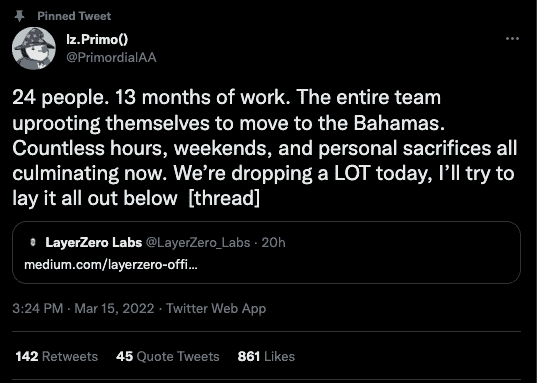
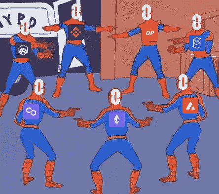
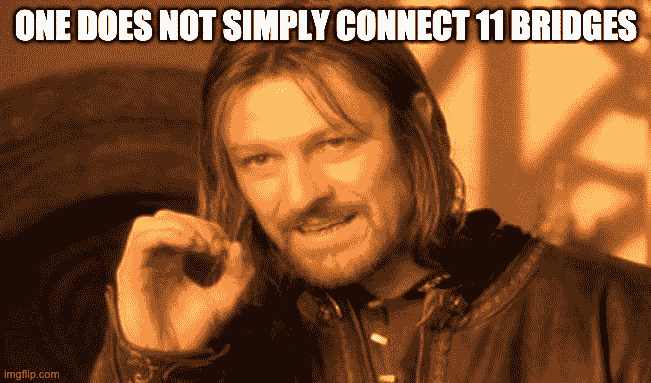
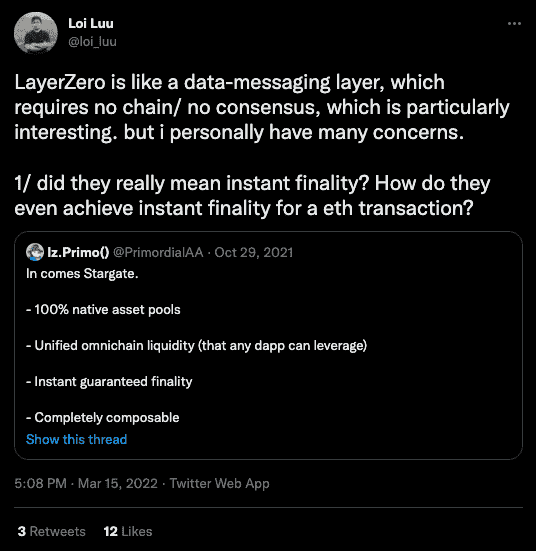

# 使用 LayerZero & Stargate 在一次交易中跨多个区块链传输加密

> 原文：<https://web.archive.org/web/https://dappradar.com/blog/transfer-crypto-across-multiple-blockchains-in-one-transaction-with-layerzero-stargate>

## 在一次交易中完成跨多个区块链的多项交易

互操作性平台 LayerZero 正准备推出 Stargate，这是一种无缝高效地在不同区块链之间交换令牌的协议。Stargate 将在 3 月 17 日开始的象征性销售后上线。象征性出售将在七个区块链产生所需的流动性。

星际之门协议是建立在 LayerZero 协议之上的一个应用程序，用于在多个区块链之间转移资金。它将与现有的多链令牌桥接项目竞争，如 Hop Protocol、Connext、multichain 和 Synapse。它现在在以太坊，雪崩，多边形，BNB 链，Fantom，Arbitrum 和乐观上直播。计划在未来 6 到 8 周内增加 Solana、Terra、Cosmos Hub 和 Osmosis。LayerZero 团队还获得了 SushiSwap 联合创始人 Maki 的帮助，以及他在业务发展领域的人脉。

## 星际之门是如何工作的？

假设您想要将一系列复杂的交易捆绑在一起，可能是 un stake-> swap-> initiate bridge-> claim bridge-> swap-> stake。所有这些都在一次交易中完成。用户只需要连接到源链，并且只需要在源上拥有资产。更简单地说，用户将能够在一个交易中对多个链进行[多个操作。](https://web.archive.org/web/20220925075131/https://www.youtube.com/watch?v=JFnF1dgbF00)

这意味着用户基本上看不到令牌桥，多链活动变得像与一个链交互一样简单。可以说，这项技术加上更好的支持原生多链的钱包，可以让多链体验类似于只使用一条链。

## 用例

今天，跨链消息传递是桥接的同义词，但是除了简单地桥接资产之外，LayerZero 还可以做更多的事情。LayerZero 支持跨链状态共享、桥接、借贷、互换、治理等等。

SushiSwap 就是一个很好的例子，它存在于 12 个不同的区块链上，每个版本都在其筒仓中运行。如果他们想与中央以太坊实例同步，开发人员必须使用虫洞、彩虹桥、多边形网桥、雪崩桥等编写代码。结果是十一个代码集，有十一个独特的接口和十一个不同的安全属性。由于桥梁和新 L1/L2 的生态系统在不断变化，这种方法是不可持续的。

使用 LayerZero，SushiSwap 将为所有跨链对提供一个单一的接口和代码库。SushiSwap 开发人员只需要实现发送和接收功能。

## 统一流动性桥梁

如今，桥梁竞相吸引流动性提供者(LP ),这些流动性提供者在桥梁和它们的池之间分割流动性。有限合伙人必须选择一个连接到一条链的单一资金池，而不是用一个资金池为所有连接的链提供流动性。

LayerZero 实现了跨所有链的统一流动性，并保证了源链的终结性。当用户将资产从链 A 转移到链 B 时，用户在链 B 上的资产得到保证，并且 LP 提供商从链 B 的所有传入交易中收取费用，而不管来源链如何。

## 代币互换

现有的令牌交换平台可以包装令牌以执行从一个资产到另一个资产的跨链交换，而无需修改任何现有代码。用户将从以太坊上的 ETH 转换到 SOL Solana，只需一次来自源代码链的交易。

## 放款与借款

目前，如果用户在链 A 上有资金，但想在链 B 上耕种，用户将不得不在链 A 上抵押、借款、过桥、互换、在目的链上耕种、交换回来、过桥回来、偿还贷款和取消抵押。大多数步骤会产生费用，这些费用会不断累积。有了 LayerZero，你可以在 A 链上抵押，在目的链上借款，耕种，偿还，抵押品被解锁，跳过了四个桥接和交换费用。

LayerZero 将无缝连接区块链，用户甚至不会意识到他们正在使用它。此外，它将使 dapps 能够扩展到 EVM 或非 EVM 发展的边界之外，从而创建世界上第一个全链应用程序。

## 星际之门真的有可能吗？

虽然 LayerZero 和在一个交易中跨多个链执行活动的前提令社区兴奋，但其他人对底层技术栈持怀疑态度。Twitter 用户 Loi Luu 是 Kyber 的联合创始人，他很快就试图解决可能出现的问题。

LayerZero 实验室的联合创始人兼首席执行官，在 Twitter 上被称为 [lz。Primo()](https://web.archive.org/web/20220925075131/https://twitter.com/PrimordialAA/status/1503750548142575624) 很快回应了对最终结果的担忧。在答复中指出，Loi Luu 混淆了即时终局性和即时终局性保证。此外，不存在交易无法在目的地链上完成的情况，也不存在交易没有足够的资本来满足来自来源链的请求的情况。

多链范式是 DappRadar 一段时间以来一直倡导和信奉的东西。现在，用户将执行复杂的跨链交易，而不会遇到使用多个区块链带来的麻烦，这一想法可能会使该行业向大规模采用又迈进了一步。观察 LayerZero 和 Stargate 的成功将会非常有趣。此外，观察从 3 月 17 日开始的代币销售进展将会非常有趣。

[了解更多关于 LayerZero 和 Stargate 的信息](https://web.archive.org/web/20220925075131/https://layerzero.gitbook.io/docs/)

 NewsletterUnsubscribe at any time. [T&Cs](https://web.archive.org/web/20220925075131/https://dappradar.com/terms) and [Privacy Policy](https://web.archive.org/web/20220925075131/https://dappradar.com/privacy-policy)

***以上不构成投资建议。此处给出的信息仅供参考。请行使尽职调查，做你的研究。作者持有多种加密货币的头寸，包括 BTC、ETH 和 RADAR。***