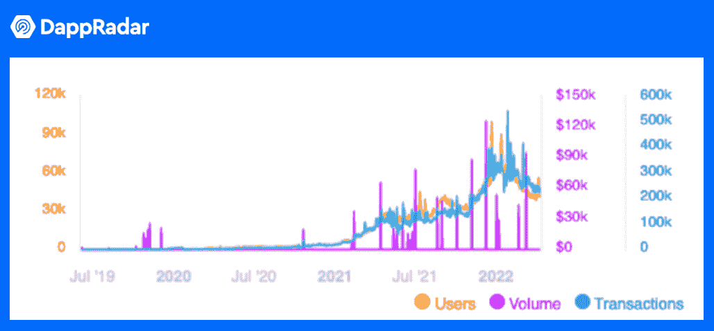
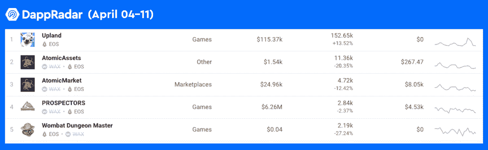
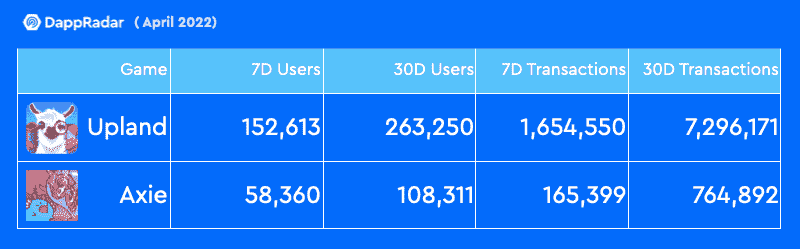

# 交通和商业丰富了元宇宙高地的生态系统

> 原文：<https://web.archive.org/web/https://dappradar.com/blog/transport-businesses-have-enriched-the-upland-metaverse-ecosystem>

## 高地是一个受欢迎的元宇宙房地产交易游戏，每月活跃用户超过 60 万

新交通系统和业务的引入彻底改变了元宇宙高地的房地产交易游戏。每天有超过 100，000 名用户，EOS 区块链上的游戏 dapp 总是位于图表的顶部。

**这是加入元宇宙的最佳时机:** [**使用此链接申领双倍的 6000 UPX 注册奖金**](https://web.archive.org/web/20221004142518/https://discover.upland.me/dappradar_2022) **。**

**概要:**

*   Upland 引入 M Motors 和 Metaventures(用户创建的商店)来丰富其未来的元宇宙生态系统和游戏性。
*   **高地是顶级游戏 dapp 生活在**[**EOS 区块链**](https://web.archive.org/web/20221004142518/https://dappradar.com/rankings/protocol/eos) **上。**
*   [**游戏**](https://web.archive.org/web/20221004142518/https://dappradar.com/eos/games/upland) **自 2019 年以来取得了突出的数据里程碑，包括 252，594 个业主和 2，883，723 个铸造的物业。**
*   [**在最近的用户和交易数量方面，高地也超过了 Axie Infinity**](https://web.archive.org/web/20221004142518/https://dappradar.com/rankings/category/games) **。**

## 元宇宙高地揭开新篇章

Upland 于 2019 年在 EOS 上首次亮相，将一款类似大富翁的棋盘游戏变成了区块链本土游戏。像所有其他“玩赚”游戏一样，Upland 利用不可替换令牌(NFT)来授予玩家对其游戏内资产的所有权。

值得注意的是，自成立以来，Upland 的用户群一直在稳步增长。2021 年 2 月，游戏单日用户数首次突破 1 万。从那以后，这个数字已经飙升到六位数以上，并且还在继续增长。此外，2021 年 11 月，随着 Metaventures 的引入，Upland 的玩家驱动型经济得到了更新。这一消息将游戏的用户群推至近 60 万 MAU(月活跃用户)，并一直维持至今。

在撰写本文时，该游戏有 65，204 名用户在过去 24 小时内玩过该游戏。Upland 的走红离不开另一个重要项目 M Motors。这个项目自 3 月以来取得了重大进展，进一步提高了玩家对高地的预期和机会。

### m 电机

[元宇宙汽车公司(“M 汽车公司”)](https://web.archive.org/web/20221004142518/https://www.upland.me/m-motors)是高地的汽车品牌，将在加州圣克拉拉的旗舰展厅推出。这些汽车将为高地庞大的新交通系统提供动力。玩家很快就可以利用他们的 NFT 汽车组合参与运输货物、拼车、赛车等活动。

[https://web.archive.org/web/20221004142518if_/https://www.youtube.com/embed/b7J2z6s2tbE?feature=oembed](https://web.archive.org/web/20221004142518if_/https://www.youtube.com/embed/b7J2z6s2tbE?feature=oembed)

### 元风险投资

[Metaventures](https://web.archive.org/web/20221004142518/https://www.upland.me/metaventures) 实现玩家成为企业家的梦想。在 Metaventures 中，玩家可以拥有和经营店铺，按照自己的意愿设计商业模式。此外，强大的经济模式将允许元宇宙企业家塑造新的经济，并为 Upland 的支柱“赚取”价值带来活力:玩、赚和连接。

[https://web.archive.org/web/20221004142518if_/https://www.youtube.com/embed/hpY-EbSU3wc?feature=oembed](https://web.archive.org/web/20221004142518if_/https://www.youtube.com/embed/hpY-EbSU3wc?feature=oembed)

年轻一代可能会在现实生活中努力获得梦想中的房产。然而，元宇宙的情况有所不同。虚拟财产的繁荣使千禧一代成为百万富翁和房地产大亨。

生活在 [EOS 区块链](https://web.archive.org/web/20221004142518/https://dappradar.com/rankings/protocol/eos)上的冠军 dapp Upland，是一款从玩到赚的财产交易游戏，反映了现实世界的地理位置。玩家已经支付了巨额财富来抢购大片虚拟土地，押注未来的曼哈顿、洛杉矶和旧金山，但没有任何实体形态。

## 对高地繁荣经济的近距离观察

高地是增长最快的游戏 dapp 之一，在 EOS dapp 排行榜上名列前茅。这款游戏以类似大富翁的游戏方式描绘了真实世界。这使得理解玩家在高地需要做什么变得相当容易。然而，这个游戏不仅仅是大富翁的一个版本。此外，Upland 还提供了“玩到赚”机制，玩家可以使用游戏内的代币 UPX 进行交易，以铸造可在市场上以美元和 UPX 进行交易的非货币券。

因此，高地精心设计的游戏玩法和游戏经济赢得了许多游戏玩家的心。自 2019 年以来，该游戏获得了巨大的人气。让我们深入研究一下 Upland 的数据性能，以了解这款游戏有多成功。高地在游戏中有多达 252，000 个财产所有者，铸造了 2，883，723 个财产。除了财产，其他铸造 NFT 资产的数量，包括探险家，NFLPA 球员合法，精神万圣节合法，和结构装饰品 NFT，是 905，831，其中 20，077 是独特的 NFT。最重要的是，这款游戏为玩家带来了超过 280 万美元的累积财富。

此外，Upland 的游戏内资产交易火爆，反映出该游戏享有非常高的用户参与度。从数据角度来看，Upland 的玩家在一级市场上产生了超过 260 万笔交易，每天 5962 分钟。二级市场总共记录了超过 190 万笔交易，平均每天 6701 笔交易。值得注意的是，高地房产的加价乘数为 3.58，这意味着高地房产在二级市场上的平均售价是其原价的 3.58 倍。

高地游戏经济蓬勃发展的另一个有力证据在于其本土标志 UPX 的数据表现。UPX 是高地的主要货币，也是高地经济的支柱。它通过各种工具赋予玩家力量。例如，UPX 可以用于铸造属性，在高地商店购买稀有和独特的 NFT，并为玩家的游戏内活动提供动力，如发送，市场交易等。目前，已经购买了 35，819，364，000 UPX，日均交易量为 143，426，855 UPX。

## Axie VS Upland

当我们谈论“玩即赚”游戏时，没有人会忘记先驱 P2E 游戏 [Axie Infinity](https://web.archive.org/web/20221004142518/https://dappradar.com/multichain/games/axie-infinity) 。然而，当我们将 Axie 最近的数字与 Upland 的数字进行比较时，我们发现 Upland 的在某些方面优于 Axie。虽然直接比较 Axie 和 Upland 是不公平的，但由于每个游戏都有其独特的游戏性和经济性，希望这有助于解释 Upland 的吸引力。下表显示了过去 30 天内用户和交易数量的差异。

作为一款元宇宙游戏，虚拟财产为 Upland 的游戏性发展成为一个动态的虚拟世界奠定了坚实的基础。更令人兴奋的新功能即将来到高地的元宇宙。了解有关高地的更多信息:**这是加入元宇宙的最佳时机:** [**使用此链接申领翻倍的 6，000 UPX 注册奖金**](https://web.archive.org/web/20221004142518/https://discover.upland.me/dappradar_2022) **。**在 [Twitter](https://web.archive.org/web/20221004142518/https://twitter.com/UplandMe) 或 [Discord](https://web.archive.org/web/20221004142518/https://discover.upland.me/discord) 上加入他们的社区。高地还在 Reddit、脸书、YouTube、Twitch 和 Telegram 上保持着一席之地。

**免责声明** —这是一篇赞助文章。DappRadar 不认可本页面上的任何内容或产品。DappRadar 旨在提供准确的信息，但读者应该在采取行动之前总是自己做研究。DappRadar 的文章不能被认为是投资建议。