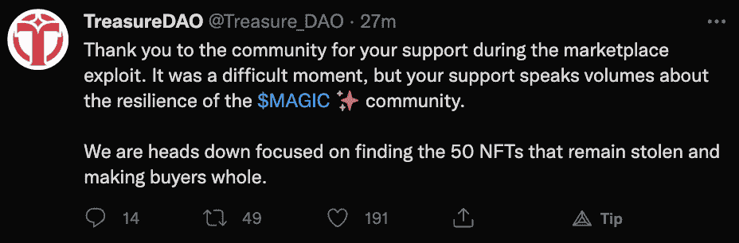
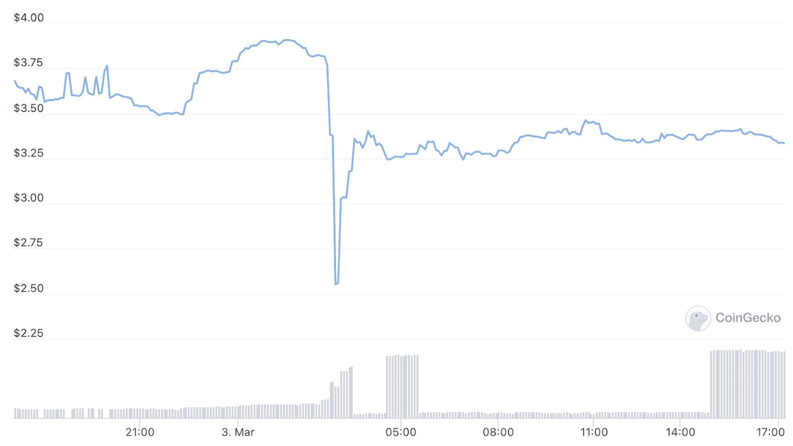

# 宝岛市场遭受攻击，153 个 NFT 被盗

> 原文：<https://web.archive.org/web/https://dappradar.com/blog/treasauredao-marketplace-suffers-exploit-153-nfts-stolen>

## 一个漏洞允许黑客购买 0 魔法的 NFTs

总部位于 Arbitrum 的 treasury Dao NFT 市场遭受了一次攻击，允许黑客购买非功能性金融工具，而无需花费任何魔法令牌，实际上是窃取了它们。这一漏洞被 NFT 爱好者在 Twitter 上发现，宝岛迅速着手补偿受影响的用户。

据虚拟世界 Isolite 背后的[团队称，市场上总共有 153 台 NFT 被盗。他们中的大多数属于 Smol Brains 集合，这是平台上最昂贵的项目。在撰写本文时，最便宜的斯莫尔大脑 NFT 售价 2469 英镑，约合 8400 美元。](https://web.archive.org/web/20221222215620/https://twitter.com/isotile)

在漏洞被揭露大约 24 小时后，TreasureDAO 分享了一个感谢的帖子，宣布只有 50 个 NFT 仍然需要被找到并希望被归还。TreasureDAO 团队迅速关闭了允许该漏洞的智能合同，成功地限制了用户遭受的损害。

## 为什么宝岛市场会出现这种情况？

一个 [Crypto Twitter 深度挖掘](https://web.archive.org/web/20221222215620/https://twitter.com/edgar_eth/status/1499181117169094656)显示，宝岛市场用户开始注意到零价格交易离开了市场。在团队的努力下，用户发现平台的底层代码允许黑客以 0 MAGIC 的价格购买之前列出的 NFT。

根据 Isotile 团队的说法，代码的一个重要行中缺少了一个大于号。这实质上允许数量值为 0 的非功能性食物以同样的 0 魔法值出售。利用这个漏洞，黑客窃取了 112 个 Smol 大脑 NFT 和 41 个军团 NFT。

除了宝岛用户不得不承受的损失之外，这种漏洞利用还有另一个令人担忧的因素。宝岛市场是 Arbitrum 上最受欢迎的平台之一。这就是为什么许多开发者使用它的源代码来建立他们自己的 NFT 市场。考虑到这一点，这个 bug 也可能传播到其他平台。

此外，随着漏洞利用的消息在 Crypto Twitter 上传开，该平台的原生令牌 MAGIC 的估值出现了惊人的[下跌](https://web.archive.org/web/20221222215620/https://www.coingecko.com/en/coins/magic)。自那以后，代币有所回升。然而，与昨天同一时间相比，它的交易价格仍然明显较低。

DappRadar 将继续关注 NFT 空间，为您带来最新的销售数据和新闻。如果您想了解最新事件，请在 [Twitter](https://web.archive.org/web/20221222215620/https://twitter.com/dappradar) 上关注我们。此外，你可以查看[达普拉达 NFT 排名](https://web.archive.org/web/20221222215620/https://dappradar.com/nft)页面，找到最新的连锁销售数据。

 NewsletterUnsubscribe at any time. [T&Cs](https://web.archive.org/web/20221222215620/https://dappradar.com/terms) and [Privacy Policy](https://web.archive.org/web/20221222215620/https://dappradar.com/privacy-policy)