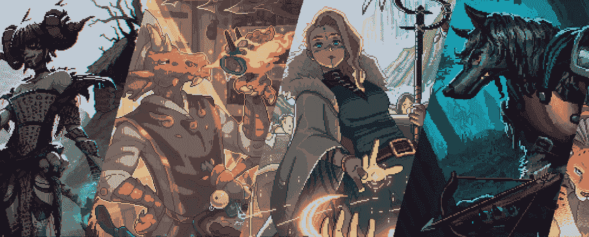

# 你可能错过的热门卡尔达诺游戏

> 原文：<https://web.archive.org/web/https://dappradar.com/blog/trending-cardano-games-you-probably-missed>

## 从虚拟世界到策略卡牌游戏，Cardano 上游戏 dapps 的快速概览

越来越多的游戏开发商采用快速增长的卡尔达诺区块链来增强他们游戏的功能。他们的目标是为全球数十亿游戏玩家创造一个公平透明的玩家经济。那么 Cardano 上有哪些潮流的 dapps 和游戏呢？

内容:

*   [聚宝盆元宇宙:增强真实感的 3D 平台游戏](https://web.archive.org/web/20221201130200/https://dappradar.com/blog/trending-cardano-games-you-probably-missed/#cornucopias)
*   [醉龙——史诗般的奇幻宇宙](https://web.archive.org/web/20221201130200/https://dappradar.com/blog/trending-cardano-games-you-probably-missed/#drunken)
*   [Dracards:一款战略交易纸牌游戏](https://web.archive.org/web/20221201130200/https://dappradar.com/blog/trending-cardano-games-you-probably-missed/#dracards)
*   帕维亚:乌托邦式的未来世界
*   [用 DappRdadar 跟踪快速生长的腰果生态系统](https://web.archive.org/web/20221201130200/https://dappradar.com/blog/trending-cardano-games-you-probably-missed/#track)

游戏行业是区块链上竞争最激烈的行业，占整个行业使用量的 50%以上。在 DappRadar 的游戏排名表上，随着顶级游戏激烈争夺更大的市场份额，月用户超过 10 万的 dapps 数量继续增长。要深入了解最新的区块链游戏市场表现，请阅读 DappRadar x BGA 游戏报告。

新游戏正在游戏空间中涌现，为众多分散式网络贡献了用例及新想法。DappRadar 跟踪了 50 多个网络，当然，我们也不能忽略最近对 Cardano 的大肆宣传。

卡尔达诺已经有了一个坚实的新游戏阵容，涵盖了各种类别。你可能错过了哪些比赛？别担心。我们已经为你准备好了一切。

## 聚宝盆的元宇宙:增强真实感的 3D 平台

[https://web.archive.org/web/20221201130200if_/https://www.youtube.com/embed/v52pdDdPzMw?feature=oembed](https://web.archive.org/web/20221201130200if_/https://www.youtube.com/embed/v52pdDdPzMw?feature=oembed)

聚宝盆'岛'是一个巨大的玩赚，建设赚，学习赚区块链游戏。它允许玩家拥有基于 NFT 的资产，赚取真实世界的价值，玩迷你游戏，并在一个虚幻的引擎驱动的元宇宙中相互交往。

“岛屿”由各种主题区域组成，如狂野西部、农场生活、武士时代等。这款壮观的 3D 平台游戏包含了增强真实感的所有元素，为游戏玩家带来梦想中的冒险。

此外，创作者和玩家将发现一种新形式的游戏内经济，赋予玩家更多权利。他们将因在游戏中的参与和创造而获得奖励。

在 Cardano 上查看更多 dapps。

## 醉龙——一个史诗般的幻想世界

凭借复古的视觉风格、史诗般的奇幻宇宙和引人注目的传说，《醉龙》想要重新定义奇幻游戏的范式。这款游戏的野心不仅仅是让玩家收集 NFT 冒险者和完成任务。

它提出了幻想专营权和知识产权管理的新的行业标准。为了做到这一点，醉龙正在精心制作一个由社区管理的全新的幻想专营权。这个开放的平台将邀请每个人贡献自己的知识、产品、商品等等。

[多亏了 Cardano](https://web.archive.org/web/20221201130200/https://dappradar.com/rankings/protocol/cardano) ,《醉龙》可以拥有去中心化的治理，社区金库管理，以及游戏内资产的自由市场。阿尔法版[已经上线](https://web.archive.org/web/20221201130200/https://www.drunkendragon.games/)。此外，你可以在 [JPG 商店获得冒险者 NFTs，游戏中的角色。](https://web.archive.org/web/20221201130200/https://dappradar.com/cardano/marketplaces/jpg-store)观看下面的视频，了解如何开始玩《醉龙》。

[https://web.archive.org/web/20221201130200if_/https://www.youtube.com/embed/vOfr-Tk1Az0?start=45&feature=oembed](https://web.archive.org/web/20221201130200if_/https://www.youtube.com/embed/vOfr-Tk1Az0?start=45&feature=oembed)

## Dracards:一种战略交易纸牌游戏

[https://web.archive.org/web/20221201130200if_/https://www.youtube.com/embed/ZKw_XH8CmaQ?feature=oembed](https://web.archive.org/web/20221201130200if_/https://www.youtube.com/embed/ZKw_XH8CmaQ?feature=oembed)

Dracards 融合了经典的交易纸牌游戏(TCG)和 NFT 驱动的即玩即赚游戏。此外，随着史诗般的幻想设置，每个德拉卡收藏品都有一个独特的故事，伴随着非凡的人物和情节。Dracards 团队旨在为收藏家、玩家和投资者构建一个包容性的生态系统。

值得注意的是，该游戏的特点是设计良好的游戏性。从升压包到不同的卡稀有和战斗节奏，它通过让玩家发现最佳策略来逐渐吸引玩家。

龙卡之火是龙卡生态系统的象征。持火人可以享受各种福利，例如通过下注令牌申领奖励，购买游戏内资产，以及参与投票决定游戏的新元素。

## 帕维亚:乌托邦式的未来世界

[https://web.archive.org/web/20221201130200if_/https://www.youtube.com/embed/EhHuP4Z-aDk?feature=oembed](https://web.archive.org/web/20221201130200if_/https://www.youtube.com/embed/EhHuP4Z-aDk?feature=oembed)

Pavia 的目标是将游戏和社交网络的乐趣与 Web3 的新数字所有权范式相融合。

在这个身临其境的、由社区构建的虚拟世界中，用户可以创建、玩、拥有并获得参与和贡献的回报。这个乌托邦式的未来世界邀请早期元宇宙开拓者在卡达诺生态系统中定居、建设和发展。

帕维亚由 10 万块 NFT 土地组成，更重要的是，它是一个创新社区。帕维亚成员坚信，元宇宙是由人民建设和拥有的。如果你响应这样的宣言，从 [JPG 商店](https://web.archive.org/web/20221201130200/https://dappradar.com/cardano/marketplaces/jpg-store)得到你的土地并开始贡献。

## 用 DappRdadar 追踪快速生长的 Cardano 生态系统

在 Vasil 升级之后，Cardano 正式进入了下一个阶段，拥有一个具有增强的可扩展性和事务吞吐量的生态系统。目前，超过 650 个项目正在利用 Cardano 提供更好的体验。

现在，用户可以使用 DappRadar 赶上 Cardano 网络的最新 dapp 景观。

[https://web.archive.org/web/20221201130200if_/https://www.youtube.com/embed/HSVvtpxWNWs?feature=oembed](https://web.archive.org/web/20221201130200if_/https://www.youtube.com/embed/HSVvtpxWNWs?feature=oembed)

如果您是 Cardano 社区的开发人员，并且想要向 DappRadar 的一百万用户展示您的伟大项目，请现在通过下面的链接向我们提交 dapp。

[<picture></picture>](https://web.archive.org/web/20221201130200/https://dappradar.com/rankings/category/games)[<picture></picture>](https://web.archive.org/web/20221201130200/https://dappradar.com/hub/nft-explorer)[<picture></picture>](https://web.archive.org/web/20221201130200/https://dappradar.com/blog/10-games-to-play-and-earn-for-less-than-10-dollars)

## 随身携带您的 Web3 之旅

使用 DappRadar 移动应用程序，再也不会错过 Web3。查看最受欢迎的 dapps 的性能，并关注您投资组合中的 NFT。您在 DappRadar 上的帐户会与我们的移动应用程序同步，这样您很快就可以选择实时接收提醒。

[Download the DappRadar app now](https://web.archive.org/web/20221201130200/https://dappradar.app.link/blog)[<picture></picture>](https://web.archive.org/web/20221201130200/https://play.google.com/store/apps/details?id=com.portfolio.dappradar)