# 流行的 Dapps–Cronos Chain DeFi，Play-to-Earn 游戏和热门动漫 NFT

> 原文：<https://web.archive.org/web/https://dappradar.com/blog/trending-dapps-cronos-chain-defi-play-to-earn-games-hot-anime-nfts>

## 流行 Dapps |第 6 周| 2022 年

****您的每周更新可以发现各种类别的新 dapps，包括 DeFi 和 yield 农场、NFT 市场和收藏，以及顶级的玩赚游戏。****

区块链充满了不断发展的 dapps。在 DappRadar，我们在 20 多个不同的区块链跟踪数以千计的人。每周，DappRadar 都会深入生态系统，发掘那些流行的、即将到来的、有趣的 dapps。无论是以太坊上的 DeFi、蜡上的 NFT 系列，还是币安智能链上的 yield farming，我们都能满足您的需求。

## 克罗诺斯链上的 DeFi & Yield 农业

本周，我们聚焦于以 DeFi 为中心，最近整合的 Cronos 网络，这是一个由非常受欢迎的 Crypto.com 交易所支持的 EVM 兼容网络。自 2021 年 11 月 Cronos Mainnet Beta 发布以来，该生态系统已经产生了越来越多的构建者和用户需求，经过一个月的发布，它已经是区块链总市值排名前 10 名的上市公司之一(TVL)。目前，超过 100 个 dapps 被部署并在 Cronos mainnet 测试版上运行，拥有超过 20 亿美元的 TVL 资金。

[<picture>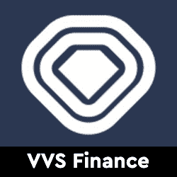</picture>](https://web.archive.org/web/20221006042212/https://dappradar.com/cronos/defi/vvs-finance)

*   VVS 旨在成为一个简单易用的 DeFi 平台，供用户交换代币，赚取收益
*   掌控您的财务，赢取 VVS 奖励

[<picture>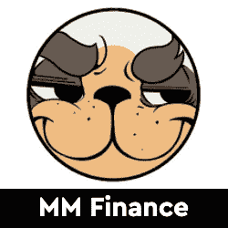</picture>](https://web.archive.org/web/20221006042212/https://dappradar.com/cronos/defi/mm-finance)

*   Cronos 链上的 AMM 和德克斯通过贸易采矿提供费用回扣
*   协议自有流动性(POL)

[<picture>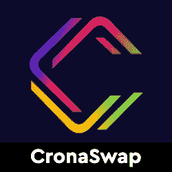</picture>](https://web.archive.org/web/20221006042212/https://dappradar.com/cronos/defi/cronaswap)

*   CronaSwap 的目标是成为 Cronos 上 DEX 平台的基准
*   交换和赢取代币
*   CronaSwap 的本机令牌是 CRONA

[<picture>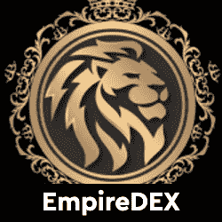</picture>](https://web.archive.org/web/20221006042212/https://dappradar.com/cronos/defi/empiredex)

*   EmpireDEX 是 Cronos 上的多链 DEX 协议
*   交易商在克罗诺斯交易代币的枢纽
*   代币互换和法明期权

[<picture>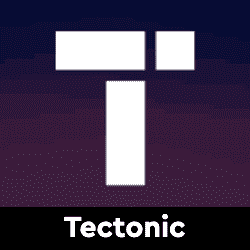</picture>](https://web.archive.org/web/20221006042212/https://dappradar.com/cronos/defi/tectonic)

*   Cronos 上的借贷平台
*   跨链货币市场
*   赚取被动收益并获得即时担保贷款
*   滋补治理令牌

[<picture>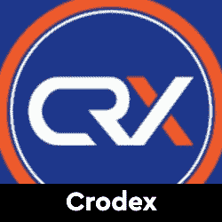</picture>](https://web.archive.org/web/20221006042212/https://dappradar.com/cronos/exchanges/crodex)

*   分散交换
*   在 Cronos 上提供流动性并实现点对点交易

## 玩赢游戏

游戏很有趣，但是区块链驱动的游戏给这种体验增加了一个全新的经济层面。突然你可以玩一个游戏并从中赚钱。并非所有游戏都有相同类型的财务激励，但当社区发展时，每一项区块链资产都会增值。以下是本周的六款游戏趋势。

[<picture>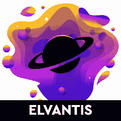</picture>](https://web.archive.org/web/20221006042212/https://dappradar.com/multichain/games/elvantis)

*   受元宇宙启发的在线 NFT 游戏
*   作为一名赏金猎人探索埃尔文蒂斯，或者潜入一个农场赚取物品，这些物品可以被送出去建立强大的联盟或者在市场上交易

[<picture>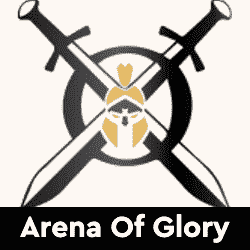</picture>](https://web.archive.org/web/20221006042212/https://dappradar.com/wax/games/arena-of-glory)

*   荣耀竞技场是一款在蜡像区块链上的 NFT 游戏
*   免费 2 玩和玩 2 赚角斗士游戏
*   继续冒险，在竞技场战斗，成为最棒的

[<picture>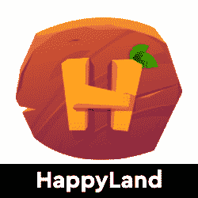</picture>](https://web.archive.org/web/20221006042212/https://dappradar.com/binance-smart-chain/games/happyland)

*   获得快乐世界的本地令牌$HPL 以获得土地、庄稼和动物
*   用独特的角色风格和商品使游戏体验个性化

[<picture>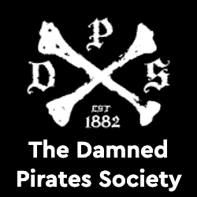</picture>](https://web.archive.org/web/20221006042212/https://dappradar.com/moonriver/games/the-damned-pirates-society)

*   带上你的 NFT 去寻找宝箱，升级你的船，建立一个舰队等等
*   赚取金币来升级您的旗舰和舰队

[<picture>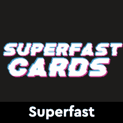</picture>](https://web.archive.org/web/20221006042212/https://dappradar.com/polygon/games/superfast)

*   完全可玩的汽车四重奏游戏，其中每个 NFT 代表一张扑克牌
*   简单的高/低力学
*   玩家对人工智能，玩家对玩家和多人模式

[<picture>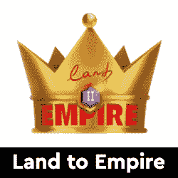</picture>](https://web.archive.org/web/20221006042212/https://dappradar.com/near/games/land-to-empire)

*   《帝国之地》是一款基于 Near 协议的即玩即赚手机战略游戏
*   玩家需要建造自己的村庄、军队和国防基础设施

## 热门 NFT 系列

CryptoPunks 和 Bored Ape Yacht Club 已经成为 NFT 最受欢迎的收藏品。虽然这些生活在以太坊，许多其他项目作为不同区块链的伟大收藏品。在这里，我们强调了所谓的[环境友好型 Tezos 网络](https://web.archive.org/web/20221006042212/https://medium.com/tqtezos/clean-nfts-on-tezos-58566b2fdba1)上的三个 NFT 市场，随着 NFT 滴滴在地平线上，这些市场值得探索。

你知道你可以在 DappRadar 上买卖 NFT 吗？只需登录并开始使用我们的投资组合跟踪工具！

[<picture>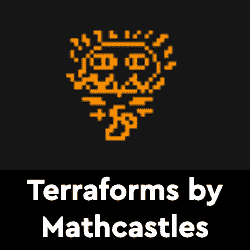</picture>](https://web.archive.org/web/20221006042212/https://dappradar.com/ethereum/collectibles/terraforms-by-mathcastles)

*   来自动态生成的在线 3D 世界的在线陆地艺术
*   区块链以太坊上的 9919 个 NFT

[<picture>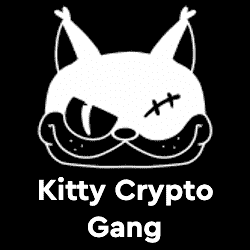</picture>](https://web.archive.org/web/20221006042212/https://dappradar.com/ethereum/collectibles/kcg)

*   KCG 是生活在元宇宙的 3D 小猫
*   由两位艺术家创作，他们曾为漫威、迪士尼、奈弗利克斯、华纳兄弟等公司工作

[<picture></picture>](https://web.archive.org/web/20221006042212/https://dappradar.com/ethereum/collectibles/azuki)

*   10，000 个头像，让你的会员进入花园
*   志那都红豆持有者可以获得独家优惠、体验等

[<picture>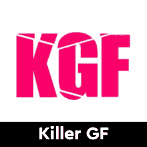</picture>](https://web.archive.org/web/20221006042212/https://dappradar.com/ethereum/collectibles/killer-gf)

*   前 Riot Games 艺术家 Zeronis 收藏了 7，777 幅肖像艺术作品
*   可爱且富有美感的女朋友也是危险的刺客

[<picture>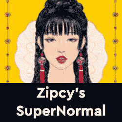</picture>](https://web.archive.org/web/20221006042212/https://dappradar.com/ethereum/collectibles/zipcy-s-supernormal)

*   以太坊区块链上的 8，888 个生成性 NFT 通过描绘多样化和独特的元素来代表个人主义
*   超过 1000 个特征

[<picture>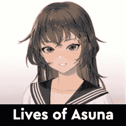</picture>](https://web.archive.org/web/20221006042212/https://dappradar.com/ethereum/collectibles/lives-of-asuna)

*   10，000 个 NFT 的独特组合，灵感来自丰富的动漫世界
*   亚莎 NFT 可以定制和成型

## 顶级 NFT 碎片

鉴于 NFT 的售价相当可观，细分的想法正在兴起，这给了小投资者一个参与的机会。细分的技术过程非常简单。拿一把 NFT，把它锁进金库，然后得到代币作为回报。这些代币代表了被锁定的 NFT 的所有权，它们的价值增加或减少意味着 NFT 资产的价值波动。投资者可以购买这些代币，并拥有 NFT 的一部分。要了解更多信息，请查看我们的[细分非功能性甲状腺素完全指南](/web/20221006042212/https://dappradar.com/blog/what-are-fractionalized-nfts-how-to-invest-in-them/)。

[<picture></picture>](https://web.archive.org/web/20221006042212/https://dappradar.com/nft/fractionalized)

*   臭名昭著的总督 NFT 已经被切成了 11 亿块
*   每个狗代币目前价值 0.0103 美元

[<picture></picture>](https://web.archive.org/web/20221006042212/https://dappradar.com/nft/fractionalized)

*   以太石是第一批以太坊收藏的 NFT 之一
*   每个鹅卵石目前价值 0.00143 美元

[<picture></picture>](https://web.archive.org/web/20221006042212/https://dappradar.com/nft/fractionalized)

*   104 个底价密码朋克的集合
*   每个楼层代币目前价值 0.0448 美元

***以上不构成投资建议。此处给出的信息仅供参考。请行使尽职调查，做你的研究。作者在瑞士联邦理工学院、BTC、NIOX、AGIX、MATIC、MANA、SAFEMOON、SDAO、CAKE、HEX、LINK、GRT、CRO、OMI、GO、SHIBA INU 和 OCEAN 任职。***

 NewsletterUnsubscribe at any time. [T&Cs](https://web.archive.org/web/20221006042212/https://dappradar.com/terms) and [Privacy Policy](https://web.archive.org/web/20221006042212/https://dappradar.com/privacy-policy)