# 流行 Dapps–Cross Chain DeFi、Top Play-to-Earn、GameFi 和 Hot NFT 系列

> 原文：<https://web.archive.org/web/https://dappradar.com/blog/trending-dapps-cross-chain-defi-top-play-to-earn-gamefi-hot-nft-collections>

## 流行 Dapps |第 7 周| 2022 年

****您的每周更新可以发现各种类别的新 dapps，包括 DeFi 和 yield 农场、NFT 市场和收藏，以及顶级的玩赚游戏。****

区块链充满了不断发展的 dapps。在 DappRadar，我们在 20 多个不同的区块链跟踪数以千计的人。每周，DappRadar 都会深入生态系统，发掘那些流行的、即将到来的、有趣的 dapps。无论是以太坊上的 DeFi、蜡上的 NFT 系列，还是币安智能链上的 yield farming，我们都能满足您的需求。

## 交叉链定义

本周我们来看看在区块链以太坊外运营的六家 DeFi 和 exchange dapps。而 PancakeSwap、Uniswap 和 Sushi 等龙头企业则主导着其连锁店的交易量。由于交易者希望避免汽油和交易费用，允许用户从以太坊桥接代币的替代服务越来越受欢迎。

[<picture></picture>](https://web.archive.org/web/20220930093913/https://dappradar.com/oasis/defi/yuzuswap)

*   YuzuSwap 是 Oasis 网络上的分散式交换机
*   旨在提供一个安全、快捷、低成本的工具，用于在 Oasis 生态系统中发现和交换令牌

[<picture>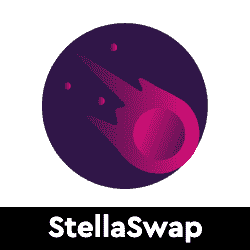</picture>](https://web.archive.org/web/20220930093913/https://dappradar.com/moonbeam/defi/stellaswap)

*   StellaSwap 是领先的月光指数
*   用户可以从多个网络交换、赚取、产出农场和桥接资产

[<picture></picture>](https://web.archive.org/web/20220930093913/https://dappradar.com/fantom/defi/hector-finance)

*   TOR 是 Hector 金融生态系统的稳定核心。
*   HEC 是 TOR 支持的公用令牌，可作为支付令牌、交易媒介和低风险收益令牌

[<picture>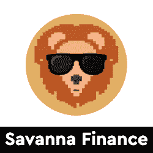</picture>](https://web.archive.org/web/20220930093913/https://dappradar.com/cronos/defi/savanna-finance)

*   Cronos 上领先的算法稳定平台
*   建立在 MM 金融之上的高产农业环境

[<picture>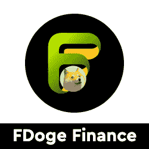</picture>](https://web.archive.org/web/20220930093913/https://dappradar.com/fantom/defi/fdoge-finance)

*   FDoge Finance 是 Fantom 网络上的一个算法稳定点
*   分散收益协议和 meme 令牌的组合

[<picture>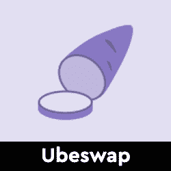</picture>](https://web.archive.org/web/20220930093913/https://dappradar.com/celo/defi/ubeswap)

*   Ubeswap 的使命是通过手机增加 DeFi 的采用和流动性
*   让用户更便宜、更容易地交换、耕种和进入新的金融市场

## 玩即赚& GameFi

游戏很有趣，但是区块链驱动的游戏给这种体验增加了一个全新的经济层面。突然你可以玩一个游戏并从中赚钱。并非所有游戏都有相同类型的财务激励，但当社区发展时，每一项区块链资产都会增值。以下是本周的六款游戏趋势。

[<picture></picture>](https://web.archive.org/web/20220930093913/https://dappradar.com/binance-smart-chain/games/9d-nft)

*   9D NFT 是一款 MMO 武术游戏，在 BSC 上利用了区块链和 NFT 技术

[<picture></picture>](https://web.archive.org/web/20220930093913/https://dappradar.com/avalanche/games/pizza-game)

*   披萨游戏是一款关于雪崩区块链的游戏
*   受网络游戏“饼干点击器”的启发

[<picture>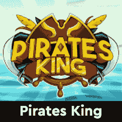</picture>](https://web.archive.org/web/20220930093913/https://dappradar.com/binance-smart-chain/games/piratesking)

*   《海盗王》是一款以玩赚取收入的 NFT 海盗世界游戏
*   BUSD 或 PKT 的奖励

[<picture>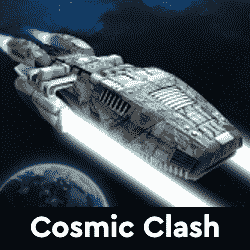</picture>](https://web.archive.org/web/20220930093913/https://dappradar.com/wax/games/cosmic-clash)

*   宇宙冲突是一个基于 WAX 区块链的 NFT 星际飞船收集游戏

[<picture>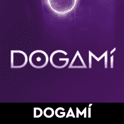</picture>](https://web.archive.org/web/20220930093913/https://dappradar.com/tezos/games/dogami)

*   你真正的虚拟伴侣
*   在 AR/VR 中领养并饲养一只独一无二的 Dogamí

[<picture>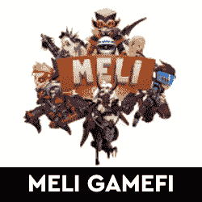</picture>](https://web.archive.org/web/20220930093913/https://dappradar.com/multichain/games/meli-gamefi)

*   《MELI》是一款战斗游戏，使用了具有个人特色的可玩 NFT

## 热门 NFT 系列

CryptoPunks 和 Bored Ape Yacht Club 已经成为 NFT 最受欢迎的收藏品。然而，每天都有新的系列推出，其中一些显示出与大公司竞争的潜力。在这里，我们强调六个新鲜的 NFT 下降。

你知道你可以在 DappRadar 上买卖 NFT 吗？只需登录并开始使用我们的投资组合跟踪工具！

[<picture>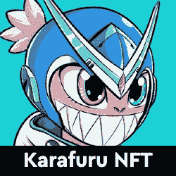</picture>](https://web.archive.org/web/20220930093913/https://dappradar.com/nft)

*   卡拉弗鲁是 5555 个生殖性 NFT 的家园，在那里颜色至高无上
*   离开单调的现实，进入卡拉福鲁的世界

[<picture>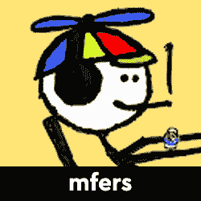</picture>](https://web.archive.org/web/20220930093913/https://dappradar.com/nft)

*   mfers 完全由 [sartoshi](https://web.archive.org/web/20220930093913/https://twitter.com/sartoshi_nft) 的手绘生成
*   你可以随意使用 mfers

[<picture></picture>](https://web.archive.org/web/20220930093913/https://dappradar.com/ethereum/collectibles/cool-pets-nft)

*   每一只酷宠物都是从蛋中孵化出来的，然后进化成最终形态
*   就像酷猫一样，每个酷宠物都是独一无二的

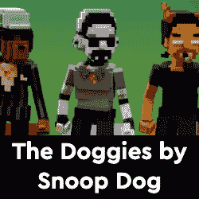

*   10，000 份 NFT，每份 150 砂
*   独特的，手工制作的，可玩的小狗来到沙盒

[<picture>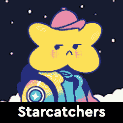</picture>](https://web.archive.org/web/20220930093913/https://dappradar.com/nft)

*   Starcatchers 是一个由 10，000 名热爱太空探险的人组成的集合
*   社区驱动的品牌，旨在拓展 web3 的边界

[<picture>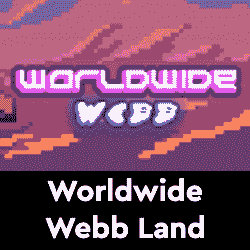</picture>](https://web.archive.org/web/20220930093913/https://dappradar.com/ethereum/collectibles/worldwide-webb-land)

*   MMORPG 元宇宙游戏，使用 NFTs 作为游戏中的化身
*   为流行的 NFT 项目提供实用工具的互操作平台

## 顶级 NFT 碎片

鉴于 NFT 的售价相当可观，细分的想法正在兴起，这给了小投资者一个参与的机会。细分的技术过程非常简单。拿一把 NFT，把它锁进金库，然后得到代币作为回报。这些代币代表了被锁定的 NFT 的所有权，它们的价值增加或减少意味着 NFT 资产的价值波动。投资者可以购买这些代币，并拥有 NFT 的一部分。要了解更多信息，请查看我们的[细分非功能性甲状腺素完全指南](/web/20220930093913/https://dappradar.com/blog/what-are-fractionalized-nfts-how-to-invest-in-them/)。

[<picture></picture>](https://web.archive.org/web/20220930093913/https://dappradar.com/nft/fractionalized)

*   臭名昭著的总督 NFT 已经被切成了 11 亿块
*   每个狗代币目前价值 0.0103 美元

[<picture></picture>](https://web.archive.org/web/20220930093913/https://dappradar.com/nft/fractionalized)

*   以太石是第一批以太坊收藏的 NFT 之一
*   每个鹅卵石目前价值 0.00143 美元

[<picture></picture>](https://web.archive.org/web/20220930093913/https://dappradar.com/nft/fractionalized)

*   104 个底价密码朋克的集合
*   每个楼层代币目前价值 0.0448 美元

***以上不构成投资建议。此处给出的信息仅供参考。请行使尽职调查，做你的研究。作者在瑞士联邦理工学院、BTC、NIOX、AGIX、MATIC、MANA、SAFEMOON、SDAO、CAKE、HEX、LINK、GRT、CRO、OMI、GO、SHIBA INU 和 OCEAN 任职。***

 NewsletterUnsubscribe at any time. [T&Cs](https://web.archive.org/web/20220930093913/https://dappradar.com/terms) and [Privacy Policy](https://web.archive.org/web/20220930093913/https://dappradar.com/privacy-policy)