# 趋势 Dapps–雪崩、顶级游戏和 NFT 土地上的 DeFi & Yield 农业

> 原文：<https://web.archive.org/web/https://dappradar.com/blog/trending-dapps-defi-yield-farming-on-avalanche-top-play-to-earn-games-nft-lands>

## 流行 Dapps |第 11 周| 2022 年

****您的每周更新可以发现各种类别的新 dapps，包括 DeFi 和 yield 农场、NFT 市场和收藏，以及顶级的玩赚游戏。****

区块链充满了不断发展的 dapps。在 DappRadar，我们在 20 多个不同的区块链跟踪数以千计的人。每周，DappRadar 都会深入生态系统，发掘那些流行的、即将到来的、有趣的 dapps。无论是以太坊上的 DeFi，蜡上的 NFT 收藏，还是雪崩上的高产农业，我们都能为您提供保障。

## 雪崩时的亏损和收益农业

本周我们来看看雪崩区块链上的六个 DeFi、token exchange 和 lending dapps。Avalanche 协议试图挑选当前分布式分类帐技术的最佳方面，并将其放在一个整洁的框架内。通过实施以太坊和 EVM 的创新，尊重古老的系统，同时改变核心机制，以实现更快、更轻、更低的运行成本。

[<picture></picture>](https://web.archive.org/web/20221207002433/https://dappradar.com/avalanche/defi/trader-joe)

*   Trader Joe 是 Avalanche 原生的一站式去中心化交易平台。交易、农场、股份、贷款和发射…都在一个屋檐下

[<picture>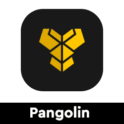</picture>](https://web.archive.org/web/20221207002433/https://dappradar.com/avalanche/defi/pangolin-exchange)

*   这是一个社区驱动的分散式交易所，用于交易 Avalanche 和 Ethereum 资产，结算速度快，交易费用低

[<picture>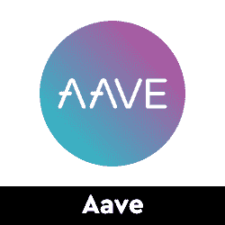</picture>](https://web.archive.org/web/20221207002433/https://dappradar.com/multichain/defi/aave)

*   协议赚取存款和借款资产现在运行雪崩
*   比以太坊更低的费用和交易时间

[<picture></picture>](https://web.archive.org/web/20221207002433/https://dappradar.com/avalanche/defi/sushi)

*   寿司是以太坊上的领先指数，每天有大约 100 万个活跃钱包
*   它运行多链，现在在雪崩

[<picture>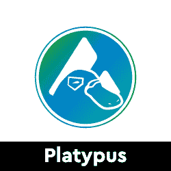</picture>](https://web.archive.org/web/20221207002433/https://dappradar.com/avalanche/defi/platypus)

*   Platypus 是一个基于资产负债管理的雪崩式 StableSwap 平台。
*   它是针对现有的 StableSwap 限制而设计的

[<picture>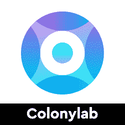</picture>](https://web.archive.org/web/20221207002433/https://dappradar.com/avalanche/defi/colonylab)

*   社区驱动的雪崩生态系统加速器
*   Colony 为雪崩式建筑项目提供早期资金，并为现有的雪崩式 DeFi 协议提供流动性

## 玩即赚& GameFi

游戏很有趣，但是区块链驱动的游戏给这种体验增加了一个全新的经济层面。突然你可以玩一个游戏并从中赚钱。并非所有游戏都有相同类型的财务激励，但当社区发展时，每一项区块链资产都会增值。以下是本周的六款游戏趋势。

[<picture>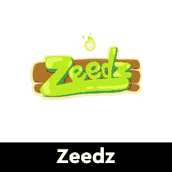</picture>](https://web.archive.org/web/20221207002433/https://dappradar.com/flow/games/zeedz)

*   Zeedz 是第一款为目的而玩的游戏，玩家通过收集植物启发的生物来减少全球碳排放:Zeedz

[<picture>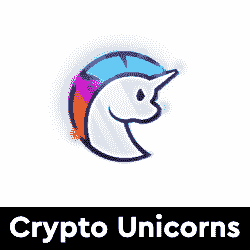</picture>](https://web.archive.org/web/20221207002433/https://dappradar.com/polygon/games/crypto-unicorns)

*   加密独角兽是一个有趣的农业和独角兽养殖游戏，建立在多边形区块链上
*   游戏围绕独角兽和陆地 NFT 展开

[<picture>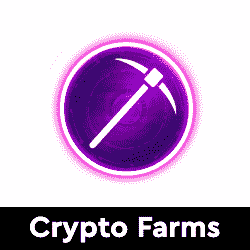</picture>](https://web.archive.org/web/20221207002433/https://dappradar.com/wax/games/crypto-farms)

*   有没有想过做加密货币矿工？
*   机会来了，抓住 NFT，成为加密货币的先驱

[<picture>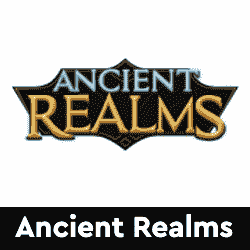</picture>](https://web.archive.org/web/20221207002433/https://dappradar.com/wax/games/ancient-realms)

*   古代王国是一个在蜡像区块链上玩到赚的增量 RPG 游戏
*   使用你的武器和装备
*   赚取游戏费

[<picture>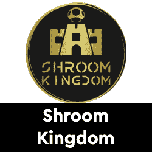</picture>](https://web.archive.org/web/20221207002433/https://dappradar.com/near/games/shroom-kingdom)

*   Shroom Kingdom 是一款即将推出的基于近区块链的游戏

[<picture>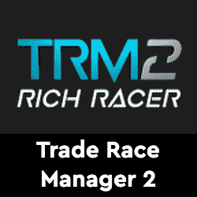</picture>](https://web.archive.org/web/20221207002433/https://dappradar.com/polygon/games/trade-race-manager-2-rich-racer)

*   用你独特的 NFT 超级跑车与世界各地的玩家比赛
*   一天 4 场比赛
*   赢家获得奖池

## 虚拟世界土地

与实体房地产类似，在区块链的虚拟世界中，代表一块数字土地的 NFT 已被证明是可以存储价值的资产。自 Meta 去年 10 月宣布以来，对这些虚拟土地 NFT 的需求激增，推动其价格上涨。然而，在价格暴跌的情况下，精明的投资者可能会找到便宜货。

[<picture></picture>](https://web.archive.org/web/20221207002433/https://dappradar.com/ethereum/games/the-sandbox)[<picture></picture>](https://web.archive.org/web/20221207002433/https://dappradar.com/ethereum/marketplaces/decentraland)[<picture></picture>](https://web.archive.org/web/20221207002433/https://dappradar.com/ethereum/games/somnium-space)

你知道你可以在 DappRadar 上买卖 NFT 吗？只需登录并开始使用我们的投资组合跟踪工具！

## 顶级 NFT 碎片

鉴于 NFT 的售价相当可观，细分的想法正在兴起，这给了小投资者一个参与的机会。细分的技术过程非常简单。拿一把 NFT，把它锁进金库，然后得到代币作为回报。

[<picture>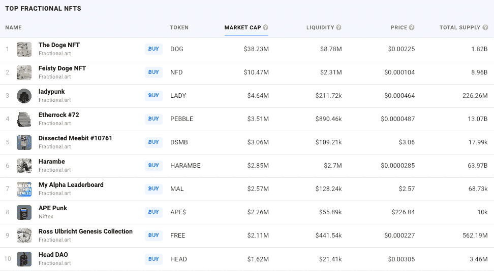</picture>](https://web.archive.org/web/20221207002433/https://dappradar.com/nft/fractionalized)

这些代币代表了被锁定的 NFT 的所有权，它们的价值增加或减少意味着 NFT 资产的价值波动。投资者可以购买这些代币，并拥有 NFT 的一部分。要了解更多信息，请查看我们的[细分非功能性甲状腺素完全指南](/web/20221207002433/https://dappradar.com/blog/what-are-fractionalized-nfts-how-to-invest-in-them/)。

[<picture></picture>](https://web.archive.org/web/20221207002433/https://dappradar.com/nft/fractionalized)

*   臭名昭著的总督 NFT 已经被切成了 11 亿块
*   每个狗代币目前价值 0.0103 美元

[<picture></picture>](https://web.archive.org/web/20221207002433/https://dappradar.com/nft/fractionalized)

*   以太石是第一批以太坊收藏的 NFT 之一
*   每个鹅卵石目前价值 0.00143 美元

[<picture></picture>](https://web.archive.org/web/20221207002433/https://dappradar.com/nft/fractionalized)

*   104 个底价密码朋克的集合
*   每个楼层代币目前价值 0.0448 美元

***以上不构成投资建议。此处给出的信息仅供参考。请行使尽职调查，做你的研究。作者在瑞士联邦理工学院、BTC、NIOX、AGIX、MATIC、MANA、SAFEMOON、SDAO、CAKE、HEX、LINK、GRT、CRO、OMI、GO、SHIBA INU 和 OCEAN 任职。***

 NewsletterUnsubscribe at any time. [T&Cs](https://web.archive.org/web/20221207002433/https://dappradar.com/terms) and [Privacy Policy](https://web.archive.org/web/20221207002433/https://dappradar.com/privacy-policy)