# 流行 Dapps——DeFi & Yield Farming，Play-to-Earn 游戏，GameFi & Hot NFT 系列

> 原文：<https://web.archive.org/web/https://dappradar.com/blog/trending-dapps-defi-yield-farming-play-to-earn-games-gamefi-hot-nft-collections>

## 流行 Dapps |第 11 周| 2022 年

****您的每周更新可以发现各种类别的新 dapps，包括 DeFi 和 yield 农场、NFT 市场和收藏，以及顶级的玩赚游戏。****

区块链充满了不断发展的 dapps。在 DappRadar，我们在 20 多个不同的区块链跟踪数以千计的人。每周，DappRadar 都会深入生态系统，发掘那些流行的、即将到来的、有趣的 dapps。无论是以太坊上的 DeFi，蜡上的 NFT 收藏，还是雪崩上的高产农业，我们都能为您提供保障。

## 亏损和收益农业

本周，我们来看看区块链的六个 DeFi、token exchange 和 lending dapps。虽然以太坊 dex 获得了用户的欢迎，但他们确实受到高额燃气费的困扰。在不倾家荡产的情况下，探索其他交易方式。

[<picture>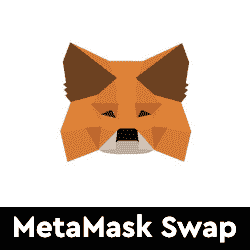</picture>](https://web.archive.org/web/20221006051637/https://dappradar.com/ethereum/defi/metamask-swap)

*   元掩码交换内置于元掩码钱包中
*   跨多个链交换令牌
*   本周早些时候，道的声明中就有空投传言流传

[<picture></picture>](https://web.archive.org/web/20221006051637/https://dappradar.com/fantom/exchanges/excalibur-exchange)

*   Excalibur Exchange 是一个基于 Fantom 的指数
*   长期饥饿和产量的动态激励
*   高度可变的掉期费用

[<picture>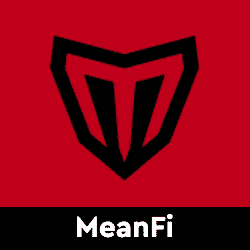</picture>](https://web.archive.org/web/20221006051637/https://dappradar.com/solana/defi/meanfi)

*   一个关于索拉纳的自我监护、无权限和无信任协议
*   MeanFi 为日常银行业务带来加密和解密

[<picture></picture>](https://web.archive.org/web/20221006051637/https://dappradar.com/cronos/defi/mm-optimizer-1)

*   Cronos 产量优化器
*   收益聚合器利用不同的 DeFi 协议和策略来最大化用户利润

[<picture>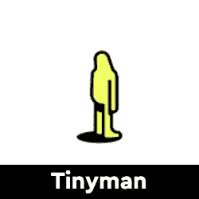</picture>](https://web.archive.org/web/20221006051637/https://dappradar.com/algorand/defi/tinyman)

*   Tinyman 是一个分散的 AMM 协议
*   利用阿尔格兰德区块链的快速和安全的框架

[<picture>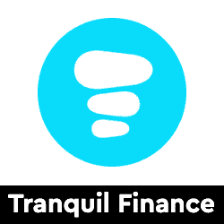</picture>](https://web.archive.org/web/20221006051637/https://dappradar.com/harmony/defi/tranquil-finance)

*   宁静金融是一个算法货币市场协议和区块链和谐指数
*   宁静的金融将成为幻想游戏世界的一部分，其中 DeFi 和 GameFi 模式融合在一起

## 玩即赚& GameFi

游戏很有趣，但是区块链驱动的游戏给这种体验增加了一个全新的经济层面。突然你可以玩一个游戏并从中赚钱。并非所有游戏都有相同类型的财务激励，但当社区发展时，每一项区块链资产都会增值。以下是本周的六款游戏趋势。

[<picture>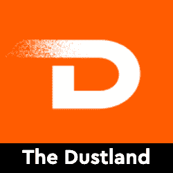</picture>](https://web.archive.org/web/20221006051637/https://dappradar.com/polygon/collectibles/the-dustland)

*   Dustland 是 OliveX 健身元宇宙的最新游戏，奖励现实生活中跑步和骑自行车的玩家

[<picture>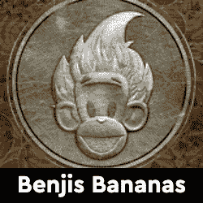</picture>](https://web.archive.org/web/20221006051637/https://dappradar.com/ethereum/games/benji-bananas-membership-pass)

*   获得一张玩本杰香蕉的通行证，并开始赚取猿代币

[<picture>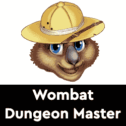</picture>](https://web.archive.org/web/20221006051637/https://dappradar.com/multichain/games/wombat-dungeon-master)

*   袋熊地下城主带你去冒险的另一面
*   控制地牢，隐藏战利品，奖励袋熊和赚取

*   龙之谷是 NFT 的一款游戏，区块链专注于玩到赚
*   成为驯龙师，进化龙，帮助击败地精，恢复山谷的和平，并获得奖励

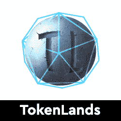

*   TokenLands 是一个新世界殖民的经济模拟游戏
*   结合 WAX 区块链和网页游戏

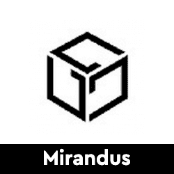

*   米兰多斯是一个由区块链技术驱动的幻想世界，在这里你可以真正拥有自己的内容

## NFT 流行系列

无聊猿游艇俱乐部，变异猿游艇俱乐部，无聊猿养狗俱乐部是热门需求，由于释放猿。围绕进一步的会员福利的宣传正在增长，这些 NFT 已经成为最受欢迎的 NFT 系列。然而，每天都有新的系列推出，其中一些显示出与大公司竞争的潜力。

[<picture>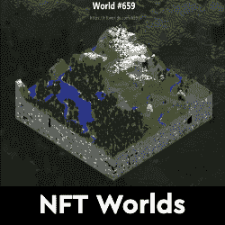</picture>](https://web.archive.org/web/20221006051637/https://dappradar.com/ethereum/games/nft-worlds)[<picture>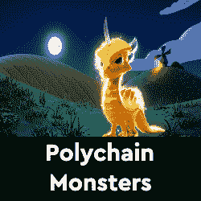</picture>](https://web.archive.org/web/20221006051637/https://dappradar.com/multichain/collectibles/polychain-monsters)[<picture></picture>](https://web.archive.org/web/20221006051637/https://dappradar.com/ethereum/collectibles/3landers)[<picture>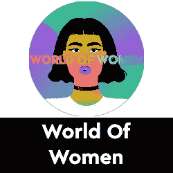</picture>](https://web.archive.org/web/20221006051637/https://dappradar.com/ethereum/collectibles/world-of-women)[<picture></picture>](https://web.archive.org/web/20221006051637/https://dappradar.com/ethereum/collectibles/bored-ape-kennel-club)[<picture>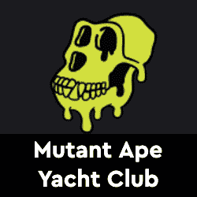</picture>](https://web.archive.org/web/20221006051637/https://dappradar.com/ethereum/collectibles/mutant-ape-yacht-club)

发现新推出的和即将推出的 NFT 系列，并使用超级先进的 [NFT 浏览器](https://web.archive.org/web/20221006051637/https://dappradar.com/hub/nft-explorer)根据机器学习算法、历史销售和元数据获得估计的 NFT 价值！

[<picture></picture>](https://web.archive.org/web/20221006051637/https://dappradar.com/hub/nft-explorer)

## 顶级 NFT 碎片

鉴于 NFT 的售价相当可观，细分的想法正在兴起，这给了小投资者一个参与的机会。细分的技术过程非常简单。拿一把 NFT，把它锁进金库，然后得到代币作为回报。

[<picture></picture>](https://web.archive.org/web/20221006051637/https://dappradar.com/nft/fractionalized)

这些代币代表了被锁定的 NFT 的所有权，它们的价值增加或减少意味着 NFT 资产的价值波动。投资者可以购买这些代币，并拥有 NFT 的一部分。要了解更多信息，请查看我们的[细分非功能性甲状腺素完全指南](/web/20221006051637/https://dappradar.com/blog/what-are-fractionalized-nfts-how-to-invest-in-them/)。

[<picture></picture>](https://web.archive.org/web/20221006051637/https://dappradar.com/nft/fractionalized)

*   臭名昭著的总督 NFT 已经被切成了 11 亿块
*   每个狗代币目前价值 0.0103 美元

[<picture></picture>](https://web.archive.org/web/20221006051637/https://dappradar.com/nft/fractionalized)

*   以太石是第一批以太坊收藏的 NFT 之一
*   每个鹅卵石目前价值 0.00143 美元

[<picture></picture>](https://web.archive.org/web/20221006051637/https://dappradar.com/nft/fractionalized)

*   104 个底价密码朋克的集合
*   每个楼层代币目前价值 0.0448 美元

***以上不构成投资建议。此处给出的信息仅供参考。请行使尽职调查，做你的研究。作者在瑞士联邦理工学院、BTC、NIOX、AGIX、MATIC、MANA、SAFEMOON、SDAO、CAKE、HEX、LINK、GRT、CRO、OMI、GO、SHIBA INU 和 OCEAN 任职。***

 NewsletterUnsubscribe at any time. [T&Cs](https://web.archive.org/web/20221006051637/https://dappradar.com/terms) and [Privacy Policy](https://web.archive.org/web/20221006051637/https://dappradar.com/privacy-policy)