# 流行 Dapps——新的即玩即赚游戏、Oasis Network 上的 DeFi 和热门 NFT 系列

> 原文：<https://web.archive.org/web/https://dappradar.com/blog/trending-dapps-new-play-to-earn-games-defi-on-oasis-network-hot-nft-collections>

## 流行 Dapps |第 7 周| 2022 年

****您的每周更新可以发现各种类别的新 dapps，包括 DeFi 和 yield 农场、NFT 市场和收藏，以及顶级的玩赚游戏。****

区块链充满了不断发展的 dapps。在 DappRadar，我们在 20 多个不同的区块链跟踪数以千计的人。每周，DappRadar 都会深入生态系统，发掘那些流行的、即将到来的、有趣的 dapps。无论是以太坊上的 DeFi、蜡上的 NFT 系列，还是币安智能链上的 yield farming，我们都能满足您的需求。

## 绿洲网络定义

本周，我们聚焦于以 DeFi 为中心、最近整合的 Oasis 网络。除了快速发展的合作伙伴生态系统，EVM 还注重兼容性和安全性。Oasis 是 dapp 开发者构建 DeFi、Play-2-Earn 游戏和隐私解决方案的可靠选择。更重要的是，最近推出的 [$500，000 DappRadar x Oasis dapp 开发加速器](https://web.archive.org/web/20221127164227/https://airtable.com/shreZAEcjcrTFpwT0)可以帮助开发团队实现他们的目标。

[<picture>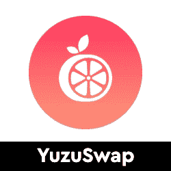</picture>](https://web.archive.org/web/20221127164227/https://dappradar.com/oasis/defi/yuzuswap)

*   在 Oasis 生态系统中发现和交换令牌的快速、低成本工具
*   绿洲翡翠号的分散交易
*   包括流动性和贸易挖掘等激励措施

[<picture>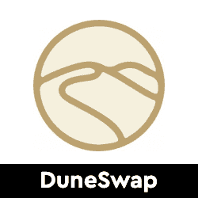</picture>](https://web.archive.org/web/20221127164227/https://dappradar.com/oasis/defi/duneswap)

*   Oasis Emerald ParaTime 网络自带的自动做市商/分散式交易所
*   DUNE 是平台的本地令牌

[<picture>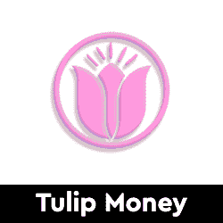</picture>](https://web.archive.org/web/20221127164227/https://dappradar.com/oasis/defi/tulip)

*   一个有自动合成器的平台，DEX，一种通过铸币税与 1 美元挂钩的算法稳定币，等等
*   TSWAP 令牌，它允许在本机 DEX 中的令牌对上进行额外的产量生成

## 玩赢游戏

游戏很有趣，但是区块链驱动的游戏给这种体验增加了一个全新的经济层面。突然你可以玩一个游戏并从中赚钱。并非所有游戏都有相同类型的财务激励，但当社区发展时，每一项区块链资产都会增值。以下是本周的六款游戏趋势。

[<picture>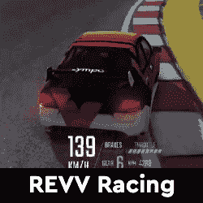</picture>](https://web.archive.org/web/20221127164227/https://dappradar.com/polygon/games/revv-racing)

*   区块链赛车运动游戏平台利用 NFTs 进行游戏来赢取经验
*   可玩的赛车游戏和奖励

[<picture>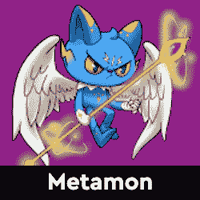</picture>](https://web.archive.org/web/20221127164227/https://dappradar.com/binance-smart-chain/games/metamon)

*   Metamon 是一款赢得 NFT 区块链游戏的游戏
*   由卡卡电台设计，将作为第一款迷你游戏加入环球元宇宙(USM)

[<picture>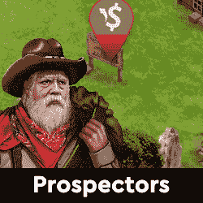</picture>](https://web.archive.org/web/20221127164227/https://dappradar.com/multichain/games/prospectors)

*   第一个拥有完整经济模型的区块链奥运会
*   立即投入 19 世纪的淘金热

[<picture>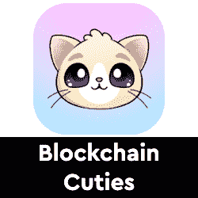</picture>](https://web.archive.org/web/20221127164227/https://dappradar.com/multichain/games/blockchain-cuties)

*   最可爱的区块链以太坊冒险游戏
*   与小狗，龙，小熊，猫和其他真实和幻想的生物玩耍
*   战斗升级和赚取

[<picture>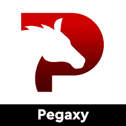</picture>](https://web.archive.org/web/20221127164227/https://dappradar.com/polygon/games/pegaxy)

*   玩到赚 PVP 风格的赛马游戏，玩家与其他 11 名参赛者争夺前 3 名的位置
*   使用战略升级、食物和技能，玩家必须进入前 3 名才能获得平台实用令牌 VIS

[<picture></picture>](https://web.archive.org/web/20221127164227/https://dappradar.com/avalanche/games/crabada)

*   玩赚 NFT 游戏基于一个充满激烈战斗的寄居蟹的世界
*   独特的 PvP 注入空闲游戏
*   育种和市场
*   游戏激励和奖励

## 热门 NFT 系列

CryptoPunks 和 Bored Ape Yacht Club 已经成为 NFT 最受欢迎的收藏品。然而，每天都有新的系列推出，其中一些显示出与大公司竞争的潜力。在这里，我们强调六个新鲜的 NFT 下降。

你知道你可以在 DappRadar 上买卖 NFT 吗？只需登录并开始使用我们的投资组合跟踪工具！

[<picture>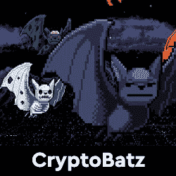</picture>](https://web.archive.org/web/20221127164227/https://dappradar.com/nft/collections)

*   每只隐蝠都有能力“咬”一只来自不同蓝筹项目的 NFT，并创造一只“变异蝙蝠”,共享两种标记的 DNA
*   隐蝠只能咬一次，所以要小心选择

[<picture></picture>](https://web.archive.org/web/20221127164227/https://dappradar.com/nft/collections)

*   一群生活在多边形区块链的独特戈萨普女孩
*   他们的使命是代表 NFT 空间的包容、平等和美丽

[<picture>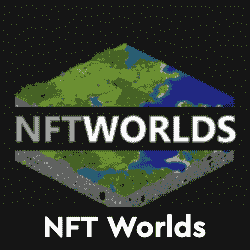</picture>](https://web.archive.org/web/20221127164227/https://dappradar.com/ethereum/games/nft-worlds)

*   每个 NFT 世界都是一个可探索的、无限的世界，你可以把它建成你能想象的任何东西。
*   NFT 世界是《我的世界》兼容的开发者 API，是分散的，等等

[<picture>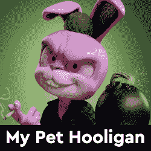</picture>](https://web.archive.org/web/20221127164227/https://dappradar.com/ethereum/collectibles/my-pet-hooligan)

*   NFT 收藏 8888 宠物流氓
*   3D 角色具有多种独特的特征
*   NFT 作为一个独特的可玩角色出现在即将到来的元宇宙，兔子洞

[<picture>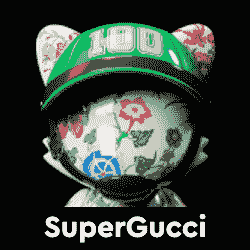</picture>](https://web.archive.org/web/20221127164227/https://dappradar.com/ethereum/collectibles/superplastic-supergucci)

*   古驰和超塑独家合作
*   由古驰创意总监 Alessandro Michele 和合成艺术家 Janky & Guggimon 创作

[<picture>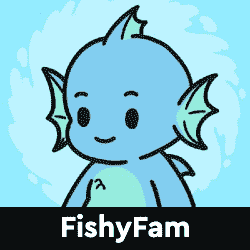</picture>](https://web.archive.org/web/20221127164227/https://dappradar.com/nft/collections)

*   区块链以太坊的 NFT 收藏
*   由 9999 条鱼组成，它们将离开大堡礁去海洋探险

## 顶级 NFT 碎片

鉴于 NFT 的售价相当可观，细分的想法正在兴起，这给了小投资者一个参与的机会。细分的技术过程非常简单。拿一把 NFT，把它锁进金库，然后得到代币作为回报。这些代币代表了被锁定的 NFT 的所有权，它们的价值增加或减少意味着 NFT 资产的价值波动。投资者可以购买这些代币，并拥有 NFT 的一部分。要了解更多信息，请查看我们的[细分非功能性甲状腺素完全指南](/web/20221127164227/https://dappradar.com/blog/what-are-fractionalized-nfts-how-to-invest-in-them/)。

[<picture></picture>](https://web.archive.org/web/20221127164227/https://dappradar.com/nft/fractionalized)

*   臭名昭著的总督 NFT 已经被切成了 11 亿块
*   每个狗代币目前价值 0.0103 美元

[<picture></picture>](https://web.archive.org/web/20221127164227/https://dappradar.com/nft/fractionalized)

*   以太石是第一批以太坊收藏的 NFT 之一
*   每个鹅卵石目前价值 0.00143 美元

[<picture></picture>](https://web.archive.org/web/20221127164227/https://dappradar.com/nft/fractionalized)

*   104 个底价密码朋克的集合
*   每个楼层代币目前价值 0.0448 美元

***以上不构成投资建议。此处给出的信息仅供参考。请行使尽职调查，做你的研究。作者在瑞士联邦理工学院、BTC、NIOX、AGIX、MATIC、MANA、SAFEMOON、SDAO、CAKE、HEX、LINK、GRT、CRO、OMI、GO、SHIBA INU 和 OCEAN 任职。***

 NewsletterUnsubscribe at any time. [T&Cs](https://web.archive.org/web/20221127164227/https://dappradar.com/terms) and [Privacy Policy](https://web.archive.org/web/20221127164227/https://dappradar.com/privacy-policy)