# 趋势 Dapps——在 Solana 上的 Play-to-Earn 和 GameFi、DeFi Lending 和 NFTs

> 原文：<https://web.archive.org/web/https://dappradar.com/blog/trending-dapps-play-to-earn-gamefi-defi-lending-nfts-on-solana>

## 流行 Dapps |第 10 周| 2022

****您的每周更新可以发现各种类别的新 dapps，包括 DeFi 和 yield 农场、NFT 市场和收藏，以及顶级的玩赚游戏。****

区块链充满了不断发展的 dapps。在 DappRadar，我们在 20 多个不同的区块链跟踪数以千计的人。每周，DappRadar 都会深入生态系统，发掘那些流行的、即将到来的、有趣的 dapps。无论是以太坊上的 DeFi，蜡上的 NFT 收藏，还是雪崩上的高产农业，我们都能为您提供保障。

## 定义和贷款

本周，我们来看看六个 DeFi、代币交换和跨多个链的借贷 dapps。贷款已经成为 DeFi 的一个重要组成部分，在当前的交易环境下，投资者发现通过贷款获得回报会有更好的结果。

[<picture>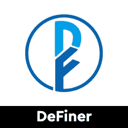</picture>](https://web.archive.org/web/20221208160703/https://dappradar.com/oec/defi/definer)

*   主储蓄池支持高流动性资产，如 stablecoins、BTC、ETH 等。
*   存放和借出密码以获取奖励

[<picture></picture>](https://web.archive.org/web/20221208160703/https://dappradar.com/solana/defi/solend)

*   Solana 上用于借贷的算法的、分散的协议
*   赚取利息、借款和利用资产
*   多头和空头头寸

[<picture></picture>](https://web.archive.org/web/20221208160703/https://dappradar.com/multichain/defi/aave)

*   从存款和借入资产中获利的多链协议
*   存款人通过向贷款池提供流动性赚取利息，而借款人可以通过利用这些贷款池获得贷款

[<picture>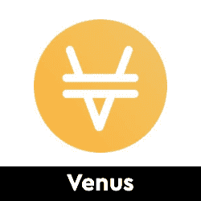</picture>](https://web.archive.org/web/20221208160703/https://dappradar.com/binance-smart-chain/defi/venus)

*   Venus 是一个分散的算法货币市场和稳定货币协议
*   使借款人和供应商能够按需获得流动性和收益

[<picture>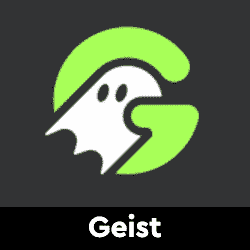</picture>](https://web.archive.org/web/20221208160703/https://dappradar.com/fantom/defi/geist)

*   艾斯特金融是一个分散的、非托管的流动性市场协议，在 Fantom 上运行
*   存放和借出密码以获取奖励

[<picture>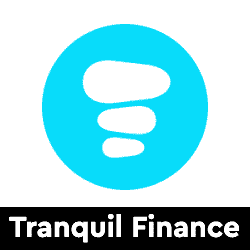</picture>](https://web.archive.org/web/20221208160703/https://dappradar.com/harmony/defi/tranquil-finance)

*   宁静金融是一个算法货币市场协议和 DEX 上的和谐区块链
*   互换、供应和借入资产

## 玩即赚& GameFi

游戏很有趣，但是区块链驱动的游戏给这种体验增加了一个全新的经济层面。突然你可以玩一个游戏并从中赚钱。并非所有游戏都有相同类型的财务激励，但当社区发展时，每一项区块链资产都会增值。以下是本周的六款游戏趋势。

[<picture>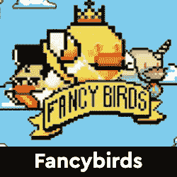</picture>](https://web.archive.org/web/20221208160703/https://dappradar.com/polygon/games/fancybirds)

*   受 Flappy 鸟的启发，在多边形上玩赚取游戏
*   赚取并在游戏工具中使用$FNC

[<picture></picture>](https://web.archive.org/web/20221208160703/https://dappradar.com/binance-smart-chain/games/mobox-nft-farmer)

*   BSC 上领先的即玩即赚游戏
*   产出农场，看陌陌 NFTs 成长
*   刚刚推出新的游戏模式莫兰德防御

[<picture>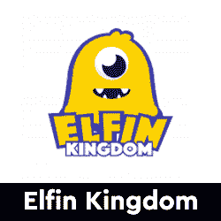</picture>](https://web.archive.org/web/20221208160703/https://dappradar.com/binance-smart-chain/games/elfin-kingdom)

*   小精灵王国融合了农场养殖、NFT 收集和代币开采
*   玩家可以用精灵代币玩游戏和赚钱

[<picture>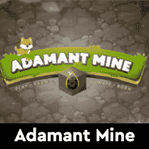</picture>](https://web.archive.org/web/20221208160703/https://dappradar.com/binance-smart-chain/games/adamant-mine)

*   BSC 上的方块采矿游戏，描述它的机制是一个玩到赚，捐赠和燃烧的游戏
*   NFT 市场和代币本周发布

[<picture>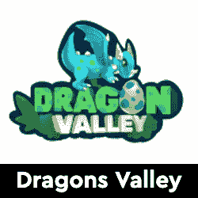</picture>](https://web.archive.org/web/20221208160703/https://dappradar.com/wax/games/dragons-valley)

*   龙之谷是一款 NFT 风格的在蜡像区块链上玩赚游戏

[<picture>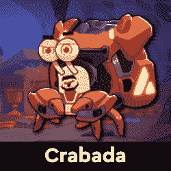</picture>](https://web.archive.org/web/20221208160703/https://dappradar.com/avalanche/games/crabada)

*   克拉巴达是一个玩赚 NFT 游戏与激烈的战斗寄居蟹称为克拉巴达
*   育种和市场
*   出租酒馆
*   游戏激励和奖励

## 热门索拉纳 NFT 系列

CryptoPunks 和 Bored Ape Yacht Club 已经成为 NFT 最受欢迎的收藏品。然而，每天都有新的系列推出，其中一些显示出与大公司竞争的潜力。在这里，我们强调六个新鲜的 NFT 下降。

你知道你可以在 DappRadar 上买卖 NFT 吗？只需登录并开始使用我们的投资组合跟踪工具！

[<picture>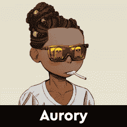</picture>](https://web.archive.org/web/20221208160703/https://dappradar.com/solana/marketplaces/solanart)

*   来自全国各地的村民聚集在奈夫蒂维尔参加聚会，与傲罗人见面
*   10，000 NFT
*   27.50 索尔底价

[<picture>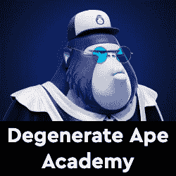</picture>](https://web.archive.org/web/20221208160703/https://dappradar.com/solana/marketplaces/solanart)

*   堕落猿学院是位于索拉纳的一个 NFT 品牌
*   该学院由 10，000 个退化的猿 NFT 组成
*   54 索尔底价

[<picture></picture>](https://web.archive.org/web/20221208160703/https://dappradar.com/solana/marketplaces/solanart)

*   索朋克是索拉纳区块链最早的非技术人员之一
*   一万个索朋克
*   4.5 SOL 底价

[<picture>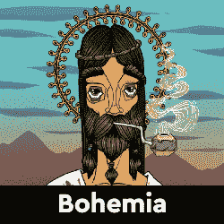</picture>](https://web.archive.org/web/20221208160703/https://dappradar.com/solana/marketplaces/magic-eden)

*   波西米亚是索拉纳的互动 NFT 艺术博览会
*   5000 波希米亚 NFTs 电话
*   将 3D 环境画廊概念与艺术、记号组学、打桩和多重燃烧机制相结合
*   5 索尔底价

[<picture>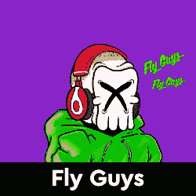</picture>](https://web.archive.org/web/20221208160703/https://dappradar.com/solana/marketplaces/magic-eden)

*   最初收集的 888 苍蝇 Mf 的索拉纳区块链
*   交朋友赚钱，变异，商品，等等
*   7 SOL 底价

[<picture></picture>](https://web.archive.org/web/20221208160703/https://dappradar.com/solana/marketplaces/magic-eden)

*   灵感来自玄学派艺术家乔尔乔·德·契里柯
*   神是遗产 6666 NFT 收集
*   8.6 SOL 底价

## 顶级 NFT 碎片

鉴于 NFT 的售价相当可观，细分的想法正在兴起，这给了小投资者一个参与的机会。细分的技术过程非常简单。拿一把 NFT，把它锁进金库，然后得到代币作为回报。

[<picture></picture>](https://web.archive.org/web/20221208160703/https://dappradar.com/nft/fractionalized)

这些代币代表了被锁定的 NFT 的所有权，它们的价值增加或减少意味着 NFT 资产的价值波动。投资者可以购买这些代币，并拥有 NFT 的一部分。要了解更多信息，请查看我们的[细分非功能性甲状腺素完全指南](/web/20221208160703/https://dappradar.com/blog/what-are-fractionalized-nfts-how-to-invest-in-them/)。

[<picture>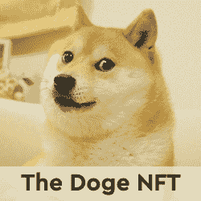</picture>](https://web.archive.org/web/20221208160703/https://dappradar.com/nft/fractionalized)

*   臭名昭著的总督 NFT 已经被切成了 11 亿块
*   每个狗代币目前价值 0.0103 美元

[<picture></picture>](https://web.archive.org/web/20221208160703/https://dappradar.com/nft/fractionalized)

*   以太石是第一批以太坊收藏的 NFT 之一
*   每个鹅卵石目前价值 0.00143 美元

[<picture></picture>](https://web.archive.org/web/20221208160703/https://dappradar.com/nft/fractionalized)

*   104 个底价密码朋克的集合
*   每个楼层代币目前价值 0.0448 美元

***以上不构成投资建议。此处给出的信息仅供参考。请行使尽职调查，做你的研究。作者在瑞士联邦理工学院、BTC、NIOX、AGIX、MATIC、MANA、SAFEMOON、SDAO、CAKE、HEX、LINK、GRT、CRO、OMI、GO、SHIBA INU 和 OCEAN 任职。***

 NewsletterUnsubscribe at any time. [T&Cs](https://web.archive.org/web/20221208160703/https://dappradar.com/terms) and [Privacy Policy](https://web.archive.org/web/20221208160703/https://dappradar.com/privacy-policy)