# 流行 Dapps——即玩即赚游戏、DeFi Yield 农业、热门 NFT 收藏和碎片

> 原文：<https://web.archive.org/web/https://dappradar.com/blog/trending-dapps-play-to-earn-games-defi-yield-farming-hot-nft-collections-shards>

## 流行 Dapps |第 3 周| 2022 年

****每周更新，发现各种类别的新 dapps，包括 DeFi yield farms、NFT 收集和 play-to-earn 游戏。本周，我们将探讨一些最热门的游戏赚钱和 GameFi 机会。DeFi 跨越几个区块链和一如既往，看看六个令人兴奋的 NFT 滴现在兴风作浪。****

区块链充满了不断发展的 dapps。在 DappRadar，我们在 20 多个不同的区块链跟踪数以千计的人。每周，DappRadar 都会深入生态系统，发掘那些流行的、即将到来的、有趣的 dapps。无论是以太坊上的 DeFi、蜡上的 NFT 系列，还是币安智能链上的 yield farming，我们都能满足您的需求。

## 亏损和收益农业

当我们谈到 DeFi 时，我们通常会提到 Uniswap、SushiSwap 和 PancakeSwap。这些大协议存在于以太坊、币安智能链和多边形上。然而，每个区块链都提供 DeFi 机会，因此我们重点介绍一些即将推出的替代区块链平台。

[<picture>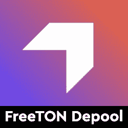</picture>](https://web.archive.org/web/20220930093245/https://dappradar.com/everscale/defi/freeton-depool)

*   FreeTON Depool 仪表板和标桩
*   该平台帮助用户安全地在弗里敦网络中下注

[<picture></picture>](https://web.archive.org/web/20220930093245/https://dappradar.com/harmony/defi/unite-finance)

*   联合金融是和谐 Mainnet 上第一个算法稳定的硬币
*   通过铸币税与 1 英镑的价格挂钩

[<picture>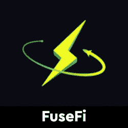</picture>](https://web.archive.org/web/20220930093245/https://dappradar.com/fuse/defi/fusefi)

*   Fuse.fi 为主流带来前所未有的 DeFi 功能
*   通过消费者友好的 Fuse Cash 移动应用程序

[<picture>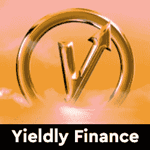</picture>](https://web.archive.org/web/20220930093245/https://dappradar.com/multichain/defi/yieldly-finance)

*   Yieldly 的产品套件包括赌注和流动性挖掘池、跨链互换等

[<picture>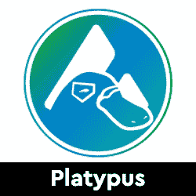</picture>](https://web.archive.org/web/20220930093245/https://dappradar.com/avalanche/defi/platypus)

*   鸭嘴兽是雪崩原生的稳定平台
*   基于资产负债管理
*   针对现有 StableSwap 限制精心设计

[<picture></picture>](https://web.archive.org/web/20220930093245/https://dappradar.com/rsk/defi/money-on-chain)

*   一个具有稳定的比特币、HODL 令牌和杠杆机制的比特币抵押 DeFi 协议
*   第 2 层 BTC 提升

## 玩赢游戏

游戏很有趣，但是区块链驱动的游戏给这种体验增加了一个全新的经济层面。突然你可以玩一个游戏并从中赚钱。并非所有游戏都有相同类型的财务激励，但当社区发展时，每一项区块链资产都会增值。

[<picture></picture>](https://web.archive.org/web/20220930093245/https://dappradar.com/wax/games/office-land)

*   办公室世界是一个虚拟的商业世界
*   你可以创建企业，收集员工，甚至使用他们赚取密码

[<picture>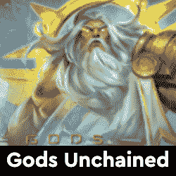</picture>](https://web.archive.org/web/20220930093245/https://dappradar.com/multichain/games/gods-unchained)

*   《被解放的上帝》是区块链上的一款 AAA 级游戏
*   得到了比特币基地等投资者的支持。

[<picture>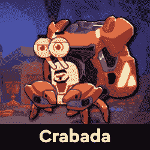</picture>](https://web.archive.org/web/20220930093245/https://dappradar.com/avalanche/games/crabada)

*   克拉巴达是一个令人兴奋的玩赚 NFT 游戏的基础上阿凡奇区块链
*   在达普拉达的队伍中迅速上升

[<picture>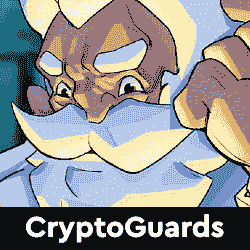</picture>](https://web.archive.org/web/20220930093245/https://dappradar.com/binance-smart-chain/games/cryptoguards)

*   密码卫士是元宇宙密码城的第三个项目
*   对抗外太空的力量，保护神秘的元宇宙

[<picture>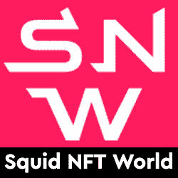</picture>](https://web.archive.org/web/20220930093245/https://dappradar.com/binance-smart-chain/games/squid-nft-world)

*   乌贼 NFT 世界是 BSC 上的一款游戏
*   Biswap 为玩家提供多重加密奖励

[<picture>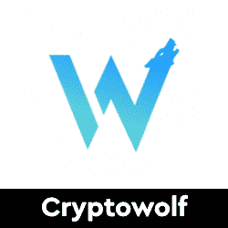</picture>](https://web.archive.org/web/20220930093245/https://dappradar.com/binance-smart-chain/games/cryptowolf-finance)

*   Cryptowolf Finance 是一款 NFT 游戏，玩家成为狼群的首领
*   在游戏中繁殖和交易它们

## 新 NFT 系列

隐朋克和艺术块已经成为最受欢迎的 NFT 收藏品。然而，还有很多其他项目可以作为很好的收藏品。在这里，我们强调了六个有趣的 NFT 项目，探索更多的水滴在地平线上。你知道你可以在 DappRadar 上买卖 NFT 吗？只需登录并开始使用我们的投资组合跟踪工具！

[<picture>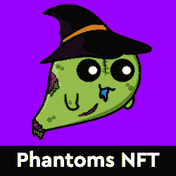</picture>](https://web.archive.org/web/20220930093245/https://dappradar.com/polygon/collectibles/phantoms-nft)

*   5，555 个独特生成的可收集角色，其所有权证明存储在多边形区块链上

[<picture>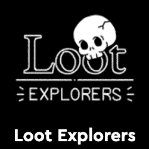</picture>](https://web.archive.org/web/20220930093245/https://dappradar.com/ethereum/collectibles/loot-explorer)

*   8000 个独特的探险家角色和他们自己独特的职业
*   装备了第一批 8000 创世纪 NFT 的战利品

[<picture>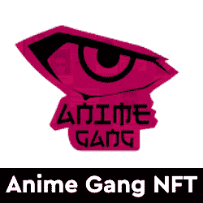</picture>](https://web.archive.org/web/20220930093245/https://dappradar.com/ethereum/collectibles/anime-gang-nft)

*   动漫团伙由 440 个元素组成，其中一些元素有颜色变化
*   常见的、罕见的、史诗般的和传奇的。

[<picture>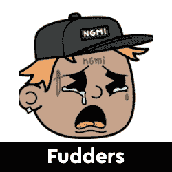</picture>](https://web.archive.org/web/20220930093245/https://dappradar.com/ethereum/collectibles/fudders)

*   Fudderverse 项目是一个捏造自己的项目
*   Fudders 是以太坊区块链上的 6464 个 NFT 的集合。

[<picture>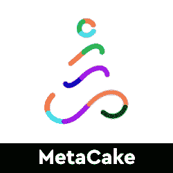</picture>](https://web.archive.org/web/20220930093245/https://dappradar.com/ethereum/collectibles/metacake-collabitclub)

*   集合中有 10，000 个唯一元券的元券 CC NFTs

[<picture>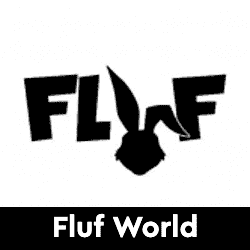</picture>](https://web.archive.org/web/20220930093245/https://dappradar.com/ethereum/collectibles/fluf-world)

*   10，000 个 3D 动画 NFT 兔头像
*   只有一样东西比胡萝卜更受 FLUFs 喜爱，那就是兴奋剂！

## 顶级 NFT 碎片

鉴于 NFT 的售价相当可观，细分的想法正在兴起，这给了小投资者一个参与的机会。细分的技术过程非常简单。拿一把 NFT，把它锁进金库，然后得到代币作为回报。这些代币代表了被锁定的 NFT 的所有权，它们的价值增加或减少意味着 NFT 资产的价值波动。投资者可以购买这些代币，并拥有 NFT 的一部分。要了解更多信息，请查看我们的[细分非功能性甲状腺素完全指南](/web/20220930093245/https://dappradar.com/blog/what-are-fractionalized-nfts-how-to-invest-in-them/)。

[<picture></picture>](https://web.archive.org/web/20220930093245/https://dappradar.com/nft/fractionalized)

*   臭名昭著的总督 NFT 已经被切成了 11 亿块
*   每个狗代币目前价值 0.0103 美元

[<picture></picture>](https://web.archive.org/web/20220930093245/https://dappradar.com/nft/fractionalized)

*   以太石是第一批以太坊收藏的 NFT 之一
*   每个鹅卵石目前价值 0.00143 美元

[<picture></picture>](https://web.archive.org/web/20220930093245/https://dappradar.com/nft/fractionalized)

*   104 个底价密码朋克的集合
*   每个楼层代币目前价值 0.0448 美元

***以上不构成投资建议。此处给出的信息仅供参考。请行使尽职调查，做你的研究。作者在瑞士联邦理工学院、BTC、NIOX、AGIX、MATIC、MANA、SAFEMOON、SDAO、CAKE、HEX、LINK、GRT、CRO、OMI、GO、SHIBA INU 和 OCEAN 任职。***

 NewsletterUnsubscribe at any time. [T&Cs](https://web.archive.org/web/20220930093245/https://dappradar.com/terms) and [Privacy Policy](https://web.archive.org/web/20220930093245/https://dappradar.com/privacy-policy)