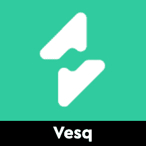
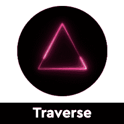
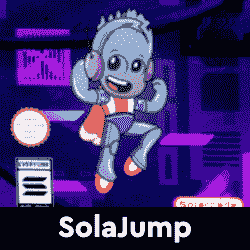
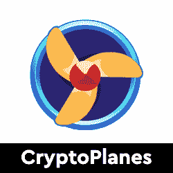
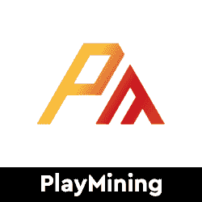
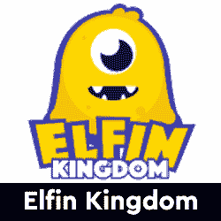
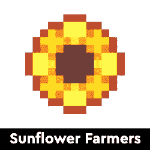
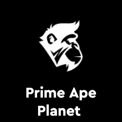
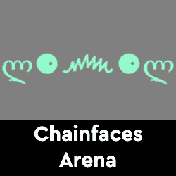

# 流行 Dapps–即玩即赚游戏、多链 DeFi 和热门 NFT 系列

> 原文：<https://web.archive.org/web/https://dappradar.com/blog/trending-dapps-play-to-earn-games-multichain-defi-hot-nft-collections>

## 流行 Dapps |第 1 周| 2022 年

****每周更新，发现各种类别的新 dapps，包括 DeFi yield farms、NFT 收集和 play-to-earn 游戏。本周，我们将探讨一些最热门的游戏赚钱和 GameFi 机会。DeFi 跨越几个区块链和一如既往，看看六个令人兴奋的 NFT 滴现在兴风作浪。****

区块链充满了不断发展的 dapps。在 DappRadar，我们在 20 个不同的区块链跟踪数以千计的人。每周，DappRadar 都会深入生态系统，发掘那些流行的、即将到来的、有趣的 dapps。无论是以太坊上的 DeFi、蜡上的 NFT 系列，还是币安智能链上的 yield farming，我们都能满足您的需求。

## 亏损和收益农业

当我们谈到 DeFi 时，我们通常会提到 Uniswap、SushiSwap 和 PancakeSwap。这些大协议存在于以太坊、币安智能链和多边形上。然而，每个区块链都提供 DeFi 机会，因此我们重点介绍一些即将推出的替代区块链平台。

[<picture></picture>](https://web.archive.org/web/20220929043605/https://dappradar.com/multichain/defi/gooddollar-1)

*   GoodDollar 是以太坊和第二层熔丝上的非盈利协议
*   旨在让每个人都能使用数字货币

[<picture></picture>](https://web.archive.org/web/20220929043605/https://dappradar.com/harmony/defi/unite-finance)

*   联合金融是和谐网上第一个算法稳定的硬币
*   通过铸币税与 1 英镑的价格挂钩

[<picture></picture>](https://web.archive.org/web/20220929043605/https://dappradar.com/polygon/defi/vesq)

*   Vesq 是一种由 Polygon 上的资产支持的储备货币。
*   为获得最佳回报，投资、发行债券并利用你的资产

[<picture></picture>](https://web.archive.org/web/20220929043605/https://dappradar.com/binance-smart-chain/defi/pinksale)

*   PinkSale 是一个协议，旨在为用户提供启动他们自己的令牌和创建他们自己的初始令牌销售的能力

[<picture></picture>](https://web.archive.org/web/20220929043605/https://dappradar.com/polygon/defi/nacho-finance)

*   Nacho 是一种算法稳定币，旨在以低费用为多边形网络上的以太坊持有者带来高年利率

[<picture></picture>](https://web.archive.org/web/20220929043605/https://dappradar.com/avalanche/defi/traverse)

*   Traverse 是目前在基于 verse 令牌的 Avalanche 网络上可用的第一个多链储备货币协议

## 玩赢游戏

游戏很有趣，但是区块链驱动的游戏给这种体验增加了一个全新的经济层面。突然你可以玩一个游戏并从中赚钱。并非所有游戏都有相同类型的财务激励，但当社区发展时，每一项区块链资产都会增值。

[<picture></picture>](https://web.archive.org/web/20220929043605/https://dappradar.com/solana/games/solajump)

*   SolaJump NFT 游戏以一种扭曲的方式带回了经典的街机游戏体验
*   10，000 NFT，算法生成的独特收藏品

[<picture></picture>](https://web.archive.org/web/20220929043605/https://dappradar.com/binance-smart-chain/games/cryptoplanes)

*   加密飞机是加密城市元宇宙的扩展
*   著名的 NFT 赛车游戏 CryptoCars 就是在这里诞生的

[<picture></picture>](https://web.archive.org/web/20220929043605/https://dappradar.com/dep/games/playmining)

*   PlayMining 是一款赚取 NFT 的游戏平台
*   玩各种免费游戏。你可以在玩游戏时赚取 DEP 币。

[<picture></picture>](https://web.archive.org/web/20220929043605/https://dappradar.com/binance-smart-chain/games/secondlive)

*   选择生活，选择空间，选择朋友。
*   成为你渴望的偶像，在展览、舞池和购物中心等空间漫游

[<picture></picture>](https://web.archive.org/web/20220929043605/https://dappradar.com/binance-smart-chain/games/elfin-kingdom)

*   小精灵王国融合了 Defi yield 农业、NFT 收藏和采矿以及竞技电子竞技

[<picture></picture>](https://web.archive.org/web/20220929043605/https://dappradar.com/polygon/games/sunflower-farmers)

*   一个开源的游戏赚取无限的可能性来赚取
*   种植，工艺，采矿，剁碎，捕鱼，战斗和更多你建立你的农业帝国

## 顶级 NFT 系列

隐朋克和艺术块已经成为最受欢迎的 NFT 收藏品。然而，还有很多其他项目可以作为很好的收藏品。在这里，我们强调了六个有趣的 NFT 项目，探索更多的水滴在地平线上。你知道你可以在 DappRadar 上买卖 NFT 吗？只需登录并开始使用我们的投资组合跟踪工具！

[<picture></picture>](https://web.archive.org/web/20220929043605/https://dappradar.com/ethereum/collectibles/kumo-x-world-residents)

*   6666 个库莫居民，9 个职业，500+性状。
*   一定比例的销售额捐给了儿童和心理健康慈善机构

[<picture></picture>](https://web.archive.org/web/20220929043605/https://dappradar.com/ethereum/collectibles/yung-ape-squad-official)

*   几个世纪的物种间战争让少数幸存者从猿类种群中幸存下来
*   多样的服装、装备、外观等等

[<picture></picture>](https://web.archive.org/web/20220929043605/https://dappradar.com/ethereum/collectibles/prime-ape-planet-pap)

*   7，979 只 3D 手绘原始猿的独特收藏，储存在以太坊网络上
*   在不到 24 小时内,《原始猿类星球》的不和谐成员达到了 100，000 人以上

[<picture></picture>](https://web.archive.org/web/20220929043605/https://dappradar.com/ethereum/collectibles/phantabear)

*   Phanta Bear 是一个由 10，000 个算法生成的数字收藏品组成的集合，可以作为 Ezek 俱乐部的会员卡

[<picture></picture>](https://web.archive.org/web/20220929043605/https://dappradar.com/ethereum/collectibles/linksdao)

*   LinksDAO NFTs 将在短期内允许社区访问、治理、各种津贴和游戏

[<picture></picture>](https://web.archive.org/web/20220929043605/https://dappradar.com/ethereum/collectibles/chainfaces-arena)

*   ChainFaces Arena 是最初的链上创成式 ASCII 文本面的备受期待的继承者

## 元宇宙土地

毫无疑问，元宇宙土地是 NFT 空间的下一个大热门。输出创纪录的销售数字和不断增加的 NFT 价格，虚拟世界是密码领域的新的顶级商品。对沙盒和分散土地等虚拟世界的关注浪潮始于脸书对 Meta 的更名。

[<picture></picture>](https://web.archive.org/web/20220929043605/https://dappradar.com/ethereum/marketplaces/decentraland)

*   领先的虚拟世界平台
*   MANA token
*   定期出售土地和二级市场的可用性

[<picture></picture>](https://web.archive.org/web/20220929043605/https://dappradar.com/ethereum/games/somnium-space)

*   完全沉浸式 VR 虚拟世界
*   多维数据集令牌
*   Solana Haloplex 的土地和世界销售

[<picture></picture>](https://web.archive.org/web/20220929043605/https://dappradar.com/ethereum/games/the-sandbox)

*   在沙盒中，创作者可以制作、玩、分享和交易他们自己的游戏世界
*   土地代币

## 顶级 NFT 碎片

鉴于 NFT 的售价相当可观，细分的想法正在兴起，这给了小投资者一个参与的机会。细分的技术过程非常简单。拿一把 NFT，把它锁进金库，然后得到代币作为回报。这些代币代表了被锁定的 NFT 的所有权，它们的价值增加或减少意味着 NFT 资产的价值波动。投资者可以购买这些代币，并拥有 NFT 的一部分。要了解更多信息，请查看我们的[细分非功能性甲状腺肿的完整指南](/web/20220929043605/https://dappradar.com/blog/what-are-fractionalized-nfts-how-to-invest-in-them/)。

[<picture></picture>](https://web.archive.org/web/20220929043605/https://dappradar.com/nft/fractionalized)

*   臭名昭著的总督 NFT 已经被切成了 11 亿块
*   每个狗代币目前价值 0.0103 美元

[<picture></picture>](https://web.archive.org/web/20220929043605/https://dappradar.com/nft/fractionalized)

*   以太石是第一批以太坊收藏的 NFT 之一
*   每个鹅卵石目前价值 0.00143 美元

[<picture></picture>](https://web.archive.org/web/20220929043605/https://dappradar.com/nft/fractionalized)

*   104 个底价密码朋克的集合
*   每个楼层代币目前价值 0.0448 美元

***以上不构成投资建议。此处给出的信息仅供参考。请行使尽职调查，做你的研究。作者在瑞士联邦理工学院、BTC、NIOX、AGIX、MATIC、MANA、SAFEMOON、SDAO、CAKE、HEX、LINK、GRT、CRO、OMI、GO、SHIBA INU 和 OCEAN 任职。***

 NewsletterUnsubscribe at any time. [T&Cs](https://web.archive.org/web/20220929043605/https://dappradar.com/terms) and [Privacy Policy](https://web.archive.org/web/20220929043605/https://dappradar.com/privacy-policy)