# 流行 Dapps——关于蜡像、DeFi & Yield 农业、新 NFT 系列的游戏

> 原文：<https://web.archive.org/web/https://dappradar.com/blog/trending-dapps-play-to-earn-games-on-wax-defi-yield-farming-new-nft-collections>

## 流行 Dapps |第 4 周| 2022 年

****每周更新，发现各种类别的新 dapps，包括 DeFi yield farms、NFT 收集和 play-to-earn 游戏。本周，我们将探讨一些最热门的游戏赚钱和 GameFi 机会。DeFi 跨越几个区块链和一如既往，看看六个令人兴奋的 NFT 滴现在兴风作浪。****

区块链充满了不断发展的 dapps。在 DappRadar，我们在 20 多个不同的区块链跟踪数以千计的人。每周，DappRadar 都会深入生态系统，发掘那些流行的、即将到来的、有趣的 dapps。无论是以太坊上的 DeFi、蜡上的 NFT 系列，还是币安智能链上的 yield farming，我们都能满足您的需求。

## 亏损和收益农业

当我们谈到 DeFi 时，我们通常会提到 Uniswap、SushiSwap 和 PancakeSwap。这些大协议存在于以太坊、币安智能链和多边形上。然而，每个区块链都提供 DeFi 机会，因此我们重点介绍一些即将推出的平台。

[<picture>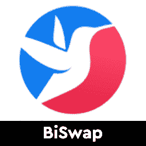</picture>](https://web.archive.org/web/20221208160032/https://dappradar.com/binance-smart-chain/defi/biswap)

*   币安智能链上的分散交换，具有三种类型的转介系统和低费用
*   由 BSW 令牌提供动力

[<picture>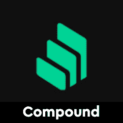</picture>](https://web.archive.org/web/20221208160032/https://dappradar.com/ethereum/defi/compound)

*   复利是一种算法，自主利率协议
*   专为开发人员打造，用于解锁开放式金融应用

[<picture>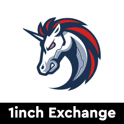</picture>](https://web.archive.org/web/20221208160032/https://dappradar.com/multichain/defi/1inch-network)

*   DEX 聚合器解决方案
*   搜索多个流动性来源的交易，为用户提供比任何单个交易所都更好的利率

[<picture>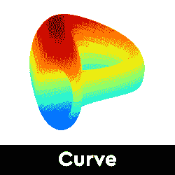</picture>](https://web.archive.org/web/20221208160032/https://dappradar.com/multichain/defi/curve)

*   Curve 是针对稳定债券优化的自动做市商
*   提供一个交易所，并允许流动性提供者赚取费用和贷款利息

[<picture>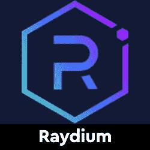</picture>](https://web.archive.org/web/20221208160032/https://dappradar.com/solana/defi/raydium)

*   Raydium 是建立在 Solana 区块链基础上的自动做市商(AMM)
*   利用基于 Solana 的血清 DEX 的中央订单簿

[<picture>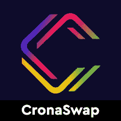</picture>](https://web.archive.org/web/20221208160032/https://dappradar.com/cronos/defi/cronaswap)

*   CronaSwap 是 Cronos 链上的一个去中心化的交换平台
*   保证卓越的速度和更低的网络交易成本

## 蜡上的玩赢游戏

游戏很有趣，但是区块链驱动的游戏给这种体验增加了一个全新的经济层面。随着汽油费现在达到峰值，蜡像区块链可以提供一个很好的解决方案。突然你可以玩一个游戏并从中赚钱。并非所有游戏都有相同类型的财务激励，但当社区发展时，每一项区块链资产都会增值。

[<picture>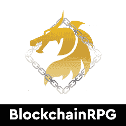</picture>](https://web.archive.org/web/20221208160032/https://dappradar.com/wax/games/blockchainrpg)

*   追捕怪物，工艺物品，并成为这个分散的免费玩 RPG 最大的冒险家

[<picture>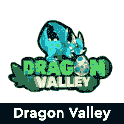</picture>](https://web.archive.org/web/20221208160032/https://dappradar.com/wax/games/dragons-valley)

*   成为一名驯龙师，进化你的龙，帮助击败地精，恢复龙之谷的和平
*   获得奖励

[<picture>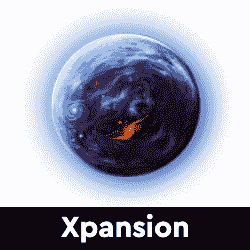</picture>](https://web.archive.org/web/20221208160032/https://dappradar.com/wax/games/xpansion)

*   Xpansion 是一款分散的 4x 策略游戏，由 NFTs 提供支持
*   BSC 和 WAX 网络上都有

[<picture>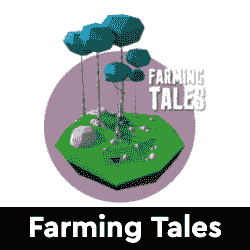</picture>](https://web.archive.org/web/20221208160032/https://dappradar.com/wax/games/farming-tales)

*   其中 NFT 代表来自真实农场的真实产品
*   建造你的农场，成为我们土地的共有人，生产你的产品，直接送货上门或在真实市场上出售。

[<picture>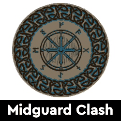</picture>](https://web.archive.org/web/20221208160032/https://dappradar.com/wax/games/midgard-clash)

*   Midgard 是一个基于数字交易卡的限量版 PvE 和 PvP 游戏集合
*   灵感来自斯堪的纳维亚神话

[<picture>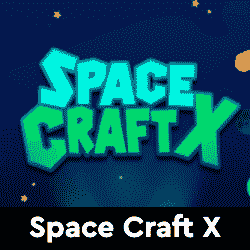</picture>](https://web.archive.org/web/20221208160032/https://dappradar.com/wax/games/spacecraftx)

*   Space CraftX 是一款蜡制的太空 NFT 游戏
*   将游戏代币兑换成加密货币的可能性
*   探索收集宇宙尘埃，暗物质和波

## 新 NFT 系列

隐朋克和艺术块已经成为最受欢迎的 NFT 收藏品。然而，还有很多其他项目可以作为很好的收藏品。在这里，我们强调了六个有趣的 NFT 项目，探索更多的水滴在地平线上。你知道你可以在 DappRadar 上买卖 NFT 吗？只需登录并开始使用我们的投资组合跟踪工具！

[<picture>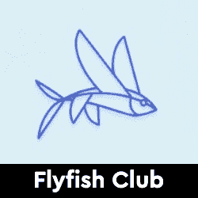</picture>](https://web.archive.org/web/20221208160032/https://dappradar.com/blog/new-dapps-report-nft-collectibles-january-2022-edition-2)

*   由业内资深人士 Gary Vee 领导的 VCR 集团制作的系列。
*   在纽约最负盛名的餐厅之一用餐

[<picture>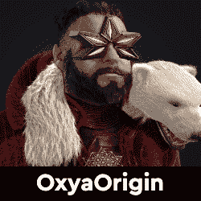</picture>](https://web.archive.org/web/20221208160032/https://dappradar.com/blog/new-dapps-report-nft-collectibles-january-2022-edition-2)

*   头像系列于 1 月 6 日推出，但交易量已经达到 1400 万美元
*   在过去 7 天的交易量中排名第 21 位

[<picture></picture>](https://web.archive.org/web/20221208160032/https://dappradar.com/blog/new-dapps-report-nft-collectibles-january-2022-edition-2)

*   中国制作公司 Ezek Group 和 PHANTACi 的合作项目
*   自推出以来，交易量接近 2900 万美元
*   在过去 7 天交易量最大的收藏中排名第 11

[<picture>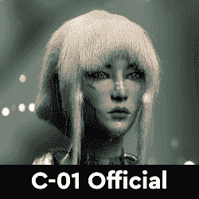</picture>](https://web.archive.org/web/20221208160032/https://dappradar.com/blog/new-dapps-report-nft-collectibles-january-2022-edition-3)

*   由曾为香奈儿和路易威登工作过的法国时尚界资深人士开发。
*   该系列于 1 月中旬推出，铸造两周后，其最高销量为 40 ETH/96，000 美元

[<picture>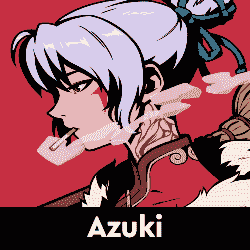</picture>](https://web.archive.org/web/20221208160032/https://dappradar.com/blog/new-dapps-report-nft-collectibles-january-2022-edition-3)

*   以动漫为灵感的收藏，旨在通过推广艺术、音乐和在线社区来建立狂热的追随者
*   两周内总交易量超过 1.12 亿美元
*   目前是过去七天交易量第五大的收藏。

[<picture>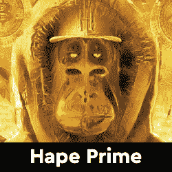</picture>](https://web.archive.org/web/20221208160032/https://dappradar.com/blog/new-dapps-report-nft-collectibles-january-2022-edition-3)

*   BAYC 灵感系列
*   强大的社交媒体影响力
*   近 280，000 名 Twitter 关注者和 450，000 名 Discord 用户
*   底价资产增长 3700%。

## 顶级 NFT 碎片

鉴于 NFT 的售价相当可观，细分的想法正在兴起，这给了小投资者一个参与的机会。细分的技术过程非常简单。拿一把 NFT，把它锁进金库，然后得到代币作为回报。这些代币代表了被锁定的 NFT 的所有权，它们的价值增加或减少意味着 NFT 资产的价值波动。投资者可以购买这些代币，并拥有 NFT 的一部分。要了解更多信息，请查看我们的[细分非功能性甲状腺素完全指南](/web/20221208160032/https://dappradar.com/blog/what-are-fractionalized-nfts-how-to-invest-in-them/)。

[<picture></picture>](https://web.archive.org/web/20221208160032/https://dappradar.com/nft/fractionalized)

*   臭名昭著的总督 NFT 已经被切成了 11 亿块
*   每个狗代币目前价值 0.0103 美元

[<picture>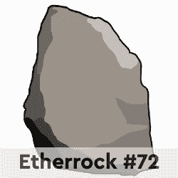</picture>](https://web.archive.org/web/20221208160032/https://dappradar.com/nft/fractionalized)

*   以太石是第一批以太坊收藏的 NFT 之一
*   每个鹅卵石目前价值 0.00143 美元

[<picture></picture>](https://web.archive.org/web/20221208160032/https://dappradar.com/nft/fractionalized)

*   104 个底价密码朋克的集合
*   每个楼层代币目前价值 0.0448 美元

***以上不构成投资建议。此处给出的信息仅供参考。请行使尽职调查，做你的研究。作者在瑞士联邦理工学院、BTC、NIOX、AGIX、MATIC、MANA、SAFEMOON、SDAO、CAKE、HEX、LINK、GRT、CRO、OMI、GO、SHIBA INU 和 OCEAN 任职。***

 NewsletterUnsubscribe at any time. [T&Cs](https://web.archive.org/web/20221208160032/https://dappradar.com/terms) and [Privacy Policy](https://web.archive.org/web/20221208160032/https://dappradar.com/privacy-policy)