# 趋势 Dapps——聚焦 Fantom、前 6 大玩赚游戏和 Tezos 上的 NFT 市场

> 原文：<https://web.archive.org/web/https://dappradar.com/blog/trending-dapps-spotlight-on-fantom-top-6-play-to-earn-games-nft-marketplaces-on-tezos>

## 流行 Dapps |第 5 周| 2022 年

****每周更新，发现各种类别的新 dapps，包括 Fantom 上的 DeFi yield farms、Tezos 上的 NFT 市场，以及全区块链排名前六的玩赚游戏。****

区块链充满了不断发展的 dapps。在 DappRadar，我们在 20 多个不同的区块链跟踪数以千计的人。每周，DappRadar 都会深入生态系统，发掘那些流行的、即将到来的、有趣的 dapps。无论是以太坊上的 DeFi、蜡上的 NFT 系列，还是币安智能链上的 yield farming，我们都能满足您的需求。

## Fantom 上的 DeFi & Yield 农业

本周，我们将聚焦于以 DeFi 为中心、最近整合的 Fantom 网络。[锁定近 90 亿美元的总价值](https://web.archive.org/web/20220925231859/https://defillama.com/chain/Fantom) (TVL)该网络目前约占 DeFi 总 TVL 的 5%。因此，重要的是观察其生态系统中最重要的 dapps，揭示它们的作用，以及它们是否显示出积极的增长信号。

[<picture>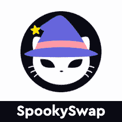</picture>](https://web.archive.org/web/20220925231859/https://dappradar.com/fantom/exchanges/spookyswap)

*   SpookySwap 是 Fantom 上领先的令牌交换平台。
*   利用低费用和快速交易时间创造无缝交换体验。

[<picture>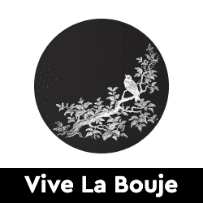</picture>](https://web.archive.org/web/20220925231859/https://dappradar.com/fantom/defi/vive-la-bouje)

*   Vive La Bouje 是第二代产量养殖平台。
*   利用名为 APR reset 的新时代系统(灵感来自 Swift Finance)。

[<picture>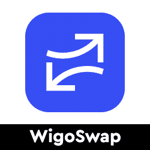</picture>](https://web.archive.org/web/20220925231859/https://dappradar.com/fantom/defi/wigoswap)

*   提供自动做市商的 DeFi 平台(AMM)。
*   同时提供农业机会和 NFT 市场。

[<picture>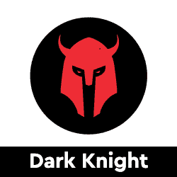</picture>](https://web.archive.org/web/20220925231859/https://dappradar.com/fantom/exchanges/dark-knight)

*   共生生态系统，帮助投资者加速他们的财富生成。
*   旨在最大化上升潜力同时限制错误的工具。

[<picture>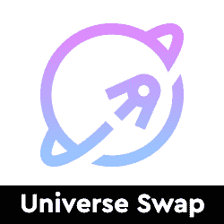</picture>](https://web.archive.org/web/20220925231859/https://dappradar.com/fantom/defi/universe-swap)

*   Fantom 网络上的稳定 DeFi 令牌，帮助投资者保护资金。
*   主要目标是提供一个安全、稳定的农场，并拥有一个强大而活跃的社区。

[<picture>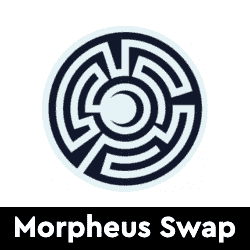</picture>](https://web.archive.org/web/20220925231859/https://dappradar.com/fantom/defi/morpheus-swap)

*   分散交换和耕作协议。
*   主要致力于为交易者提供安全、稳定和有利可图的体验。

## 玩赢游戏

游戏很有趣，但是区块链驱动的游戏给这种体验增加了一个全新的经济层面。突然你可以玩一个游戏并从中赚钱。并非所有游戏都有相同类型的财务激励，但当社区发展时，每一项区块链资产都会增值。以下是本周排名前六的“玩即赚”游戏。

[<picture>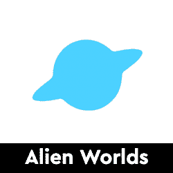</picture>](https://web.archive.org/web/20220925231859/https://dappradar.com/multichain/games/alien-worlds)

*   使用 Trilium (TLM)游戏代币加入模拟地球经济的外星世界。
*   在 Trilium 和 NFT 的社交元宇宙寻求财富和发展。

[<picture>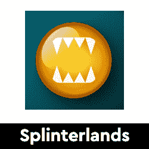</picture>](https://web.archive.org/web/20220925231859/https://dappradar.com/multichain/games/splinterlands)

*   Splinterlands 是一款可收藏的交易型多人卡牌游戏，设计介于口袋妖怪卡牌游戏和魔兽世界之间。
*   OG 游戏赚取游戏与坚实的 2022 年路线图

[<picture></picture>](https://web.archive.org/web/20220925231859/https://dappradar.com/wax/games/farmers-world)

*   农民世界是第一个在 Wax 上运行的农业游戏。
*   挑选工具，开发各种资源，购买土地建造巨大的农场。
*   一边玩一边赚。

[<picture>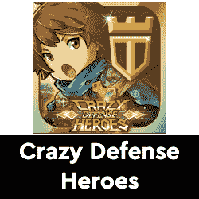</picture>](https://web.archive.org/web/20220925231859/https://dappradar.com/multichain/games/crazy-defense-heroes)

*   疯狂防御英雄是一款免费玩和玩赚结合的塔防手游。
*   每天玩游戏赚取塔代币。

[<picture>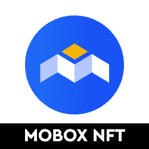</picture>](https://web.archive.org/web/20220925231859/https://dappradar.com/binance-smart-chain/games/mobox-nft-farmer)

*   使用流动性池、产量农业和 NFTs 寻找最佳产量策略。
*   生成可以在众多游戏中使用的独特的 NFT。

[<picture>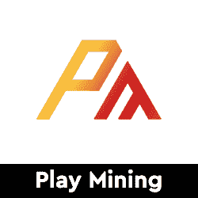</picture>](https://web.archive.org/web/20220925231859/https://dappradar.com/dep/games/playmining)

*   PlayMining 是一个赚取 NFT 游戏平台，你可以玩各种免费游戏。
*   玩游戏时赚取 DEP 币。

## 泰佐斯的 NFT 市场

CryptoPunks 和 Bored Ape Yacht Club 已经成为 NFT 最受欢迎的收藏品。虽然这些生活在以太坊，许多其他项目作为不同区块链的伟大收藏品。在这里，我们强调了所谓的[环境友好型 Tezos 网络](https://web.archive.org/web/20220925231859/https://medium.com/tqtezos/clean-nfts-on-tezos-58566b2fdba1)上的三个 NFT 市场，随着 NFT 滴滴在地平线上，这些市场值得探索。

你知道你可以在 DappRadar 上买卖 NFT 吗？只需登录并开始使用我们的投资组合跟踪工具！

[<picture>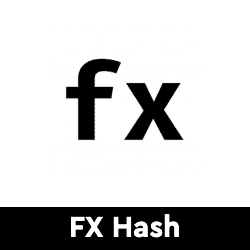</picture>](https://web.archive.org/web/20220925231859/https://dappradar.com/tezos/marketplaces/fxhash)

*   这是一个开放的平台，可以在泰佐斯区块链上创建和收集生成性艺术作品
*   **过去 7 天用户增长 10%**

[<picture></picture>](https://web.archive.org/web/20220925231859/https://dappradar.com/tezos/marketplaces/objkt-com)

*   Tezos 上的 FA2 市场，允许拍卖和交易 NFT
*   **过去 7 天用户增加了 15%**

[<picture>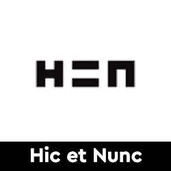</picture>](https://web.archive.org/web/20220925231859/https://dappradar.com/tezos/marketplaces/hic-et-nunc)

*   这是一个开发者拉斐尔·利马的创意，他在泰佐斯区块链上从零开始建造它
*   **过去 7 天用户增加了 5%**

## 顶级 NFT 碎片

鉴于 NFT 的售价相当可观，细分的想法正在兴起，这给了小投资者一个参与的机会。细分的技术过程非常简单。拿一把 NFT，把它锁进金库，然后得到代币作为回报。这些代币代表了被锁定的 NFT 的所有权，它们的价值增加或减少意味着 NFT 资产的价值波动。投资者可以购买这些代币，并拥有 NFT 的一部分。要了解更多信息，请查看我们的[细分非功能性甲状腺素完全指南](/web/20220925231859/https://dappradar.com/blog/what-are-fractionalized-nfts-how-to-invest-in-them/)。

[<picture></picture>](https://web.archive.org/web/20220925231859/https://dappradar.com/nft/fractionalized)

*   臭名昭著的总督 NFT 已经被切成了 11 亿块
*   每个狗代币目前价值 0.0103 美元

[<picture></picture>](https://web.archive.org/web/20220925231859/https://dappradar.com/nft/fractionalized)

*   以太石是第一批以太坊收藏的 NFT 之一
*   每个鹅卵石目前价值 0.00143 美元

[<picture>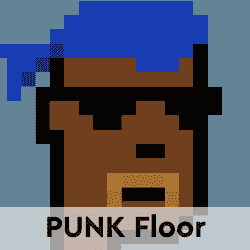</picture>](https://web.archive.org/web/20220925231859/https://dappradar.com/nft/fractionalized)

*   104 个底价密码朋克的集合
*   每个楼层代币目前价值 0.0448 美元

***以上不构成投资建议。此处给出的信息仅供参考。请行使尽职调查，做你的研究。作者在瑞士联邦理工学院、BTC、NIOX、AGIX、MATIC、MANA、SAFEMOON、SDAO、CAKE、HEX、LINK、GRT、CRO、OMI、GO、SHIBA INU 和 OCEAN 任职。***

 NewsletterUnsubscribe at any time. [T&Cs](https://web.archive.org/web/20220925231859/https://dappradar.com/terms) and [Privacy Policy](https://web.archive.org/web/20220925231859/https://dappradar.com/privacy-policy)