# 热门 Dapps–顶级游戏，DeFi 产量农业和即将推出的 Solana NFTs

> 原文：<https://web.archive.org/web/https://dappradar.com/blog/trending-dapps-top-play-to-earn-games-defi-yield-farming-forthcoming-solana-nfts>

## 流行 Dapps |第 2 周| 2022 年

****每周更新，发现各种类别的新 dapps，包括 DeFi yield farms、NFT 收集和 play-to-earn 游戏。本周，我们将探讨一些最热门的游戏赚钱和 GameFi 机会。DeFi 跨越几个区块链和一如既往，看看六个令人兴奋的 NFT 滴现在兴风作浪。****

区块链充满了不断发展的 dapps。在 DappRadar，我们在 20 多个不同的区块链跟踪数以千计的人。每周，DappRadar 都会深入生态系统，发掘那些流行的、即将到来的、有趣的 dapps。无论是以太坊上的 DeFi、蜡上的 NFT 系列，还是币安智能链上的 yield farming，我们都能满足您的需求。

## 亏损和收益农业

当我们谈到 DeFi 时，我们通常会提到 Uniswap、SushiSwap 和 PancakeSwap。这些大协议存在于以太坊、币安智能链和多边形上。然而，每个区块链都提供 DeFi 机会，因此我们重点介绍一些即将推出的替代区块链平台。

[<picture></picture>](https://web.archive.org/web/20220929043049/https://dappradar.com/multichain/defi/gooddollar-1)

*   GoodDollar 是以太坊和第二层熔丝上的非盈利协议
*   旨在让每个人都能使用数字货币

[<picture>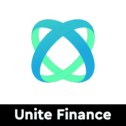</picture>](https://web.archive.org/web/20220929043049/https://dappradar.com/harmony/defi/unite-finance)

*   联合金融是和谐 Mainnet 上第一个算法稳定的硬币
*   通过铸币税与 1 英镑的价格挂钩

[<picture></picture>](https://web.archive.org/web/20220929043049/https://dappradar.com/binance-smart-chain/defi/dibs-money)

*   $DIBS 算法令牌是快速增长的生态系统的支柱
*   为 BSC 网络带来流动性和新的使用案例

[<picture>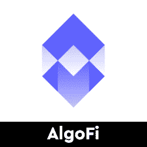</picture>](https://web.archive.org/web/20220929043049/https://dappradar.com/algorand/defi/algofi)

*   基于 Algorand 的分散式借贷协议和 stablecoin

[<picture></picture>](https://web.archive.org/web/20220929043049/https://dappradar.com/thundercore/defi/cooky-finance)

*   雷霆核心网络上的星际争霸和农场
*   cookies 是一种分散储备货币，带有实用令牌

[<picture>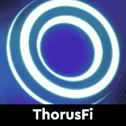</picture>](https://web.archive.org/web/20220929043049/https://dappradar.com/avalanche/defi/thorusfi)

*   Thorus 是一个一体化的跨链 DeFi 平台
*   适应性强的资金系统和代币持有者优先的方法

## 玩赢游戏

游戏很有趣，但是区块链驱动的游戏给这种体验增加了一个全新的经济层面。突然你可以玩一个游戏并从中赚钱。并非所有游戏都有相同类型的财务激励，但当社区发展时，每一项区块链资产都会增值。

[<picture>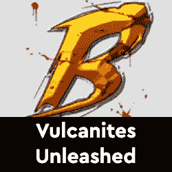</picture>](https://web.archive.org/web/20220929043049/https://dappradar.com/vulcanforged/games/berserk-vulcanites-unleashed)

*   在这个高强度的 NFT 卡片收藏游戏中与野兽和咒语战斗

[<picture>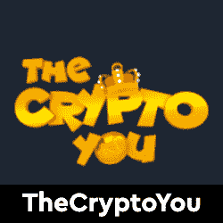</picture>](https://web.archive.org/web/20220929043049/https://dappradar.com/binance-smart-chain/games/the-crypto-you)

*   召唤人物，完成日常采矿任务，征服黑暗力量，掠夺稀有物品来玩和赚取

[<picture>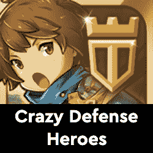</picture>](https://web.archive.org/web/20220929043049/https://dappradar.com/multichain/games/crazy-defense-heroes)

*   每天玩到赚到塔代币
*   结合免费游戏和赚取游戏的塔防手机游戏

[<picture>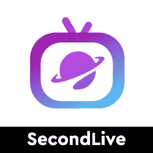</picture>](https://web.archive.org/web/20220929043049/https://dappradar.com/binance-smart-chain/games/secondlive)

*   选择生活，选择空间，选择朋友。
*   成为你渴望的偶像，在展览、舞池和购物中心等空间漫游

[<picture>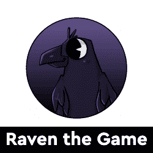</picture>](https://web.archive.org/web/20220929043049/https://dappradar.com/binance-smart-chain/games/raven-the-game)

*   渡鸦游戏是一款游戏，目前在 Google Play 上直播
*   这项运动的最佳得分手每周都能得到 RTG 的报酬

[<picture>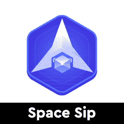</picture>](https://web.archive.org/web/20220929043049/https://dappradar.com/binance-smart-chain/games/space-sip)

*   太空 SIP 是一款 NFT 太空战舰游戏
*   我的 SIP 令牌
*   参与战斗，使用赚取 SIP 令牌

## 即将推出的索拉纳·NFT 系列

隐朋克和艺术块已经成为最受欢迎的 NFT 收藏品。然而，还有很多其他项目可以作为很好的收藏品。在这里，我们强调了六个有趣的 NFT 项目，探索更多的水滴在地平线上。你知道你可以在 DappRadar 上买卖 NFT 吗？只需登录并开始使用我们的投资组合跟踪工具！

[<picture>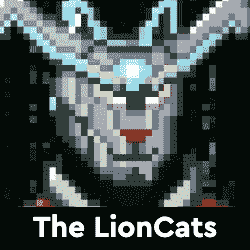</picture>](https://web.archive.org/web/20220929043049/https://dappradar.com/nft/collections/protocol/solana)

*   2012 年 1 月 13 日发布
*   NFT 收藏了 799 只以为自己是狮子的猫

[<picture></picture>](https://web.archive.org/web/20220929043049/https://dappradar.com/nft/collections/protocol/solana)

*   2012 年 1 月 14 日发布
*   9，999 个复古风格的高质量 3D SoulDogs 漫游在索拉纳

[<picture></picture>](https://web.archive.org/web/20220929043049/https://dappradar.com/nft/collections/protocol/solana)

*   2012 年 1 月 13 日发布
*   独特的意识球体在索拉纳区块链巡游

[<picture></picture>](https://web.archive.org/web/20220929043049/https://dappradar.com/nft/collections/protocol/solana)

*   2012 年 1 月 13 日发布
*   3080 只生活在索拉纳区块链的优质小猫

[<picture>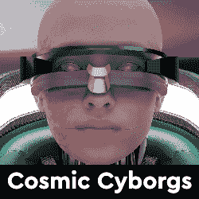</picture>](https://web.archive.org/web/20220929043049/https://dappradar.com/nft/collections/protocol/solana)

*   2012 年 1 月 14 日发布
*   1111 电子人在索拉纳区块链上受冻
*   电子人的元宇宙游戏

[<picture>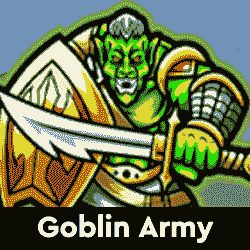</picture>](https://web.archive.org/web/20220929043049/https://dappradar.com/nft/collections/protocol/solana)

*   2012 年 1 月 14 日发布
*   3333 独特的，手绘的，可收藏的索拉纳 NFTs
*   玩赢游戏来了

## 顶级 NFT 碎片

鉴于 NFT 的售价相当可观，细分的想法正在兴起，这给了小投资者一个参与的机会。细分的技术过程非常简单。拿一把 NFT，把它锁进金库，然后得到代币作为回报。这些代币代表了被锁定的 NFT 的所有权，它们的价值增加或减少意味着 NFT 资产的价值波动。投资者可以购买这些代币，并拥有 NFT 的一部分。要了解更多信息，请查看我们的[细分非功能性甲状腺肿的完整指南](/web/20220929043049/https://dappradar.com/blog/what-are-fractionalized-nfts-how-to-invest-in-them/)。

[<picture></picture>](https://web.archive.org/web/20220929043049/https://dappradar.com/nft/fractionalized)

*   臭名昭著的总督 NFT 已经被切成了 11 亿块
*   每个狗代币目前价值 0.0103 美元

[<picture></picture>](https://web.archive.org/web/20220929043049/https://dappradar.com/nft/fractionalized)

*   以太石是第一批以太坊收藏的 NFT 之一
*   每个鹅卵石目前价值 0.00143 美元

[<picture></picture>](https://web.archive.org/web/20220929043049/https://dappradar.com/nft/fractionalized)

*   104 个底价密码朋克的集合
*   每个楼层代币目前价值 0.0448 美元

***以上不构成投资建议。此处给出的信息仅供参考。请行使尽职调查，做你的研究。作者在瑞士联邦理工学院、BTC、NIOX、AGIX、MATIC、MANA、SAFEMOON、SDAO、CAKE、HEX、LINK、GRT、CRO、OMI、GO、SHIBA INU 和 OCEAN 任职。***

 NewsletterUnsubscribe at any time. [T&Cs](https://web.archive.org/web/20220929043049/https://dappradar.com/terms) and [Privacy Policy](https://web.archive.org/web/20220929043049/https://dappradar.com/privacy-policy)