# 流行 Dapps–顶级游戏赚取收入，DeFi & Yield 农业和热门 NFT 系列

> 原文：<https://web.archive.org/web/https://dappradar.com/blog/trending-dapps-top-play-to-earn-games-defi-yield-farming-hot-nft-collections>

## 流行 Dapps |第 9 周| 2022 年

****您的每周更新可以发现各种类别的新 dapps，包括 DeFi 和 yield 农场、NFT 市场和收藏，以及顶级的玩赚游戏。****

区块链充满了不断发展的 dapps。在 DappRadar，我们在 20 多个不同的区块链跟踪数以千计的人。每周，DappRadar 都会深入生态系统，发掘那些流行的、即将到来的、有趣的 dapps。无论是以太坊上的 DeFi，蜡上的 NFT 收藏，还是雪崩上的高产农业，我们都能为您提供保障。

## 亏损和收益农业

本周我们来看看在区块链以太坊外运营的六家 DeFi 和 exchange dapps。而 Uniswap 和 Sushi 等龙头企业则主导着以太坊的交易量。由于交易者希望避免汽油和交易费用，允许用户从以太坊桥接代币的替代服务越来越受欢迎。

[<picture>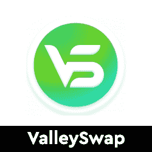</picture>](https://web.archive.org/web/20221127142931/https://dappradar.com/oasis/exchanges/valleyswap)

*   ValleySwap 是 Oasis 网络上的分散式交换
*   旨在提供一个安全、快捷、低成本的工具，用于在 Oasis 生态系统中发现和交换令牌

[<picture></picture>](https://web.archive.org/web/20221127142931/https://dappradar.com/solana/defi/meanfi)

*   一个自我保管，未经许可和不信任的银行。MeanFi 将 Crypto 和 DeFi 引入日常银行业务。

[<picture>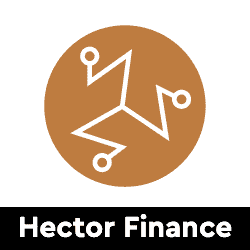</picture>](https://web.archive.org/web/20221127142931/https://dappradar.com/fantom/defi/hector-finance)

*   TOR 是 Hector 金融生态系统的稳定核心。
*   HEC 是 TOR 支持的公用令牌，可作为支付令牌、交易媒介和低风险收益令牌

[<picture>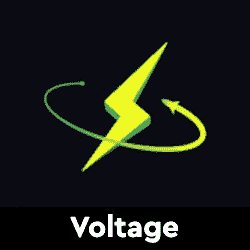</picture>](https://web.archive.org/web/20221127142931/https://dappradar.com/fuse/defi/voltage)

*   通过消费者友好的 Fuse Cash 移动应用程序将 DeFi 功能带入主流

[<picture>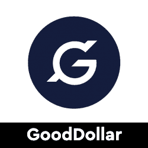</picture>](https://web.archive.org/web/20221127142931/https://dappradar.com/multichain/defi/gooddollar-1)

*   GoodDollar 是一个由 GoodDAO 管理的非营利性协议
*   通过储备支持的加密货币实现普遍基本收入交付

[<picture>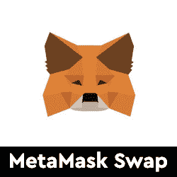</picture>](https://web.archive.org/web/20221127142931/https://dappradar.com/ethereum/defi/metamask-swap)

*   从您最喜爱的区块链钱包中兑换代币
*   关于 MetaMask 令牌的空投谣言仍然存在
*   完成令牌交换和发送

## 玩即赚& GameFi

游戏很有趣，但是区块链驱动的游戏给这种体验增加了一个全新的经济层面。突然你可以玩一个游戏并从中赚钱。并非所有游戏都有相同类型的财务激励，但当社区发展时，每一项区块链资产都会增值。以下是本周的六款游戏趋势。

[<picture></picture>](https://web.archive.org/web/20221127142931/https://dappradar.com/wax/games/cosmic-clash)

*   宇宙冲突是一个基于 WAX 区块链的 NFT 星际飞船收集游戏

[<picture></picture>](https://web.archive.org/web/20221127142931/https://dappradar.com/tezos/games/dogami)

*   你真正的虚拟伴侣
*   在 AR/VR 中领养并饲养一只独一无二的 Dogamí

[<picture>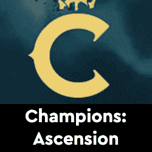</picture>](https://web.archive.org/web/20221127142931/https://dappradar.com/ethereum/games/champions-ascension)

*   以太坊区块链上的区块链游戏
*   由前 MySpace 联合创始人兼首席执行官 Chris DeWolfe 领导的获奖公司打造

[<picture>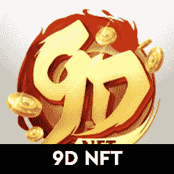</picture>](https://web.archive.org/web/20221127142931/https://dappradar.com/binance-smart-chain/games/9d-nft)

*   9D NFT 是一款 MMO 武术游戏，在 BSC 上利用了区块链和 NFT 技术

[<picture></picture>](https://web.archive.org/web/20221127142931/https://dappradar.com/avalanche/games/pizza-game)

*   披萨游戏是一款关于雪崩区块链的游戏
*   受网络游戏的启发，饼干点击器

[<picture></picture>](https://web.archive.org/web/20221127142931/https://dappradar.com/binance-smart-chain/games/piratesking)

*   《海盗王》是一款以玩赚取收入的 NFT 海盗世界游戏
*   BUSD 或 PKT 的奖励

## 热门 NFT 系列

CryptoPunks 和 Bored Ape Yacht Club 已经成为 NFT 最受欢迎的收藏品。然而，每天都有新的系列推出，其中一些显示出与大公司竞争的潜力。在这里，我们强调六个新鲜的 NFT 下降。

[<picture>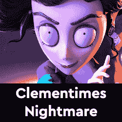</picture>](https://web.archive.org/web/20221127142931/https://dappradar.com/nft)

*   一个崭露头角的 NFT 注入玩赚游戏
*   第二阶段非功能性资产于 3 月份发布，最多提供 500 项独特资产，总计 10，000 项非功能性资产

[<picture></picture>](https://web.archive.org/web/20221127142931/https://dappradar.com/nft)

*   mfers 完全由 [sartoshi](https://web.archive.org/web/20221127142931/https://twitter.com/sartoshi_nft) 的手绘生成
*   你可以随意使用 mfers

[<picture>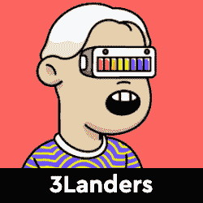</picture>](https://web.archive.org/web/20221127142931/https://dappradar.com/ethereum/collectibles/3landers)

*   3Landers 是一个以社区、冒险和合作为中心的 NFT 收藏项目。
*   拿着 3 兰德 NFT，你就是 3 兰德

[<picture>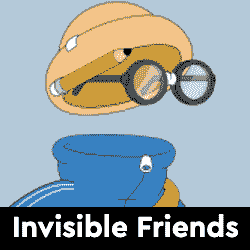</picture>](https://web.archive.org/web/20221127142931/https://dappradar.com/ethereum/collectibles/invisible-friends)

*   《隐形朋友》是由马库斯·马格努松创作的 5000 个动画隐形角色的集合

[<picture>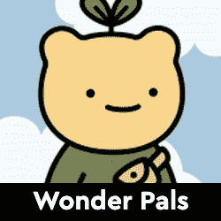</picture>](https://web.archive.org/web/20221127142931/https://dappradar.com/ethereum/collectibles/wonderpals)

*   WonderPals 是一个由 10，000 个可爱的朋友组成的集合
*   将会有一些特别的 1/1 点缀在这个系列中

[<picture>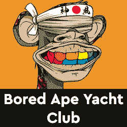</picture>](https://web.archive.org/web/20221127142931/https://dappradar.com/ethereum/collectibles/bored-ape-yacht-club)

*   无聊猿游艇俱乐部收集了 10，000 个独特的无聊猿 NFT——生活在以太坊区块链上的独特的数字收藏品。

## 顶级 NFT 碎片

鉴于 NFT 的售价相当可观，细分的想法正在兴起，这给了小投资者一个参与的机会。细分的技术过程非常简单。拿一把 NFT，把它锁进金库，然后得到代币作为回报。这些代币代表了被锁定的 NFT 的所有权，它们的价值增加或减少意味着 NFT 资产的价值波动。投资者可以购买这些代币，并拥有 NFT 的一部分。要了解更多信息，请查看我们的[细分非功能性甲状腺素完全指南](/web/20221127142931/https://dappradar.com/blog/what-are-fractionalized-nfts-how-to-invest-in-them/)。

[<picture></picture>](https://web.archive.org/web/20221127142931/https://dappradar.com/nft/fractionalized)

*   臭名昭著的总督 NFT 已经被切成了 11 亿块
*   每个狗代币目前价值 0.0103 美元

[<picture></picture>](https://web.archive.org/web/20221127142931/https://dappradar.com/nft/fractionalized)

*   以太石是第一批以太坊收藏的 NFT 之一
*   每个鹅卵石目前价值 0.00143 美元

[<picture></picture>](https://web.archive.org/web/20221127142931/https://dappradar.com/nft/fractionalized)

*   104 个底价密码朋克的集合
*   每个楼层代币目前价值 0.0448 美元

***以上不构成投资建议。此处给出的信息仅供参考。请行使尽职调查，做你的研究。作者在瑞士联邦理工学院、BTC、NIOX、AGIX、MATIC、MANA、SAFEMOON、SDAO、CAKE、HEX、LINK、GRT、CRO、OMI、GO、SHIBA INU 和 OCEAN 任职。***

 NewsletterUnsubscribe at any time. [T&Cs](https://web.archive.org/web/20221127142931/https://dappradar.com/terms) and [Privacy Policy](https://web.archive.org/web/20221127142931/https://dappradar.com/privacy-policy)