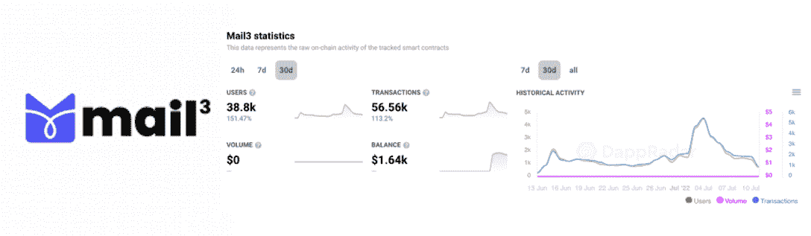
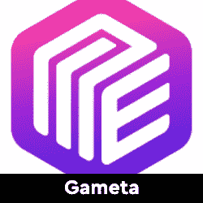
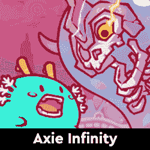
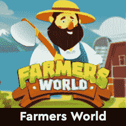
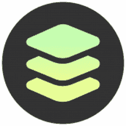
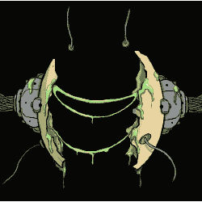
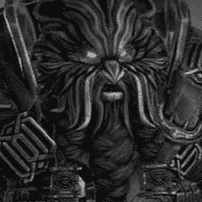

# 热门 Dapps–顶级的即玩即赚游戏、NFT 收藏和市场、DeFi 等

> 原文：<https://web.archive.org/web/https://dappradar.com/blog/trending-dapps-top-play-to-earn-games-nft-collections-marketplaces-defi-more>

## 流行 Dapps |第 28 周| 2022 年

****您的每周更新将发现各种类别的 dapps，包括 DeFi 和 yield 农场、NFT 市场和收藏、顶级游戏赚取等等。****

区块链充满了不断发展的 dapps。在 DappRadar，我们在 20 多个不同的区块链跟踪数以千计的人。

每周 DappRadar [都会深入生态系统](https://web.archive.org/web/20220813154817/https://dappradar.com/rankings)去发现那些吸引最多用户的、即将到来的、流行的、有趣的 dapps。无论是以太坊上的 [DeFi，蜡像](https://web.archive.org/web/20220813154817/https://dappradar.com/rankings)上的 [NFT 收藏，还是雪崩](https://web.archive.org/web/20220813154817/https://dappradar.com/rankings)上的产量农业[，我们都会为您报道。](https://web.archive.org/web/20220813154817/https://dappradar.com/rankings/avalanche)

***注意:此处介绍的所有 dapps 都是根据 DappRadar 跟踪的链上指标选择的。这不是付费推广。***

## 本周 dapp–邮件 3

*   过去 30 天内有 38，800 名活跃用户
*   [加密本地通信协议](https://web.archive.org/web/20220813154817/https://mail3.me/?utm_source=DappRadar&utm_medium=deeplink&utm_campaign=visit-website)
*   承诺安全性、隐私保护和自我主权身份
*   它还使用户能够捕捉社会联系的价值，并积累链上的数字声誉

[Explore Mail3](https://web.archive.org/web/20220813154817/https://mail3.me/?utm_source=DappRadar&utm_medium=deeplink&utm_campaign=visit-website)

## 区块链游戏

游戏很有趣，但是区块链驱动的游戏给这种体验增加了一个全新的经济层面。突然你可以玩一个游戏并从中赚钱。

[<picture></picture>](https://web.archive.org/web/20220813154817/https://dappradar.com/flow/games/solitaire-blitz)[<picture></picture>](https://web.archive.org/web/20220813154817/https://dappradar.com/solana/games/gameta)[<picture></picture>](https://web.archive.org/web/20220813154817/https://dappradar.com/polygon/games/karmaverse-zombie)[<picture></picture>](https://web.archive.org/web/20220813154817/https://dappradar.com/multichain/games/axie-infinity)[<picture></picture>](https://web.archive.org/web/20220813154817/https://dappradar.com/eos/games/upland)[<picture></picture>](https://web.archive.org/web/20220813154817/https://dappradar.com/wax/games/farmers-world)[Explore More Blockchain Games](https://web.archive.org/web/20220813154817/https://dappradar.com/rankings/category/games)

## 定义和交换

对于市场来说，目前的状况是一个评估和利用现有资产的好时机。探索这些贷款、产量农业和利息产生平台，并记住[保持安全](/web/20220813154817/https://dappradar.com/blog/4-tips-on-blockchain-cybersecurity-stay-safe-in-crypto/)。

[<picture></picture>](https://web.archive.org/web/20220813154817/https://dappradar.com/fuse/defi/fuse-cash)

[Fuse Cash](https://web.archive.org/web/20220813154817/https://dappradar.com/fuse/defi/fuse-cash)

目前对 fUSD stablecoin 控股公司提供 25%的年利率

[<picture></picture>](https://web.archive.org/web/20220813154817/https://dappradar.com/binance-smart-chain/defi/pancakeswap)

[PancakeSwap](https://web.archive.org/web/20220813154817/https://dappradar.com/binance-smart-chain/defi/pancakeswap)

通过交易和用户在 BNB 链上领先 DeFi dapp

[<picture></picture>](https://web.archive.org/web/20220813154817/https://dappradar.com/token/staking)

[RADAR Staking](https://web.archive.org/web/20220813154817/https://dappradar.com/token/staking)

赌雷达，赚雷达。任何区块链上的收获

## 热门 NFT 系列

[<picture></picture>](https://web.archive.org/web/20220813154817/https://dappradar.com/nft)

[Project 0xD38](https://web.archive.org/web/20220813154817/https://dappradar.com/nft)

[<picture></picture>](https://web.archive.org/web/20220813154817/https://dappradar.com/nft)

[Immortal Player Characters](https://web.archive.org/web/20220813154817/https://dappradar.com/nft)

[<picture></picture>](https://web.archive.org/web/20220813154817/https://dappradar.com/nft)

[Cope Bears](https://web.archive.org/web/20220813154817/https://dappradar.com/nft)

[Explore all NFT Collections](https://web.archive.org/web/20220813154817/https://dappradar.com/nft/collections)

## NFT 市场

[<picture></picture>](https://web.archive.org/web/20220813154817/https://dappradar.com/ethereum/marketplaces/x2y2)

[X2Y2](https://web.archive.org/web/20220813154817/https://dappradar.com/ethereum/marketplaces/x2y2)

[<picture></picture>](https://web.archive.org/web/20220813154817/https://dappradar.com/ethereum/marketplaces/opensea)

[Opensea](https://web.archive.org/web/20220813154817/https://dappradar.com/ethereum/marketplaces/opensea)

[<picture></picture>](https://web.archive.org/web/20220813154817/https://dappradar.com/ethereum/marketplaces/gem)

[Gem](https://web.archive.org/web/20220813154817/https://dappradar.com/ethereum/marketplaces/gem)

[Explore all NFT Marketplaces](https://web.archive.org/web/20220813154817/https://dappradar.com/nft/marketplaces)

## 观看 Dapps

这些 dapps 因其独特的服务、面向客户的效用和预发布机会而大有可为。

[<picture></picture>](https://web.archive.org/web/20220813154817/https://dappradar.com/hive/social/liketu)

[Liketu](https://web.archive.org/web/20220813154817/https://dappradar.com/hive/social/liketu)

like tu——读作“like to ”,是一个建立在蜂巢区块链上的照片分享网站。它允许创作者分享照片，并为优质图片添加付费墙。

[<picture></picture>](https://web.archive.org/web/20220813154817/https://dappradar.com/polygon/social/lens-protocol)

[Lens Protocol](https://web.archive.org/web/20220813154817/https://dappradar.com/polygon/social/lens-protocol)

Lens 协议是一个无权限的、可组合的、去中心化的社交图，使得构建一个 Web3 社交平台变得容易。给你带来了一份协议的团队。

[<picture></picture>](https://web.archive.org/web/20220813154817/https://dappradar.com/fuse/other/peepl)

[Pe](https://web.archive.org/web/20220813154817/https://dappradar.com/near/marketplaces/nearnames)[epl](https://web.archive.org/web/20220813154817/https://dappradar.com/fuse/other/peepl)

Peepl 是一个支付和奖励平台，有助于保持当地经济中更多的资金流动。

## 区块链域

使用可代替钱包地址的自定义域名来个性化您的 web3 体验。

[<picture></picture>](https://web.archive.org/web/20220813154817/https://dappradar.com/multichain/collectibles/unstoppable-domains)

[Unstoppable Domains](https://web.archive.org/web/20220813154817/https://dappradar.com/multichain/collectibles/unstoppable-domains)

[<picture></picture>](https://web.archive.org/web/20220813154817/https://dappradar.com/ethereum/other/ethereum-name-service)

[Ethereum Name Service](https://web.archive.org/web/20220813154817/https://dappradar.com/ethereum/other/ethereum-name-service)

[<picture></picture>](https://web.archive.org/web/20220813154817/https://dappradar.com/near/marketplaces/nearnames)

[NEAR Names](https://web.archive.org/web/20220813154817/https://dappradar.com/near/marketplaces/nearnames)

[Explore the DappRadar Dapp Rankings](https://web.archive.org/web/20220813154817/https://dappradar.com/rankings) NewsletterUnsubscribe at any time. [T&Cs](https://web.archive.org/web/20220813154817/https://dappradar.com/terms) and [Privacy Policy](https://web.archive.org/web/20220813154817/https://dappradar.com/privacy-policy)