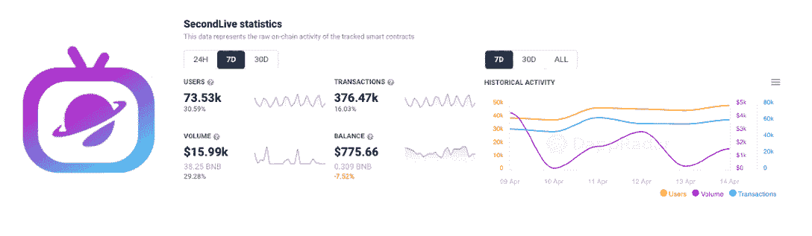
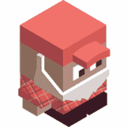
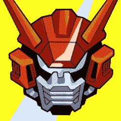
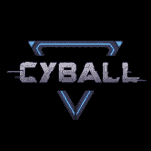
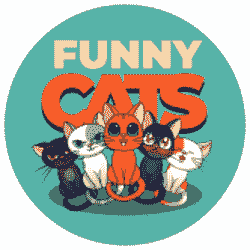
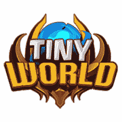

# 流行 Dapps |第 15 周| 2022

> 原文：<https://web.archive.org/web/https://dappradar.com/blog/trending-dapps-week-15-2022>

## 您的每周更新，发现各种类别的 dapps

****每周更新，发现各种类别的 dapps，包括 DeFi 和 yield 农场、NFT 市场和收藏，以及顶级的玩赚游戏。****

区块链充满了不断发展的 dapps。在 DappRadar，我们在 20 多个不同的区块链跟踪数以千计的人。每周 DappRadar 都会深入到生态系统中，以发现吸引最多用户、即将到来、流行和有趣的 dapps。无论是以太坊上的 DeFi，蜡上的 NFT 收藏，还是雪崩上的高产农业，我们都能为您提供保障。

***注意:此处介绍的所有 dapps 都是根据 DappRadar 跟踪的链上指标选择的。这不是付费推广。***

## 本周 Dapp

#### 第二人生

[<picture></picture>](https://web.archive.org/web/20220929102749/https://dappradar.com/binance-smart-chain/games/secondlive)

*   过去 7 天有 73，000 名活跃用户
*   第一场试点元宇宙演唱会定于 4 月 15 日 12:00 (UTC)
*   NFT 声称现在开放

[https://web.archive.org/web/20220929102749if_/https://www.youtube.com/embed/PxVaSY0QRLA?feature=oembed](https://web.archive.org/web/20220929102749if_/https://www.youtube.com/embed/PxVaSY0QRLA?feature=oembed)

[Try Second Live](https://web.archive.org/web/20220929102749/https://dappradar.com/binance-smart-chain/games/secondlive)

## 定义和交换

看看本周多个区块链的趋势性 DeFi、token exchange 和 lending dapps。别忘了，你现在可以在以太坊、BNB 链和 DappRadar 上的 Polygon [上交换代币，而无需支付平台费！](https://web.archive.org/web/20220929102749/https://dappradar.com/hub/swap/eth)

[<picture></picture>](https://web.archive.org/web/20220929102749/https://dappradar.com/cronos/defi/mm-finance)

[MM Finance](https://web.archive.org/web/20220929102749/https://dappradar.com/cronos/defi/mm-finance)

[<picture></picture>](https://web.archive.org/web/20220929102749/https://dappradar.com/near/defi/burrow)

[Burrow](https://web.archive.org/web/20220929102749/https://dappradar.com/multichain/defi/curve)

[<picture></picture>](https://web.archive.org/web/20220929102749/https://dappradar.com/hedera/defi/stader-sd)

[Stader](https://web.archive.org/web/20220929102749/https://dappradar.com/multichain/defi/1inch-network)

[<picture></picture>](https://web.archive.org/web/20220929102749/https://dappradar.com/astar/defi/arthswap)

[ArthSwap](https://web.archive.org/web/20220929102749/https://dappradar.com/multichain/exchanges/dodo-1)

[<picture></picture>](https://web.archive.org/web/20220929102749/https://dappradar.com/solana/defi/orca)

[ORCA Finance](https://web.archive.org/web/20220929102749/https://dappradar.com/polygon/exchanges/quickswap)

[<picture></picture>](https://web.archive.org/web/20220929102749/https://dappradar.com/avalanche/defi/trader-joe)

[Trader Joe](https://web.archive.org/web/20220929102749/https://dappradar.com/klaytn/exchanges/klayswap)

[Explore More DeFi Dapps](https://web.archive.org/web/20220929102749/https://dappradar.com/rankings/category/defi)

## 玩赢游戏

游戏很有趣，但是区块链驱动的游戏给这种体验增加了一个全新的经济层面。突然你可以玩一个游戏并从中赚钱。

[<picture></picture>](https://web.archive.org/web/20220929102749/https://dappradar.com/polygon/games/phantom-galaxies)

[Phantom Galaxies](https://web.archive.org/web/20220929102749/https://dappradar.com/polygon/games/phantom-galaxies)

[<picture></picture>](https://web.archive.org/web/20220929102749/https://dappradar.com/binance-smart-chain/games/cyball)

[CyBall](https://web.archive.org/web/20220929102749/https://dappradar.com/binance-smart-chain/games/cyball)

[<picture></picture>](https://web.archive.org/web/20220929102749/https://dappradar.com/polygon/games/pegaxy)

[Pega](https://web.archive.org/web/20220929102749/https://dappradar.com/polygon/games/aavegotchi)[xy](https://web.archive.org/web/20220929102749/https://dappradar.com/polygon/games/pegaxy)

[<picture></picture>](https://web.archive.org/web/20220929102749/https://dappradar.com/wax/games/funny-cats)

[Funn](https://web.archive.org/web/20220929102749/https://dappradar.com/polygon/games/sunflower-land)[y Cats](https://web.archive.org/web/20220929102749/https://dappradar.com/wax/games/funny-cats)

[<picture></picture>](https://web.archive.org/web/20220929102749/https://dappradar.com/binance-smart-chain/games/tiny-world)

[Tiny World](https://web.archive.org/web/20220929102749/https://dappradar.com/binance-smart-chain/games/tiny-world)

[<picture></picture>](https://web.archive.org/web/20220929102749/https://dappradar.com/wax/games/blockchain-brawlers)

[Blockchain Brawlers](https://web.archive.org/web/20220929102749/https://dappradar.com/wax/games/blockchain-brawlers)

[Explore More Blockchain Games](https://web.archive.org/web/20220929102749/https://dappradar.com/rankings/category/games)

## 热门 NFT 系列

[<picture></picture>](https://web.archive.org/web/20220929102749/https://dappradar.com/nft/collections)

[The Picaroons](https://web.archive.org/web/20220929102749/https://dappradar.com/nft/collections)

[<picture></picture>](https://web.archive.org/web/20220929102749/https://dappradar.com/nft/collections)

[Beanz](https://web.archive.org/web/20220929102749/https://dappradar.com/nft/collections)

[<picture></picture>](https://web.archive.org/web/20220929102749/https://dappradar.com/nft/collections)

[Shinsei Gal](https://web.archive.org/web/20220929102749/https://dappradar.com/nft/protocol/wax)[verse](https://web.archive.org/web/20220929102749/https://dappradar.com/nft/collections)

[<picture></picture>](https://web.archive.org/web/20220929102749/https://dappradar.com/nft/collections)

[MOAR](https://web.archive.org/web/20220929102749/https://dappradar.com/nft/collections)

[<picture></picture>](https://web.archive.org/web/20220929102749/https://dappradar.com/nft/collections)

[Alien Frens Evolution](https://web.archive.org/web/20220929102749/https://dappradar.com/nft/collections)

[<picture></picture>](https://web.archive.org/web/20220929102749/https://dappradar.com/ethereum/collectibles/azuki)

[Azuki](https://web.archive.org/web/20220929102749/https://dappradar.com/ethereum/collectibles/azuki)

[Explore all NFT Collections](https://web.archive.org/web/20220929102749/https://dappradar.com/nft/collections)

## NFT 市场

[<picture></picture>](https://web.archive.org/web/20220929102749/https://dappradar.com/solana/marketplaces/solanart)

[Solanart](https://web.archive.org/web/20220929102749/https://dappradar.com/solana/marketplaces/solanart)

[<picture></picture>](https://web.archive.org/web/20220929102749/https://dappradar.com/ethereum/marketplaces/opensea)

[Opensea](https://web.archive.org/web/20220929102749/https://dappradar.com/ethereum/marketplaces/opensea)

[<picture></picture>](https://web.archive.org/web/20220929102749/https://dappradar.com/ethereum/marketplaces/foundation)

[Foundation](https://web.archive.org/web/20220929102749/https://dappradar.com/ethereum/marketplaces/foundation)

[<picture></picture>](https://web.archive.org/web/20220929102749/https://dappradar.com/ethereum/marketplaces/looksrare)

[LooksRare](https://web.archive.org/web/20220929102749/https://dappradar.com/ethereum/marketplaces/looksrare)

[<picture></picture>](https://web.archive.org/web/20220929102749/https://dappradar.com/solana/marketplaces/magic-eden)

[Magic Eden](https://web.archive.org/web/20220929102749/https://dappradar.com/solana/marketplaces/magic-eden)

[<picture></picture>](https://web.archive.org/web/20220929102749/https://dappradar.com/multichain/marketplaces/atomicmarket)

[Atomic Market](https://web.archive.org/web/20220929102749/https://dappradar.com/multichain/marketplaces/atomicmarket)

[Explore all NFT Marketplaces](https://web.archive.org/web/20220929102749/https://dappradar.com/nft/marketplaces)

## 区块链域

使用可代替钱包地址的自定义域名来个性化您的 web3 体验。

[<picture></picture>](https://web.archive.org/web/20220929102749/https://dappradar.com/multichain/collectibles/unstoppable-domains)

[Unstoppable Domains](https://web.archive.org/web/20220929102749/https://dappradar.com/multichain/collectibles/unstoppable-domains)

[<picture></picture>](https://web.archive.org/web/20220929102749/https://dappradar.com/ethereum/other/ethereum-name-service)

[Ethereum Name Service](https://web.archive.org/web/20220929102749/https://dappradar.com/ethereum/other/ethereum-name-service)

[<picture></picture>](https://web.archive.org/web/20220929102749/https://dappradar.com/near/marketplaces/nearnames)

[NEAR Names](https://web.archive.org/web/20220929102749/https://dappradar.com/near/marketplaces/nearnames)

[Explore the DappRadar Dapp Rankings](https://web.archive.org/web/20220929102749/https://dappradar.com/rankings) NewsletterUnsubscribe at any time. [T&Cs](https://web.archive.org/web/20220929102749/https://dappradar.com/terms) and [Privacy Policy](https://web.archive.org/web/20220929102749/https://dappradar.com/privacy-policy)