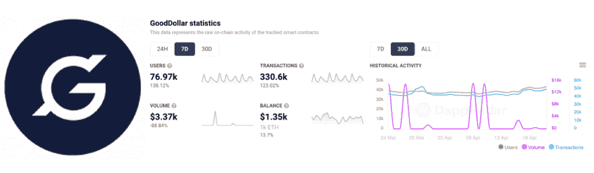
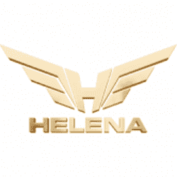
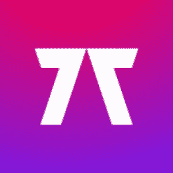
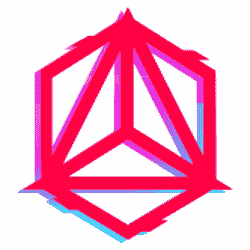
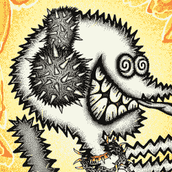
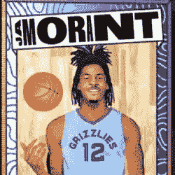
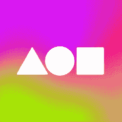
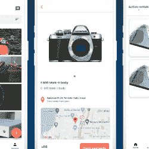

# 流行 Dapps |第 16 周| 2022 年

> 原文：<https://web.archive.org/web/https://dappradar.com/blog/trending-dapps-week-16-2022>

## 您的每周更新，发现各种类别的 dapps

****每周更新，发现各种类别的 dapps，包括 DeFi 和 yield 农场、NFT 市场和收藏，以及顶级的玩赚游戏。****

区块链充满了不断发展的 dapps。在 DappRadar，我们在 20 多个不同的区块链跟踪数以千计的人。每周 DappRadar 都会深入到生态系统中，以发现吸引最多用户、即将到来、流行和有趣的 dapps。无论是以太坊上的 DeFi，蜡上的 NFT 收藏，还是雪崩上的高产农业，我们都能为您提供保障。

***注意:此处介绍的所有 dapps 都是根据 DappRadar 跟踪的链上指标选择的。这不是付费推广。***

## 本周 Dapp

#### 好美元

[<picture></picture>](https://web.archive.org/web/20221129134004/https://dappradar.com/multichain/defi/gooddollar-1)

*   过去 7 天有 76，970 个活跃用户
*   [入股 crypto 并赚取奖励](/web/20221129134004/https://dappradar.com/blog/gooddollar-generates-a-universal-basic-income-economy/),同时捐出一定比例
*   原生 Android 应用程序要求通用基本收入(UBI)
*   GoodDollar 已经成功地向全球数千名用户分发了价值超过 50，000 美元的 G$代币

[https://web.archive.org/web/20221129134004if_/https://www.youtube.com/embed/ceLYFGwtCl0?feature=oembed](https://web.archive.org/web/20221129134004if_/https://www.youtube.com/embed/ceLYFGwtCl0?feature=oembed)

[Explore GoodDollar](https://web.archive.org/web/20221129134004/https://dappradar.com/multichain/defi/gooddollar-1)

## 定义和交换

看看本周多个区块链的趋势性 DeFi、token exchange 和 lending dapps。别忘了，你现在可以在以太坊、BNB 链和 DappRadar 上的 Polygon [上交换代币，而无需支付平台费！](https://web.archive.org/web/20221129134004/https://dappradar.com/hub/swap/eth)

[Clipper](https://web.archive.org/web/20221129134004/https://dappradar.com/cronos/defi/mm-finance) [DEX](https://web.archive.org/web/20221129134004/https://dappradar.com/multichain/defi/clipper-dex)

[Voltage](https://web.archive.org/web/20221129134004/https://dappradar.com/multichain/defi/curve)

[Sirius Finance](https://web.archive.org/web/20221129134004/https://dappradar.com/astar/defi/sirius-finance)

[Aldrin](https://web.archive.org/web/20221129134004/https://dappradar.com/solana/defi/aldrin)

[Smart Finance](https://web.archive.org/web/20221129134004/https://dappradar.com/avalanche/defi/smart-finance)

[Helena Finance](https://web.archive.org/web/20221129134004/https://dappradar.com/binance-smart-chain/defi/helena-financial)

[Explore More DeFi Dapps](https://web.archive.org/web/20221129134004/https://dappradar.com/rankings/category/defi)

## 玩赢游戏

游戏很有趣，但是区块链驱动的游戏给这种体验增加了一个全新的经济层面。突然你可以玩一个游戏并从中赚钱。

[Sailors World](https://web.archive.org/web/20221129134004/https://dappradar.com/polygon/games/phantom-galaxies)

[Sunflower Land](https://web.archive.org/web/20221129134004/https://dappradar.com/binance-smart-chain/games/cyball)

[Arc](https://web.archive.org/web/20221129134004/https://dappradar.com/polygon/games/aavegotchi)[8](https://web.archive.org/web/20221129134004/https://dappradar.com/polygon/games/arc8-by-gamee-1)

[<picture></picture>](https://web.archive.org/web/20221129134004/https://dappradar.com/wax/games/funny-cats)

[Funn](https://web.archive.org/web/20221129134004/https://dappradar.com/polygon/games/sunflower-land)[y Cats](https://web.archive.org/web/20221129134004/https://dappradar.com/wax/games/funny-cats)

[Planet IX](https://web.archive.org/web/20221129134004/https://dappradar.com/polygon/games/planet-ix)

[Cyber Arena](https://web.archive.org/web/20221129134004/https://dappradar.com/polygon/games/cyber-arena)

[Explore More Blockchain Games](https://web.archive.org/web/20221129134004/https://dappradar.com/rankings/category/games)

## 热门 NFT 系列

[Moonbirds](https://web.archive.org/web/20221129134004/https://dappradar.com/ethereum/collectibles/moonbirds)

[The Creyzies](https://web.archive.org/web/20221129134004/https://dappradar.com/nft)

[Cool Pets](https://web.archive.org/web/20221129134004/https://dappradar.com/nft/protocol/wax)

[<picture></picture>](https://web.archive.org/web/20221129134004/https://dappradar.com/nft/collections)

[MOAR](https://web.archive.org/web/20221129134004/https://dappradar.com/nft/collections)

[<picture></picture>](https://web.archive.org/web/20221129134004/https://dappradar.com/nft/collections)

[Alien Frens Evolution](https://web.archive.org/web/20221129134004/https://dappradar.com/nft/collections)

[The Association NFT](https://web.archive.org/web/20221129134004/https://dappradar.com/nft)

[Explore all NFT Collections](https://web.archive.org/web/20221129134004/https://dappradar.com/nft/collections)

## NFT 市场

[<picture></picture>](https://web.archive.org/web/20221129134004/https://dappradar.com/solana/marketplaces/solanart)

[Solanart](https://web.archive.org/web/20221129134004/https://dappradar.com/solana/marketplaces/solanart)

[<picture></picture>](https://web.archive.org/web/20221129134004/https://dappradar.com/ethereum/marketplaces/opensea)

[Opensea](https://web.archive.org/web/20221129134004/https://dappradar.com/ethereum/marketplaces/opensea)

[<picture></picture>](https://web.archive.org/web/20221129134004/https://dappradar.com/ethereum/marketplaces/foundation)

[Foundation](https://web.archive.org/web/20221129134004/https://dappradar.com/ethereum/marketplaces/foundation)

[<picture></picture>](https://web.archive.org/web/20221129134004/https://dappradar.com/ethereum/marketplaces/looksrare)

[LooksRare](https://web.archive.org/web/20221129134004/https://dappradar.com/ethereum/marketplaces/looksrare)

[<picture></picture>](https://web.archive.org/web/20221129134004/https://dappradar.com/solana/marketplaces/magic-eden)

[Magic Eden](https://web.archive.org/web/20221129134004/https://dappradar.com/solana/marketplaces/magic-eden)

[<picture></picture>](https://web.archive.org/web/20221129134004/https://dappradar.com/multichain/marketplaces/atomicmarket)

[Atomic Market](https://web.archive.org/web/20221129134004/https://dappradar.com/multichain/marketplaces/atomicmarket)

[Explore all NFT Marketplaces](https://web.archive.org/web/20221129134004/https://dappradar.com/nft/marketplaces)

## 观看 Dapps

这些 dapps 因其独特的服务、面向客户的效用和预发布机会而大有可为。

[SomeSing](https://web.archive.org/web/20221129134004/https://dappradar.com/klaytn/social/somesing)

[Flambu](https://web.archive.org/web/20221129134004/https://dappradar.com/fuse/marketplaces/flambu)

[Pe](https://web.archive.org/web/20221129134004/https://dappradar.com/near/marketplaces/nearnames)[epl](https://web.archive.org/web/20221129134004/https://dappradar.com/fuse/other/peepl)

## 区块链域

使用可代替钱包地址的自定义域名来个性化您的 web3 体验。

[<picture></picture>](https://web.archive.org/web/20221129134004/https://dappradar.com/multichain/collectibles/unstoppable-domains)

[Unstoppable Domains](https://web.archive.org/web/20221129134004/https://dappradar.com/multichain/collectibles/unstoppable-domains)

[<picture></picture>](https://web.archive.org/web/20221129134004/https://dappradar.com/ethereum/other/ethereum-name-service)

[Ethereum Name Service](https://web.archive.org/web/20221129134004/https://dappradar.com/ethereum/other/ethereum-name-service)

[<picture></picture>](https://web.archive.org/web/20221129134004/https://dappradar.com/near/marketplaces/nearnames)

[NEAR Names](https://web.archive.org/web/20221129134004/https://dappradar.com/near/marketplaces/nearnames)

[Explore the DappRadar Dapp Rankings](https://web.archive.org/web/20221129134004/https://dappradar.com/rankings) NewsletterUnsubscribe at any time. [T&Cs](https://web.archive.org/web/20221129134004/https://dappradar.com/terms) and [Privacy Policy](https://web.archive.org/web/20221129134004/https://dappradar.com/privacy-policy)