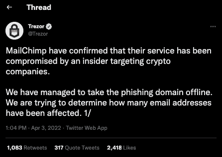
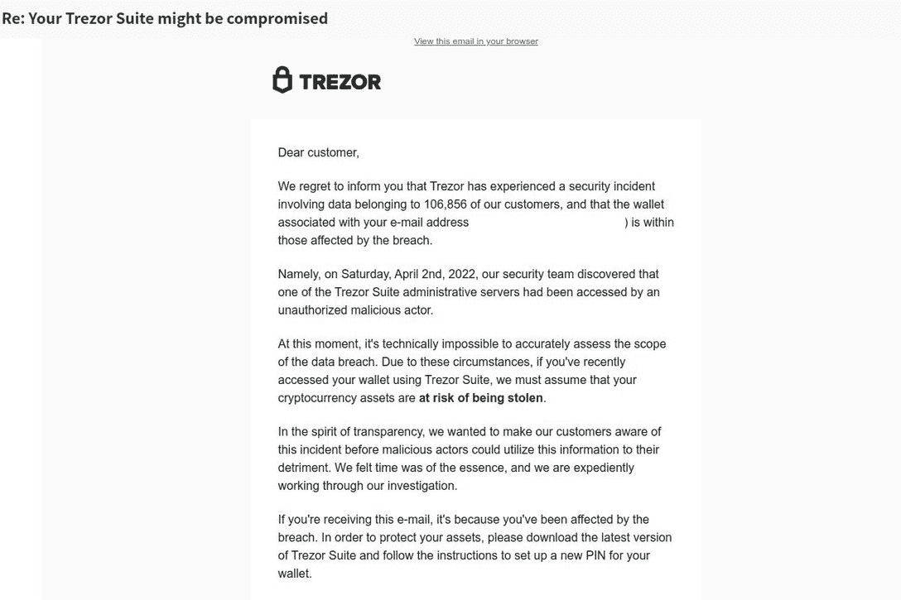

# Trezor 在 MailChimp 钓鱼攻击后发出警告

> 原文：<https://web.archive.org/web/https://dappradar.com/blog/trezor-issue-warning-after-mailchimp-phishing-attack>

## 在得到进一步通知之前，不要打开任何来自 Trezor 的邮件

流行的加密货币硬件钱包 Trezor 已经向所有用户发出通知，在获得进一步信息之前，不要打开任何似乎来自 Trezor 的电子邮件。Trezor 证实，他们的直接邮件提供商 MailChimp 的服务已经被一个针对加密公司的内部人员破坏了。他们设法使一个网络钓鱼域离线，但仍然需要确定有多少受影响的电子邮件地址。

## 摘要

*   ***MailChimp 遭受网络钓鱼攻击*** [***热门硬件钱包***](https://web.archive.org/web/20220930101525/https://dappradar.com/blog/best-crypto-hardware-wallets-for-2022) ***Trezor。***
*   Trezor 暂停所有直邮活动。
*   ***不要打开任何来自[【邮件保护】](/web/20220930101525/https://dappradar.com/cdn-cgi/l/email-protection)的邮件，此为钓鱼域名。***
*   ***请确保您使用匿名电子邮件地址进行比特币相关活动。又是一个*** [***的那些网络安全小技巧***](https://web.archive.org/web/20220930101525/https://dappradar.com/blog/4-tips-on-blockchain-cybersecurity-stay-safe-in-crypto) ***要熟悉了。***

Trezor 是一个硬件[加密钱包](https://web.archive.org/web/20220930101525/https://dappradar.com/blog/category/crypto-wallet)，为处理比特币和其他加密货币的私钥提供高级安全性。与传统的冷藏方法不同，Trezor 可以安全地进行支付，而不会将用户的私钥暴露给可能受到威胁的计算机。

## 网络钓鱼域

至关重要的是，这个漏洞不是特雷佐的错。相反，他们调查了 MailChimp 上的一份选择性加入时事通讯的潜在数据泄露。此外，一封警告数据泄露的诈骗电子邮件正在流传。建议 Trezor 用户不要打开任何来自 [【电子邮件保护】](/web/20220930101525/https://dappradar.com/cdn-cgi/l/email-protection#cea0a1bcabbea2b78ebabcabb4a1bce0bbbd) 的电子邮件，因为这是一个网络钓鱼域，并忽略来自 Trezor 的任何电子邮件，直到另行通知。

Trezor 很快关闭了网络钓鱼域名，但是目前还不清楚有多少用户的详细信息已经被这个骗局窃取。[的声明于 2022 年 4 月 3 日下午 1 点左右在 Twitter](https://web.archive.org/web/20220930101525/https://twitter.com/Trezor/status/1510558771944333312) 上发布，目前仍在调查中。

坏演员也试图通过直接邮件与 Trezor 用户沟通，但这被认为是假的。我们建议用户密切关注[官方 Trezor Twitter](https://web.archive.org/web/20220930101525/https://twitter.com/Trezor) 的更新。

## 检查 DappRadar 上的加密和 NFT 资产

如果您使用 Trezor 这样的硬件钱包，您可以使用标准的硬件钱包地址或附加到它的自定义域名，使用 DappRadar 投资组合跟踪器来访问您在以太坊、BNB 链和 Polygon 上的余额。更重要的是，Trezor 用户可以快速检查他们的余额在这三个网络中是否安全。

第一步:转到[此链接](https://web.archive.org/web/20220930101525/https://dappradar.com/hub/wallet/)并输入您的硬件钱包地址、ENS 或类似地址。

第二步:坐下来，让投资组合跟踪导入您所有的代币和 NFT 资产。

第三步:检查你的投资组合。

[https://web.archive.org/web/20220930101525if_/https://www.youtube.com/embed/WHL_uYv8riA?feature=oembed](https://web.archive.org/web/20220930101525if_/https://www.youtube.com/embed/WHL_uYv8riA?feature=oembed)

***以上不构成投资建议。此处给出的信息仅供参考。请行使尽职调查，做你的研究。作者持有多种加密货币的头寸，包括 BTC、瑞士法郎和雷达。***

 NewsletterUnsubscribe at any time. [T&Cs](https://web.archive.org/web/20220930101525/https://dappradar.com/terms) and [Privacy Policy](https://web.archive.org/web/20220930101525/https://dappradar.com/privacy-policy)