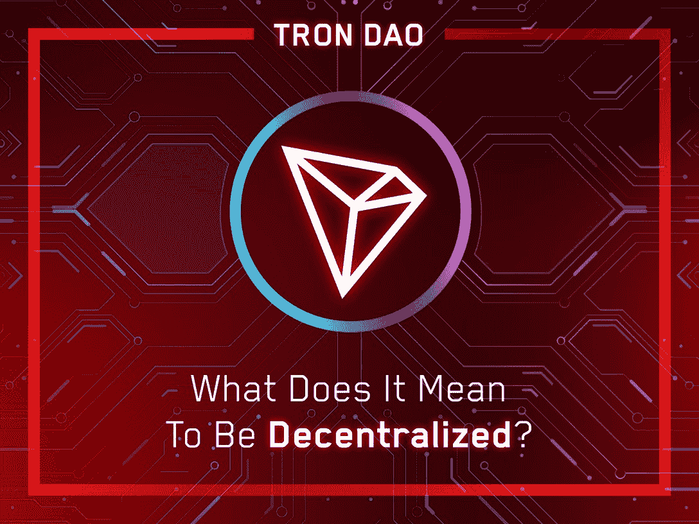

# TRON 的目标是为所有人创造一个互联网，并重新定义去中心化

> 原文：<https://web.archive.org/web/https://dappradar.com/blog/tron-aims-to-create-an-internet-for-all-and-redefine-decentralization>

## 关于 TRONDAO 发展的一切，以及它如何使用户受益

[**TRON**](https://web.archive.org/web/20220930132012/https://trondao.org/) **成立的愿景是打造一个由去中心化驱动的升级版互联网。自 2017 年成立以来，Tron 在过去五年中一直遵循这一宗旨。**

**概要:**

*   [TRON 网络](https://web.archive.org/web/20220930132012/https://dappradar.com/rankings/protocol/tron)于 2021 年 12 月完成了全面的去中心化，并在其演变为[道](/web/20220930132012/https://dappradar.com/blog/what-is-a-dao-how-does-it-work/)的过程中实现了众多里程碑。
*   TRON 的网络拥有超过 1.04 亿个用户账户，超过 36 亿笔交易，锁定的总价值超过 110 亿美元(TVL)。
*   [创道储备](https://web.archive.org/web/20220930132012/https://tdr.org/#/)在创区块链推出[超额抵押分散稳定币](/web/20220930132012/https://dappradar.com/blog/how-is-tron-dao-reserves-usdd-different-from-other-stablecoins-on-the-market/)满足用户对[稳定币](/web/20220930132012/https://dappradar.com/blog/stablecoins-the-simple-guide/)的需求
*   TRON 的权力下放是通过一个四支柱驱动的架构实现的。
*   这四个支柱包括协议、节点、资产和 dapps。

## 创演变为道简史

对大多数区块链人来说，权力下放是一个中心主题。这是一种将权力下放给个人的管理形式；因此，用户可以贡献并拥有网络的一部分。

TRON 致力于通过利用区块链技术和分散应用程序(dapps)来加速互联网的分散化。TRON 网络由 Justin Sun 阁下于 2017 年 9 月创立，自 2018 年 5 月 MainNet 启动以来，取得了令人瞩目的成就。

### 创近年来的里程碑

2018 年 7 月也标志着 [BitTorrent](https://web.archive.org/web/20220930132012/https://www.bittorrent.com/) 的生态系统整合，BitTorrent 是分散化 Web3 服务的先驱，拥有超过 1 亿的月活跃用户。最近几年， [TRON 网络](https://web.archive.org/web/20220930132012/https://tron.network/)获得了令人难以置信的牵引力。

据 [TRONSCAN](https://web.archive.org/web/20220930132012/https://tronscan.org/#/data/stats2/token/tvl) 报道，截至 2022 年 7 月，它在区块链拥有超过 1.04 亿个用户账户，总交易量超过 36 亿笔，锁定的总价值超过 110 亿美元(TVL)。

此外，TRON 拥有全球最大的[美元系绳](https://web.archive.org/web/20220930132012/https://tether.to/en/transparency) (USDT)稳定币流通供应量，自 2021 年 4 月以来在[以太坊](https://web.archive.org/web/20220930132012/https://dappradar.com/rankings/protocol/ethereum)超过 [USDT](https://web.archive.org/web/20220930132012/https://dappradar.com/hub/token/eth/USDT/ETH?from=0xdac17f958d2ee523a2206206994597c13d831ec7) 。TRON 网络于 2021 年 12 月完成了完全的权力下放，现在是一个由社区管理的 DAO。

最近，超额抵押分散稳定币 [USDD](https://web.archive.org/web/20220930132012/https://usdd.io/#/) 在创区块链推出。其背后是区块链业界有史以来第一个加密储备——[创道储备](https://web.archive.org/web/20220930132012/https://tdr.org/#/)，标志着创道正式进入去中心化 stablecoins。

## TRON 的分散架构是如何工作的？

权力下放鼓励将权力交到人民手中。与这样的理念产生共鸣，TRON 于 2021 年 12 月解散了基金会。相反，它将自己确立为一个由社区管理的分权自治组织(DAO ),将其分权承诺推向了一个新的高度。

四个支柱支持 TRON 的分散架构、协议、节点、资产和 dapps。

### 协议的分散化

TRON 希望为开发者和用户提供高效、高通量、可扩展的区块链。为此，它使用委托利益证明(DPoS)共识机制来管理其区块链。

在 DPoS 共识机制中，只有当选的节点可以批准交易块，这与 PoS 系统不同，PoS 系统允许任何拥有足够资产的人这样做。这种结构使用户能够通过一种激励机制委托他们的赌注资产来保护网络。

每个区块链网络都使用共识机制，而 DPoS 是可用的最有效的共识算法之一。此外，与 PoW(工作证明)或传统 PoS 系统相比，DPoS 消耗的能源更少，完成交易的速度更快。由于这些优势，许多区块链已经过渡到 DPoS 机制来为他们的网络供电。

当谈到 TRON 时，社区每六个小时选举 27 个块验证器作为生态系统中的“超级代表”(SRs)。不管 TRX 的赌注有多少，或者 SR 收到多少票，每个 SR 在 TRON 网络上都有相同的投票权。这保证了每个服务请求的控制百分比是均衡的。

### 节点分散化

节点是每个区块链网络的基础。因此，对权力下放的任何审查都必须对其进行评估。值得注意的是，TRON 节点的地理多样性使其更加安全和耐用。

### 资产分散化

本地资产的分布及其可用性也有助于区块链的权力下放。TRX 钱包的数量以惊人的速度增长。2022 年 7 月，TRX 钱包超过 6100 万，一年内增长 134%。

TRON 钱包用户的增加有力地证明了该网络的受欢迎程度以及 TRON 对实现去中心化的贡献。今天，网络上有超过 1 亿个用户帐户，并且用户数量每天都在增长。

### dapps 的分散化

dapps、智能合约和用户的数量对于去中心化也是值得注意的。

TRON Grand Hackathon 为初露头角的企业家和他们的想法提供了一个发展 TRON 网络的绝佳机会。在黑客马拉松期间，各种团队提交了他们的项目，并为生态系统的多样化做出了贡献。此外，这些团队继续开发他们的 dapps，并进一步优化创区块链的用户体验。

尽管取得了丰硕的成果，创的道之旅才刚刚开始。要了解更多关于 TRON 去中心化的信息，用户可以阅读 TRONDAO 博客上的“深入去中心化”报告。

**找到更多关于 TRON 和 TRONDAO 的信息**

[特朗网络](https://web.archive.org/web/20220930132012/http://tron.network/) | [特朗道](https://web.archive.org/web/20220930132012/https://trondao.org/) | [推特](https://web.archive.org/web/20220930132012/https://twitter.com/TRONDAO) | [YouTube](https://web.archive.org/web/20220930132012/https://www.youtube.com/channel/UC5OPOGRq02iK-0T9sKse_kA) | [电报](https://web.archive.org/web/20220930132012/https://t.me/tronnetworkEN) | [不和](https://web.archive.org/web/20220930132012/http://discord.gg/tron)|[Reddit](https://web.archive.org/web/20220930132012/https://www.reddit.com/r/Tronix/)|[GitHub](https://web.archive.org/web/20220930132012/https://github.com/tronprotocol)|[媒体](https://web.archive.org/web/20220930132012/https://trondao.medium.com/) | [论坛](https://web.archive.org/web/20220930132012/https://forum.trondao.org/)

***媒体联系***

费洛兹·拉哈尼
[【电子邮件保护】](/web/20220930132012/https://dappradar.com/cdn-cgi/l/email-protection)

**免责声明** —这是一篇赞助文章。DappRadar 不认可本页面上的任何内容或产品。DappRadar 旨在提供准确的信息，但读者应该在采取行动之前总是自己做研究。DappRadar 的文章不能被认为是投资建议。