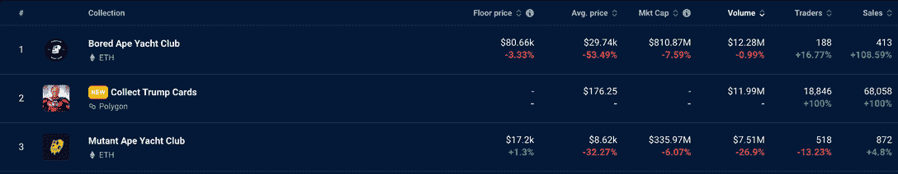
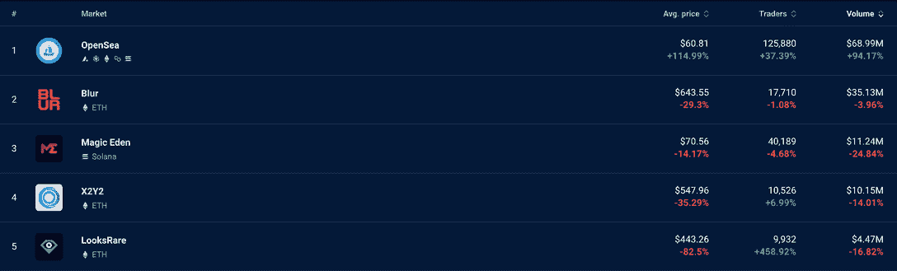

# 川普 NFT 收集泵 OpenSea 交易量

> 原文：<https://web.archive.org/web/https://dappradar.com/blog/trump-nft-collection-pumps-opensea-trading-volume>

## 前总统的 NFT 项目让 OpenSea 再次变得伟大

唐纳德·川普的首届 NFT 时装秀与他 2016 年竞选总统如出一辙。看似无处不在，它的势头越来越大，现在每个人都在讨论它是好是坏，或者介于两者之间。他的交易卡收藏是本周 NFT 的亮点，因为持续的良好销售有助于二级市场 OpenSea 的交易量增加。

[Explore NFT Data](https://web.archive.org/web/20221231111857/https://dappradar.com/nft)

## 王牌数字交易卡

唐纳德·特朗普上周再次成为头条新闻，这一次是因为他启动了自己的官方 NFT 项目。它被称为[王牌数字交易卡](https://web.archive.org/web/20221231111857/https://dappradar.com/polygon/collectibles/collect-trump-cards)，持有多种物品的人会获得不同级别的奖励。持有 45 张卡片，你就能自动获得参加佛罗里达州晚宴的资格。目前，有 255 人拥有 45 张或更多的信用卡。

45，000 件藏品在 12 小时内销售一空，该项目最初的净销售额为 445 万美元。在二级市场上，交易迅速升温，很快就到了月球上。

[Our NFT data shows Trump at number 2](https://web.archive.org/web/20221231111857/https://dappradar.com/nft/collections)

在过去七天的销售中，王牌坐在排名第一的无聊猿和排名第三的变异猿之间。这位前总统的收藏品在二级市场上的销售额为 1199 万美元，个人交易记录为 68058 笔。

特朗普和他的团队实际上并不拥有该项目的所有权，他们也不负责该项目的管理。该系列背后的公司是 NFT 国际公司，很可能他们将收取 10%的版税，这已经远远超过了 100 万美元。

该公司为该系列授权了特朗普的形象、肖像和名字，因此他可能已经收到了参与该系列的一次性付款。

有趣的是，区块链侦探鄂霍次克指出，一个项目管理员钱包在一系列交易中为自己铸造了第一批 1000 张王牌数字交易卡。对特朗普和他的团队来说，幸运的是，他们能够为自己赢得一张罕见的 1 对 1 卡，最终可能价值数千美元。

> 1/原来唐纳德·川普在他的金库钱包里铸造了 1000 张他自己的 nft
> 
> 为自己保留了他收藏中最罕见的 NFT 的很大一部分
> 
> 第二张铸造的 NFT 是罕见的 1 比 1，机会…【pic.twitter.com/3m0MQGQydp】T4
> 
> — OKHotshot (@NFTherder) [December 17, 2022](https://web.archive.org/web/20221231111857/https://twitter.com/NFTherder/status/1604099659382784000?ref_src=twsrc%5Etfw)

Source: Twitter

从 NFT 效用的角度来看，持有这些卡片的奖励清单，是以唐纳德·特朗普(Donald Trump)的名字命名的系列所能提供的。如果你想见到第 45 任总统，那么其中一些奖项不会让你失望:

*   与特朗普在迈阿密共进晚餐
*   Mar-a-Lago 鸡尾酒
*   与他本人的一对一会面
*   特朗普度假村的高尔夫
*   Zoom 与第 45 任总统通话
*   签名纪念品

因此，如果你喜欢太阳、高尔夫、Zoom calls 和唐纳德·特朗普，今天拿起几张牌可能是一项值得的投资。如果你是纯粹的投机者，想要快速获利，看起来你已经错过了机会，价格可能已经见顶了。

## OpenSea 交易量增长 94%

尽管 NFT 市场在 2022 年大幅下跌，交易量从 1 月份的 57 亿美元下降到 11 月份的 5 亿美元，但 OpenSea 度过了美好的七天。该平台的交易额跃升 94%，至 6，899 万美元。

[<picture></picture>](https://web.archive.org/web/20221231111857/https://dappradar.com/nft/marketplaces)

Check out DappRadar’s NFT marketplace data

当我们将这些数据与其他 NFT 市场进行比较时，OpenSea 的数据尤其令人印象深刻。其他所有交易平台的交易量都在下降，每笔 NFT 交易的平均价格也在下降。

如果我们看看 OpenSea 网站上的数据，我们可以看到一些大型收藏的交易量增加了，这些是促成交易量增加的因素:

*   [王牌数字交易卡](https://web.archive.org/web/20221231111857/https://dappradar.com/polygon/collectibles/collect-trump-cards)–6，378 ETH 销售额–新进入。
*   [Bored Ape 游艇俱乐部](https://web.archive.org/web/20221231111857/https://dappradar.com/ethereum/collectibles/bored-ape-yacht-club)–销售额达到 2391 ETH–增长 48%。
*   销售额增加了 6529–1045 ETH，增长了 144%。
*   Beacon 的销售额为 649 ETH，增长了 164%。
*   [DEGEN TOONZ COLLECTION](https://web.archive.org/web/20221231111857/https://dappradar.com/ethereum/collectibles/degen-toonz-collection)–552 ETH 销售额–增长 134%。
*   [狼游戏](https://web.archive.org/web/20221231111857/https://dappradar.com/ethereum/games/wolf-game)–销售额 537 ETH–增长 1.578%。

仅特朗普的交易卡就为 OpenSea 的总交易量贡献了超过 750 万美元的交易量，占 3346 万美元周环比增长的 22.4%。交易卡是在 Polygon 上创建的，如果我们查看七天 [Polygon 市场数据](https://web.archive.org/web/20221231111857/https://dappradar.com/nft/marketplaces/protocol/polygon)，我们可以看到 OpenSea 在该网络上的销售额增长了 602%。

## 两个足球猿在十大销售

本周 NFT 十大最贵房产包括九只猩猩和一块 Axie Infinity 土地。不同寻常的是，并非所有的猿类都感到无聊；其中两件来自一个新系列，该系列借助了 FIFA 世界杯的人气。

[Explore Top NFT Sales](https://web.archive.org/web/20221231111857/https://dappradar.com/nft/sales)

来自足球类人猿粉丝俱乐部创世纪版的两件 NFT 拍出了 145，250 美元和 121，610 美元的价格。[足球猿粉丝俱乐部 6](https://web.archive.org/web/20221231111857/https://dappradar.com/hub/assets/eth/0xfe4cb03f2a4cf5a4074f6c8f77894a814782fdba/6) 是一只叫 Nemar Jr(不要和巴西传奇人物小内马尔混淆)的金猿。[足球猿球迷俱乐部 3](https://web.archive.org/web/20221231111857/https://dappradar.com/hub/assets/eth/0xfe4cb03f2a4cf5a4074f6c8f77894a814782fdba/3) 眼睛有激光，手拿金靴，名叫马拉多纳。

Nemar Jr (sic.)

这两只猿猴都是通过 OpenSea 出售的，装它们的钱包都是最近制作的。其中一个钱包装有另外两只足球猿，另一个钱包装有另外两只足球猿[。](https://web.archive.org/web/20221231111857/https://dappradar.com/hub/wallet/eth/0x138a908466c946821736d3580df71558b4d45b91)

Maradona

这些可能是完全合法的交易，但它们都具有可疑活动的所有特征。做自己的研究是任何优秀的 NFT 交易者的关键技能。如果某个收藏不知从何而来，并且有几个突出的项目卖到了令人惊讶的价格，那绝对值得做更多的挖掘，以确定这不是一个骗局。

## 识破骗局

DappRadar 为您提供了大量资源，帮助您避免诈骗、地毯拉花和骗子:

*   [识破 NFT 骗局的六种方法](https://web.archive.org/web/20221231111857/https://dappradar.com/blog/how-to-spot-an-nft-scam)
*   [如何防止骗子榨干你的钱包](https://web.archive.org/web/20221231111857/https://dappradar.com/blog/how-to-prevent-scammers-from-draining-your-wallet)
*   [如何保护自己免受种子短语诈骗](https://web.archive.org/web/20221231111857/https://dappradar.com/blog/how-to-protect-yourself-from-seed-phrase-scam)
*   [检验代币骗局的八种方法](https://web.archive.org/web/20221231111857/https://dappradar.com/blog/8-ways-to-check-if-its-a-token-scam)

我们还有一个每周一次的 Twitter 空间，在那里我们可以和来自 Web3 现场的专家讨论所有关于地毯的话题。每周二下午 6 点加入我们，我们将讨论拉地毯:如何发现通常的嫌疑人。

[Read RugRats Article](https://web.archive.org/web/20221231111857/https://dappradar.com/blog/rug-pulls-how-to-spot-a-usual-suspect)

## 随身携带您的 Web3 之旅

使用 DappRadar 移动应用程序，再也不会错过 Web3。查看最受欢迎的 dapps 的性能，并关注您投资组合中的 NFT。您在 DappRadar 上的帐户会与我们的移动应用程序同步，这样您很快就可以选择实时接收提醒。

[Download the DappRadar app now](https://web.archive.org/web/20221231111857/https://dappradar.app.link/blog)[<picture></picture>](https://web.archive.org/web/20221231111857/https://play.google.com/store/apps/details?id=com.portfolio.dappradar)