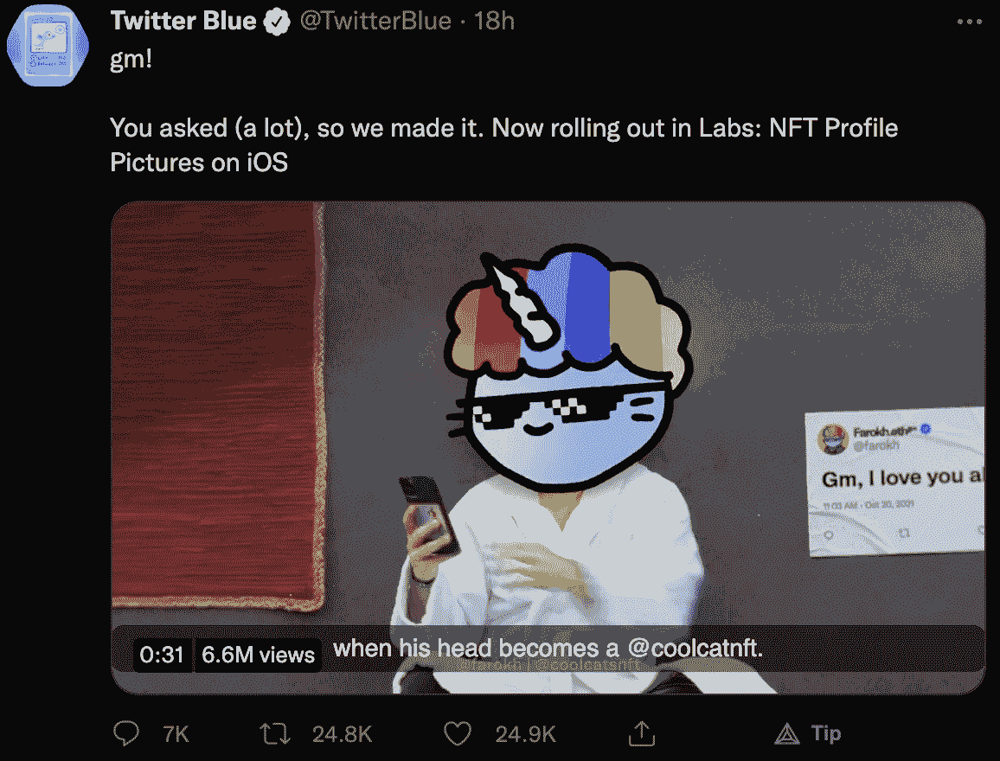
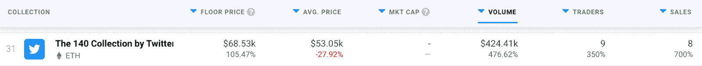

# Twitter 推出 NFT 个人资料图片验证

> 原文：<https://web.archive.org/web/https://dappradar.com/blog/twitter-launches-nft-profile-picture-verification>

## 备受期待的功能可以说是阻止了“右击保存”

社交媒体平台 Twitter 正朝着将区块链技术，尤其是 NFTs 融入其服务的方向迈出第一步。该平台宣布正在开发一项新功能，该功能将允许用户验证他们是以太坊钱包中 NFT 的所有者。

新功能还将为用户引入不同的个人资料图片边框。那些拥有 NFT 头像的人将会得到一个不同形状的边框。传统上，Twitter 个人资料图片放在一个圆形边框中。但是，已经被验证为由帐户所有者拥有的 NFT 将具有六边形边框。

这项功能备受期待，尤其是来自加密和 NFT 爱好者。重要的是，新的验证结构可能会停止“右键单击保存”的做法。反对将 NFTs 作为一个概念的主要论点之一是，任何图像都可以很容易地保存和复制。然而，有了新的验证功能，只有任何给定 NFT 的所有者才能用特殊的六边形边框来展示它。

## Twitter 进一步进入 NFT 空间

新的 NFT 验证功能并不是 Twitter 首次涉足区块链领域。这是第一个让平台更接近 web3 的主要功能。然而，Twitter 已经在 NFT 占据了一席之地。

这个社交媒体平台去年夏天发布了 140 集合，有效地将 Twitter 推向了加密世界。目前，在二级市场 OpenSea 上只有七种 NFT 可用。令人印象深刻的是，它们的底价是 24 ETH，约合 66.827 美元。

在过去的 30 天里，只有 9 笔交易记录在托收智能合同上，然而，这些交易产生了近 50 万美元的交易量。尽管如此，考虑到令人印象深刻的底价，这并不令人惊讶。

随着 140 集合和最新的 NFT 验证功能，Twitter 正在向 NFT 和加密领域深入。Twitter 已经是加密爱好者使用的最受欢迎的社交媒体平台之一，因此专注于 NFT 的功能出现在它提供的服务列表中是唯一合乎逻辑的。

## 脸书和 Instagram 也加入进来

Twitter 并不是唯一探索区块链空间和 NFT 整合的社交媒体平台。根据最近英国《金融时报》的一篇文章，Meta 正在积极开发原型功能，允许用户在脸书和 Instagram 上展示他们的 NFT。这些社交媒体平台上甚至有关于 NFT 铸造功能的传言。

当然，这些发展符合该公司最近对区块链市场的巨大推动。从更名为 Meta 开始，马克·扎克伯格的计划越来越关注虚拟现实和元宇宙。NFT 在塑造元宇宙的过程中发挥了巨大作用，因此将它们整合到脸书和 Instagram 中是合乎逻辑的。

DappRadar 将继续监控 NFT 空间，以及现在可以验证他们的 Twitter NFT 个人资料照片的名人收藏者。此外，我们将报道任何关于 Meta 在元宇宙的计划的新闻。要了解最新的 NFT 新闻，请关注 DappRadar 的 [Twitter](https://web.archive.org/web/20221208152755/https://twitter.com/dappradar) ，或者加入我们的 [Discord](https://web.archive.org/web/20221208152755/https://discord.gg/4ybbssrHkm) 社区，进行有趣的 NFT 讨论。

 NewsletterUnsubscribe at any time. [T&Cs](https://web.archive.org/web/20221208152755/https://dappradar.com/terms) and [Privacy Policy](https://web.archive.org/web/20221208152755/https://dappradar.com/privacy-policy)