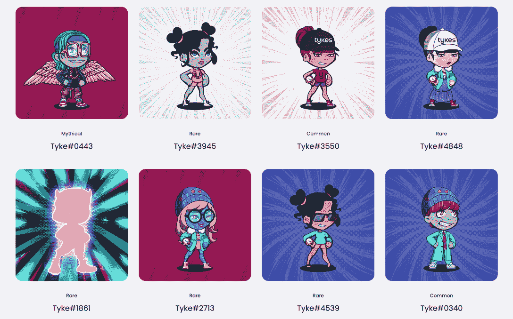

# 泰克斯·NFT 一周内就赚了 1000 多 ETH

> 原文：<https://web.archive.org/web/https://dappradar.com/blog/tykes-nft-grosses-over-1000-eth-in-a-week>

## 这位创始人声称，这不仅仅是一个 NFT 支持的 Airbnb 项目。

**Tykes NFT 在推出一周后，销量超过 1，000 ETH。该项目致力于将房地产与 Web3 技术相结合，并将社区成员与房地产专业人士、投资者、web3 专家、开发商和企业家联系起来。**

**概要:**

*   Tykes 是由连续创业者 Ryan Pineda 创建的 5000 个 NFT 的集合。
*   Tykes 旨在通过汇集投资者、开发商、web3 专家和房地产专业人士的社区来构建数字房地产的未来。
*   持有人还可以使用 Tykes 的生态系统令牌预订项目拥有的住宿。
*   如果用户想发现当下最受欢迎的 NFT 项目，他们可以查看 DappRadar 的 NFT 探索者。

在过去的几天里，NFT 的空间里有相当多的嗡嗡声。除了人们津津乐道的 y00ts 之外，还有一位著名的表演者叫做[泰克斯·NFT，他出演了 DappRadar 的《NFT 探险者》。](https://web.archive.org/web/20220926154217/https://dappradar.com/hub/nft-explorer/collection/digital-tycoons-club-tykes)

Tykes NFT 于 8 月 31 日推出，交易价格超过 3 ETH。值得注意的是，它已经累积了超过 1300 ETH 的体积，在过去的 24 小时内增加了 22%。该项目承诺给持有者带来意想不到和前所未有的可用性，其功能甚至超过了[月鸟](https://web.archive.org/web/20220926154217/https://dappradar.com/hub/nft-explorer/collection/bored-ape-yacht-club)和[海湾](https://web.archive.org/web/20220926154217/https://dappradar.com/hub/nft-explorer/collection/moonbirds)。听起来是不是很有野心？

让我们来看看这个时髦的 NFT 收藏是怎么回事！

## Tykes NFT 是什么？

Tykes 由连续创业者 Ryan Pineda 创建，由 5000 家 NFT 组成，旨在塑造数字房地产的未来。此外，Tykes NFT 为希望利用 Web3 和[元宇宙](/web/20220926154217/https://dappradar.com/blog/what-is-the-metaverse/)创业的个人提供教育工具。

Tykes 不是吹嘘沉浸式游戏体验或独家业务，而是为成员建立一个社区，与房地产专业人士、投资者、企业家等建立联系。另一个主要目标是帮助他们建立一个永续发展的企业和产业。

这听起来与蓝筹股 NFT 系列 [VeeFriends](https://web.archive.org/web/20220926154217/https://dappradar.com/hub/nft-explorer/collection/veefriends) 相似，但更侧重于创新性地利用价值数十亿美元的房地产行业。

如果你从未听说过 VeeFriends，这篇 DappRadar 报道会给你一个大概的概念。

## Tykes 有哪些公用设施？

Tykes 正在为会员建立一个平台与房地产专业人士、投资者、Web3 专家、开发商、企业家等建立联系。这一广泛的网络促进合作，以建立塑造未来的业务。

教育一直是 Tykes 社区最重要的主题之一。成为 Tykes NFT 持有者将有机会参加在线和现实生活中的培训。除了所有这些好处之外，会员还可以获得投资初创企业、房地产交易、元宇宙土地交易等的专属权限。

如果这一切听起来仍然有点模糊，Tykes 已经在其房地产业务中向前迈进了一步。该项目在内华达州拉斯维加斯购买了一套价值 150 万美元的房子，这是许多房子中的第一套。社区成员将能够使用他们的 Tycoin token 来预订他们的住宿日期。

下面的视频向您介绍了酒店的方位。

[https://web.archive.org/web/20220926154217if_/https://www.youtube.com/embed/iCkY21eiutA?list=PLO9MWnxrqdQXk0LEm_KWzryCEfLMtUR_E](https://web.archive.org/web/20220926154217if_/https://www.youtube.com/embed/iCkY21eiutA?list=PLO9MWnxrqdQXk0LEm_KWzryCEfLMtUR_E)

## 泰克斯·NFT 合法吗？

围绕 [Tykes](https://web.archive.org/web/20220926154217/https://dappradar.com/hub/nft-explorer/collection/digital-tycoons-club-tykes) 的热切期待似乎毫无疑问。藏品在造币当天被抢购一空，楼面价翻了好几倍。但是，值得注意的是，这些 NFT 的浓度相对较高。具体来说，5，000 个 NFT 由 1，000 个不同的钱包持有，这意味着底价操纵的可能性更高。

感兴趣的用户在加入之前必须做自己的研究。用户可以利用 DappRadar [NFT 探索者](https://web.archive.org/web/20220926154217/https://dappradar.com/hub/nft-explorer)和 [NFT 价值评估者](https://web.archive.org/web/20220926154217/https://dappradar.com/hub/nft-value-estimator)来获得关于各种 NFT 和集合的更有见地的信息。

使用 [NFT 浏览器](https://web.archive.org/web/20220926154217/https://dappradar.com/hub/nft-explorer)发现您最喜爱的 NFT 系列，并获得可操作的准确数据。

## 随身携带您的 Web3 之旅

有了 DappRadar 移动应用程序，再也不要错过 Web3。查看最受欢迎的 dapps 的性能，并关注您投资组合中的 NFT。您在 DappRadar 上的帐户与我们的移动应用程序同步，很快您就可以选择实时接收提醒！

[<picture></picture>](https://web.archive.org/web/20220926154217/https://play.google.com/store/apps/details?id=com.portfolio.dappradar)[Download for Android](https://web.archive.org/web/20220926154217/https://play.google.com/store/apps/details?id=com.portfolio.dappradar)