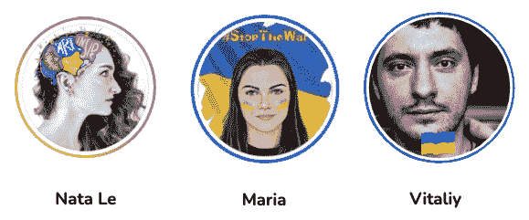
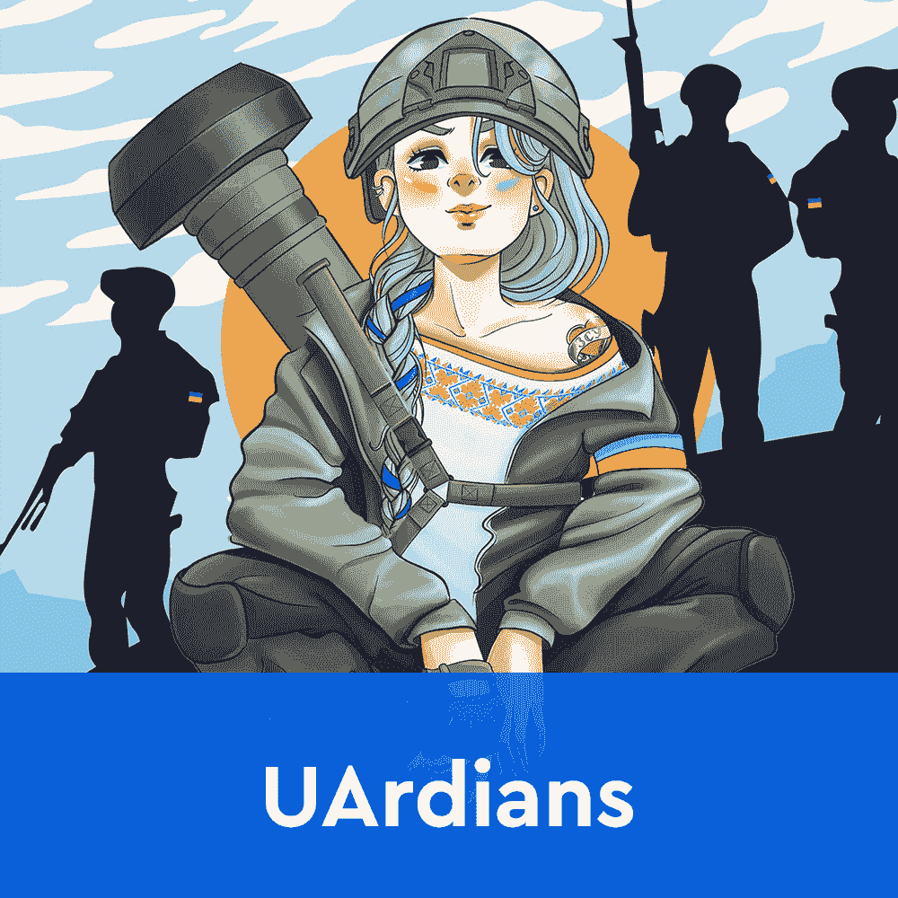
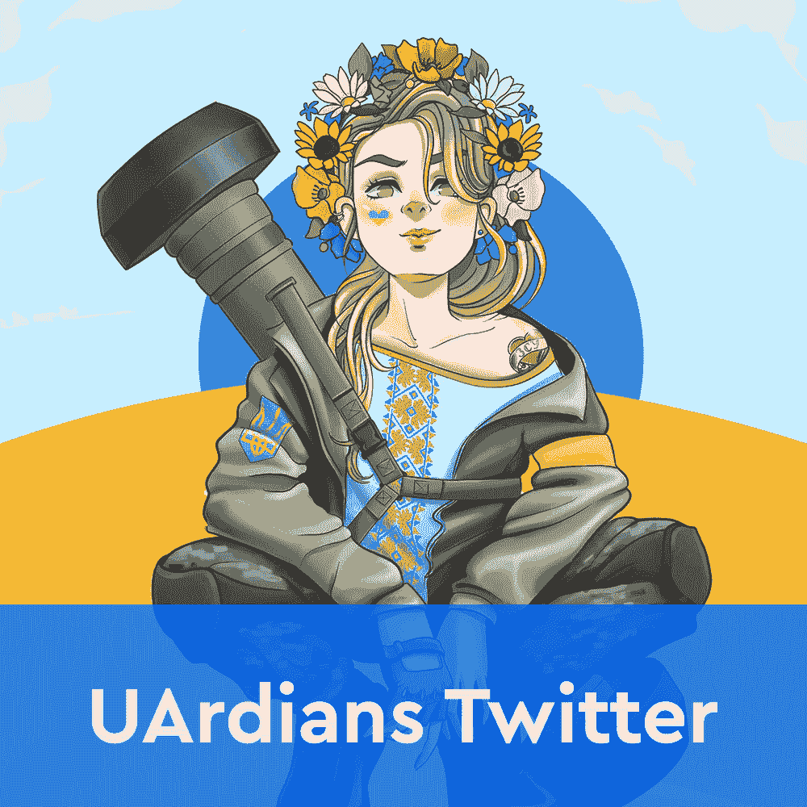

# 守护者 nfts 筹集资金支持乌克兰

> 原文：<https://web.archive.org/web/https://dappradar.com/blog/uardians-nfts-raise-funds-to-support-ukraine>

## 乌克兰艺术家 Natasha Le 设计的 10，000 个 NFT 系列将于 4 月 28 日推出，首批投放 100 个独特的 NFT

乌克兰已经英勇抗击入侵的俄罗斯军队 60 多天了，即将展出的乌克兰人 NFT 作品集将尽力帮助乌克兰人。该项目的艺术是由创作者娜塔莎勒设计。她来自一个靠近布加勒斯特的地区，布加勒斯特是战争中受影响最严重的城市之一。

***概要:***

*   [UArdians 象征着乌克兰人民在面对不可能的困难时的反抗](https://web.archive.org/web/20220924162941/https://dappradar.com/blog/uardians-nfts-raise-funds-to-support-ukraine/#UArdians)
*   [第一次发布是在 4 月 28 日，定价为 0.08 ETH](https://web.archive.org/web/20220924162941/https://dappradar.com/blog/uardians-nfts-raise-funds-to-support-ukraine/#mint)
*   [90%的一次销售收入和 10%的二次销售版税收入归乌克兰慈善机构所有](https://web.archive.org/web/20220924162941/https://dappradar.com/blog/uardians-nfts-raise-funds-to-support-ukraine/#goal)

UArdians 是由五个角色组成的 NFT 集合。他们中的每一个人都代表了乌克兰人的日常生活。五个角色中的每一个都将在无数次的重复中出现，描述与入侵的俄罗斯军队的战斗。

## 什么是 UArdians？

UArdians 是一个基于以太坊的 NFT 收藏。它由 10，000 个 NFT 组成，专用于五个不同的角色。每一套都以乌克兰人民面临的日常斗争的独特诠释为特色。

该系列的艺术品由乌克兰艺术家 Natasha Le 创作。她的设计已经到达了全球的观众，在过去的几周里像病毒一样传播开来。她与两名乌克兰同胞合作，创建了一个慈善的 NFT 收藏，以帮助乌克兰人民的日常斗争。

重要的是，UArdians 收集的唯一目的是筹集资金和提高对正在乌克兰肆虐的军事冲突的认识。这个团队的所有成员都在为这个项目无偿工作。他们的重点是向他们的乌克兰同胞提供急需的帮助。

该项目的路线图包括四个不同的阶段，每个阶段专注于不同的目标。该团队正在努力为 UArdians NFT 持有者开发一个强大的福利计划，包括额外的优惠以及社区参与。

目前，收藏家们只能看到五个 UArdians 人物中的第一个。她来自 Mikolaiv，一个宁愿喝咖啡和航运代码也不愿扫荡入侵者的女人，但时代已经改变，她正在迎接挑战。

## 怎么造币？

第一批 100 台 UArdians NFTs 将于 4 月 28 日推出。造币将在 UArdians 官方网站上进行，每个 NFT 的造币价格定为 0.08 ETH。你可以在[官方的 UArdians Twitter 页面](https://web.archive.org/web/20220924162941/https://twitter.com/nft_uardians)上关注所有关于造币厂的最新消息。所有的二级市场行为都发生在这里[的 OpenSea](https://web.archive.org/web/20220924162941/https://opensea.io/collection/uardiansnft) 。

造币厂初期 90%的收益将用于支持乌克兰人民的筹款活动。请记住，如果你想制造一辆 UArdian NFT，你还必须留出一些汽油费。当然，如果你不能设法抢到一个造币厂，你总是可以在二级市场上购买 UArdians。

## UArdians 项目的目标是什么？

UArdians 有一个非常简单，但崇高的使命:帮助乌克兰人战斗。该项目的所有铸造和二次销售版税收入将捐给乌克兰的两个慈善组织。PrytulaFoundation 和 T2 RazomForUkraine 都向乌克兰人民提供军事和人道主义援助。

该项目的最终目标是通过一级和二级 NFT 销售筹集超过 100 万美元。在这场史无前例的入侵中，所有这些资金都将用于帮助乌克兰及其人民。UArdians NFTs 每次二次转售的版税费用定为 10%，将全部直接寄给创始人选择的慈善组织。

达普拉达为 UArdians 的崇高使命喝彩。不幸的是，蔓延整个乌克兰的战争和恐怖仍在继续，乌克兰人民需要他们所能得到的一切帮助。查看下面的链接以获得更多关于 UArdians 的信息，并填写 mint 注册表。这是一个展示你对乌克兰的支持和帮助的好机会。

[<picture></picture>](https://web.archive.org/web/20220924162941/https://www.uardians.com/)[<picture></picture>](https://web.archive.org/web/20220924162941/https://twitter.com/nft_uardians)[<picture></picture>](https://web.archive.org/web/20220924162941/https://opensea.io/collection/uardiansnft)

**有用链接:**

市场位置:https://opensea . io/collection/guardiansnft

linkree:https://linker . ee/NFT _ guardians

网址:[https://www.uardians.com/](https://web.archive.org/web/20220924162941/https://www.uardians.com/)

推特:[https://twitter.com/nft_uardians](https://web.archive.org/web/20220924162941/https://twitter.com/nft_uardians)

insta gram:[https://www . insta gram . com/NFT _ guardians/](https://web.archive.org/web/20220924162941/https://www.instagram.com/nft_uardians/)

 NewsletterUnsubscribe at any time. [T&Cs](https://web.archive.org/web/20220924162941/https://dappradar.com/terms) and [Privacy Policy](https://web.archive.org/web/20220924162941/https://dappradar.com/privacy-policy)