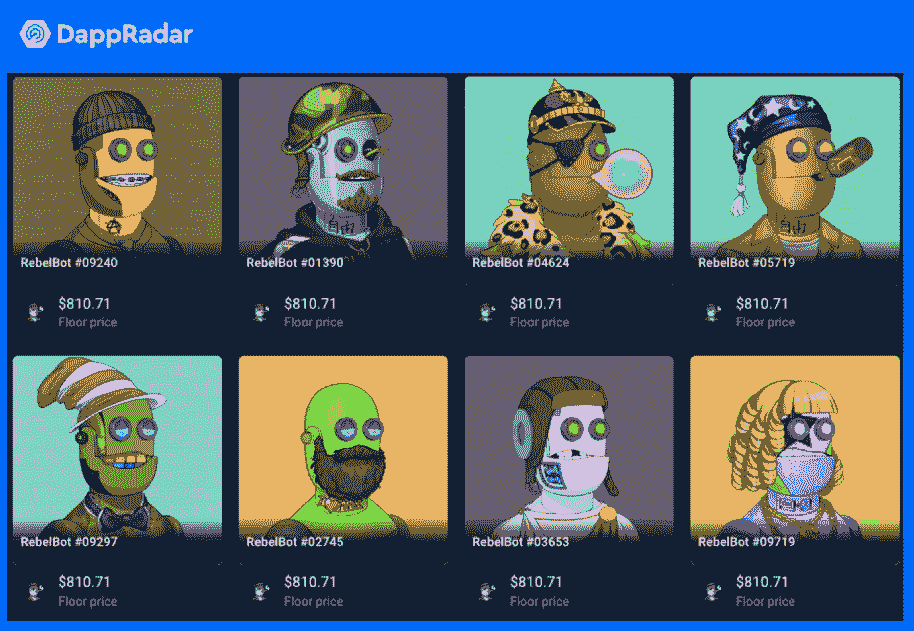
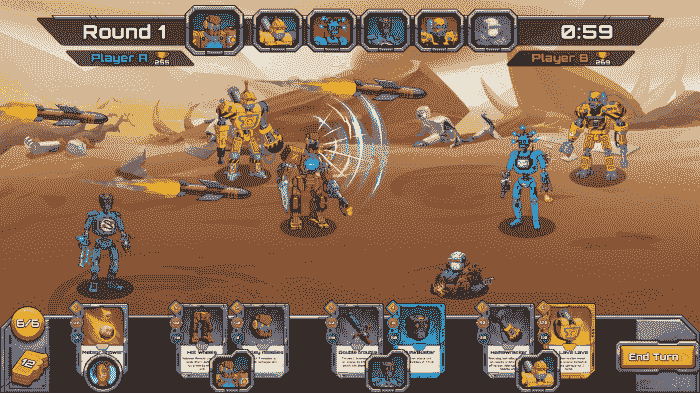

# 育碧和 Animoca 在游戏《反叛机器人》背后

> 原文：<https://web.archive.org/web/https://dappradar.com/blog/ubisoft-animoca-behind-play-to-earn-game-rebel-bots>

## Rebel Bots 是一款基于多边形的卡牌战斗游戏，采用“玩到赚”的机制

Polygon 区块链上的一款游戏 Rebel Bots 与 Animoca Brands、育碧和 Overwolf 达成了一项价值 200 万美元的私人代币销售。去年，该游戏发行了 10，000 个具有创收功能的独特的不可替代的 token)头像。另一种游戏中的非战斗机器人被称为战斗机器人，充当士兵与其他玩家战斗。

这一轮成功的融资发生在 8 月份 Rebel Bots NFT 系列拍卖的几个月后。它进一步增强了团队构建参与式社区和游戏生态系统的能力。有了区块链游戏巨头 T2 Animoca Brands 和游戏巨头育碧的支持，反叛机器人的潜力得到了巩固。

Rebel Bots 是一款以技能为基础，以科幻为主题的卡牌对战游戏，同时提供 PvE 模式和 PvP 模式。2021 年 8 月，该团队发布了 [10，000 个反叛机器人 NFT](https://web.archive.org/web/20221002000900/https://dappradar.com/hub/wallet/eth/0x4714701542b52ee59dde2e4e4c468051c0b433da/nfts/1/rebelbots) 头像，并很快售罄。这些叛军机器人 NFT，也被称为王国领主，是游戏中最有价值的 NFT。王国领主的特别之处在于他们是王国的统治者。叛军机器人头像将被用作王国的旗帜。每一个加入游戏的玩家，都会在某个王国旗帜下战斗。最重要的是，拥有一个反叛机器人 NFT 可以让你从游戏经济中获得收入分成。

## 叛军机器人游戏解释

第一个反叛机器人的标题，Xoil 战争，提供了一个卡牌战斗游戏与发挥赚取机制。这款游戏由 Unity 打造，目标是在 2022 年 6 月底之前在网络和移动平台上推出。叛军机器人的核心玩法是回合制半自动卡牌战。它的灵感来自于炉石、魔法聚会和皇家冲突等游戏所创造的成功的游戏机制。

在游戏中，玩家将能够在单人模式(PvE)或多人模式(PvP)中游戏、进步和赚钱。游戏将要求玩家团结在不同的王国周围，建立他们的军队，并与其他玩家争夺宝贵的 Xoil 资源。游戏中的资源是至关重要的，因为它允许玩家建立新的，更先进的机器人士兵 NFT，并发展他们的战斗策略，以在排行榜上获得更高的赛季奖金。

如前所述，叛军机器人 NFT(王国领主)只是化身。那谁会为你的王国而战？战斗机器人来了，游戏中另一种重要的 NFT。为了与其他玩家战斗，你需要组建一支战斗机器人队伍。你可以在市场上购买战斗机器人，或者使用游戏资源来建造它们，包括 Xoil 和 RBLS 令牌。

## 什么是 RBLS 代币

该团队将发行最多 3 亿枚 RBLS 代币。它是 Rebel Bots 游戏世界的治理令牌，旨在授予未来 Rebel Bots DAO 的投票权。此外，RBLS 代币在游戏中有实用功能，玩家可以在交易所交易。

代币销售流程将经历 3 个阶段:

*   第一阶段:面向反叛机器人持有者的社区销售；
*   第二阶段:Gatio.io 代币销售；
*   第三阶段:通过 Rebel Bots 网站上的分散式交换服务进行公开销售。

Rebel Bots 背后的团队拥有多年开发移动社交游戏的经验。有了这笔投资，该团队离他们成为快速增长的游戏赚钱行业中最大的公司之一的目标又近了一步。

关于特权叛军机器人 NFT 的更多信息，你可以查看 DappRadar NFT 追踪页面。我们也将继续关注叛军机器人和[充满活力的多边形游戏领域](https://web.archive.org/web/20221002000900/https://dappradar.com/rankings/protocol/polygon/category/games)的最新发展。不要忘记[在 Twitter 上关注我们](https://web.archive.org/web/20221002000900/https://twitter.com/DappRadar)让你走在所有人的前面，在快节奏的 dapp 世界中保持更新。