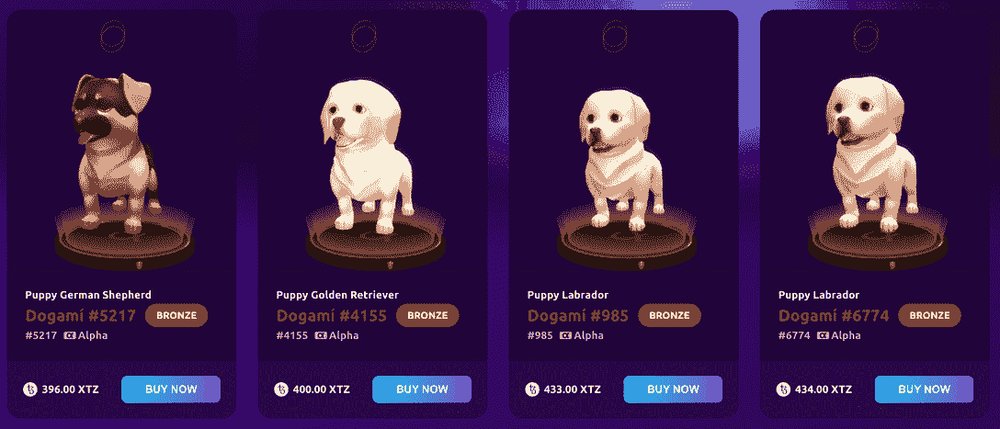
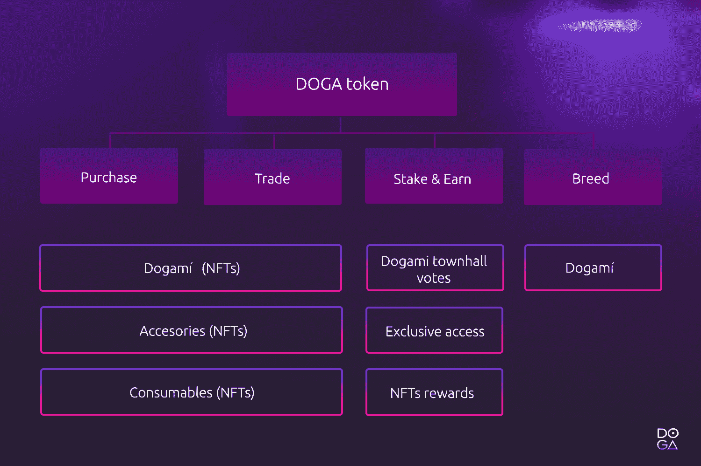
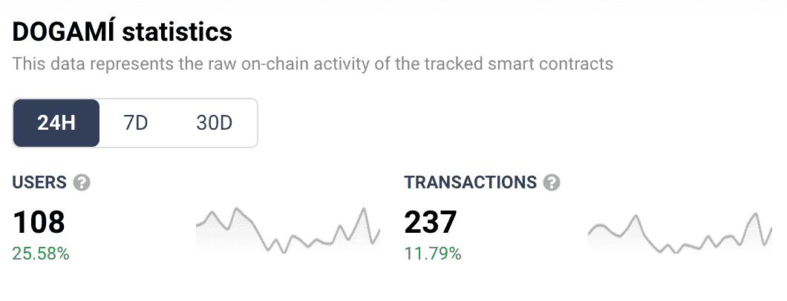
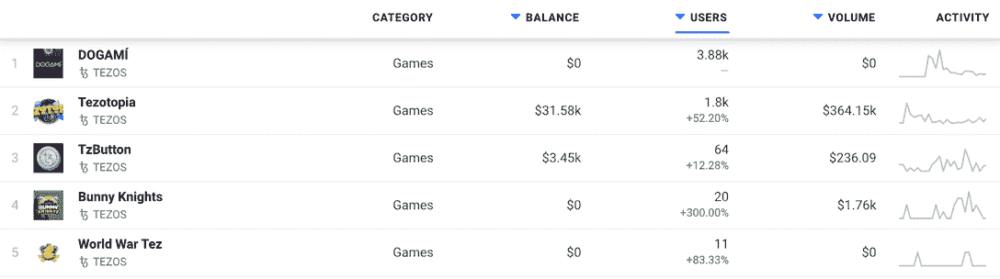
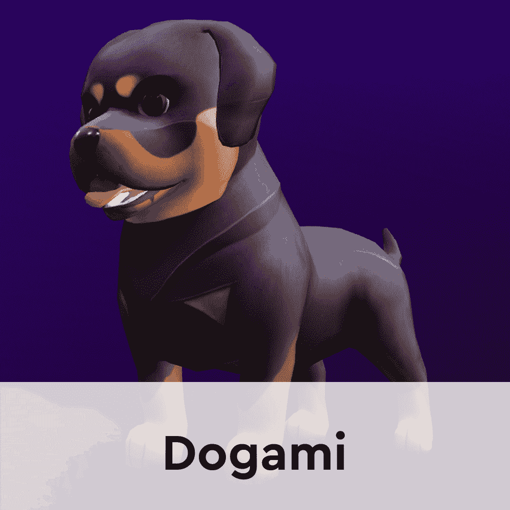
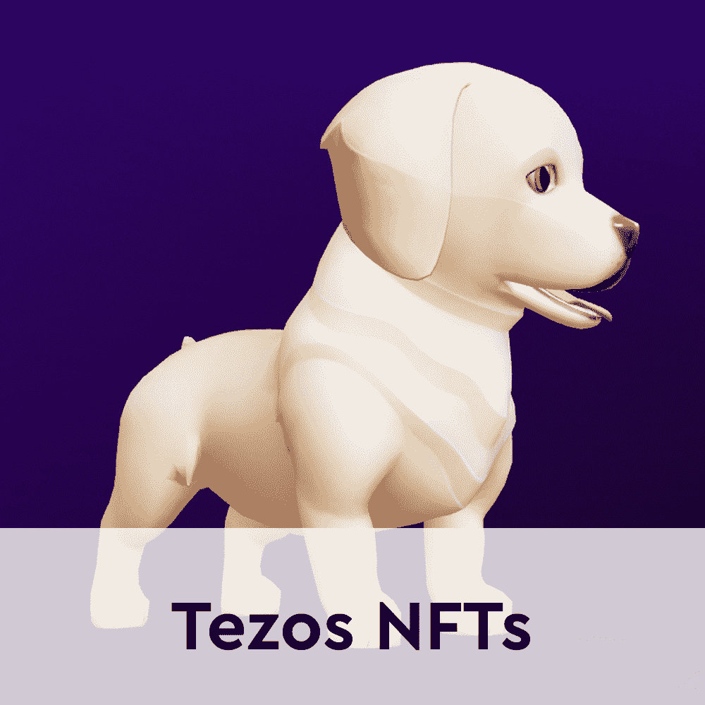
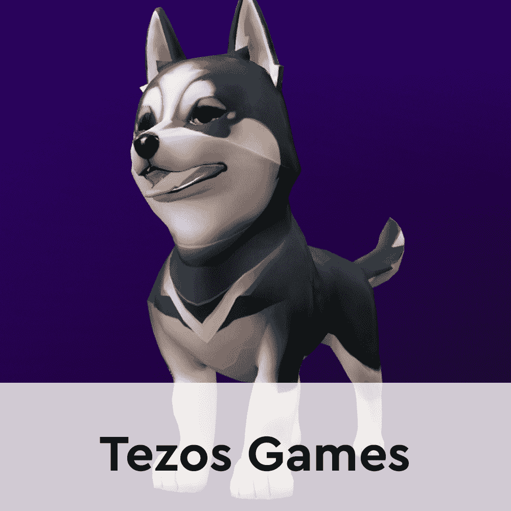

# 育碧支持的 Dogami 两次空投 DOGA 代币

> 原文：<https://web.archive.org/web/https://dappradar.com/blog/ubisoft-backed-dogami-to-airdrop-doga-tokens-twice>

## 第一次 DOGA 空投将在今年 3 月进行，接下来的一次将在 4 月进行

受电子鸡启发的 Tezos 游戏赚取奇迹 Dogami 将在未来几周向其 NFT 持有者空投两次 DOGA 代币。Dogami 社区正兴奋地等待着第一次 DOGA 空投，应该在 3 月 31 日。 **该小组还宣布下个月将进行一次 DOGA 坠落。**

通过在一段时间内空投分散的 DOGA 代币，Dogami 团队确保 NFT 所有者持有他们的资产。此外，这些空投会创造一定的需求，推高数码宠物的价值。因为谁不想要一些免费的 DOGA 呢？

DOGA 代币是 Petaverse 的当地货币， [Dogami](https://web.archive.org/web/20221209053956/https://dappradar.com/tezos/games/dogami) 虚拟宇宙。Dogami 所有者在玩游戏时赚取 DOGA 代币。然后，他们可以使用他们的 DOGA 奖励购买消耗品，建立数字衣柜，购买活动门票，培育他们的 Dogami NFTs，并建立 Petaverse 的未来。

描述 Dogami 的最佳方式是将其比作区块链版的电子鸡。玩家拥有一只宠物 NFT，他们需要收养并饲养它来赚取 DOGA 代币。玩家将需要通过智能手机上的增强现实来照顾他们的虚拟宠物。

重要的是，第一批 Dogami NFT 宠物很快销售一空。现在，新玩家需要从二级市场如 [Objekt](https://web.archive.org/web/20221209053956/https://dappradar.com/tezos/marketplaces/objkt-com) 或内部 Dogami 商店购买 Dogami NFT。然而，Dogami 团队已经计划发布更多的集合。更重要的是，官方路线图详细说明了这款游戏还将在 2022 年年中推出游戏赚取功能。

## DOGA 刺激了 Dogami 经济

本土的 DOGA 令牌在 Dogami 生态系统中扮演着基础性的角色。更重要的是，在未来，随着平台引入先玩后赚机制和进一步的经济工具，它将变得更加重要。

除了作为一个纯粹的经济设备，DOGA 还在游戏的管理和未来扮演着重要的角色。Dogami 采用了分散自治组织的一些原则。该团队定期举行市政厅投票，征求 Dogami 社区的意见和反馈，以及对未来的想法。重要的是，这些市政厅投票只对 DOGA 和 Dogami NFT 持有者开放。

DOGA 代币促进了平台上的所有交易，允许玩家从游戏提供的所有功能中受益。考虑到这一点，用免费的 DOGA 空投奖励忠实粉丝是该平台一个很好的社区建设机制。这也是为什么即将到来的第二次下降吸引了大量的关注，[沿途推动平台上的活动](https://web.archive.org/web/20221209053956/https://dappradar.com/tezos/games/dogami)。

空投已经成为最受欢迎的项目工具之一，用来表达他们对社区的感激之情。最近，DappRadar 举行了自己的[雷达空投](https://web.archive.org/web/20221209053956/https://dappradar.com/token/overview)，向社区进一步开放了它的生态系统。此外，在 NFT 的空间，像[无聊猿游艇俱乐部也举行了自己的空投在过去几周](https://web.archive.org/web/20221209053956/https://dappradar.com/blog/bored-ape-yacht-club-launch-apecoin-with-ape-token-airdrop)。

## Tezos 游戏获得牵引力

Tezos 区块链一直在 NFT 和区块链博彩业吸引新项目。去年，随着 NFT 市场 [Hic et Nunc](https://web.archive.org/web/20221209053956/https://dappradar.com/tezos/marketplaces/hic-et-nunc) 和 [Objkt](https://web.archive.org/web/20221209053956/https://dappradar.com/tezos/marketplaces/objkt-com) 的推出，焦点转向了 Tezos。

2022 年，加密社区对区块链游戏表现出了更大的兴趣。根据最新的 [DappRadar 和区块链游戏联盟报告](https://web.archive.org/web/20221209053956/https://dappradar.com/blog/dappradar-x-bga-games-report-february-2022)，2 月份所有协议的所有区块链活动中，接近 50%来自区块链游戏。考虑到这一点，看到 Dogami、Teztopia 和 BunnyKnights 等项目在过去 30 天内的活动大幅增加就不足为奇了。

在托管游戏项目方面，Tezos 仍处于起步阶段。然而，明显的上升趋势和 Dogami 等 A 级项目的推出证明了该协议可以提供出色的游戏体验。育碧在 Tezos 上举办自己的 NFT 市场和《幽灵侦察》NFT 奖，这不是没有原因的。

Dogami 是最受支持的游戏项目之一。该团队选择 Tezos 来构建他们的平台这一事实说明了一切。受电子鸡启发的宠物平台[已经获得了育碧](https://web.archive.org/web/20221209053956/https://dappradar.com/blog/ubisoft-invests-in-nft-pet-game-platform-dogami/)和 Animoca Brands 的投资，而沙盒的联合创始人 Sebastien Borget 是顾问委员会的一员。

DappRadar 将继续监控 Dogami 和整个 T2 Tezos 游戏生态系统，直到它达到新的高度。如果你想了解这些 dapps，看看下面有用的链接。此外，你可以在[的 Twitter](https://web.archive.org/web/20221209053956/https://twitter.com/dappradar) 上关注 DappRadar，首先获得最新的游戏更新。

[<picture></picture>](https://web.archive.org/web/20221209053956/https://dappradar.com/tezos/games/dogami)[<picture></picture>](https://web.archive.org/web/20221209053956/https://dappradar.com/nft/protocol/tezos)[<picture></picture>](https://web.archive.org/web/20221209053956/https://dappradar.com/rankings/protocol/tezos/category/games) NewsletterUnsubscribe at any time. [T&Cs](https://web.archive.org/web/20221209053956/https://dappradar.com/terms) and [Privacy Policy](https://web.archive.org/web/20221209053956/https://dappradar.com/privacy-policy)