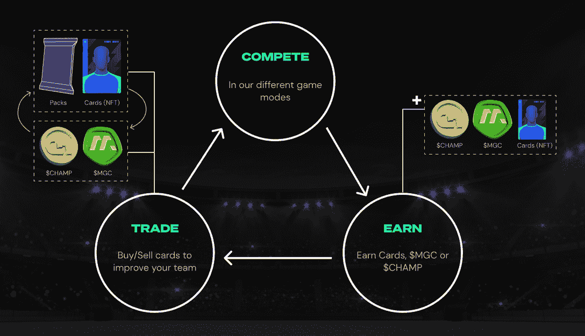

# 终极冠军签约阿森纳成为梦幻足球合作伙伴

> 原文：<https://web.archive.org/web/https://dappradar.com/blog/ultimate-champions-signs-arsenal-fc-as-fantasy-soccer-partner>

## 足球 NFTs 是一个相对未开发的行业

由 Unagi 开发的梦幻足球平台 Ultimate Champions 已经与阿森纳足球俱乐部签署了合作伙伴名单。开发多边形区块链，终极冠军是希望建立大和奖励玩家最好的知识。

**总结**

*   ***《终极冠军》是一款基于多边形区块链的奇幻足球游戏。玩家可以交换足球运动员的 NFT 卡来组建最好的球队。***
*   阿森纳是最新的也可能是最重要的与终极冠军合作的球队。从该平台的路线图来看，将会有更多的大牌宣布，他们将会把更多的运动添加到他们的生态系统中。

[终极冠军](https://web.archive.org/web/20221209053816/https://dappradar.com/polygon/games/ultimate-champions)是一个位于[多边形](https://web.archive.org/web/20221209053816/https://dappradar.com/rankings/protocol/polygon/category/games)区块链的梦幻足球平台，为用户提供拥有数字球员卡和赢得加密代币的机会。不是为了吹牛的权利而和你的朋友比赛，这个想法是你比赛是为了赚钱。

Unagi 是终极冠军背后的公司，自去年以来，他们已经与许多顶级足球队签署了合作协议。加入的球队越多，用户可以添加到他们名单中的球员就越多。

## 终极冠军 x 阿森纳

[终极冠军](https://web.archive.org/web/20221209053816/https://dappradar.com/polygon/games/ultimate-champions)本周早些时候宣布签约英超球队阿森纳。这家来自伦敦北部的足球俱乐部在近 20 年的时间里可能没有赢得多少有意义的奖杯，但它仍然是世界足球的强国，这种合作关系是梦幻体育平台的一次成功。

> 终极冠军很荣幸能与这个标志性的俱乐部合作！
> 
> 立即免费玩:【https://t.co/r2FTihUOTH】T2pic.twitter.com/7ZkGD7NxRn
> 
> — Ultimate Champions (@UltiChamps) [May 10, 2022](https://web.archive.org/web/20221209053816/https://twitter.com/UltiChamps/status/1524064353003188225?ref_src=twsrc%5Etfw)

Ultimate Champions announcement on Twitter

这笔交易意味着终极冠军拥有阿森纳球员形象的全部权利，可以在他们的免费阵容建设游戏中使用这些形象。

与往常一样，这些交易的财务细节很少，但我们认为跨品牌广告将是其中至关重要的一部分。因此，期待在不久的将来，在酋长球场看到终极冠军的标志和品牌滚动在球场的另一边。

对于最终冠军的球员来说，他们现在可以将布卡约·萨卡人、埃迪·恩克蒂亚和加布里埃尔·马丁内利这样的球员加入他们的梦幻阵容，并希望明年阿森纳能够真正努力赢得一些有价值的东西。如果他们没有，至少终极冠军玩家可以赢得一些东西。

## 什么是终极冠军？

终极冠军在 2021 年第三季度推出了第一款可玩的原型，从那时起，它的路线图上已经出现了许多里程碑。去年年底，终极冠军推出了自己的网站，与足球俱乐部合作，私下出售其代币，并开始其封闭的阿尔法。

游戏背后的想法很简单。玩家收集他们喜爱的足球明星的 NFT 卡片，并根据他们在比赛中的表现来累积分数。如果你比对手得分多，你就赢了。这是一个使命:成为教练，尽可能打造最好的团队。

玩家可以在他们的队伍中注册 14 名 NFT，并为他们的队伍挑选 11 名队员。如果用户的团队达到一定的幻想点阈值，他们会获得奖励。这些可以是终极冠军代币和新 NFT 运动员卡的组合。

CHAMP is the utility token and MGC is in the in-game reward token

在接下来的几个月里，终极冠军希望与更多的足球队建立更多的合作关系。他们还希望开始将新闻体育引入他们的生态系统，这样篮球、足球甚至赛车的粉丝就可以关注终极冠军。

因此，这是一个已经在竞争日益激烈的领域取得进展的新平台。

## 这并不是足球界第一次涉足区块链

终极冠军不是第一个基于足球的区块链游戏。作为全球最大、最赚钱的运动，难怪其他人已经利用了它的受欢迎程度。以下是目前将 web3 引入足球的一些最大项目的列表:

*   Sorare——类似于终极冠军，Sorare 是一款梦幻足球游戏，玩家可以用 NFT 卡来组建最好的球队。它基于区块链[以太坊](https://web.archive.org/web/20221209053816/https://dappradar.com/rankings/protocol/ethereum/category/games)的 Starkware 扩展解决方案，并与皇马、巴萨和利物浦等俱乐部建立了合作关系。它于 2019 年推出，投资者包括热拉尔·皮克和安托万·格里兹曼。[下面是对平台](https://web.archive.org/web/20221209053816/https://dappradar.com/blog/guide-on-how-to-play-and-earn-sorare)更深入的了解。

*   [Topps](https://web.archive.org/web/20221209053816/https://dappradar.com/blog/topps-brings-bundesliga-nfts-to-avalanche)——这是一款针对德国德甲球队的简单交易卡牌游戏。想想 NFT 形式的帕尼尼贴纸。它是在区块链的[雪崩](https://web.archive.org/web/20221209053816/https://dappradar.com/rankings/protocol/avalanche/category/games)上推出的，它的制造商已经在 MLB 的[版本](https://web.archive.org/web/20221209053816/https://dappradar.com/wax/collectibles/topps-mlb)上取得了一些成功。有趣的是，棒球卡在蜡制的区块链上交易，但是公司选择了不同的足球卡。

*   MetaSoccer–MetaSoccer 在三月因在平台上增加女性角色而成为新闻。DappRadar 在这里报道了这个故事[。这个游戏是关于管理一个俱乐部和它的球员。你侦察，你购买，你训练，你决定战术。但你也需要安排赞助交易，并利用受欢迎的球员来推销 merch。](https://web.archive.org/web/20221209053816/https://dappradar.com/blog/metasoccer-adds-women-creates-equal-playing-field) 
*   RealFevr-将梦幻足球与数字收藏品相结合。用户可以以类似于 NBA Top Shot 的方式收集动画足球瞬间。这些 NFT 可以在 Fevr 竞技场游戏中使用。当然也有幻想联盟。

关注我们的[博客](https://web.archive.org/web/20221209053816/https://dappradar.com/blog/)和[推特](https://web.archive.org/web/20221209053816/https://twitter.com/DappRadar)订阅，了解更多来自区块链的新闻。使用我们的 [NFT](https://web.archive.org/web/20221209053816/https://dappradar.com/nft) 追踪和排名页面查看你的足球收藏品在我们的列表中的位置。