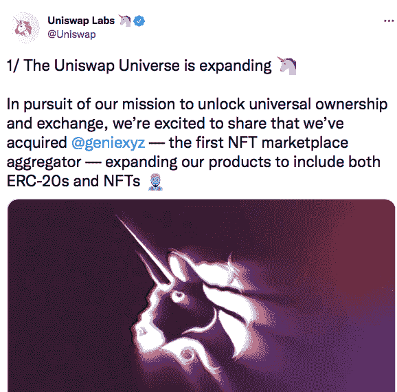

# DeFi 和 NFTs 携手合作，Uniswap 引领潮流

> 原文：<https://web.archive.org/web/https://dappradar.com/blog/uniswap-nfts-will-change-crypto>

## Uniswap 进入 NFTs，OpenSea 进入 DeFi。对 NFTs 效用的总体影响是什么？

## Uniswap 最近进军 NFT 的举动改变了该行业的游戏规则，可以为这些独特的代币带来金融效用。

去年，我们在 NFT 看到了超过 230 亿美元的交易，这是一个不断增长的新兴行业，尽管存在秘密熊市的可能性。每周都有数以千计的 NFT 销售发生，他们现在是 T2 名人、大品牌和流行趋势的代名词，这有助于传播大众接受。

另一方面，DeFi 是 crypto 丑陋的表亲，并没有以同样的方式获得主流的关注。技术壁垒、复杂的动态和糟糕的用户体验可能是罪魁祸首，但 Uniswap 可能会改变这一切。

## 和 DeFi 的 NFTs 结婚是什么样子的？

[Uniswap](https://web.archive.org/web/20230115205008/https://dappradar.com/hub/token/eth/UNI/ETH?from=0x1f9840a85d5af5bf1d1762f925bdaddc4201f984) 是 [DeFi](https://web.archive.org/web/20230115205008/https://dappradar.com/rankings/category/defi) 领域最大的巨头，TVL 超过 47.7 亿美元，是加密领域最可靠、最值得信赖的品牌之一。

[以太坊区块链](https://web.archive.org/web/20230115205008/https://dappradar.com/rankings/protocol/ethereum)在 Uniswap 中锁定的金额最高(45.8 亿美元)，其次是[多边形](https://web.archive.org/web/20230115205008/https://dappradar.com/rankings/protocol/polygon)，Arbitrum 和[乐观](https://web.archive.org/web/20230115205008/https://dappradar.com/rankings/protocol/optimism)。NFTs 与 DeFi 的联姻正式开始于 Uniswap 对第一家 NFT 市场整合商 [Genie](https://web.archive.org/web/20230115205008/https://www.genie.xyz/) 的收购。

用户可以在 Genie 上发现、搜索和交易不同的市场，如 [OpenSea](https://web.archive.org/web/20230115205008/https://dappradar.com/multichain/marketplaces/opensea) 、 [Rarible](https://web.archive.org/web/20230115205008/https://dappradar.com/multichain/marketplaces/rarible) 、 [LooksRare](https://web.archive.org/web/20230115205008/https://dappradar.com/ethereum/marketplaces/looksrare) 等等。最酷的是，你可以在一次交易中完成所有这些。

Source: [Twitter](https://web.archive.org/web/20230115205008/https://twitter.com/Uniswap/status/1539306956002820096?s=20&t=sCPR6kQN4eTnoV43iDoXlA)

## Uniswap NFTs 提高资本效率

大多数婚姻都涉及之前的求爱，在 Uniswap 作为一个领先的 DeFi 平台和不可替代的令牌的情况下，这没有什么不同。

2021 年 5 月，Uniswap 宣布流动性池(LP)头寸将在 [Uniswap V3](https://web.archive.org/web/20230115205008/https://dappradar.com/multichain/exchanges/uniswap-v3) 成为 NFT，根据头寸的个别属性显示为独特的链上生成的 art。

Uniswap3 引入 NFTs 是资本效率和用户体验的巨大进步。根据资产池和在流动性提供界面上选择的参数，将生成一个唯一的 NFT，代表您在该特定资产池中的头寸。

这允许支持具有多个费用等级和集中流动性范围的头寸，而不是简单地选择等值的代币。

在任何流动性池中选择您偏好的费用等级，都会提升整体用户体验，并因 NFT 元素而大幅提高资本效率。

[https://web.archive.org/web/20230115205008if_/https://www.youtube.com/embed/GREUQeHpQeQ?feature=oembed](https://web.archive.org/web/20230115205008if_/https://www.youtube.com/embed/GREUQeHpQeQ?feature=oembed)

Source: [Coin Bureau](https://web.archive.org/web/20230115205008/https://www.youtube.com/watch?v=GREUQeHpQeQ)

## 游戏 NFT 需要 DeFi 进行令牌标记

游戏、NFTs 和 DeFi 是一个强大的组合，可以在游戏中进行比特币、以太坊或普通货币等加密货币的货币兑换。例如，当 [Axie Infinity](https://web.archive.org/web/20230115205008/https://dappradar.com/multichain/games/axie-infinity) 在 Covid 疫情期间成为主流时，拉丁美洲的大多数玩家都将其光滑的爱情药剂(SLP)令牌转换为稳定的硬币，然后通过兑换转换为法定货币。

GameFi 是一个游戏包含分散金融或 DeFi 元素的市场，它正在以真正革命性的方式颠覆游戏行业。与此同时，正如我们在最新的 [BGA Games 报告](https://web.archive.org/web/20230115205008/https://dappradar.com/blog/dappradar-crypto-games-report-5-blockchain-games-continue-to-defy-the-bear-market)中所报道的，它吸引了全球风投和投资者的目光。

赌注是 DeFi 的核心诉求，允许玩家锁定他们的代币，建立对特定代币的兴趣。当然，同时希望代币价值会随着时间的推移而增加。

这些游戏代币和资产可以转移到其他生态系统，这不仅增加了 DeFi 的流动性，反之亦然，还将玩家置于驾驶员的座位前，带来了传统游戏无法提供的许多好处，尽管出色的图形和用户体验无法提供这些好处。

Source: [OpenSea](https://web.archive.org/web/20230115205008/https://opensea.io/assets/ethereum/0x495f947276749ce646f68ac8c248420045cb7b5e/101384670028251040624379703957067301496215794066136880463632652255105021640705)

## NFT 可能成为现实世界的 DeFi

许多人觉得 NFT 和热门收藏如 [BAYC](https://web.archive.org/web/20230115205008/https://dappradar.com/hub/nft-explorer/collection/bored-ape-yacht-club) 和 [Doodles](https://web.archive.org/web/20230115205008/https://dappradar.com/hub/nft-explorer/collection/doodles-official) 令人难以置信和荒谬。可以理解的是，像以太坊的创造者 Vitalik Buterin 这样的人认为他们应该服务于一个更有意义的目的。

除了排他性和数字所有权，很难发现这些看起来像 jpeg 的资产的真正用途。然而，将 NFTs 引入 DeFi 对于加密社区和主流来说是开创性的，因为这可能最终成为大规模采用的关键。

除了艺术，NFT 还有许多其他用途。将不可替代的代币作为可交易资产增加金融效用，将使用户可以用它们做的事情多样化和扩大。这也将为包括真实世界定义在内的全新的资产过剩铺平道路，使其更加有形和相关。

这方面的一个很好的例子是在 ETH 出售纽约市的一栋办公楼，作为 OpenSea 上的一个不可替代的令牌。同样值得注意的是，OpenSea 在今年 1 月收购了 DeFi 钱包初创公司 Dharma Labs。

## 关闭

Uniswap 进军 NFT 可能会带来一种新的 NFT，这种不仅依赖于稀有因素和排他性，还依赖于实际的金融效用，以及我们已经用这些非专利技术做的一切。

游戏是将 NFT、加密货币和 DeFi 联系在一起的粘合剂。有了 NFTs，玩家可以在区块链上真正拥有自己的游戏资产，进行交易，并通过在二级市场上作为收藏品出售来赚钱。

同时，游戏需要定义这些游戏代币/资产的可转让性。Uniswap 成为 NFT 市场是一项重大发展，尤其是该行业的其他参与者，如 [OpenSea，已经采取了类似的举措来合并 NFTs 和 DeFi](https://web.archive.org/web/20230115205008/https://techcrunch.com/2022/01/18/opensea-buys-defi-wallet-startup-dharma-labs-appoints-new-cto/#:~:text=OpenSea%20buys%20DeFi%20wallet%20startup%20Dharma%20Labs%2C%20appoints%20new%20CTO,-Lucas%20Matney%40lucasmtny&text=NFT%20marketplace%20OpenSea%20is%20putting,Labs%2C%20the%20company%20announced%20today.) 。

在艰难的熊市中，这是一个令人兴奋的消息。但无论发生什么，我们都会在我们的[博客](https://web.archive.org/web/20230115205008/https://dappradar.com/blog/)中为您带来最新消息，并在我们的[推特](https://web.archive.org/web/20230115205008/https://twitter.com/DappRadar)上为您带来最快的更新。关注这两个网站，了解 [NFTs](https://web.archive.org/web/20230115205008/https://dappradar.com/nft) 和 web3 的最新动态。

 NewsletterUnsubscribe at any time. [T&Cs](https://web.archive.org/web/20230115205008/https://dappradar.com/terms) and [Privacy Policy](https://web.archive.org/web/20230115205008/https://dappradar.com/privacy-policy)