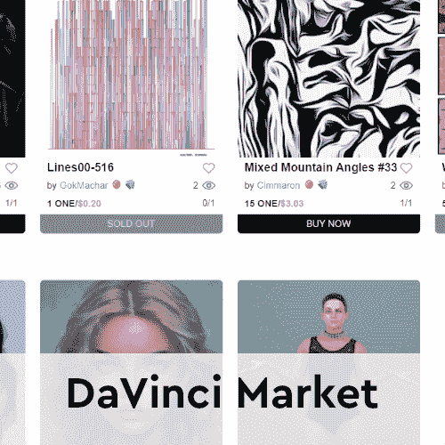
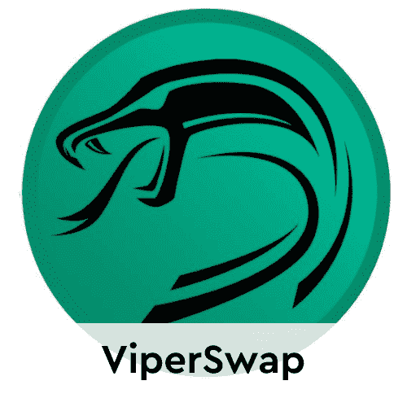
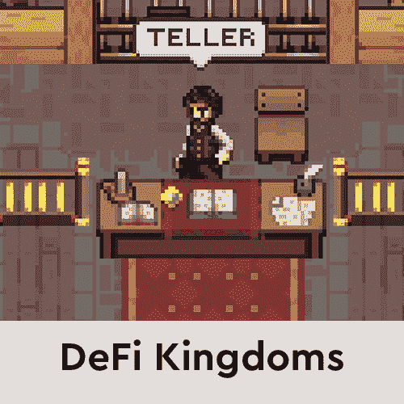

# 团结稳定的硬币给了和谐的定义一个推动力

> 原文：<https://web.archive.org/web/https://dappradar.com/blog/unite-stablecoin-gives-defi-on-harmony-a-boost>

## 给和谐的一个令牌持有者带来高年利率

和谐网络上的新 DeFi 平台 Unite Finance 推出了与和谐一号代币 1:1 挂钩的稳定币。发布后，该平台每周的用户数增加了 70%以上。

UNITE token 旨在成为 [Harmony](https://web.archive.org/web/20220929042647/https://dappradar.com/rankings/protocol/harmony) 上不断增长的 DeFi 生态系统的支柱，为网络上的 one 持有者带来高 apr。 [Unite Finance 团队表示](https://web.archive.org/web/20220929042647/https://dappradar.com/harmony/defi/unite-finance)在受到 Tomb.finance 的启发后，认识到需要一种与 Harmony 挂钩的算法稳定币。Tomb 在 Fantom 区块链上运行，并与 FTM 的价格 1:1 挂钩。坟墓取得了成功，并帮助 Fantom DeFi 生态系统扩张，将网络上的总价值锁定(TVL)超过 70 亿美元。

自 2021 年 12 月 24 日推出以来， [Harmony](https://web.archive.org/web/20220929042647/https://dappradar.com/rankings/protocol/harmony) DeFi 平台已经吸引了近 7000 名活跃用户。促成了超过 423，000 笔交易和近 200 万美元的交易量。

## 什么是联合金融

联合金融是和谐区块链的定义协议。该协议的底层机制旨在确保 UNITE 的钉住:一个被实现，并且一旦实现，它被维护以建立 UNITE 作为一个镜像的、流动的资产。该协议通过其三个令牌将独特的经济和以博弈论为中心的动态引入市场来实现这一目标。这些令牌是:

1.  Unite 或$ you Unite——一种交换媒介
2.  **Unite Shares** 或 USHARE——协议价值的治理和衡量
3.  **联合债券**或 UBOND——在紧缩时期改变联合供应

让我们更深入地了解这三个令牌，它们共同构成了 Unite Finance 的核心。

### 统一令牌

Unite 算法令牌作为生态系统的骨干，旨在为和谐网络上的一个持有人带来高 apr。该协议的底层机制动态调整 UNITE 的供应，推动其价格相对于 ONE 的价格上升或下降，以保持 UNITE 与 ONE 的价格挂钩。

### 联合股份

Unite share(UShare)是衡量 Unite 协议的价值以及股东对其保持 Unite 接近钉住的能力的信任度的方法之一。在扩张期间，协议铸币厂联合起来，按比例分配给所有在会议室下注的 UShare 持有者。UShare 持有人对改进 Unite 生态系统和 launchpad 内的协议和未来用例的提案拥有投票权(治理权)。

### 联合债券

联合债券(UBOND)的主要工作是在一个时代的收缩期帮助激励联合债券供应的变化。

## UNITE token 是做什么的？

在短期内，在实现挂钩之前，UNITE 的重点是优化协议，并通过现有的农场和董事会机制为早期投资者创造财富。

一旦实现挂钩，该系统的机制将侧重于稳定性和一致性，以便 UNITE 可以作为 ONE token 的镜像流动资产

这一过程所得收益的一部分将捐给社区所有的 DAO 基金。然后，DAO 计划建立一个孵化器和发射台，为整个和谐生态系统带来增长。为了团结才有价值，一个人也需要有价值。要做到这一点，需要一个充满活力的和谐生态系统和蓬勃发展的项目。

有趣的是，那些寻求团结的人被链接到另一个和谐定义平台 [ViperSwap](https://web.archive.org/web/20220929042647/https://dappradar.com/harmony/defi/viperswap) 。这种分散化的交易所也看到了越来越多的活动，可能是受到 Unite Finance 成功的刺激。

在快速交易和巨大社区支持的推动下，和谐网络发展迅速。虽然 dapp 的生态系统与其他连锁店相比相对较小，但它在 TVL 已经实现了超过 12.5 亿美元的收入，这表明和谐已经到来。在 [DappRadar 排名](https://web.archive.org/web/20220929042647/https://dappradar.com/rankings/protocol/harmony)中发现更多和谐 dapps。对和谐生态系统感兴趣，为什么不试试这些 dapps？

[<picture></picture>](https://web.archive.org/web/20220929042647/https://dappradar.com/harmony/marketplaces/davinci-nft-marketplace)[<picture></picture>](https://web.archive.org/web/20220929042647/https://dappradar.com/harmony/defi/viperswap)[<picture></picture>](https://web.archive.org/web/20220929042647/https://dappradar.com/harmony/games/defi-kingdoms)

***以上不构成投资建议。此处给出的信息仅供参考。请行使尽职调查，做你的研究。作者持有 ETH、BTC、AGIX、HEX、LINK、GRT、CRO、OMI、不变 X、ENS、GALA、AVASTR、GMEE、CUBE、RADAR、FLOW、FTM、BNB、SPS、WRLD、ATOM 和 ADA。***